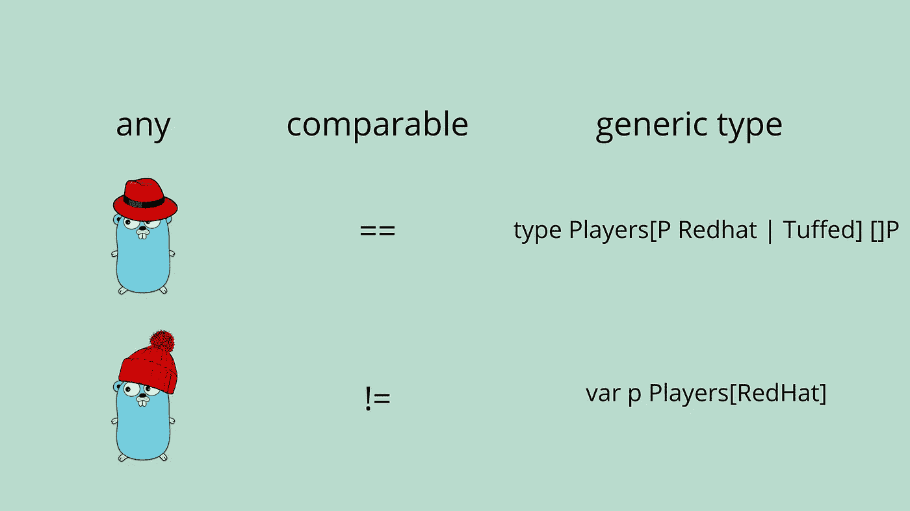

# 在围棋中学习泛型

> 原文：<https://towardsdatascience.com/learning-generics-in-go-318f53752ccd>

## 泛型在 Go 1.18 中发布，是时候学习如何利用这个新特性了


泛型的可视化解释，用函数表示的一行，泛型接受多个输入。图片由珀西·博尔梅尔提供。Gopher 由拓也·上田提供，原始 Go Gopher 由勒内·弗伦奇提供(CC BY 3.0)

泛型在更新 1.18(将于 2022 年 2 月发布)中推出，带有一系列其他闪亮的新功能。你可以在我的 1.18 补丁说明摘要中了解所有的变化。

<https://medium.com/@percybolmer/go-1-18-comes-with-many-amazing-changes-d33ac0afd6ee>  

要开始使用 1.18，您可以运行或下载它[这里](https://go.dev/dl/#go1.18beta1)。

```
go install golang.org/dl/go1.18beta1@latest
```

虽然还添加了其他一些好东西，但毫无疑问，泛型的实现已经盖过了其他一切。这是一个已经讨论了很长时间的话题，有许多开发者支持它，也有许多反对它。

许多人觉得泛型棘手而复杂，但是让我们揭开其中的奥秘。一旦你熟悉了它们，就不难使用了。

在本文中，我们将看看什么是泛型，并学习如何使用它们。

我的视频涵盖了泛型，如果你喜欢它胜过文本的话

## 什么是泛型，为什么 Go 需要泛型


通用函数，允许多种类型的输入和输出。图片由珀西·博尔梅尔提供。Gopher 由拓也·上田提供，原始 Go Gopher 由勒内·弗伦奇提供(CC BY 3.0)

泛型是一种让函数接受多种数据类型作为相同输入参数的方式。假设您有一个函数，它应该接受一个输入参数，并减去第二个输入参数的值。

您需要决定使用哪种数据类型，int、int64 还是 floats。这将迫使任何使用 subtract 函数的开发人员在使用它之前将其值转换为正确的数据类型。

另一个解决方案是为 int 提供一个 subtract 函数，为 floats 提供另一个函数，等等，这样就有多个函数做同样的工作。

减法使用相同的减法函数，将浮点数转换为整数

如果可以跳过类型转换或重复的函数会怎么样？在上面的例子中，我们从 float 结果中得到错误的结果，因为我们在把它转换成 int 时去掉了 0.5。

因此，唯一合适的解决方案是拥有重复的函数，一个`Subtract(a,b int) int`和一个副本`Subtractfloat(a,b float32) float32`。

我说复制功能是唯一的解决方案，我知道你可以使用`interface{}`输入和输出解决方案。我不喜欢那个软件，它容易出错，而且很笨重。您还会丢失编译时错误检查，因为编译器不知道您在用那个接口做什么。这很快变得不可维护，并增加了许多额外的代码。

这是泛型旨在解决的问题，也是为什么如此多的开发人员非常渴望看到它的发布。

现在，Go 1.18 发布了泛型的第一个草案，解决上述问题的方法很简单。

通用减法——一个简单的解决方案

## 泛型及其工作原理——泛型函数的基础


通过向第一个函数提供类型参数开始学习泛型。图片由珀西·博尔梅尔提供。Gopher 由拓也·上田提供，原始 Go Gopher 由勒内·弗伦奇提供(CC BY 3.0)

让我们深入学习泛型的基本用法。

我们将从常规的`Subtract`函数开始，并向它添加通用特性，同时了解我们添加的是什么，以及为什么添加。

函数的语法是，我们通过声明`func FunctionName`来定义函数，声明之后是函数参数。

**功能参数**在`()`里面定义，可以任意多。函数参数是通过声明名称，后跟数据类型来定义的。例如`(a int)`定义了函数的局部作用域将有一个名为 a 的整数。

`Subtract`方法有数据类型为 int 的函数参数`a`和`b`。

我们用它作为学习泛型的基础。

现在，函数参数可能看起来微不足道，但是在进入泛型之前理解它是至关重要的。

除了函数参数，还有**类型参数**。类型参数在`[]`内部定义，应该在函数参数`<a,b int>`之前定义。您可以像定义函数参数一样定义类型参数，名称后跟数据类型。

> 类型参数通常是大写的，以便于识别。

一个例子，我们声明参数 V 是一个整数，`[V int]`

类型参数 V 已被添加，此代码尚未运行。

函数参数和类型参数的区别在于，函数参数在函数的局部范围内可用。如果你像上面那样定义`V`，你将不能在函数中使用`V`作为变量。类型参数只说明 V 代表什么数据类型。

我们用类型参数定义的是，有一个叫做 V 的**数据类型，它是一个 int。这允许我们使用`V`作为函数参数中`int`的替换，并且在函数范围内。**

我们现在可以用`V`替换`a`和`b`的数据类型，以及输出到`V`的函数

Subtract 现在使用类型参数 v。

现在，你可能认为我们什么也没完成，我们只是用一个更复杂的解决方案替换了`int`。而且你是对的，我们还没做完，上面的代码不会编译。不允许像我们一样替换类型参数中的单个数据类型，除非把它放在接口中。

如果您尝试编译当前的减法函数，您应该会看到一个错误，指出`int is not an interface`。

原因是 a `type parameter`期望一个`type constraint`作为值，而不是一个数据类型。约束是函数参数必须满足的`interface`。

我们将通过使用一个`|`字符向`type parameter`添加第二个数据类型。管道字符用于表示`or`，这意味着我们可以向`V`参数添加许多不同的数据类型选项。使用`|`也是创建新内联`interface`的一种简便方式。

我们将把 int32 和 float32 作为可能的数据类型添加到`V`中。这样做将自动创建一个被编译器用作`type constraint`的`interface`。

使用|键入参数，这为我们创建了一个类型约束(接口)

您可以尝试使用带有简单 main 函数的新`Subtract`方法。

使用您的第一个泛型函数

为了使事情更清楚，我们可以打破类型约束。只是为了让它更容易理解，并且允许约束是可重用的。

为了创建约束，我们只需声明一个接口`Subtractable`，其中包含数据类型。它的语法和我们在类型参数中使用的简写定义是一样的，所以我们可以把它复制出来，我还添加了更多的数据类型。

向通用函数添加可减法类型约束

在你成为泛型大师之前的最后一件事。当你调用泛型函数来设置要使用的数据类型时，你可以应用一个类型参数，当我们到达更高级的用法时，这将更有意义。

添加的方法是再次使用类型参数，但这次是在函数调用之前。

```
result := Subtract[int](a, b)
```

## 类型参数和波浪号(~)


类型参数被提供给函数调用以指定数据类型。图片由珀西·博尔梅尔提供。Gopher 由拓也·上田提供，原始 Go Gopher 由勒内·弗伦奇提供(CC BY 3.0)

所以我们现在可以使用通用函数了，但是还有一些细节。想象一下，如果你想控制在一个通用函数中使用的数据类型？

假设您想要使用我们创建的`Subtract`函数，它将推断数据类型，除非被明确告知。您可以通过**类型参数**来实现这一点，语法与定义通用函数时相同。您可以在参数前的括号中提供数据类型。

```
Subtract[int](10,20) // Will be using int datatype 
Subtract[int64](10,20) // Will be using int64 datatype
```

main.go —在调用函数时使用类型参数来决定要使用的数据类型

霍雷。我们现在甚至可以告诉函数使用什么数据类型，太棒了！

现在，这里仍然有一个问题。如果您的数据类型是 Subtractable 中任何类型的别名/派生类型，该怎么办？

您将无法以我们当前声明的可减法的方式使用您的数据类型。

```
// create a custom int derived from int
type MyOwnInteger intvar myInt MyOwnInteger
myInt = 10
Subtract(myInt, 20) // This will Crash, Since myInt is not Subtractable
```

为了解决这个问题，Go 团队还添加了`~`，它告诉约束，从给定类型派生的任何类型都是允许的。在下面的例子中，我们允许`MyOwnInteger`成为`Subtractable`的一部分，方法是在它前面加上`~`。

使用~允许别名类型成为类型约束的一部分

## 通用类型，任何&可比较的



Go 中引入的新别名将用作类型约束，any 和 comparable。图片由珀西·博尔梅尔提供。Gopher 由拓也·上田提供，原始 Go Gopher 由勒内·弗伦奇提供(CC BY 3.0)

我们已经讲述了`generic functions`，现在是时候讲述`generic types`了。

要创建一个泛型类型，你必须定义一个新的类型，并给它一个类型参数。为了了解这一点，我们将创建一个`Results`类型，它是在先前创建的`Subtractable`约束中找到的任何数据类型的一部分。

泛型类型结果是可减法数据类型的一部分。

语法不应该是新的，我希望您现在能够理解泛型类型定义中发生了什么。它与前面的示例相同。在本例中，我们创建了一个数据条目属于数据类型`Subtractable`的切片，从而告诉编译器当结果切片被初始化时，必须定义包含在可减法接口中的类型。

为了使用结果，我们将更新 main 函数，并注意当创建变量时，我们如何定义`Results`片将要使用的数据类型。

使用结果通用类型(通用数据类型的一部分)

现在，我已经知道你在想什么，我们能说`Results`应该使用`Subtractable`类型约束吗？

```
var resultStorage Results[Subtractable]
```

遗憾的是，Subtractable 是一个类型约束，我们不能在`Results`的初始化中使用它。这样做会触发编译错误`interface contains type constraints`。

我们可以做的是使用新引入的 any 来允许`Results`保存任何数据类型。`any`是`interface{}`的别名。

ResultStorage 现在可以保存减法运算的所有值。

它还不完善，是初稿。我希望我们能在未来看到添加`Subtractable`的方法，避免使用`any`，因为它允许我们添加各种数据类型。

还有另一个名为`comparable`的新类型，它是一个类型约束，可以通过使用`==`或`!=`进行比较的任何数据类型都可以满足这个约束。

熟悉这些词很重要，因为随着社区对泛型越来越熟悉，你可能会看到它们到处出现。

## 接口约束和通用结构


接口可以用作类型约束。图片由珀西·博尔梅尔提供。Gopher 由拓也·上田提供，原始 Go Gopher 由勒内·弗伦奇提供(CC BY 3.0)

到目前为止，我们只使用了单个约束和输出。我们只使用了`type constraints`，但是也可以使用接口作为约束。

让我们尝试创建一个接受名为`Moveable`的接口的通用函数。该函数将简单地触发输入类型的`Move`，任何实现该接口的结构都应该能够`Move`。

Move —具有输入 v 必须可移动的约束的通用函数

你应该熟悉这个语法，我们创建了一个约束，说类型 V 必须是`Moveable`，输入参数 V 是类型 V

我们还将创建一个`Person`和一个`Car`来试用它。

移动多个结构的一般方式。

到目前为止，为了保持简单，我们只使用了一个通用参数。但是请记住，您可以添加多个，并输出多个。

让我们将`Moveable`和`Subtractable`约束组合到`Move`函数中，允许用户添加一个`Distance`值，我们用它来计算离目标还有多远。

要添加更多类型约束，只需在`[]`中添加参数，就像常规参数一样。我们将添加定义为`S`的`Subtractable`类型，而不是接受`meters`为`Int`，我们将允许它为`S`

这是我们的`Move`函数在两个`Type Constraints`中的样子

```
func Move[V Moveable, S Subtractable](v V, distance S, meters S) S
```

然而，仅仅这个改变就会导致编译器崩溃，因为`Move`函数接受了一个`Int`并且`Moveable`定义了这是 Move 应该工作的方式。所以我们需要让`Move`接受`Subtractable`。

向 Move 函数添加 Subtractable 并将 Int 改为 Subtractable

这看起来很棒，对吧？！可悲的是，上面的要点不是一个工作示例，这只是我们想要完成的伪代码。上面的代码不会编译，编译器会生气地对你大喊大叫，因为我们在一个`Interface`里面使用了一个`Type Constraint`，这是不允许的，记得吗？

但是有一种方法可以得到我们想要的东西。泛型结构是在初始化期间定义其数据类型的结构。

> 特别感谢 [u/ar1819](https://www.reddit.com/user/ar1819/) 帮助我找到这个解决方案

我们需要为`interface`定义`S`类型，就像我们为通用函数所做的一样。通过简单地将`[S Subtractable]`添加到`interface`声明中，我们可以说该结构不仅需要相同的方法集作为接口的一部分，还需要成为一个`Generic Struct`。

向接口添加类型约束

如果这是合同的规则，让我们将它添加到`Car`和`Person`中。这些结构现在将被命名为`Generic`。这意味着当创建一个对象时，您还必须定义用于该对象的数据类型。

这就是如何在 Go 中声明泛型结构

为了创建我们的汽车和人，我们需要指定他们使用什么数据类型。这是作为所有通用特征使用`[]`完成的。记住，它们被称为**类型参数。**

初始化两个泛型结构，使用[]分配数据类型

注意，我们现在使用的是`Person[S Subtractable]`，而不仅仅是`Person`，所以所有的方法都需要使用这个初始化。

使泛型结构成为可移动接口的一部分需要设置[S]

我们还应该通过升级成使`Move`函数现在接受一个`Generic Movable`，并且还接受`Subtractable`约束。

可移动必须定义其类型

我们准备创建`main`函数，它使用了我们已经完成的所有事情。使用`Car`的第一个`Move`调用很容易理解，这是因为我们使用了`int`，编译器会默认使用。

然而，第二个调用更加复杂，因为我们现在想要使用`float64`数据类型。要做到这一点，我们需要在定义**类型参数**的地方，为`Move()`调用添加常规的`[]`。在这种情况下，`Moveable`将是一个初始化为 float64 的`Person`。`Subtractable`的数据类型也将是 float64。所以类型定义会是`[Person[float64], float64]Move()`。

为汽车和人调用移动功能

一个技巧是考虑放置类型参数的顺序。我们可以通过重新排序`Move`中的类型参数来避免`Move[Person[float64], float64]`。这要归功于编译器和运行时推断数据类型。

类型参数的排序在语法上更好

## 结论

祝贺你，如果你在这里成功了，你现在是仿制药领域的专家了！

我希望你会发现它们是有用的，我知道许多人一直在等待这个版本。许多人创建了自己的库，用于对切片、使用队列的地图等进行排序。很快可能会有很多新的包和新的 API 用于旧的库。

许多用例对于泛型来说都很棒，但是有时候反而容易让事情变得有点复杂。尝试只在有实际用例时使用它们。

如果你喜欢我写的东西，不要错过我的指南，它提供了围棋中的模糊功能！

<https://medium.com/@percybolmer/fuzzy-testing-in-go-96eb08b7694d>  

走出去，成为普通人！