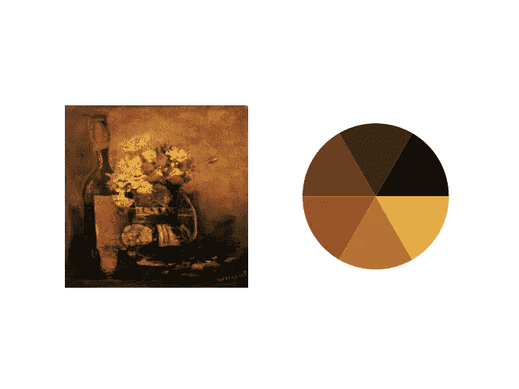
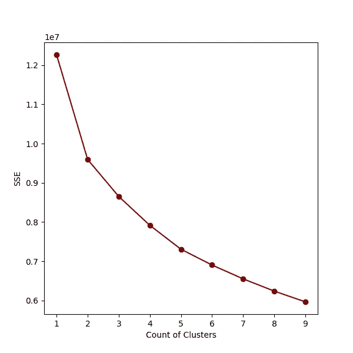
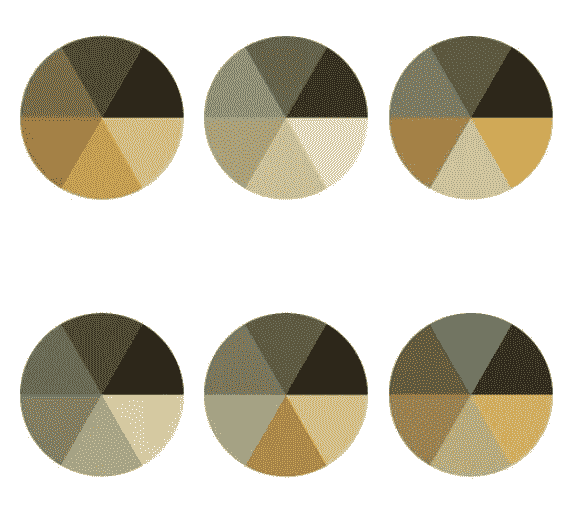

# 向文森特学习如何着装

> 原文：<https://towardsdatascience.com/learning-how-to-dress-from-vincent-b53f9e0ffd30>

## 用 KMeans 方法提取梵高作品中的色彩模式

故事从我偶然在一家网店看到的一件衣服开始。设计师称之为“梵高风格”的裙子，它确实有一个杰出的设计，尤其是颜色搭配。

然后我回忆起那些我独自在奥赛博物馆散步的下午，文森特·梵高在他所有的画作前使用色彩的方式给我留下了深刻的印象，一个想法浮现在我的脑海里，为什么不向文森特学习如何穿着呢？对于一些人来说，日常穿着的颜色搭配可能是一个大问题，包括我在内，如果我们可以用这位伟大艺术家的作品作为指导，我们可能会少犯一些错误。

作为一名数据科学家，我不敢挑战专业之外的任务，所以我宁愿回归机器学习。在这篇文章中，你将会读到我是如何使用 KMeans 从梵高的画作中提取主色图案的，我希望最终的结果能让你在明天早上站在衣柜前时不那么困惑。

# 一幅画的分色

在本文中，我使用了[梵高画作数据集](https://data.mendeley.com/datasets/3sjjtjfhx7/2) [1]的一个子集，即在阿尔勒、巴黎、瓦兹河畔奥维尔、圣雷米和维尔热完成的画作。为了提取他的颜色模式，第一项任务是从每幅画中分离出不同的颜色，这是一个可以用 KMeans 聚类方法完成的过程，这是最简单的无监督机器学习算法之一。它在一组数据点中识别 k 个质心，并将每个点分配到最近的聚类中。

回到绘画或图像，不过是一组像素，每个像素由三个分量组成，代表三个颜色通道中的值:红色、绿色和蓝色。注意，当我们用 OpenCV 读取图像时，我们最终会得到一个 BGR 格式。我们首先需要将 BGR 转换成 RGB。

代替使用众所周知的肘方法来决定标签的最佳数量，我们希望在该步骤中直接为每个图像找到 6 个聚类，以获得颜色模式的统一形式。这里有一个例子，绘画“花瓶与康乃馨和玫瑰和一个瓶子”和它的调色板。

作者图片:一幅特定的画和它的调色板

需要特别注意的一个问题是，颜色的顺序应该被忽略:例如，一个由三种颜色[黑、白、灰]组成的调色板实际上等同于[白、灰、黑]。为了避免顺序带来的不必要的干扰，我们根据所有三个颜色通道的值对输出调色板的颜色顺序进行排序，这样具有 6 种不同颜色的调色板将被迫遵循一个单位顺序。我们将所有有序的调色板保存在一个列表中，该列表将在下一步进行处理。下面的代码显示了我如何格外小心地创建数据集中所有图像的调色板列表:

# 调色板聚类

现在我们从梵高画作的数据集中的所有图像中提取了 6 种主要颜色，我们想看看是否可以得出艺术家使用颜色的某些模式。我们希望再次使用 KMeans 聚类方法来识别一些质心，但这一次是在数据点之间，每个点代表 6 种不同的颜色。

由于一个艺术家通常有几种类型的调色板，我们使用肘方法来确定最佳的聚类数，即保证不同标签的不同点彼此足够远，同时每个聚类有足够的样本的数。

我们从 1 到 10 迭代 k 的值，并计算相应的惯性值。

根据下面的图，选择 6 作为集群编号，从该编号开始，对于更大的编号没有观察到显著的改进。

作者图片:弯头方法的绘图

然后我们得到 6 个调色板，代表梵高使用颜色的模式。

作者图片

# 后续步骤

当我们站在衣柜前时，从梵高的作品中提取的颜色模式和我上面给出的简单有趣的实现已经可以作为一个指南:只需从这些梵高的调色板中选择颜色。

然而，这项工作还远远没有完成:推荐还没有自动化，我们仍然必须根据我们的视觉印象做出决定。况且大艺术家也只是给出了一个配色的思路，没有其他信息。例如，你知道黄色和蓝色是很好的搭配，但是你可能仍然不知道是黄色的裙子配蓝色的帽子还是蓝色的裤子配黄色的围巾。解决这一问题的一种可能是分析调色板的百分比，通过比较衣服的尺寸给出更精确的建议。

参考

[1]金，亚历山大(2022)，《梵高绘画数据集》，门德利数据，V2，doi:10.17632/3 sjtjfhx 7.2