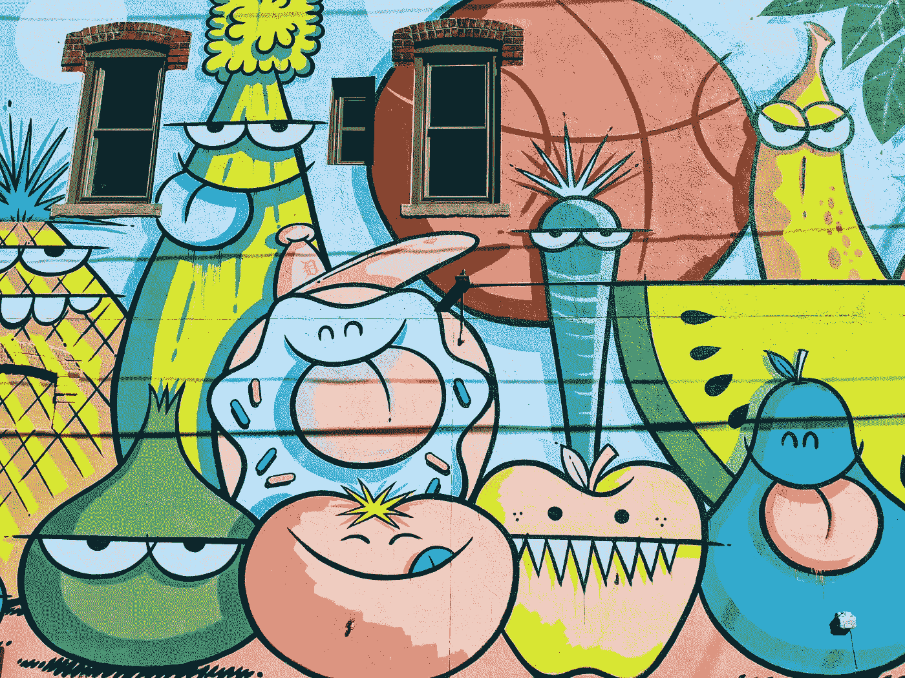
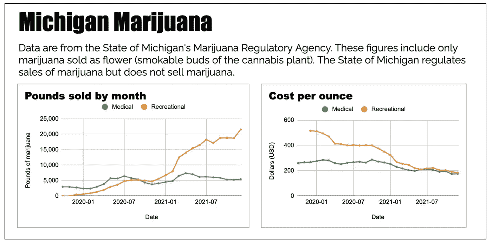
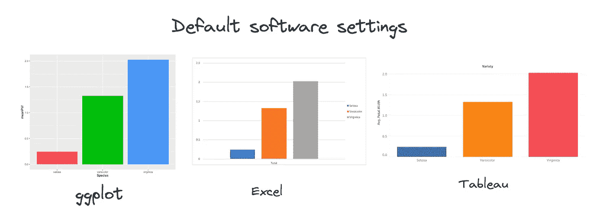
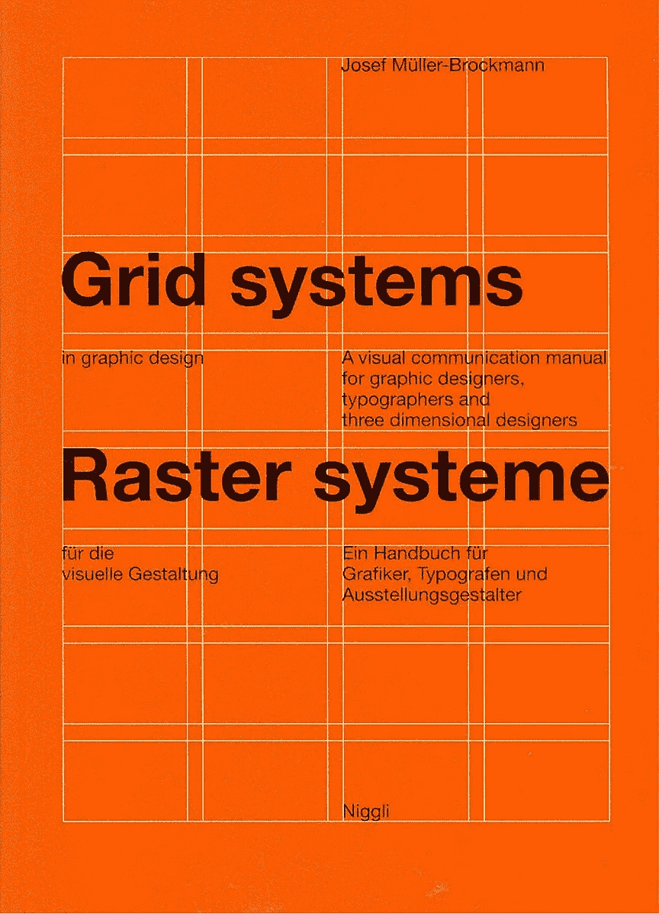
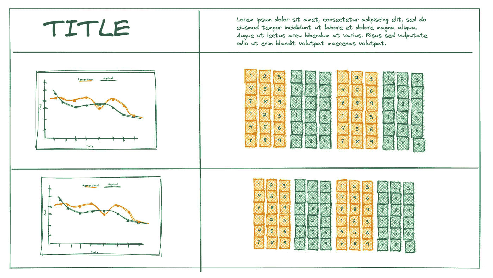
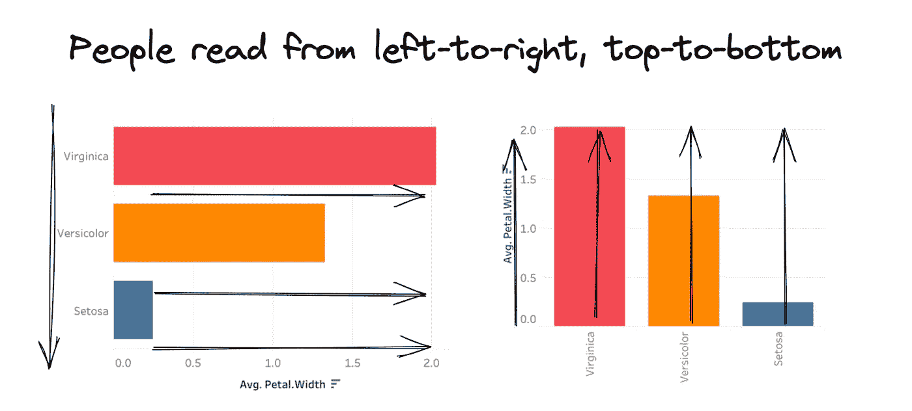
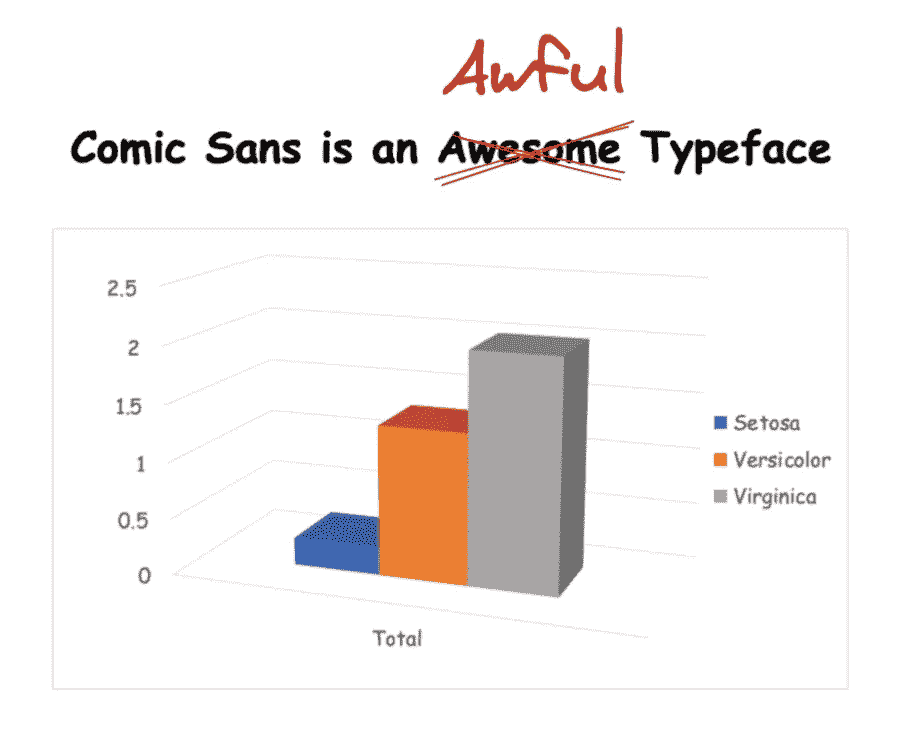
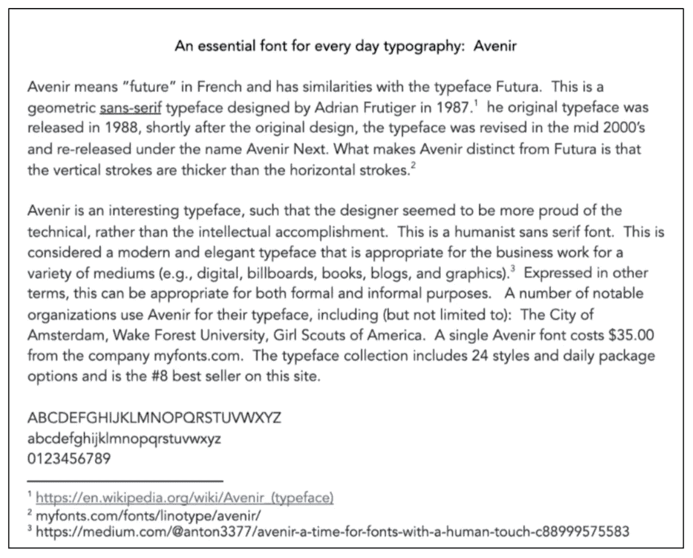
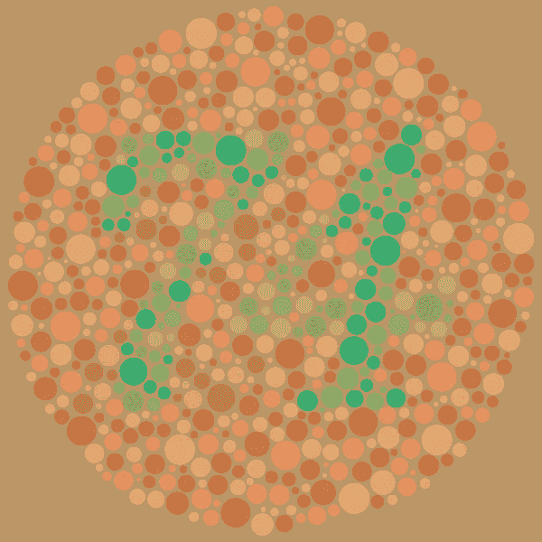
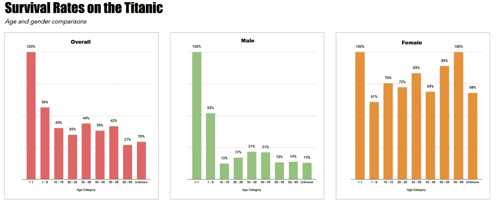

# 减少软件，增加设计

> 原文：<https://towardsdatascience.com/less-software-more-design-449175a34e59>

## 做好即

## 提高可视化效果的基本设计策略

密歇根底特律的街头艺术。作者照片。

我教那些刚开始培养数据处理技能的学生。流行的神话是好的数据可视化来自(所谓的)好的软件。Excel 通过使用户能够快速地将原始数据转换成具有几十个切片的三维条形图和饼图，或者更糟糕的是，三维饼图，延续了这一神话。糟糕的可视化不是软件的问题，而是用户的设计选择。

我写这篇文章的动机是鼓励新的学习者，尤其是我的学生，通过深思熟虑和有意识地应用设计原则来实现令人信服的数据可视化。我用 Google Sheets 制作了下面这张信息图。如您所知，数据可视化社区并不认为 Google Sheets 是“专业的”可视化软件，但是这个图形对于其预期目的和受众是有效的。

在 Google Sheets 中创建的简单信息图。作者图文。

软件既不是创建引人注目的可视化的必要条件，也不是充分条件。在计算机出现之前，人们创造了一些最有影响力的视觉效果。声称一个给定的软件比另一个软件好，这与认为钢笔比铅笔好没有什么不同。或者锤子比螺丝刀好。少关注软件，多关注解决问题和设计，你会发展得更快，走得更远。

本文回顾了一些基本的设计策略，您可以快速、直接地将它们应用到数据可视化中。我的评论不打算是全面的。相反，本文是学习基本技术和概念设计原则的路标。

# 为你的观众设计，而不是为你自己

新手在构建数据可视化时犯的最大错误是为自己设计。颜色和字体是根据个人喜好选择的。注释，如果使用的话，充满了缩写和行话。新的学习者以一种对他们自己有意义的方式排列图形元素，而不是对观众。

从受众的角度出发，做出所有的设计决策。如果您不了解您的受众，您可能还没有准备好可视化您的数据。当然，您可以使用可视化来探索您的数据，但是我专注于讲述数据故事。在对你的观众定位后，你可以用下面的一些问题来帮助引导你的设计思维。

*   关于这个话题，你的听众已经知道了什么？
*   你的观众*需要*知道什么来理解可视化？
*   您的受众有特定的信息需求吗？这些需求是什么？
*   数据可视化是交流数据的最佳方式吗？可视化本质上并不优于表格。明确你选择可视化的原因。
*   受众的信息需求是什么？
*   将如何查看可视化效果？(电子版 vs .硬拷贝？)
*   受众特征将如何影响解释？思考文化、语言、教育、数据素养技能等。

# 不要依赖默认设置。

依赖软件默认值是创建糟糕的可视化效果的一种必然方式。下图显示了不同软件环境的默认设置。你见过多少有这些调色板、字体、字体大小和网格线的图表？数据可视化社区应该禁止默认设置，就像我们讨厌 3D 条形图和饼图一样。

用三种不同的软件环境可视化虹膜数据集。很遗憾，由作者绘制。

如果您是构建数据可视化的新手，请花几分钟时间来欣赏您有意构建的图形(而不是意外点击的图形)，尽管只是几分钟。下一个大任务是定制。学习构成图形的不同元素可以让你的工作更有效率。例如，在 Google Sheets 中，您可以双击任何图表元素来打开它的定制面板。这些是我为定制我的大麻图片而调整的元素。

图片由作者提供。

# 了解网格系统并使用它们！

Josef müller-Brock Mann(1914–1996)是平面设计领域的一位有影响力的人物，他的作品继续激励和影响着世界各地的设计师。他推广了网格系统，这是在视觉交流中组织图形元素的重要辅助手段。

图片来自维基公共。

穆勒-布罗克曼写道:

> 电网系统是辅助，不是保证。它允许许多可能的用途，每个设计师可以寻找一个适合他个人风格的解决方案。但是人们必须学会如何使用网格；这是一门需要练习的艺术。

我建议避免使用软件工具来构建网格。从简单开始。了解网格系统的概念原理，并手动绘制布局草图。我可以通过绘制不同的形式来快速重复想法。

图片由作者提供。

整本书都致力于网格系统的主题，所以我这里的建议只是您进一步开发的起点。

# 考虑自然阅读的模式。

想想你的观众会如何消费这些信息。你的眼睛从哪里开始，它们如何在视觉中移动。人们从左到右、从上到下阅读，这使得图表的左上角区域成为最有价值的不动产。这个地方是人们进入可视化的地方。确保对所有的图形元素都应用同样的思想。例如，考虑 Iris 数据集中的以下条形图。图形是一样的。

使用 Iris 数据集创建的图形。图片由作者提供。

在这个例子中，我优化了左边的图表，给条形一个水平方向，因为这是人们阅读的方式——从左到右和从上到下。用户的眼睛必须浏览整个图形，然后从底部到顶部阅读。这个任务对于三个条形来说相对容易，但是当显示许多条形时就非常困难了。

# 字体和字样

人们通常所说的字体是字样。你选择的字体会影响视觉效果的可读性和色调。如果你想让你的可视化看起来像一个中学艺术项目，那么尽一切办法，使用漫画，并加入一些 3D 栏，使图形看起来有趣。其实请不要这样。永远不会。

使用 Iris 数据集的图形不应由作者创建。但确实如此。

花时间研究不同的字体，了解要解决的问题。做出明智的决定，以确保您的图形可读性，并且色调适合观众和故事。下面的图片是我第一次参加平面设计课程时提交的作业的例子。作业包括给出一种字体的简史和用法。我选择了 Avenir，我发现它非常适合打造清爽干净的造型。

图片由作者提供。

# 颜色选择

在构建数据可视化时，选择颜色是最具挑战性的问题之一。避免选择颜色使你的可视化看起来有趣。你认为有吸引力的东西可能会与你的观众的信息需求相冲突，并可能使你试图讲述的故事复杂化或扭曲。

用颜色编码尺寸值时，避免刻板思维。用蓝色和粉色来代表性别是一种过于简单化的解决问题的方式，尤其是在我们对性别认同的理解上。对种族值进行编码极具挑战性，通常需要不同的视觉通道来避免刻板的方法或冲突的图形提示。当然，你还必须考虑可访问性问题，以及如何确保色盲的受众群体仍然能够理解图片。

Ishara 色盲测试，显示数字 74。图片来自维基百科。

不幸的是，我无法用一个段落或一篇短文来概括这些大量的信息。所以，我的建议是把这个作为一个课题加入研究。Aseem Kashyap 有一篇关于入门的优秀文章。

  

# 小心谨慎地使用标题、标题和文本注释。

一个有效的可视化应该*尽可能独立*。独立的概念意味着最终用户可以清楚地看到所有的信息，从而理解你所展示的内容。他们不应该在网上搜索更多的信息，或者猜测你的缩写或行话的意思。花点时间为你的图片考虑标题，以帮助推动你的故事的叙述。我的大部分工作是学术研究，所以我的标题倾向于描述性的。但是，有时候，对于我的咨询工作，我会使用标题来说明一个关键的要点。

您可以使用文本来创建视觉层次，但这需要一定的对比度。例如，标题应该与正文区分开来。可以通过字体配对实现对比。Esther Teo 有一篇关于这个主题的优秀文章:

  

# 分类和排序

无论是创建表格还是图形显示，都不要忽视对值进行排序的重要性。大多数图形系统会在显示尺寸时按字母顺序对尺寸进行排序。这可能有用，但可能不是您的用户需要的正确信息。

# 后处理

当您熟练地创建高度定制的图形时，您将会遇到工具(即软件)不能按照您希望的方式执行的情况。例如，我有一些生疏的 R 技能，但仍然可以使用 ggplot 创建自定义图形。但是，有时，获得正确的注释可能非常耗时。当我遇到这个问题时，我会制作一个 PDF 格式的图像，并在 Adobe Illustrator 中完成我的定制。

如果要进行这种后期处理，请将图形保存为矢量图像(如 PDF 和 SVG)，而不是光栅图像(如 JPEG 和 PNG)。您可以使用矢量文件直接访问和定制所有图形元素，包括文本。您可以像处理照片一样处理光栅图像，但这很麻烦。无论何时进行任何后处理，都要确保不要扭曲数据的比例。顺便说一下，您不能只将 JPEG 或 PNG 打印成 PDF，然后期望访问这些元素。

# 切，切，切

这个建议来自爱德华·塔夫特的工作，他是数据可视化领域最有影响力的人之一。检查每一个图形元素，问问自己它是否有信息价值。它编码信息吗？它组织信息吗？为浏览或消费信息提供视觉提示？使用泰坦尼克号的数据集，我在 Google Sheets 中创建了一个简单的条形图，展示了一种极简主义的方法，如*簇绒条*。

使用 Titanic 数据集用 Google Sheets 制作的图形。作者图文。

当然，我可以很容易地在图片中添加一艘正在下沉的船，但这对我的*故事*没有帮助。一艘沉入水中的船无法传达我的数据故事。许多默认的图形元素是不必要的。例如，我在条形上提供了精确的值，因此读者不必来回扫描来进行比较。这样，y 轴就不再需要了。我不知道如何消除 y 轴，所以我的黑客是伪装成白色。我添加了颜色来加强视觉上的性别对比，但是不需要图例，因为标题已经给出了信息。

避免添加图形元素来使可视化看起来有趣。数据可视化社区将不必要的图形元素称为*图表垃圾*。再说一次，所有的事情在你的脑海中可能都是清晰的，但是视觉化并不是为你准备的——而是为你的观众准备的。来自你的数据的故事应该是兴趣点。如果你添加了吸引人的图形元素，一定不要让用户分心。同样，你心中清楚的东西，他们可能并不清楚。

# 最后的想法

我正在把我所有的课程笔记变成可分享的文章。我的大部分文章都是为新手量身定做的。如果您想收到新出版物的更新，请随时关注我。