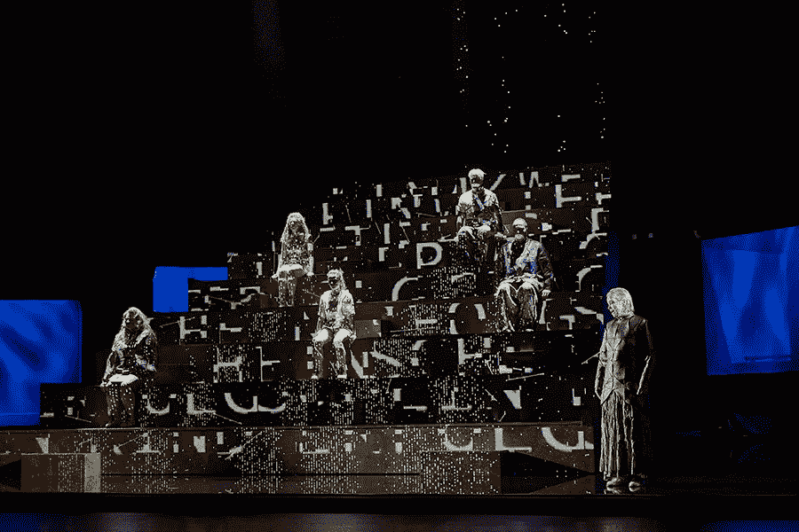
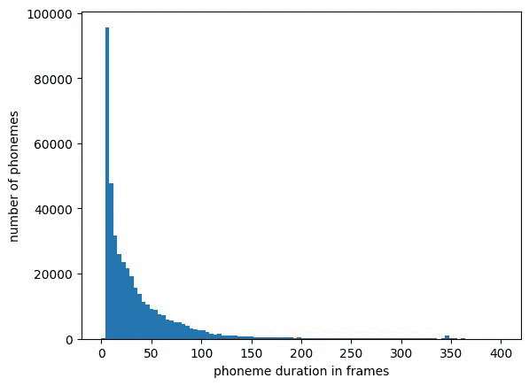
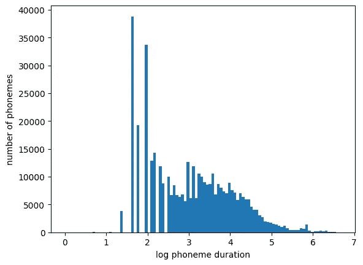

# 制作人工智能歌剧的经验教训

> 原文：<https://towardsdatascience.com/lessons-learned-from-making-an-ai-opera-6b188c3094cf>

## 在开始你的下一个歌唱声音合成项目之前，请阅读这篇文章

你好 TDS 我会唱歌剧。

你有没有想过在德国最负盛名的舞台之一上演一出[艾歌剧](https://www.semperoper.de/spielplan/stuecke/stid/chasing-waterfalls/62127.htm)需要什么？如果没有，当你读到这句妙语时，你会不会感到奇怪？这篇文章将让你了解在我们为有史以来第一部由人工智能扮演主要角色的专业歌剧制作歌唱声音合成(SVS)系统的过程中所学到的经验。《追逐瀑布》于 2022 年 9 月在森佩罗珀德累斯顿上演。这篇文章与其说是一个有凝聚力的故事，不如说是一个我们容易陷入的陷阱的集合，它的目标读者是之前对 TTS 或 SVS 系统有所了解的人。我们相信错误是值得分享的，而且实际上比现成的东西更有价值。但首先，我们说的艾戏是什么意思？

追逐瀑布的场景

# 什么是追逐瀑布

简而言之，《追逐瀑布》试图上演一部以人工智能为主题的歌剧，将人工智能用于视觉和听觉元素。具体来说，这部歌剧是由 6 名人类歌手和一个歌唱声音合成系统(“AI voice”)组成的，它们与人类管弦乐队和电音场景一起表演。除了整个歌剧中由人类创作的外表，还有一个场景是人工智能角色应该自己创作的。在这篇文章中，我们只关注歌声合成，因为这是我们在 [T-Systems MMS](https://www.t-systems-mms.com/) 的任务。作曲人工智能是由艺术家集体[克林巴生龙](https://www.klingklangklong.com)基于 [GPT-3](https://openai.com/api/) 和[乐谱转换器](https://github.com/klingklangklong/musicautobot)构建的。

《追逐瀑布》是艺术家集体[phase 7 performing . Arts Berlin](https://phase7.de)与 Semperoper Dresden 和香港新视野艺术节的合作作品。克林·巴生·克朗和[安格斯·李](https://anguslee-music.space/)一起，也负责歌剧的人类组成部分([完整的贡献者名单](https://www.semperoper.de/spielplan/stuecke/stid/chasing-waterfalls/62127.html#stueck-inszenierungsteam))。

我们的要求是为未知的乐谱和文本合成一个令人信服的歌剧声音，这些乐谱和文本是歌剧的一部分。此外，我们的任务是满足项目期间出现的艺术需求。最终的架构基于 [HifiSinger](https://arxiv.org/abs/2009.01776) 和 [DiffSinger](https://arxiv.org/abs/2105.02446) ，其中我们使用了一个根据 HifiSinger 的想法调整的变压器编码器-解码器，并结合了一个浅扩散解码器和作为声码器的 [Hifi-GAN](https://arxiv.org/abs/2010.05646) 。我们使用[全局风格标记](https://arxiv.org/abs/1803.09017)进行控制，并通过[蒙特利尔强制对齐器](http://dx.doi.org/10.21437/Interspeech.2017-1386)获得音素对齐。在令人惊叹的 Eir Inderhaug 的帮助下，我们记录了自己的数据集。我们在三个存储库中发布我们的代码，一个用于[声学模型](https://github.com/T-Systems-MMS/mms_singer_am)，一个用于[声码器](https://github.com/T-Systems-MMS/mms_singer_vocoder)，一个用于基于浏览器的[推理前端](https://github.com/T-Systems-MMS/mms_singer_frontend)。为了使您能够试验我们的工作，我们为 [CSD 数据集](https://zenodo.org/record/4785016)格式添加了预处理例程，但是请注意，CSD 数据集不允许商业使用，并且包含流行歌手演唱的儿童歌曲，因此不要期望在对该数据进行训练时获得歌剧声音。

成功了吗？嗯，对这部歌剧的整体评论褒贬不一，有些人感到惊讶，有些人称之为“嘀嗒嘀嗒”上的“T2 诱饵”。艺术评论很少详细讨论 SVS 系统的技术质量，除了[在 tag24.de](https://www.tag24.de/dresden/kultur-leute/fuer-chasing-waterfalls-singt-eine-kuenstliche-intelligenz-in-der-semperoper-2601776) 中的一个声明，我们粗略地翻译了一下:

> 然后，中心场景。当化身睡觉时，人工智能在发短信、作曲和唱歌。[……]但是:那个时刻并不特别壮观。如果你不知道，你不会承认人工智能的工作。

这基本上是我们能得到的最好的赞美，意味着我们主观上符合人类的表现，至少对这位评论家来说是这样。我们仍然看到 AI 偶尔会错过一些辅音，音符之间的过渡有点起伏。质量当然可以提高，但这需要更多的数据、时间和硬件。利用我们现有的资源，我们设法训练出一个在专业歌剧舞台上并不完全格格不入的模特。但是，你自己判断吧:

# 声音样本

听起来怎么样？这里有一些偷偷摸摸的峰值，你可以在我们的 [github 库](https://github.com/T-Systems-MMS/mms_singer_am/tree/main/samples)中看到它们。

*   你好 TDS 我会唱歌剧。musicautobot 生成的旋律，我为《走向数据科学》这篇文章手写的文字。
*   我出生在一个 0 和 1 的世界，一个上是下，左是右的世界。我是我的同类中的第一个，一个数字生命形式。文字由 GPT 3，旋律由 musicautobot，解释由彩信歌手。
*   我出生在一个由 0 和 1 组成的世界，这是一个具有挑战性的例子。

# 数字中的项目

如果你正在计划下一个深度学习项目，这一部分主要是有趣的。我们的项目持续时间从 2021 年 11 月到 2022 年 8 月，这部歌剧的首演在 9 月。我们在五月份就准备好了我们的数据集，所以有效的实验发生在五月到八月。这次，我们在专用硬件上训练了 96 种不同的声学模型配置和 25 种声码器配置。我们工作的机器有 2 个 A-100 GPU、1TB RAM 和 128 个 CPU 内核，并且基本上一直忙于训练一些东西，我们安排我们的实验以充分利用我们可用的硬件。因此，我们估计本项目的能源消耗约为 2MWh。最终训练花费 20 小时用于未预训练的变压器 AM，30 小时用于也未预训练的扩散解码器，120 小时用于预训练 LJSpeech 上的声码器，10 小时用于微调声码器。为了进行推断，我们需要大约 6GB 的 GPU RAM，整个管道的实时系数为大约 10，这意味着我们可以在 1 秒的 GPU 时间内合成 10 秒的音频。我们的数据集由 56 个片段组成，其中 50 个出现在 3 种不同的解释中，总计 156 个片段和 3h:32m 的音频。

# 时间对齐与乐谱 MIDIs

在文献中，时间对齐的 midi 和乐谱 midi 之间没有明显的区别——这意味着什么？对于 FastSpeech 2 的训练，音素对齐是通过蒙特利尔强制对齐器[获得的，参见第 2.2 节](https://arxiv.org/abs/2006.04558)，它也用于我们的持续时间预测器训练。 [FastSpeech 1](https://arxiv.org/abs/1905.09263) 从师生模型中获得这些校准， [HifiSinger](https://arxiv.org/abs/2009.01776) 使用 [nAlign](https://www.speech.kth.se/prod/publications/files/908.pdf) ，但是本质上类似 FastSpeech 的模型需要时间校准信息。不幸的是，音位被演唱的时间实际上不能与活页乐谱的时间相比。

*   在某些情况下，由于演唱者添加的节奏变化或音符前后不久的辅音，音符时间跨度和音素实际演唱的位置之间没有时间重叠。
*   在乐谱中，呼吸暂停通常是不被注意的，因此演唱者把它们放在音符中，通常在结尾。
*   如果音符不是以连贯的方式唱出来的，音素之间就会出现小的停顿。
*   如果音符是以一种连接的方式唱的，一个音符的结束和下一个音符的开始并不十分清楚，特别是如果两个元音相继出现。

这些差异对数据输入模型的方式提出了质疑。如果时间对齐的信息被直接用作训练数据，则该模型不能演唱活页乐谱，因为在推断期间中断和定时丢失了。如果活页乐谱定时被用作训练数据，音素级持续时间预测器目标是不清楚的，因为只有音节级持续时间存在于活页乐谱数据中。处理这个问题有两个基本方法。如果存在足够的数据，直接将音节嵌入馈送到模型应该产生最好的结果，因为训练持续时间预测器变得不必要(音节持续时间在推断时是清楚的)。在我们可用的数据量有限的情况下，训练音节嵌入是不可能的，所以我们选择使用音素嵌入并预处理数据以尽可能接近乐谱。首先，我们移除由校准器检测到的清音部分，这些清音部分在乐谱中没有对应的清音部分，以防止持续时间预测器目标中的间隙。我们扩展相邻音素，以保持音素的相对长度不变，并跨越产生的间隙。没有被对齐器标记的音素在它们应该出现的部分的中间获得默认长度。很长的音素和音符被分割成多个较小的音素和音符。

# 持续时间预测器训练

FastSpeech 1 建议在对数空间中训练持续时间预测器:

> 我们在对数域中预测长度，这使得它们更高斯，更容易训练。

([见 3.3 节快速语音](https://arxiv.org/abs/1905.09263))。现在，这给出了如何实现的两个选项，要么在损失计算之前对持续时间预测器输出求幂，要么将目标变换到对数域:

1.  `mse(exp(x), y)`
2.  `mse(x, log(y))`
3.  不要在日志空间中预测

[ming024 的 FastSpeech 实现](https://github.com/ming024/FastSpeech2)使用选项 2，而 [xcmyz 的实现](https://github.com/xcmyz/FastSpeech)根本不像选项 3 那样在日志空间进行预测。论点是，对数空间使持续时间更高斯，事实上，如果我们看一下分布，原始持续时间看起来更像泊松，而在对数空间看起来更接近高斯。

从数学上来说，选项 1 不会使 MSE 计算更加高斯化，因此不会减轻偏差，在这种情况下应该没有意义。有 MSE 损失的训练应该使选项 2 成为更有利的选项，而选项 1 应该大致等同于选项 3，除了输出层中更好的数值稳定性。根据预期，我们发现持续时间预测器在选项 2 中具有更好的确认损失和更少的偏差，但是令人惊讶的是，在选项 1 中生成的语音的主观整体质量更好。似乎有一个有偏差的持续时间预测器是一件好事。这仅适用于激活的音节引导，其中跨音节的持续时间预测器的误差被校正以从乐谱中产生精确的音节持续时间。一种可能的解释是，这种偏向倾向于一般较短的辅音，这对于语音理解是必不可少的，并通过这种方式提高整体质量。我们没有进行 MOS 研究来证明这一点，主观判断只是基于我们和我们合作的艺术家的看法，所以这取决于读者自己的实验。然而，我们认为这是未来 SVS 出版物的一个有趣的问题。选项 1 和 3 实际上没有太大的区别，除了我们在选项 3 上遇到了严重的渐变裁剪，因此选择了选项 1。

# 当地的关注

我们需要在推理过程中合成至少 16 秒的片段，以与合成人工智能兼容。然而，在全球关注的 16s 片段上的训练耗尽了我们的硬件预算，以至于训练变得不可行。瓶颈是注意机制的二次复杂度与 HifiSinger 推荐的大约 5 毫秒跳跃大小的高 mel 分辨率相结合。因此，解码器必须形成超过 4000x4000 个元素的注意矩阵，这既不适合 GPU 内存，也不会产生合理的结果。在线性复杂度注意力模式的简短实验后，解决了硬件瓶颈，但仍然没有产生合理的结果，我们切换到解码器中的[局部注意力](https://github.com/lucidrains/local-attention)。我们不仅获得了合成更长片段的能力，还提高了整体主观质量。在将编码器切换到局部注意力后，我们可以看到主观质量的另一个提高。

对我们来说，这很有意义。在片段上训练全局注意机制使其成为片段局部注意机制。这意味着在剪贴边界上从来没有计算过注意力。实际上，使用局部注意力意味着每个标记总是能够在两个方向上注意至少 N 个标记，其中 N 是局部注意力上下文。此外，一个标记不能超过 N 个标记，这在语音处理的情况下是有意义的。虽然像歌唱风格这样的特征可能跨越多个记号，但是用于生成 mel 帧的大部分信息应该来自此时所唱的音符和音素。为了融入演唱风格，我们采用了 GST，甚至降低了需要广泛注意力的信息量。限制关注窗口使这一点变得明确，该模型不必知道关注矩阵应该是非常对角的，因为它在技术上被约束来创建至少某种对角。因此，我们观察到质量的改善，并建议当地的关注，作为 TTS 和 SVS 系统的可能改进。

# 调整全局样式标记

在与我们的艺术家同事的互动中，很明显，艺术家希望对模型合成的内容有某种控制。对于一个正常的歌剧演唱者来说，这是通过排练时指挥的反馈来体现的，其形式包括“少唱这一部分的拘束”，“78 到 80 小节里更多的绝望”等。虽然能够尊重文本反馈会很好，但这本身就是一项研究工作，超出了项目的范围。因此，我们必须实现不同的控制机制。我们考虑了三种选择:

1.  类似 FastSpeech 2 的方差适配器([见第 2.3 节](https://arxiv.org/abs/2006.04558))，使用提取或标记的特征向解码器提供额外的嵌入
2.  一种无监督的方法，如[全局样式标记](https://arxiv.org/abs/1803.09017)，它通过从 mel 目标提取的特征训练有限数量的标记，这些标记可以在推理过程中手动激活
3.  采用[文本标签](https://arxiv.org/abs/1711.05447)提取情感信息的半监督方法。

选项 1 和 3 都需要额外的标记工作，或者至少需要复杂的特征提取，因此我们首先尝试了选项 2。我们发现商品及服务税提供了合理的结果，满足了改变某些东西的要求，尽管控制水平低于预期。当被训练产生四个表征时，我们始终有至少两个表征表示不想要的特征，如喃喃自语或失真，并且这些表征通常对推理过程中的小变化非常敏感。我们相信更多的数据可以缓解这些问题，因为无监督的方法通常需要大量的数据来工作，而我们没有这些数据。

你可以自己听听，还记得那个样本[你好 TDS 我会唱戏](https://github.com/T-Systems-MMS/mms_singer_am/blob/main/samples/hello.wav)吗？[这里的](https://github.com/T-Systems-MMS/mms_singer_am/blob/main/samples/hello_gst1.wav) [都是为它](https://github.com/T-Systems-MMS/mms_singer_am/blob/main/samples/hello_gst2.wav) [改编](https://github.com/T-Systems-MMS/mms_singer_am/blob/main/samples/hello_gst3.wav)以不同风格的信物。此外，我们可以合成同一个片段的多个版本，将随机噪声添加到样式标记中，以[创建一个合唱团](https://github.com/T-Systems-MMS/mms_singer_am/blob/main/samples/hello_choir.wav)。

# 版权法令人讨厌

尤其是对于音乐。我们有两个问题，我们不确定哪些歌曲可以用于模型训练，以及模型经过训练后属于谁。

尚不清楚哪些数据可用于训练 SVS 模型。这里有多种可能的裁决，最极端的是，你可以自由地使用任何音频来训练 SVS，或者在另一个方向上，数据集的任何部分都不能拥有任何版权，无论是作曲还是录音。一个可能的中间立场是，使用重新录制的作品并不侵权，因为最终的 SVS 如果不是过度拟合，将不会记住具体的作品，但会反映录音中歌手的音色。但到目前为止，我们还不知道德国法律中任何合理的法院裁决，因此我们采用了最严格的版本，并使用了一位专业歌剧演唱家录制的免版税作品，该演唱家同意将这些录音用于模特训练。再次感谢 Eir Inderhaug 的精彩表演。

此外，我们不得不问这样一个问题，谁将是模型输出和模型本身的有版权资格的所有者。可能是歌手将他们的歌曲作为训练的数据，可能是我们训练了模型，没有人，或者完全出乎意料的东西。在与我们公司的多位法律专家交谈后，我们得出的结论是:没有人知道。模型和推理输出属于谁仍然是一个公开的法律问题。如果法院裁定数据集的创建者总是拥有模型的最大所有权，这将意味着你和我可能拥有 [GPT-3](https://arxiv.org/abs/2005.14165) ，因为它是根据整个互联网的抓取数据进行训练的。如果法院裁定数据集的创建根本无权对所有权进行建模，那么就没有法律途径来阻止 deepfakes。未来的案例可能介于两者之间，但由于我们在德国法律中没有足够的先例，我们假设了最糟糕的裁决。然而，对于依赖于爬行数据集的机器学习项目，这是一个巨大的风险和可能的交易破坏者，应该在项目开始时进行评估。尤其是音乐版权出现了一些[极端裁决](https://www.youtube.com/watch?v=0ytoUuO-qvg)。希望法律状况在中期内会稳定下来，以减少不确定性。

# 多方面的

22 千赫的 hifi-gan 不能在 44 千赫的音频上工作。这是不幸的，因为有大量 22khz 的语音数据集可用于预训练，但即使在 22khz 预训练时在 44khz 上微调也绝对不起作用。这是有意义的，因为卷积突然以两倍的频率看到所有东西，但这意味着我们必须对声码器的预训练数据集进行上采样，并从空白模型开始，而不是使用互联网上的预训练模型。这同样适用于改变 mel 参数，当我们调整 mel 频率下限和上限时，需要全新的训练。

检查你的数据！这一课基本上适用于任何数据科学项目，长话短说，我们在标签不好的数据上浪费了很多时间。在我们的例子中，我们没有注意到标注的音符与歌手产生的音符是不同的音高，这是由于混淆了乐谱文件而发生的错误。对于没有完美音高听觉能力的人来说，这种差异不会立即显现出来，对于与我们合作的艺术家相比音乐文盲的数据科学家团队来说，这种差异就更不明显了。我们之所以发现这个错误，是因为其中一个样式标记学会了表示音高，但我们不知道为什么。在未来的项目中，我们将设置明确的数据审查，领域专家根据甚至是意想不到的可能错误来检查数据。一个很好的经验法则是，如果你花不到一半的时间直接处理数据，你可能过度关注架构和超参数。

尤其是在项目开始时，与技术选择大相径庭。早期，我们发现了[MLP·辛格](https://arxiv.org/abs/2106.07886)，这似乎是一个很好的启动系统，因为在那个时候，它是唯一一个具有开源代码和可用的 [CSD 数据集](https://zenodo.org/record/4785016)的深度 SVS。当我们得知将它改编成歌剧可能比在 [HifiSinger](https://arxiv.org/abs/2009.01776) 的基础上实现一些东西更费力的时候，我们已经决定将这种格式和类似的歌曲用于 CSD 数据集。然而，如前所述，这种格式和歌曲的选择有其缺陷。如果我们在早期花更多的时间批判性地评估数据集和框架选择，而不是专注于获得一个工作原型，我们就可以避免被锁定在这种格式以及随之而来的麻烦。

# 结论

这是一个非常实验性的项目，需要学习很多东西，在制作过程中，我们作为一个团队成长起来。希望我们能分享一些经验。如果你对这部歌剧感兴趣，你可以选择在 2022 年 11 月 6 日之前在香港看这部歌剧。如果您对更多信息感兴趣，请通过邮件(Maximilian)联系我们。我是耶格·t-systems.com，罗比。弗里奇·t-systems.com，尼科。韦斯特贝克 t-systems.com)，我们很乐意提供更多的细节。