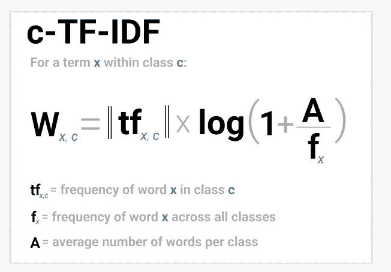
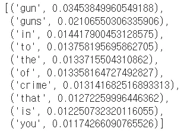
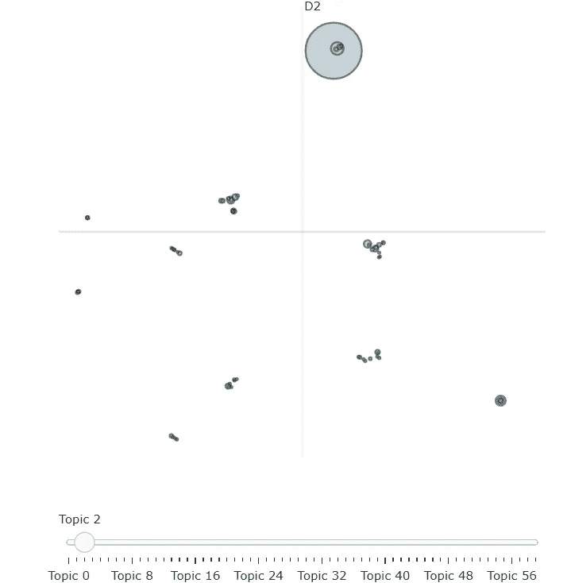
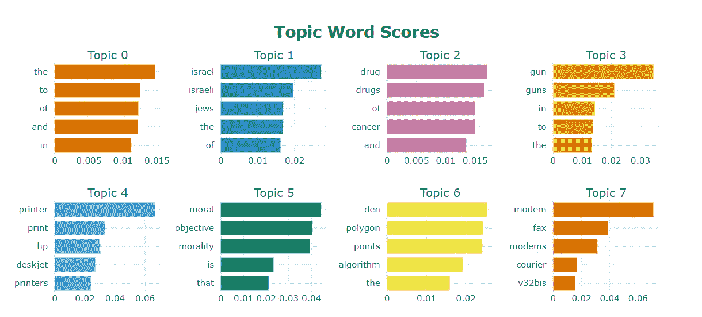

# 让我们从文本数据中提取一些主题——第四部分:主题

> 原文：<https://towardsdatascience.com/let-us-extract-some-topics-from-text-data-part-iv-bertopic-46ddf3c91622>

## 了解有关主题建模的 BERT 家族成员的更多信息


来自[像素](https://www.pexels.com/ko-kr/photo/4132326/)的免费使用照片

# 介绍

**主题建模**是一种自然语言处理(NLP)任务，它利用无监督学习方法从我们处理的一些文本数据中提取出主要主题。这里的“无监督”一词意味着没有与主题标签相关联的训练数据。相反，算法试图直接从数据本身发现潜在的模式，在这种情况下，是主题。

有各种各样的算法广泛用于主题建模。在我之前的三篇文章中，我向您介绍了主题建模的三种算法:LDA、GSDMM 和 NMF。

[](/let-us-extract-some-topics-from-text-data-part-i-latent-dirichlet-allocation-lda-e335ee3e5fa4) [## 让我们从文本数据中提取一些主题—第一部分:潜在狄利克雷分配(LDA)

### 使用 Python 的 nltk、gensim、sklearn 和 pyLDAvis 包了解主题建模需要什么及其实现

towardsdatascience.com](/let-us-extract-some-topics-from-text-data-part-i-latent-dirichlet-allocation-lda-e335ee3e5fa4) [](https://medium.com/geekculture/let-us-extract-some-topics-from-text-data-part-ii-gibbs-sampling-dirichlet-multinomial-mixture-9e82d51b0fab) [## 让我们从文本数据中提取一些主题—第二部分:吉布斯采样狄利克雷多项式混合…

### 了解如何使用 GSDMM 进行主题建模，以及它与 LDA 的比较

medium.com](https://medium.com/geekculture/let-us-extract-some-topics-from-text-data-part-ii-gibbs-sampling-dirichlet-multinomial-mixture-9e82d51b0fab) [](/let-us-extract-some-topics-from-text-data-part-iii-non-negative-matrix-factorization-nmf-8eba8c8edada) [## 让我们从文本数据中提取一些主题—第三部分:非负矩阵分解(NMF)

### 了解有关从线性代数派生的无监督算法的更多信息，该算法使用直观的方法来处理主题…

towardsdatascience.com](/let-us-extract-some-topics-from-text-data-part-iii-non-negative-matrix-factorization-nmf-8eba8c8edada) 

在本文中，我深入解释了什么是 BERTopic，以及如何将它用于您的主题建模项目！让我们直入主题吧！

# 什么是 BERTopic

在我们弄清楚 BERTopic 是什么以及它做什么之前，我们需要知道 BERT 是什么，因为 BERTopic 是从 BERT 派生出来的。BERT 是 Transformers 双向编码器表示的缩写，它是 2018 年作为基于 transformer 的机器学习模型开发的。它已经在大量的语料库数据中预训练，因此在各种 NLP 任务中表现非常好。你可以在这里查看伯特[的原始论文。BERTopic 是作为 BERT 家族成员设计的，专门用于主题建模。](https://arxiv.org/abs/1810.04805)

BERTopic 通过以下几个步骤运作。

[步骤 1]使用句子转换器将文档表示为嵌入。你可以在这里了解更多句子变形金刚[。这一步使用的默认模型是 BERT(因此得名 BERTopic)。](https://github.com/UKPLab/sentence-transformers)

【第二步】第二步是降维过程。默认使用 UMAP(统一流形近似和投影)算法。当然，根据您的目标和数据，也可以使用包括主成分分析(PCA)在内的其他选项。

【第三步】第三步是聚类过程。这一步实际计算不同文档之间的相似性，以确定它们是否属于同一主题。默认使用基于密度的分层空间聚类(HDBSCAN)算法。这是一种基于密度的聚类算法，因此通常比用于 topc 建模的 K-Means 聚类等算法性能更好。

【第四步】之后，c-TF-IDF 算法检索每个主题最相关的词。顾名思义，c-TF-IDF 类似于 TF-IDF，但不同之处在于它测量的是每个簇中的术语频率，而不是每个文档中的术语频率。c-TF-IDF 的数学公式如下。



来源: [BERTopic Github 网站](https://github.com/MaartenGr/BERTopic/blob/master/docs/algorithm/c-TF-IDF.svg)

[步骤 5]可选的最后一步是使用最大边际相关性(MMR)来优化术语。使用这种算法是有益的，因为它提高了相同主题和主题表示的术语之间的一致性。

下面是一个很好的描述上述步骤的信息图。


来源: [BERTopic Github 网站](https://github.com/MaartenGr/BERTopic/blob/master/docs/img/algorithm.png)

# 履行

我们将使用 20 个新闻组数据，每个人都可以通过 sklearn 包获得这些数据。它使用[Apache 2.0 版许可](https://www.apache.org/licenses/LICENSE-2.0)。只是提醒一下，为了不同教程之间的一致性，我在关于主题建模的前三篇文章中使用了这个数据集。

我们首先安装 BERTopic 包。

```
!pip install bertopic
```

然后我们导入我们需要的相关包。

```
import pandas as pd
import numpy as np
from sklearn.feature_extraction.text import TfidfVectorizer
from sklearn.datasets import fetch_20newsgroups
from scipy import linalg
import gensim
from tqdm import tqdm
import re
import matplotlib.pyplot as plt
from bertopic import BERTopic

%matplotlib inline
np.set_printoptions(suppress=True)
```

通常，清理和预处理文本的过程对于确保最佳性能是必要的，但是对于本教程，我们跳过这一部分，更多地关注 BERTopic 本身的实现。实际上，看到没有文本清理的主题建模输出的相对不错的质量，可以证明 BERTopic 的强大和有用。如果你想了解更多关于文本清理步骤的信息，请参考我以前的文章，这篇文章谈到了主题建模的 NMF。

从 skelarn 包中，我们读入了 20 个新闻组数据。然后，我们简单地实例化 BERTopic 对象，同时指定语言为英语。您可以通过 nr_topics 参数指定想要的主题数量。“Auto”意味着您希望模型自动确定要建模的主题的适当数量。

```
docs = fetch_20newsgroups(subset='all',  
                        remove=('headers', 'footers', 'quotes'))['data']

# Instantiate the model
model = BERTopic(language="english", nr_topics = 'auto')

# Fit and Transform
topics, probs = model.fit_transform(docs)
```

但是，请注意，您可以根据自己的需要调整模型的各个部分。

## 语言

您可以指定语言，或者让模型使用 language 参数来推断语言。

```
# Specify the lanugage to be English expliclitly
model = BERTopic(language="english")

# Let the model infer
model = BERTopic(language="multilingual")
```

## 嵌入

您还可以通过 embedding_model 参数调整 BERTopic 的嵌入部分。默认情况下，使用 BERT 基本模型，但是可以自由使用其他嵌入模型。选项列表可在本[文档](https://www.sbert.net/docs/pretrained_models.html)中找到。

```
BERTopic(embedding_model="xlm-r-bert-base-nli-stsb-mean-tokens")
```

## 主题表征

除了使用默认的 TF-IDF 向量表示，您可以自己调整它，或者使用反向量表示。

```
# Update topic representation by increasing n-gram range and 
# removing english stopwords

model.update_topics(docs, topics, n_gram_range=(1, 3), stop_words="english")

# Use Custom CountVectorizer

from sklearn.feature_extraction.text import CountVectorizer
cv = CountVectorizer(ngram_range=(1, 3), stop_words="english")
model.update_topics(docs, topics, vectorizer=cv)
```

## 降维

在将 UMAP 算法输入到 BERTopic 模型之前，您可以调整其超参数。此外，除了使用默认的 UMAP 算法进行降维，您还可以使用其他算法，如 PCA。

```
from umap import UMAP
umap_model = UMAP(n_neighbors=10, 
                  n_components=7, 
                  min_dist=0.0, 
                  metric='cosine', 
                  random_state=42)

model = BERTopic(umap_model=umap_model, language="english")
```

参考这篇很好的[文章](https://medium.com/grabngoinfo/hyperparameter-tuning-for-bertopic-model-in-python-104445778347)，它实际上用 PCA 代替了 BERTopic 的 UMPA。

## **话题数量**

您可以手动指定主题的数量，或者将 nr_topics 参数设置为“auto ”,让模型自动确定适当的主题数量。但是，您可能会遇到这样的情况:您已经训练了主题模型，但是发现主题的数量太多。在这种情况下，您可以在训练后使用 reduce_topics 函数减少主题的数量。

```
# Specify number of topics manually
model = BERTopic(nr_topics=20)

# Automatic Topic Reduction
model = BERTopic(nr_topics="auto")

# Reduce the number of topics after training the model
new_topics, new_probs =\
model.reduce_topics(docs, topics, probs, nr_topics=5)
```

## 获取主题的总体信息

您可以使用 get_topic_info 函数来获取主题的全部信息。

```
freq = model.get_topic_info() 
freq
```


来源:来自作者

Topic -1 指的是一组不可能归类到其他主题中的文档，因此我们可以忽略它。我们可以看到文档在每个主题中的数量分布，还可以在 name 列中看到代表每个主题的一些关键字。

## 特定主题的关键字和 c-TF-IDF 分数

您还可以使用 get_topic 函数访问指定主题的关键字及其 c-TF-IDF 分数。例如，我们在下面的代码中访问主题 3 的关键字及其分数。

```
# We access index 4 for topic 3 because we skip index 0 which is topic -1
model.get_topic(freq.iloc[4]["Topic"])
```



来源:来自作者

从上面的关键词我们可以看出，话题 3 主要是关于枪击和枪支相关的犯罪。

## 查找与指定术语相似的主题

```
# Return top3 topics that are semantically most similar 
# to an input query term

# 3 most similar topics to specified word
similar_topics, similarity = \
model.find_topics("religion", top_n = 3) 

print("Most Similar Topic Info: \n{}".format(model.get_topic(similar_topics[0])))
print("Similarity Score: {}".format(similarity[0]))

print("\n Most Similar Topic Info: \n{}".format(model.get_topic(similar_topics[1])))
print("Similarity Score: {}".format(similarity[1]))

print("\n Most Similar Topic Info: \n{}".format(model.get_topic(similar_topics[2])))
print("Similarity Score: {}".format(similarity[2]))
```

输出是:

```
Most Similar Topic Info: 
[('prophecies', 0.035076938400189765), ('prophecy', 0.028848478747937348), ('that', 0.02108670502531178), ('god', 0.02051417591444672), ('lord', 0.020264581769842555), ('of', 0.016688896522909655), ('the', 0.016135781453880685), ('to', 0.015035130690705624), ('scripture', 0.014930014538798414), ('we', 0.014849027662146918)]
Similarity Score: 0.5521519602007433

 Most Similar Topic Info: 
[('bank', 0.09616363061888215), ('islamic', 0.08725362721875433), ('bcci', 0.07506873356081414), ('banks', 0.04599130160033494), ('islam', 0.03498368962676642), ('interest', 0.03153905791196487), ('an', 0.02707799288051472), ('risk', 0.026608617086657786), ('investor', 0.023625991363580155), ('loans', 0.023098071864865885)]
Similarity Score: 0.5518991782725108

 Most Similar Topic Info: 
[('moral', 0.04437134134615366), ('objective', 0.04058577723387244), ('morality', 0.03933015749038743), ('is', 0.023387671936210788), ('that', 0.021184421900981805), ('what', 0.017148832156794584), ('you', 0.017133130253694097), ('not', 0.01467957486207896), ('immoral', 0.014518771930711771), ('of', 0.014256652246875072)]
Similarity Score: 0.5515153930656871
```

从上面的例子可以看出，我们可以指定一个术语，并找到与该输入最相关的主题。在这种情况下，我们使用了“宗教”这个术语。与宗教一词语义最相似的前三个话题主要是关于预言、伊斯兰教和道德。

作为软件包的一部分，BERTopic 也有一些不错的可视化功能。

```
# Intertopic Distance Map
model.visualize_topics( )
```



来源:来自作者

visualize_topics 函数显示我们之前在 [LDA 教程](https://medium.com/r?url=https%3A%2F%2Ftowardsdatascience.com%2Flet-us-extract-some-topics-from-text-data-part-i-latent-dirichlet-allocation-lda-e335ee3e5fa4)中见过的主题间距离图。这基本上是一种可视化，显示不同主题的气泡以及它们彼此之间的相似程度。两个气泡越接近，两个主题的语义就越相似。例如，主题 2 右下角的红色大气泡与主题 10 相似，后者是主题 2 中较小的气泡。主题 10 包含维生素和感染等关键词，而主题 2 包含癌症和药物等关键词，我们看到这两个主题彼此密切相关。

```
# Topic Word Scores in Bar Chart
model.visualize_barchart()
```



来源:来自作者

visualize_barchart 允许我们创建条形图，显示每个主题中关键字的不同得分。唯一的缺点是它只显示前 8 个主题，

```
# Similarity Matrix
model.visualize_heatmap( )
```


来源:来自作者

visualize_heatmap 函数返回每个成对主题相似性的相似矩阵。如果你有太多的主题，它可能不会提供太多的信息，因为在一个情节中会有过多的信息。

```
# Probability distribution of first document across different topics
model.visualize_distribution(probs[5]) 
```

visualize_distribution 函数返回水平条形图，指示某个文档属于每个主题的概率。在上面的例子中，它返回第六个文档属于每个主题的概率。请注意，您需要在训练之前将 BERTopic 对象中的 calculate_probabilities 参数指定为 True，因为默认值为 False，如果是这样，visualize_distribution 函数将返回一个错误。

```
# Hierarchical Topics
hierarchical_topics = model.hierarchical_topics(docs)
model.visualize_hierarchy(hierarchical_topics=hierarchical_topics)
```


来源:来自作者

如果您想了解不同主题之间的层次关系，visualize_hierarchy 函数将会帮您解决这个问题。

```
topics_over_time =\
model.topics_over_time(docs, topics, timestamp, nr_bins=20)

model.visualize_topics_over_time(topics_over_time, top_n_topics=20)
```

我们使用的数据集不包含任何时间元素，但是如果您的数据集包含时间元素，您也可以使用 topics_over_time 函数以线形图的形式显示主题随时间的频率。

# 结论

在本文中，我向您介绍了 BERTopic 算法，该算法源自 BERT，由多个步骤组成，利用了从 c-TF-IDF、UMAP 到 HDBSCAN 和 MRR 的各种算法。为了充分理解这个模型是如何工作的，你需要理解其他机器学习和 NLP 相关的任务，比如文本数据的维数减少和嵌入。尽管如此，它为我们提供了一种强大而简单的方法来执行主题建模，即使没有文本清理或预处理。这并不意味着文本清理是不必要的。请注意，在大多数情况下，文本清理和预处理对于确保建模主题的质量至关重要。要了解更多关于 BERTopic 的信息，请参考这个主要的[文档](https://maartengr.github.io/BERTopic/algorithm/algorithm.html#code-overview)。

如果你觉得这篇文章有帮助，请考虑通过以下链接注册 medium 来支持我: )

joshnjuny.medium.com

你不仅可以看到我，还可以看到其他作者写的这么多有用和有趣的文章和帖子！

# 关于作者

*数据科学家。加州大学欧文分校信息学专业一年级博士生。主要研究兴趣是将 SOTA ML/DL/NLP 方法应用于健康和医疗相关的大数据，以提取有趣的见解，为患者、医生和决策者提供信息。*

*密歇根大学刑事司法行政记录系统(CJARS)经济学实验室的前研究领域专家，致力于统计报告生成、自动化数据质量审查、构建数据管道和数据标准化&协调。Spotify 前数据科学实习生。Inc .(纽约市)。*

他喜欢运动、健身、烹饪美味的亚洲食物、看 kdramas 和制作/表演音乐，最重要的是崇拜我们的主耶稣基督。结账他的 [*网站*](http://seungjun-data-science.github.io) *！*