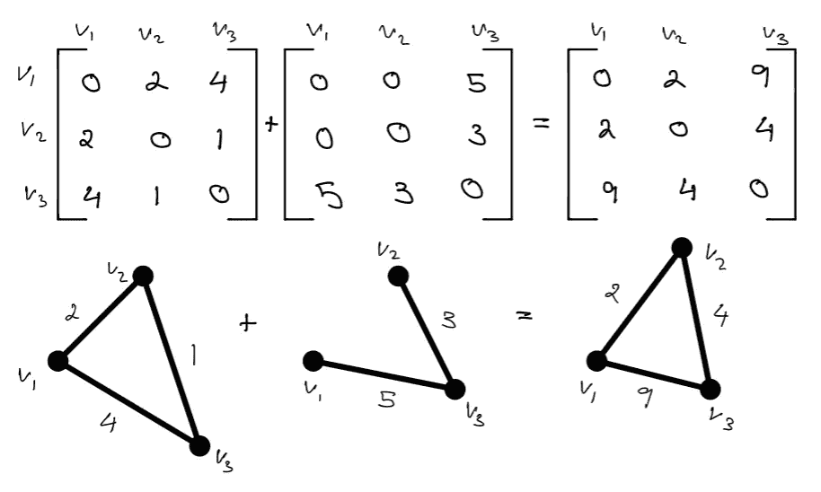
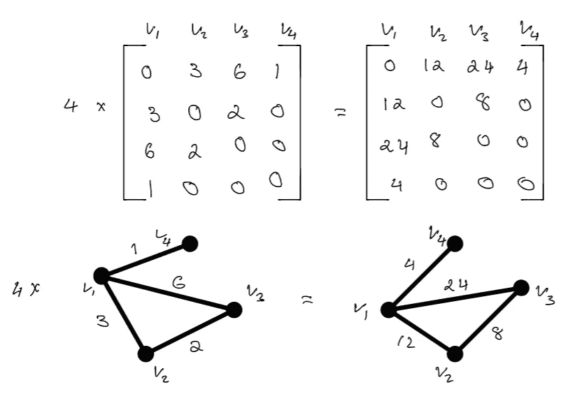
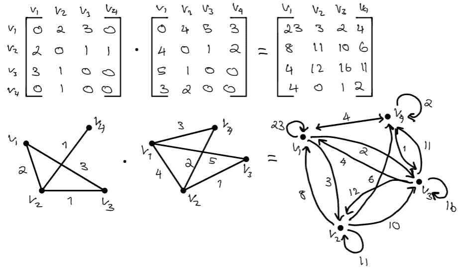
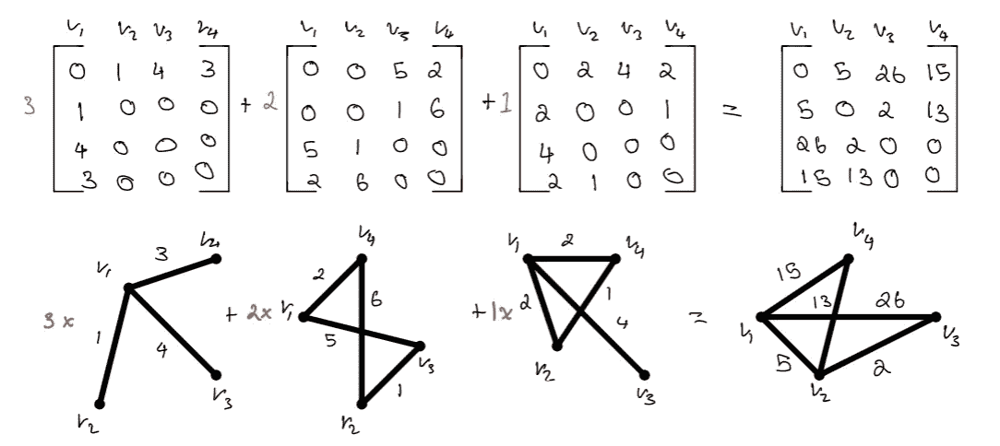

# 图论解释的线性代数

> 原文：<https://towardsdatascience.com/linear-algebra-explained-through-graph-theory-1c79711e9a20>

## 用图论直观地解释线性代数的基础


图片来自[乔尔·菲利普](https://unsplash.com/@joelfilip)来自 [Unsplash](https://unsplash.com/photos/ZMRMFULofus)

数学是一门难学的学科:它非常广泛，在许多领域都有广泛的应用。线性代数是数学的一个分支，尤其难以理解和应用。在我看来，许多教授线性代数的课程和开源工具都是计算密集型的，对于像我这样的视觉学习者来说，这可能变得非常难以理解。对于刚开始接触数学或数据的人来说，这可能会有问题，因为线性代数在数据科学和机器学习中有多种应用，仅举几个例子:自然语言处理、推荐系统、维数约简、神经网络等。对线性代数有很强的基础理解将有助于他们理解常用的机器学习方法。

这篇文章将着重于通过使用图形来直观地理解线性代数的计算。我将涵盖许多核心概念，如矩阵加法，减法，乘法，除法，转置等。这些是线性代数中非常基本和常见的概念，当涉及到机器学习时，这些概念也经常出现。以下是文章的提纲:

## **目录**

*   图和线性代数简介
    -图的邻接矩阵
*   算术
    -加法/减法
    -乘法/除法
*   移项
*   线性组合
*   线性代数在机器学习中的应用
*   结束语
*   资源

# 图形和线性代数导论

图论和线性代数是结合在一起使用的，有一个完整的数学子类`algebraic graph theory`使用代数方法来解决关于图的问题。这些代数方法通常包括各种线性代数。

## 图的邻接矩阵

贯穿本文的核心概念是邻接矩阵。邻接矩阵是一种能够将图 G 转换成矩阵的矩阵，反之亦然。邻接矩阵总是对称的，并且由指示图 g 中相邻顶点对之间的连接的元素组成。图到其关联邻接矩阵的转换可以容易地在下图中说明。


图 G 的邻接矩阵(图片由作者提供)

如果图 G 有任何自循环，那么在上图中矩阵的对角线上会有值。邻接矩阵封装了图的结构和关系。邻接矩阵可以表示为稀疏矩阵或密集矩阵，这使得在图上运行实验的计算效率非常高。出于这个原因，邻接矩阵是表示图的最常见的方式之一[1]。在整篇文章中，我将把线性代数中的基本概念应用到邻接矩阵中，并展示与该矩阵相关的图如何相应地变化。

# 算术

对大多数人来说，在矩阵上进行运算是非常简单和直观的。理解基于图的算法的最简单的方法是通过加权图。通过线性代数中的一般算法，与这些算法相关的图形可能会发生巨大的变化。可以形成或移除新的边，与这些边相关联的影响将显著增加或减少。这个图可以从一个连通的网络变成一个断开的网络。下面的例子可以让你更好地理解图中的矩阵算法。

## 加法/减法



矩阵加法通过图形直观地显示出来，正如你所看到的，图形已经合并了具有比以前更高权重的边。(图片由作者提供)

虽然这个例子只涉及加法，但是看减法如何影响图形应该是非常直观简单的。

## 乘法/除法



此图显示了乘以常数时对图形的影响，很明显，图形的形状没有改变，但边的权重急剧增加。(图片由作者提供)

# 点积

点积是一个很难直观理解的概念，尤其是当您要相乘的矩阵的维数很大时。在研究下图时，请记住，当两个图进行点积时，它几乎肯定会成为一个有向图。下图显示了两个无向图(邻接矩阵)的点积结果，以及由此产生的有向图。在最简单的形式中，如果一个图不包含重复的边和环，那么它就是无向的。这意味着无向图的邻接矩阵将具有零对角线，并且矩阵 M^T 的转置等价于 m

正如你将看到的，有向图是非常不同的。有向图是由有向边组成的图，这意味着如果有一条有向边通向一个节点，你就只能从该节点到另一个节点。方向通常用边上的箭头表示。



两个矩阵的点积直观地表示出来。(图片由作者提供)

由点积得到的图形完全改变了人们对图形的理解。两个(相对)简单的图形的点积会导致一些非常混乱的东西。如你所见，你可以遍历不同权重的节点。

# 移项

传统上，当个人陈述转置一个矩阵时，你所做的只是翻转矩阵的对角线。但是这如何影响相关的图表呢？

转置背后最简单的视觉理解是通过看一个有向图。如上所述，当一个节点通过边指向另一个节点时，图 G 是有向的，那么图 G 的转置将简单地指示方向被交换。这可能是对矩阵转置如何影响网络的更直观的理解。


如图所示，对有向网络进行转置只是改变了边现在面对的方向。(图片由作者提供)

# 线性组合

图形的线性组合与向量的线性组合非常相似。线性组合可以用以下定义来概括:

由一组项和常数组成的表达式。该表达式是每一项乘以其相关常数的乘积之和。它可以用下面的公式进行数学表示:

```
Constants : a, b, c, ... z
Terms : G1, G2, G3, ... Gn
LC = a*G1 + b*G2 + c*G3 + ... + z*Gn
```

现在，当在图的上下文中考虑线性组合时，假设每个向量现在是对应于图的对称矩阵。然后，我们可以直观地看到合并网络时每个变化所产生的影响。下面可以直观的看到:



三个不同图形 G1、G2 和 G3(从左至右)乘以常数 a1、a2、a3 (3、2、1)的线性组合及其相应结果。(图片由作者提供)

# 线性代数在机器学习中的应用

线性代数在机器学习中有多种应用。线性代数出现在数据科学管道的大多数步骤中，从数据预处理和特征工程到建模。诸如一个热编码和各种降维模型的概念基本上源于线性代数。像 PCA 这样的模型直观地使用线性组合和特征向量背后的思想来减少输入数据，同时试图最小化信息丢失。

线性代数在机器学习中更复杂的应用是以推荐系统和深度学习的形式出现的。所有形式的推荐系统都使用各种线性代数来解决所提出的给定问题。在推荐系统中，基于内容、协同过滤和混合的解决问题的方法使用线性代数中的常见概念，如点积、余弦相似性、欧几里德距离、矩阵分解等。甚至像链接预测这样的推荐系统中的复杂方法也基本上使用大量的线性代数来识别网络中的缺失边(网络中的哪些节点对应该具有边，但是当前没有)?).

深度学习本质上是线性代数，从用于定义神经网络的数据结构到训练和测试数据的方法。深度学习中的一个常见术语是`tensor`，其中张量本质上是一个超过 2 维的矩阵。

# 结束语

我希望这篇文章能为你提供图论和线性代数背后更多的见解、直觉和联系。这些概念经常出现在各种机器学习和数据科学应用的幕后。对这些概念有一个更加严格和基础的理解将很可能帮助你学习各种机器学习相关的概念。

# 资源

*   [1][http://www . math . Utah . edu/~ gustaf so/s 2017/2270/projects-2017/Dylan Johnson/Dylan % 20 Johnson % 20 graph % 20 theory % 20 and % 20 linear % 20 algebra . pdf](http://www.math.utah.edu/~gustafso/s2017/2270/projects-2017/dylanJohnson/Dylan%20Johnson%20Graph%20Theory%20and%20Linear%20Algebra.pdf)
*   [2]格罗斯曼，杰罗尔德 w；提婆达多·库尔卡尼；Schochetman，Irwin E. (1995)，"论关联矩阵的子式及其 Smith 范式"，*线性代数及其应用*，**218**:213–224，[doi](https://en.wikipedia.org/wiki/Doi_(identifier)):[10.1016/0024–3795(93)00173-W](https://doi.org/10.1016%2F0024-3795%2893%2900173-W)， [MR](https://en.wikipedia.org/wiki/MR_(identifier)) [1324059 【T 特别参见第 218 页的讨论。](https://www.ams.org/mathscinet-getitem?mr=1324059)

如果你喜欢这篇文章，这里列出了我写的其他文章，你可能也会喜欢。

[](/recommendation-systems-explained-a42fc60591ed) [## 推荐系统解释

### 用 Python 解释和实现基于内容的协同过滤和混合推荐系统

towardsdatascience.com](/recommendation-systems-explained-a42fc60591ed) [](/word2vec-explained-49c52b4ccb71) [## Word2Vec 解释道

### 解释 Word2Vec 的直观性&用 Python 实现它

towardsdatascience.com](/word2vec-explained-49c52b4ccb71) [](/node2vec-explained-db86a319e9ab) [## Node2Vec 解释

### 用 Python 解释和实现 Node2Vec 白皮书

towardsdatascience.com](/node2vec-explained-db86a319e9ab) [](https://pub.towardsai.net/dynamic-time-warping-explained-fbb24c1e079b) [## 动态时间扭曲解释

### 动态时间扭曲背后的直觉&股票数据的 Python 实现

pub.towardsai.net](https://pub.towardsai.net/dynamic-time-warping-explained-fbb24c1e079b) [](/mining-modelling-character-networks-part-ii-a3d77de89638) [## 挖掘和模拟字符网络—第二部分

### 本文将介绍挖掘和建模字符网络的 Python 实现

towardsdatascience.com](/mining-modelling-character-networks-part-ii-a3d77de89638) [](/random-walks-with-restart-explained-77c3fe216bca) [## 带重启的随机漫步解释

### 理解带重启的随机游走算法及其在 Python 中的相关实现

towardsdatascience.com](/random-walks-with-restart-explained-77c3fe216bca)