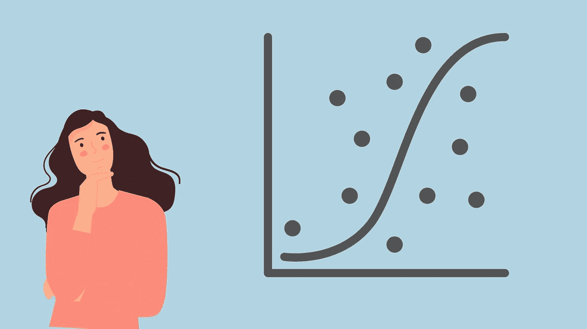
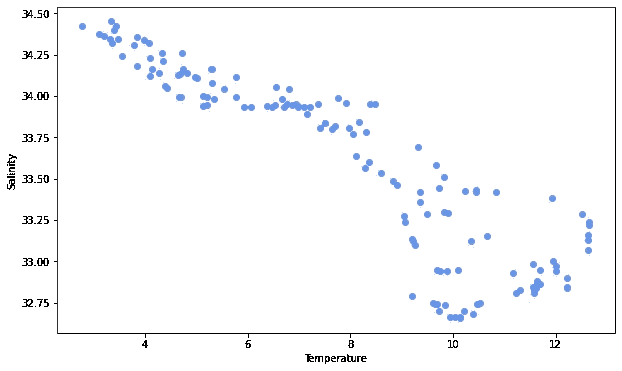
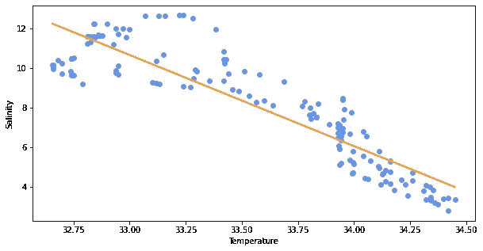
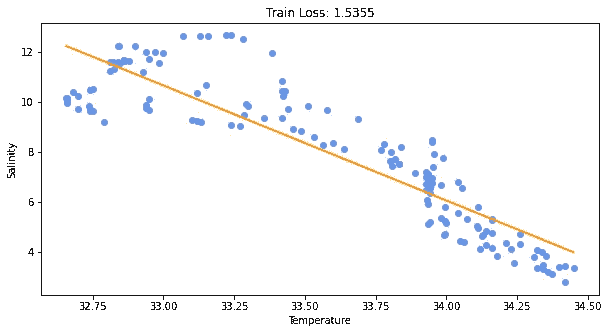
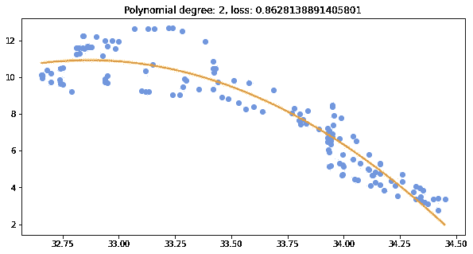
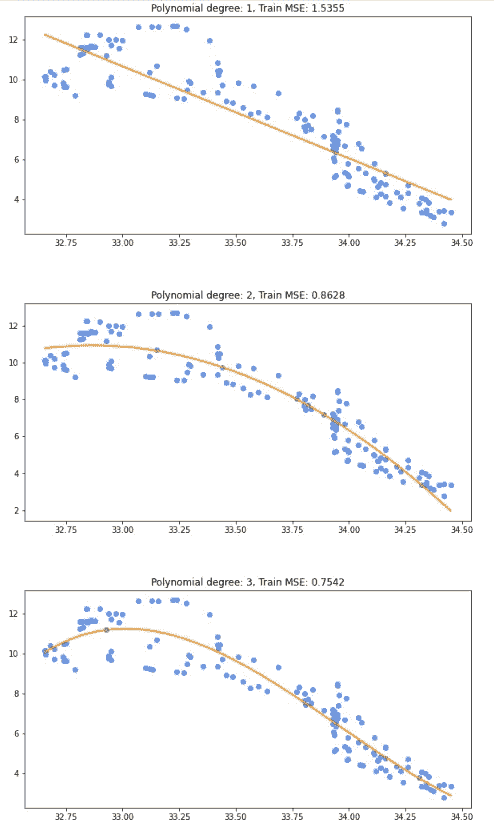

# 线性回归:海洋学数据建模

> 原文：<https://towardsdatascience.com/linear-regression-modelling-oceanographic-data-fdc3a98813bf>

## 最重要的，被忽视的，可预测的回归模型。

线性回归图像-作者

线性回归是一个简单而强大的工具，应该放在每个数据科学家的口袋里。在本文中，我将使用一个真实的例子来展示线性回归对真实数据的强大作用。

## CalCOFI 数据集

我们将使用 [CalCOFI 数据集](https://www.kaggle.com/datasets/sohier/calcofi) (CC BY 4.0 License)。该数据集包含了从 1949 年至今加利福尼亚州的全面海洋学测量数据。数据集包括水温、盐度、测量深度、氧气水平等要素。在本文中，我们将只使用水温和水的盐度功能。

加州海岸——作者[卡斯滕·科恩](https://unsplash.com/@karstenkoehn)

## 介绍

首先，线性回归模型用于预测一个连续变量的值，基于另一个连续变量的值。简单线性回归是线性回归的最基本形式，其中映射这种关系的模型是直线。

让我们从导入数据集开始，从 CalCOFI 数据集中抽取 500 个测量值的样本。在下图中，我们可以看到温度和盐度之间的关系。随着温度的升高，水的盐度降低。这表明变量之间存在负相关关系。

数据点—按作者

现在，假设我们得到了一个新的数据点，它有温度测量值，但没有盐度值。我们能根据温度来估计它的盐度值吗？(惊喜！是的，我们可以。)

解决这个问题的方法有很多，但最常用的方法之一是画一条符合数据的线。通过这种方式，给定任何温度测量值，我们都能够提供其盐度的精确估计。

我们可以简单地画一条看起来不错的线，但要做出一个真正好的猜测，我们需要做一些数学工作。在下面的部分中，我们可以使用普通的最小二乘法来找到这条线的方程。

## OLS(普通最小二乘法)

普通最小二乘法是用于寻找线性回归模型的未知参数的方法。它通过最小化观察标记和预测标记之间的差的平方和来选择这些参数。简单地说，就是选择最适合的路线。这条线的方程式如下所示。

简单线性回归公式—作者

上面这条线的方程有两个参数，B0 和 B1。B0 对应于 y 轴截距，B1 对应于直线的斜率。通过调整这两个参数，我们可以在 2D 空间中创建任何可能的线。

为了找到 B0 和 B1 的最佳值，我们可以使用以下 OLS 实现。该等式由矩阵 X、向量 Y 和结果向量 B 组成。在我们输入数据并求解该等式后，向量 B 将包含最佳系数(B0，B1)。

普通最小二乘公式—作者

上面的公式看起来很复杂，但是它的结构使得我们可以很容易地增加代码行的复杂性，而不需要添加新的术语(我们将在本文后面这样做)。

因此，使用下面的代码块，我们可以做到这一点。如果你相信我的计算机能正确地做矩阵和向量乘法，那么我们就能得到一条直线来拟合数据。这显示在代码块下面。

简单线性回归—作者

线条看起来不错，但在执行模型评估时使用损失函数很重要。我们将使用的损失函数称为 MSE(均方误差)。这衡量数据点离回归线有多远/多近。换句话说，我们取残差的平方。

均方差公式—作者

你可能会想，为什么我们要对残差求平方？

我们这样做只是为了惩罚远离回归线的数据点。如果我们取平均绝对误差，那么使近点更近或远点更近对损失函数有相同的影响。如果我们采用 MSE，那么我们会对外围数据点增加惩罚。惩罚这些离群点是一把双刃剑，因为一个极端的离群点会对 MSE 产生重大影响。

当我们评估我们创建的简单线性回归模型时，我们得到的 MSE 值约为 1.5355。

有损失的简单线性回归-作者

**线性回归(非简单)**

用直线拟合数据效果很好，但是很明显，非直线将最适合数据。值得庆幸的是，我们可以很容易地在 OLS 公式的 X 矩阵中添加列来做到这一点。我们向矩阵中添加一个新列，它是所有温度值的平方。我们现在正在用线性回归拟合一个输入非线性的模型。如果我们添加一个新的列，这将是温度，然后是 temperature⁴，temperature⁵，等等。

以下函数有助于使用 Matplotlib 以递增的度数绘制模型。多项式 _ 要素()函数将要素输入排列成一个 Numpy 数组(X 矩阵),然后，plot_regression()函数使用 OLS 函数计算最佳β值，计算 MSE，并绘制结果。

2 度模型—按作者

这个型号更合适！简单地将数据点的平方值相加改进了简单的线性回归模型。如果我们不断向 X 矩阵中添加越来越多的列，那么我们将越来越好地拟合数据。

小心点。我们增加线条的复杂度越多，过度拟合训练数据的风险就越高。如果我们得到一个新的数据点样本，我们希望确保模型也能很好地适应这些数据点。我们需要选择一个模型，该模型选取数据的一般模式，而不是训练数据的随机模式。解决这个问题的一个简单方法是使用一个验证数据集。我们可以使用这个数据集在“看不见的数据”上测试模型性能。我们还将设置一个阈值，MSE 必须达到该阈值才能继续增加复杂性。在我们的例子中，我们将不断增加输入特征的程度，直到 MSE 不增加 0.02，然后我们将停止训练。这是通过下面的代码块完成的。

最后，最能概括新数据的模型是三阶线性回归模型。我们可以在下图中直观地看到增加线的复杂性是如何影响模型的。

模型进展-按作者

然后我们可以画出最佳模型，看看它在验证集上的表现如何。在下面的图中，我们可以看到模型的 MSE 验证分数约为 0.70，训练 MSE 分数约为 0.75。我们可以说这个模型对新数据的推广效果很好。

最终 3 级模型—作者

**关闭思路**

这种模型类型是机器学习的构建模块之一。模型背后的数学非常直观，它是一个可解释的模型，并且可以产生强有力的预测。在本文中，我们证明了我们可以使用线性回归来模拟水的盐度和温度之间的关系。

线性回归已被证明在预测学术界和工业界的价值方面是有用的。也就是说，线性回归只是冰山一角。还有其他模型类型可以在其预测中包含多个输入变量。这些模型的例子包括多元线性回归、决策树和随机森林。您可以使用这些模型中的一个，通过温度和纬度来预测盐度。是时候去另一个兔子洞探索这些模型了！

这篇文章的代码可以在[这里](https://github.com/brendanartley/Medium-Article-Code/blob/main/code/ordinary-least-squares-polynomial-regression.ipynb)找到。

**参考文献**

在整篇文章中，我使用了各种资源来帮助撰写本文。谢谢大家的分享！

[卡尔科菲数据集](https://www.kaggle.com/datasets/sohier/calcofi) —索希尔·戴恩

[OLS 直观解释](https://setosa.io/ev/ordinary-least-squares-regression/) —维克多·鲍威尔，路易斯·乐和

[什么是线性回归？](https://www.ibm.com/topics/linear-regression) — IBM

[MSE vs RMSE](https://www.oreilly.com/library/view/machine-learning-with/9781785889936/669125cc-ce5c-4507-a28e-065ebfda8f86.xhtml#:~:text=RMSE%20is%20the%20square%20root,penalizes%20larger%20errors%20more%20severely.) —奥莱利

[7 种常见的回归算法](/7-of-the-most-commonly-used-regression-algorithms-and-how-to-choose-the-right-one-fc3c8890f9e3) —张秀坤·波尔泽