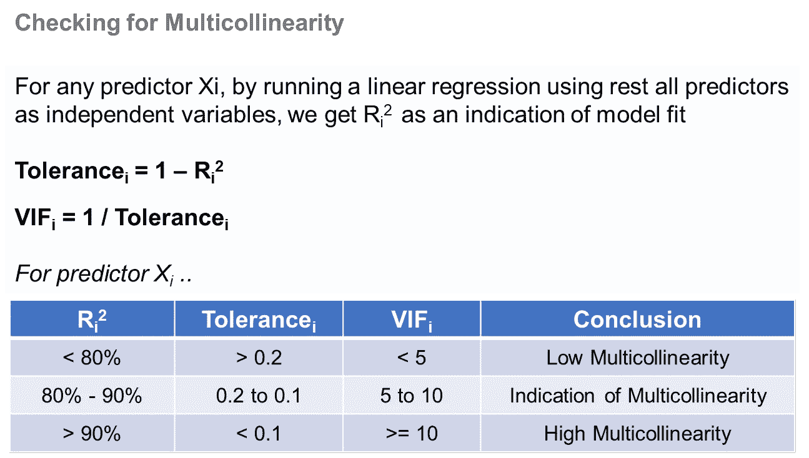
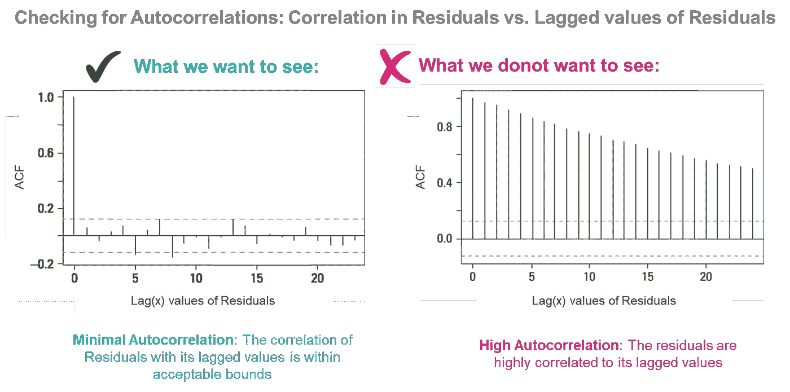
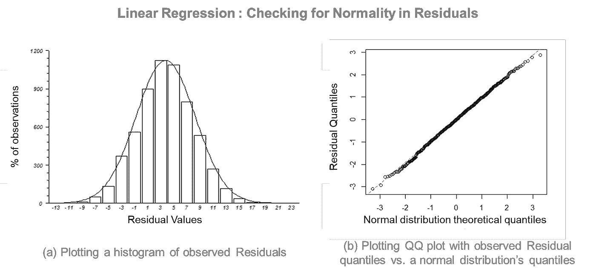

# 线性回归(第三部分)——基本假设

> 原文：<https://towardsdatascience.com/linear-regression-part-3-the-underlying-assumptions-82a66d5d5dd5>

## 理解最流行的数据科学算法所基于的支柱(前提)的来龙去脉

照片由 [Lucas Santos](https://unsplash.com/@_staticvoid?utm_source=medium&utm_medium=referral) 在 [Unsplash](https://unsplash.com?utm_source=medium&utm_medium=referral) 上拍摄

我们知道，当我们试图通过在一组**独立**变量(称为预测器)之间建立线性关系来预测一个变量(称为**因变量**)的值时，需要**线性回归**。在这篇文章中，我想谈谈线性回归模型背后的关键假设。然而，如果你在想**‘为什么要回归？’**或**‘线性回归背后的科学/数学基础是什么？请查看下面的帖子。**

*请看下面的链接，链接到一篇关于为什么需要回归的早期文章。*

  

*..一个解释线性回归背后的科学/数学。*

  

任何模型或任何程序都带有一堆**假设**，这些是**必须为真**的条件，模型才能被视为**成功匹配**。*将这些视为“如果 a，b，c 为真，则 x，y，z 成立”一类的陈述，当其为真时，意味着我们可以应用这种统计技术(即拟合我们的线性回归模型)。*

如果你读过关于线性回归的书籍/文章，你可能会发现不同数量的假设——这是因为有些假设非常基本，并且通常文本假设你已经按照设计对它们进行了分类。然而，下面我列出了所有的假设。
*请注意，假设 1 至 6 是关键假设，然后 7–10 是隐含假设或衍生假设。*

# 假设#1 —参数的线性

## ***什么意思？***

要应用线性模型，观测数据中需要有实际的线性。也就是说，**因变量和自变量必须有一个线性关系** *(相对于像二次关系这样的非线性关系)*以便我们在它们之间拟合一个线性模型。

> ***你知道吗？*** 这并不意味着总是 Y 和 X 需要线性相关；可以是 Y 与 X 平方相关，然后我们可以在 Y 和 X 平方之间(而不是 Y 和 X 之间)拟合一个线性模型。

比如下图-1 中；在场景-1 中，Y 和 X 不是线性相关的，但是存在某种关系。在操作 X(通过查看 X-cube 的相同数据)之后，我们在场景 2 中看到 Y 和 X-cube 是线性相关的。因此，Y 和 X 的变换(在这种情况下是 X 立方体)是线性相关的。
→我们可以在 Y 和 X-cube 之间应用线性回归模型。

图片-1 |线性关系(图片由作者提供)

> *这个假设也可以理解为:‘****参数的线性度****‘，*即**对于一个解释变量**的一个单位变化，在**因变量**的值中总有**的一个常数变化**。

## ***这个为什么重要？***

如果没有线性关系，那么建模和应用线性模型就没有意义。对！

## 怎么找？

我们可以通过**将 Y 对所有解释变量作图来找出线性关系。**
请注意，如上所述，我们可能有 X、X-square、X-cube、log(X)……X 的任何变换作为解释变量，我们正在寻找因变量 Y 和解释变量*之间的线性关系(即模型中使用的 X 的变换与仅 X 的变换)。*

# 假设# 2——观察的独立性

## ***什么意思？***

这种假设指的是收集的**数据点或观察值相互独立**的事实，根据这些数据点或观察值创建回归模型。如果数据是以独立的方式收集的，那么在您的数据集中这应该是最常见的情况。

> ***你知道吗？***
> 为个人收集的购物行为数据通常是独立的，因为一个人的行为不会依赖于其他人。相反，时间序列数据往往会导致观察结果相互依赖，因为一个数据点与基于时间的前一个值相关。

## 为什么这个 ***很重要？***

不独立通常意味着有一个潜在的模式；即**观察值来自特定来源** *(例如，时间序列数据——同一来源在不同时间点的观察值)。*

当我们的数据不独立时，我们看到:
- X 的观测值与自身相关
- X 和 Y 相互相关*(这是我们回归的前提)*
- *依次暗示，* Y 的观测值与自身相关

→ **在我们回归的数据中存在这些聚类或类**，这种潜在模式或类间相关性确保**来自相同类的多个观察值不会带来任何附加信息** *(因为它们来自相同的源)*和**模型的估计变得不太精确**。
*例如，考虑基于 100 个数据点估计学校中儿童的身高和体重之间的关系。你会看 100 个不同的孩子或者 20 个孩子的身高体重测量 5 次吗？*

## 怎么找？

这高度依赖于数据收集的方式。如果我们的数据单元彼此不相关，即每个单元的数据点独立于其他单元的数据值，那么可以安全地假设观察值的独立性。

# 假设# 3-无多重共线性

## 什么是多重共线性？

多重共线性是多重抑制模型中的现象，其中一个或多个独立变量彼此密切相关。也就是说，当**一个或多个解释变量**之间存在高度相关性**时，多重共线性就存在。**

> 线性回归假设解释变量之间没有完美或精确的关系。

## 为什么这很重要？

当两个或多个自变量相关时，它们**不会添加任何额外的信息来解释因变量**，而是添加了噪声，因为太多的变量传达了相同的信息。在回归模型中出现多重共线性的情况下，由于两个预测值之间的高度相关性，模型无法**了解两个变量对因变量的影响程度** *(因为两个预测值传达相同的信息，即以相同的方式影响因变量)*。
→这进一步导致**系数估计值和模型给出的 p 值变得非常不可靠**。随着多重共线性的严重程度增加，这些有问题的影响也会增加。

由于回归模型的关键目标之一是建立因变量和自变量之间的关系，多重共线性不会让这种情况发生，因为模型描述的**关系(具有多重共线性)变得不可信** *(因为多重共线性变量的β系数和 p 值不可靠)*。

> ***你知道吗？***
> 多重共线性**对模型如何拟合**没有重大影响，即 **R 平方和预测因变量**值在很大程度上**不受影响**。然而，自变量和因变量之间的关系显然是。

## 怎么找？

*   **相关矩阵:**
    为模型中使用的 n 个预测值准备一个**‘n×n’相关矩阵**，这使我们了解了每个预测值之间的相关性。为了使多重共线性最小化，**相关系数必须具有非常低的值**。
*   **容差或方差膨胀因子(VIF):**
    另一种了解一个预测因子是否与其他预测因子相关或者是否可以被其他预测因子解释的方法是**通过使用考虑中的这个预测因子作为因变量，其余所有预测因子作为自变量，运行线性回归**。如果模型非常适合，即**高 R 平方**，那么它意味着考虑中的**预测因子** **可以被其他预测因子**很好地解释。换句话说，考虑中的预测因子与其他预测因子密切相关，并且存在多重共线性。
    *下图-2 解释了我们如何为每个预测值定义容差和 VIF，并得出关于多重共线性存在的结论。*

图片-2 |从公差和 VIF 解释多重共线性(图片由作者提供)

# 关于残差的假设..

*残差定义如下:误差= y _ 实际值—Y _ 预测值*

残差是误差项，我们的模型无法解释它。因为没有一个模型是完美的，所以每个模型中都会有残差。然而，如果我们认真思考一个好的模型必须做什么，我们就会明白，在一个好的模型中，大多数因变量应该由模型来解释(即自变量)，残差项只是数据无法解释的随机位。

让我们从这个角度来看下面关于残差的假设。

# 假设# 4-残差应为独立同分布随机值

## ***什么意思？***

这意味着剩余的残差是**独立且同分布的随机**值。让我们一个一个地思考这个问题。

*   **残差是随机值:**
    回想一下，我们将在训练数据上拟合一个回归模型，它将始终是总体人口数据的子集*(因为我们几乎不可能拥有整个人口数据)*。如果我们选择不同的训练数据，模型拟合将会不同*(即使略有不同)*，因此，残差将会不同。
    →由于使用的**训练数据是随机的**，因此模型产生的**残差也是随机的。**
*   **残差同分布:**
    这意味着对应于每个数据行的每个预测的残差具有相同的概率分布。
*   **残差是独立的:**
    这有两个部分，都很重要:

**1。残差与自身无关-** 一次观测的残差不应该影响下一次观测的残差。这就是所谓的自相关。

> **自相关**是一个变量与自身相关的现象，即值依赖于先前的值。

**2。残差与解释变量无关-** 残差是随机值*(如上所述)*和**不得与模型中使用的解释变量(X)** 相关。因为如果它们是，那么它意味着有一些信息，驻留在剩余项中，我们的模型不能捕捉到。因此，我们的模型并不适合。

→如果残差可以预测，无论是通过残差本身还是通过解释变量，该信息都应该进入模型。否则，该模型不是很适合，因为它没有捕获这些信息。

## 为什么这很重要？

如果剩余项不是独立且同分布的随机值，这可能意味着下列情况之一为真:

*   线性回归模型**未能捕捉到**所有重要的独立变量。
*   线性回归模型**未正确指定**；也就是说，因变量和自变量之间没有内在的线性关系。
*   在数据中**存在多重共线性，这导致模型系数不稳定，进而导致残差项相互依赖。

    →因此，为了使我们的模型被认为是一个合适的可概括模型，**上述所有情况都必须不存在**。**

## 怎么找？

***检查自相关:***
自相关的存在意味着残差项与上一个或下一个残差项相关。简单地说，当数据的行中存在**模式时，就会发生**自相关**。
我们可以看看剩余项与其滞后值的**相关性(Lag(1)，Lag(2)，..滞后(x)值)并绘制成图**。
请参见下面的图片-3。X 轴对应于残差的滞后，以 1 为步长增加。第一行(左侧)显示残差与其自身的相关性(Lag0)，因此，它将始终等于 1。如果残差**不是自相关的**，**，从紧邻的下一行开始的相关性(Y 轴)将下降到虚线(显著性水平)以下的接近零值**。如果残差是自相关的，那么我们会看到残差项与其滞后值的高度相关性远远超出了可接受的界限。**

图 3 |绘制残差与多个滞后残差值的相关性(虚拟数据)(图片由作者提供)

> **永盒**和**杜宾-沃森测试**也可用于检查**自相关**。(我将在以后的文章中详细介绍这些内容)

***检查与解释变量无关系:*** 这可以通过查看残差与所有 X 变量的相关系数来检查。我们期望看到**残差项与解释变量的相关系数的低值，**表明它们之间的关系很弱。
我们可以前进一步，对观察到的相关系数进行**显著性检验**，看它们是否与零显著不同。显然，如果样本量较大，观察到的相关系数可能在统计上是有效的。

> **皮尔逊相关、肯德尔等级相关、斯皮尔曼相关和点双列相关**是根据变量类型检测两个变量之间相关性的一些常用方法。(我会在以后的文章中详细介绍这些内容)

# 假设# 5-残差正态分布，平均值为 0

## ***什么意思？***

它有两个组成部分，两者齐头并进:
(1)残差为**正态分布**和
(2)残差的**均值为 0** 。

如果回归模型是好的，这意味着**自变量在预测因变量**方面做得很好，并且大多数预测非常接近因变量的实际值。

*   换句话说，**你的模型的大部分预测误差接近于零**而**大误差比小误差少得多。**
    *→这就是正态分布的样子。*
*   另外，**残差的整体影响必须抵消**，即残差对因变量的正面和负面影响必须相互抵消。
    *→这意味着残差的平均影响(或均值)接近 0。*

→ **残差~ N (0，σ平方)**；即残差正态分布，平均值为零。

## 为什么这个 ***很重要？***

甚至不严格要求残差**的正态性。**如果残差不是正态分布的，你的回归模型不会出什么大问题。常态只是一个可取的性质。然而，如果**模型是好的，**残差必须相互抵消，并且必须以 0 为中心**。**

> ***你知道吗？*** 线性回归模型要求**解释变量和响应变量呈正态分布**，这是一个常见的误解**。**

## **怎么找？**

*****检查残差的正态性:***
我们可以将**残差项绘制在直方图**上，检查它们是否正态分布。请看下图-4(a)描绘了一个正常的情节。
另一种方法是创建一个**分位数-分位数图** (QQ 图)，绘制观察到的**残差分布与理论正态分布**。绘制的数据点是分位数，如果残差分布与理论正态分布对齐，我们将看到大多数点位于 45 度参考线上。请参见下图-4(b)。**

****

**图片-4 |检查残差(虚拟数据)的正态性(图片由作者提供)**

**记住中心极限定理，它说随着样本量的增加，分布趋于正态。可能会偏向分布的末端。在现实生活的数据中很难得到完美的曲线和分布。**

> **Kolmogorov-Smirnov、Shapiro-维尔克和 Anderson-Darling 检验是检查变量正态性的一些常见检验。
> (我将在以后的文章中详细讨论这些问题)**

*****检查残差的均值是否以 0 为中心:***
寻找残差的分布，应该在 0 附近，实际均值应该每接近 0。**

# **假设# 6——残差中的同方差**

## *****什么意思？*****

***同方差—Homo =相等，同方差=分散*
我们在上面已经了解到，残差是独立同分布的随机值，服从均值为 0 的正态分布。这里，我们施加了一个额外的约束，并且说**残差的变化不应该是因变量(y)的函数，并且通过扩展，不应该是解释变量(X)的函数****

****异方差**是指**残差对于 X** *的所有值都不具有恒定方差的现象(与同方差相反，这意味着残差对于所有 X 都具有恒定方差)*。**

**让我们试着理解更多，异方差意味着残差有更大的变化，这个变化依赖于 x。**

*   **这意味着**实际残差是独立变量的函数。****
*   **这也意味着，**残差包含一些独立变量没有捕捉到的信息**。**

## **为什么这个 ***很重要？*****

**根据异方差的定义，剩余值随 X 的变化更大；这意味着**预测随着 X 值**的增加或减少而变得更差，即**模型在 X 的范围内并不同样可靠或同样拟合**。*(注意，当残差显示出更大的变化时，模型更不可靠)*
此外，它通常会导致相关变量的系数估计值的方差增加，但回归模型并没有考虑到这一点。
— ***模型更有可能将系数报告为显著；事实上可能不是。*****

**显然，*异方差导致***模型不利于总体的泛化**。
*→我们必须在模型中有同方差。***

> *****你知道吗？*** 观察数据中异方差的常见原因有:
> - **从你的模型中缺失重要变量**。
> - **存在影响模型拟合的异常值**。
> - **模型的函数形式**不正确(即在没有线性关系的情况下模拟线性关系)**

## **怎么找？**

****残差和回归预测值**之间的**散点图**是检查数据是否同方差**(意味着残差在回归线上平均分布)**的好方法。见下图-5 左侧，残差的分布或方差随着回归预测值的增加而保持一致。反之；在右边，我们看到残差的分布(或方差)随着我们在预测回归值(X 轴)上从左向右移动而增加。
*请注意，在少数情况下，可能会绘制残差和回归预测值的标准化值，以了解分布情况***

****

**图片-5 |检查同质性:残差与拟合值散点图(虚拟数据)(图片由作者提供)**

> ****Goldfeld Quandt** 和 **Breusch-Pagan 测试**也可用于检查**同异方差**。(我将在以后的文章中详细介绍这些内容)**

# **隐含假设..**

## **假设# 7-回归方程被正确指定。**

**这直接来自线性假设，即如果 Y 与 X 平方有实际的线性关系，使用 X 平方(而不是 X)作为解释变量是有意义的。**

## **假设# 8——X 的可变性是正的**

**这直接来自于观察值彼此独立的事实，即彼此不相关。也就是说，所有观测值的解释变量的值并不相同。x 有可变性。**

## **假设#9 —剩余项与 X 无关**

**这直接来源于这样一个事实，即剩余项是独立且同分布的随机值。“独立性”意味着，它们与 X 变量完全无关。**

## **假设#10—观察值的数量多于预测值的数量**

**我们必须有大量的观察数据来构建我们的模型，而且这些数据应该远远多于所使用的解释变量的数量。**

# **摘要**

**为了让任何模型或数学/统计框架成立，底层数据需要遵循某些准则或原则。在线性回归模型的情况下，这些被称为“假设”，对于应用于任何数据的线性回归框架，这些假设必须成立。下面是一个线性回归模型的所有假设的详细清单。请注意，1-6 是关键，7-10 是派生的或更隐含的。**

1.  ****参数**中的**线性度**。**
2.  ****观察值**以**独立的方式**收集。**
3.  ****解释变量之间无多重共线性或多重共线性极小**。**
4.  **剩余项是**独立同分布的随机变量**。**
5.  **残差项为**正态分布** *(非必选)***均值以 0** 为中心。**
6.  **模型中剩余的项之间不存在**异方差。****
7.  **正确指定了回归模型。**
8.  **X 的可变性是正的。**
9.  **剩余项和 X(解释)变量之间没有关系。**
10.  **观察值的数量大于变量的数量。**

## **保持联系..**

**如果你喜欢这篇文章并且对类似的文章感兴趣 [***在 Medium 上关注我***](https://medium.com/@deepakchopra2911)[***加入我的邮件列表***](https://medium.com/subscribe/@deepakchopra2911) 和*(..如果你已经不是了..)*跳上成为 [***中型家族的一员***](https://medium.com/@deepakchopra2911/membership)*获取数以千计的有用文章。*(如果你使用以上链接，我将获得你约 50%的会员费)****

******..不断学习，不断成长！******