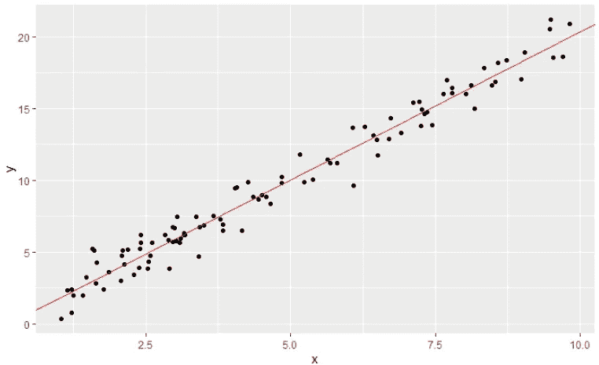
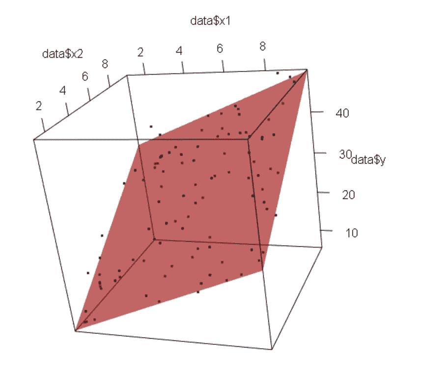
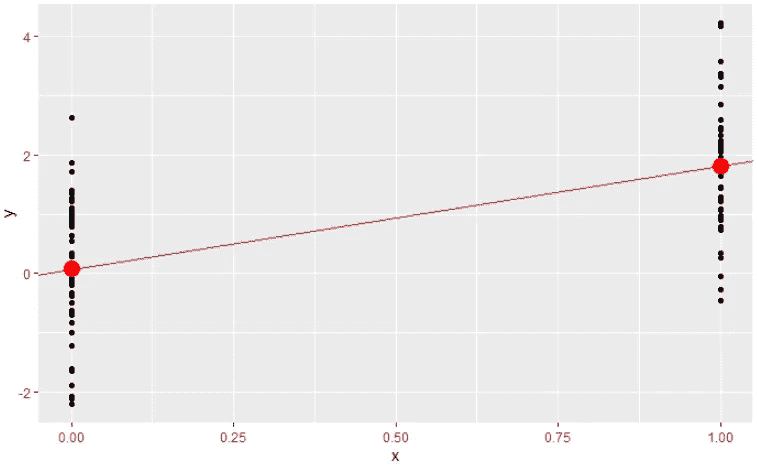
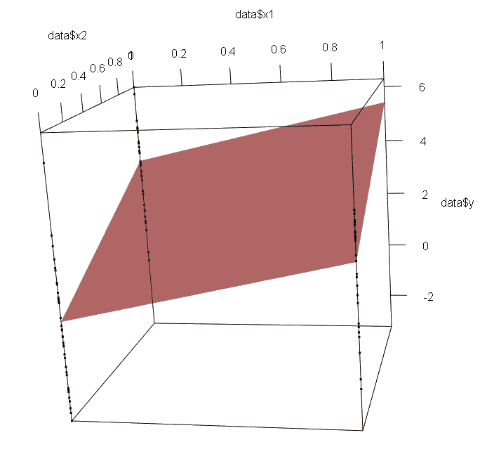
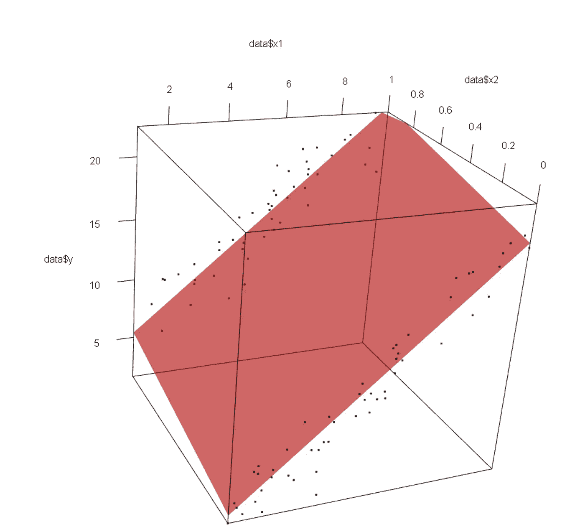
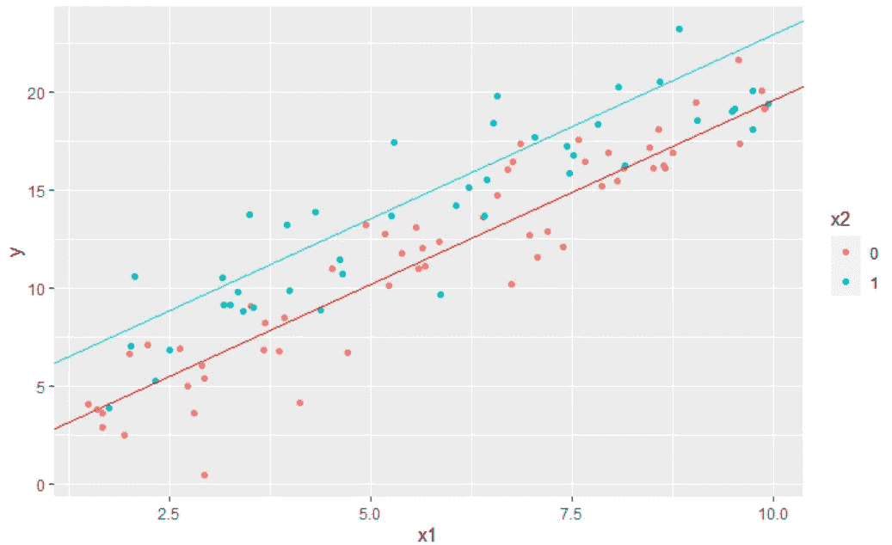

# 线性回归直观且更容易理解

> 原文：<https://towardsdatascience.com/linear-regression-visualized-and-better-understood-c8f7b9c69810>

## 可以检查一下自己是否真的懂多元线性回归

线性回归是最简单的算法之一。特别是当只有一个连续的特征变量:y=ax+b，并且用一条**直线**表示的时候。这种可视化表示对于理解模型是什么非常有用。

现在，你想知道在多变量的情况下，模型的可视化表示是什么吗？如果有多个**连续**变量，加上**分类**变量是什么？

在本文中，我将通过不同的案例，用具体的 R 代码来绘制图表。在看答案之前，你可以试着想象以下几种情况:

**连续变量**

*   两个连续变量
*   三个连续变量

**分类变量**

*   只有一个二元变量
*   一个变量有三个类别
*   一个变量有 n 个类别
*   两个二元变量

**混合变量**

*   一个连续变量和一个二元变量
*   两个连续变量和一个二元变量
*   一个连续变量和一个 n 类离散变量

**注意隐患**

当想象视觉表象时，请记住它总是线性的，笔直的，平坦的…不是弯曲的，不是非线性的…


由 [Unsplash](https://unsplash.com?utm_source=medium&utm_medium=referral) 上的[卡斯滕·沃思](https://unsplash.com/@karsten_wuerth?utm_source=medium&utm_medium=referral)拍摄的照片

# 连续变量

对于一个连续的变量，众所周知，线性回归是一条直线。然而，开始对其进行具体的编程和可视化是一个很好且容易的起点。

```
x=runif(100,1,10)
y=2*x+rnorm(100,0,1)data=data.frame(x=x,y=y)fit_lm=lm(y ~ .,data = data)ggplot(data,aes(x, y))+geom_point()+
 geom_abline(slope=fit_lm$coefficients[2],
 intercept = fit_lm$coefficients[1],
 color=”red”)
```



一个连续变量的线性回归(图片由作者提供)

对于**两个连续变量**，让我们称它们为 x1 和 x2，分别为系数 a1 和 a2，那么等式为:y = a1x1 + a2x2 + b。由于总共有 3 个连续变量(x1、x2 和 y)，我们必须想象一个三维空间:x1 和 x2 轴可以代表地面，y 轴代表高度。对于地面上的每一点，我们可以为 y 确定一个高度。所以最后，我们得到一个**平面**。

```
x1=runif(100,1,10)
x2=runif(100,1,10)y=2*x1+3*x2+rnorm(100,0,2)data=data.frame(x1=x1,x2=x2,y=y)fit_lm=lm(y ~ x1 + x2,data = data)plot3d(x=data$x1,y=data$x2,z=data$y, type = 'p')planes3d(fit_lm$coefficients["x1"], fit_lm$coefficients["x2"], 
         -1, -fit_lm$coefficients["(Intercept)"],
         col = 'red', alpha = 0.6)
```



两个连续变量的可视化线性回归(图片由作者提供)

对于**三个连续变量**，我们无法具体地将其形象化，但我们可以想象它:它将是一个四维超空间中的一个空间。

# 分类变量

对于一个二元变量，我们回到我们的简单方程:y = ax + b。在现实世界中，它可以代表性别，对不同的特征是或否。实际上，我们必须对它进行一次性编码，它可以取值为 0 或 1。然后我们就可以计算 y 的值了，如果 x = 0，那么 y = b，如果 x = 1，那么 y = a + b .所以直观的表示就是**两点**。我们可以很容易地证明，对于 x 的每个值，它们都是 y 的平均值。

为了形象化，我们仍然可以用直线来表示，但实际上在具体使用模型时，x 只等于 0 或 1。

```
x=c(rep(1,50),rep(0,50))
y=2*x+rnorm(100,0,1)data=data.frame(x=x,y=y)fit_lm=lm(y ~ .,data = data)ggplot(data,aes(x, y))+geom_point()+
   geom_abline(slope=fit_lm$coefficients[2],
               intercept = fit_lm$coefficients[1],
               color="red")
```



一个二元分类变量的线性回归(图片由作者提供)

现在，对于具有三个类别的分类变量，我们还可以创建虚拟变量，在实践中，我们将有两个特征。所以我们必须使用 3D 绘图。

与前一种情况一样，虚拟变量的组合会有几个点。我们可以创建一个平面来更好地可视化。我们知道可能的点在一个平面上，因为对于两个连续变量，方程是相同的:

y = a1x1 + a2x2 + b

在前一节连续变量中，x1 和 x2 是连续的，在这里，它们是二元的。

```
x=as.factor(sample(c(0,1,2), replace=TRUE, size=100))data=data.frame(model.matrix(~x))data$y=2*data[["x1"]]+3*data[["x2"]]+rnorm(100,0,2)fit_lm=lm(y ~ x1 + x2,data = data)plot3d(x=data$x1,y=data$x2,z=data$y, type = 'p')planes3d(fit_lm$coefficients["x1"], fit_lm$coefficients["x2"], 
         -1, -fit_lm$coefficients["(Intercept)"],
         col = 'red', alpha = 0.6)
```



具有 3 个类别的分类变量的线性回归(图片由作者提供)

值得注意的是，没有 x1=1 和 x2 =1 的观测值，因为 x1 和 x2 来自一个唯一的分类变量，不可能同时为真。

所以线性回归的表示是空间中的三个点。很容易证明它们是 x1 和 x2 可能组合的平均值。

现在，如果有**两个二元变量**呢？除了 x1=1 和 x2 =1 的观测值之外，情况非常相似。该表示仍然是一个平面，包含二进制变量的 **4 种可能组合**中每一种的点。值得问的问题是:

> 平面是否用平均值切割 4 组观测值？

答案是否定的，我们用收缩来证明。

*   条件 1:如果它们是平均值，则空间中将有 4 个点
*   条件 2:所有点都应该在一个平面上因为我们有等式:y = a1x1 + a2x2 + b

上述两个条件不可能同时成立，空间中的 4 个点不一定在一个平面上。因为我们知道条件 2 总是真的，所以条件 1 不总是真的。

# **混合变量**

对于**一个连续变量和一个二元变量**，我们可以用两种不同的方式想象。设模型为 y = a1x1 + a2x2 + b，x1 连续，x2 分类。

*   由于我们有两个连续变量的平面，如果其中一个特征变量是二元变量，那么对于空间中的一维，我们只有 0 和 1，而不是可能的值，那么我们有**两条直线在 3D 空间**中。而且你认为他们一定是**并联**？答案是肯定的，因为它们肯定来自一架飞机。

```
x1=runif(100,1,10)
x2=sample(c(0,1), replace=TRUE, size=100)y=2*x1+3*x2+rnorm(100,0,2)
data=data.frame(x1=x1,x2=x2,y=y)fit_lm=lm(y ~ x1 + x2,data = data)plot3d(x=data$x1,y=data$x2,z=data$y, type = 'p') 
planes3d(fit_lm$coefficients["x1"], fit_lm$coefficients["x2"], 
         -1, -fit_lm$coefficients["(Intercept)"],
         col = 'red', alpha = 0.6)
```



一个连续变量和一个二元变量的线性回归(图片由作者提供)

*   由于有两条直线，我们可以把它们投影到连续特征变量 x1 和 y 形成的平面上，这样就得到两条平行的直线。一条直线代表 x2=0 时的模型，斜率为 a1，截距为 b；另一个会代表 x2=1 时的模型，斜率永远是 a1，截距是 a2+b。

```
ggplot(data,aes(x1, y,color=as.factor(x2)))+
   geom_point()+
   geom_abline(slope=fit_lm$coefficients["x1"],
               intercept = fit_lm$coefficients[1],
               color="red")+
   geom_abline(slope=fit_lm$coefficients["x1"],
               intercept = fit_lm$coefficients[2]+
                  fit_lm$coefficients[3],
               color="#06D1D5")+
   labs(color="x2")
```



一个连续变量和一个二元变量的线性回归(图片由作者提供)

对于一个连续变量加**一个分类变量**带 **3 个分类**或者 **n 个分类**，我们将无法表示整个空间，我们可以表示连续变量和 y 形成的平面上的投影，平行的直线会有 n 条。

# 结论

现在，我们可以对所有问题给出答案，以此作为结束:

**连续变量**

*   一个连续变量:直线
*   两个连续变量:计划
*   三个连续变量:空间

**分类变量**

*   只有一个二元变量:两点(类别平均值)
*   一个变量有三个类别:三个点(类别平均值),它们在一个平面上，因为否则不可能
*   一个变量有 n 个类别:n 个点(类别平均值)
*   两个二元变量:4 个点(不是平均值),它们不在一个平面上

**混合变量**

*   一个连续变量和一个二元变量:两条平行的直线(每个类别一条线)
*   两个连续变量和一个二元变量:两个平行平面
*   一个连续变量和一个 n 类离散变量:n 条平行直线

如果你想在 Excel 中从头实现线性回归，可以阅读这篇文章:

[](/linear-regression-from-scratch-in-excel-3d8192214752) [## 在 Excel 中从头开始线性回归

### 这样你就能更好地理解线性回归是如何工作的

towardsdatascience.com](/linear-regression-from-scratch-in-excel-3d8192214752) 

如果您对其他算法的同类可视化感兴趣，请发表评论。

线性回归是一个非常基本的算法，正如你可以看到的所有可视化，如果数据不是线性的，它不会执行得很好。为了更好地模拟非线性数据，我们可以用几种方法来增强线性回归。你可以通过这篇文章了解更多关于**无监督机器学习算法**。

[](/overview-of-supervised-machine-learning-algorithms-a5107d036296) [## 监督机器学习算法综述

### 大图如何通过连接点给我们洞察力和对 ML 的更好理解

towardsdatascience.com](/overview-of-supervised-machine-learning-algorithms-a5107d036296)