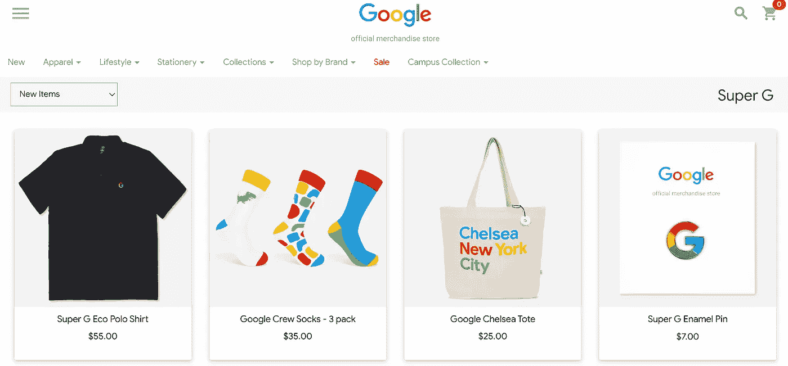
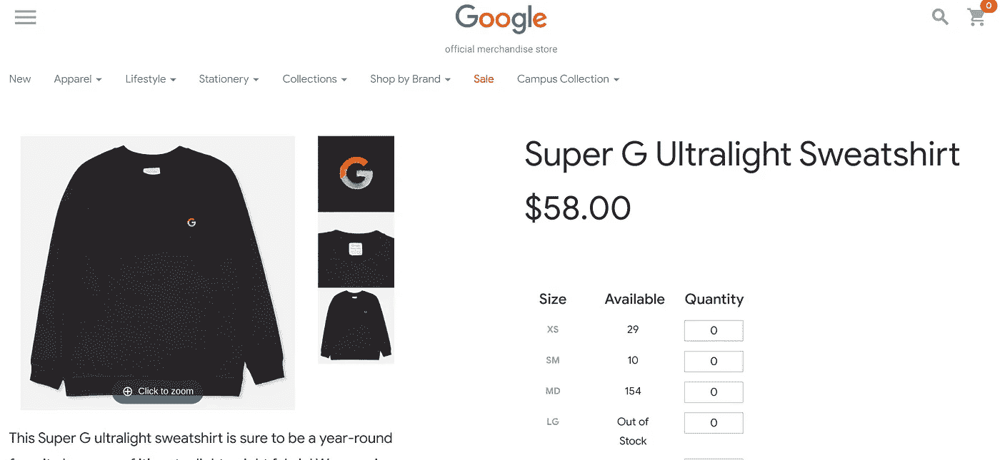
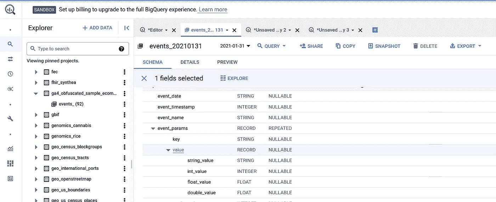
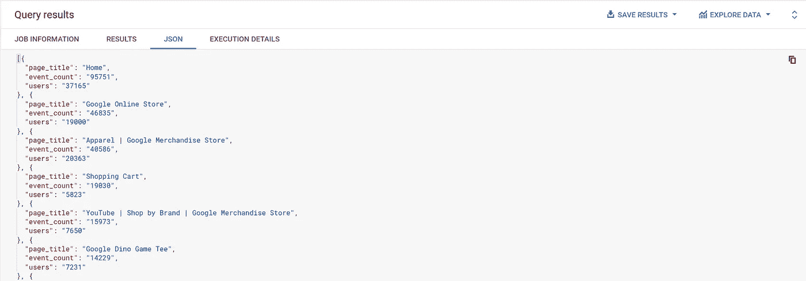
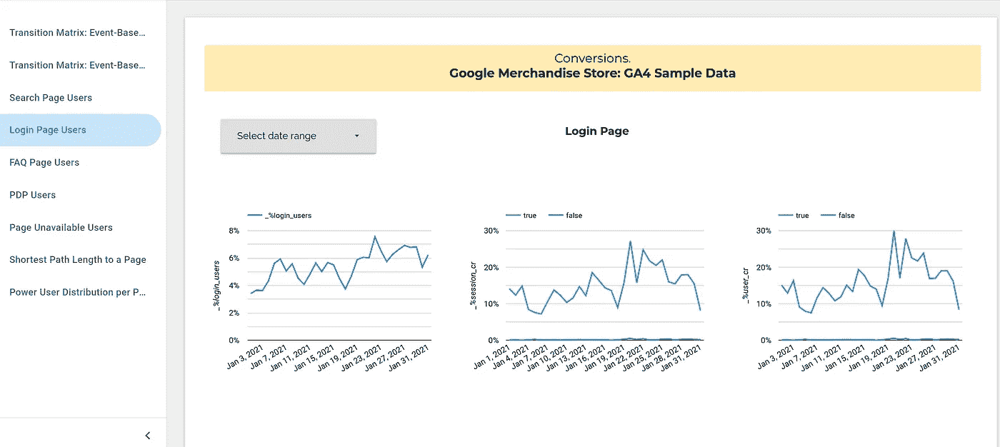
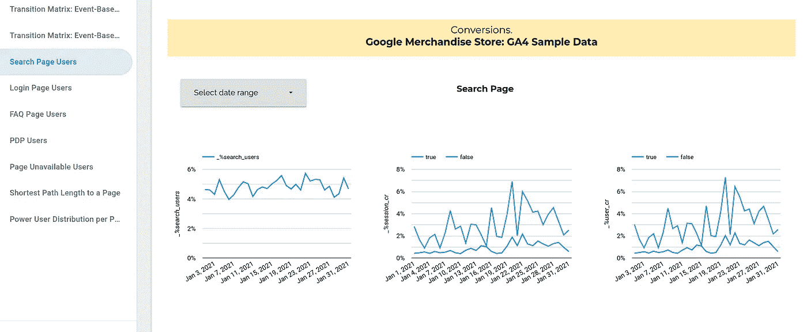
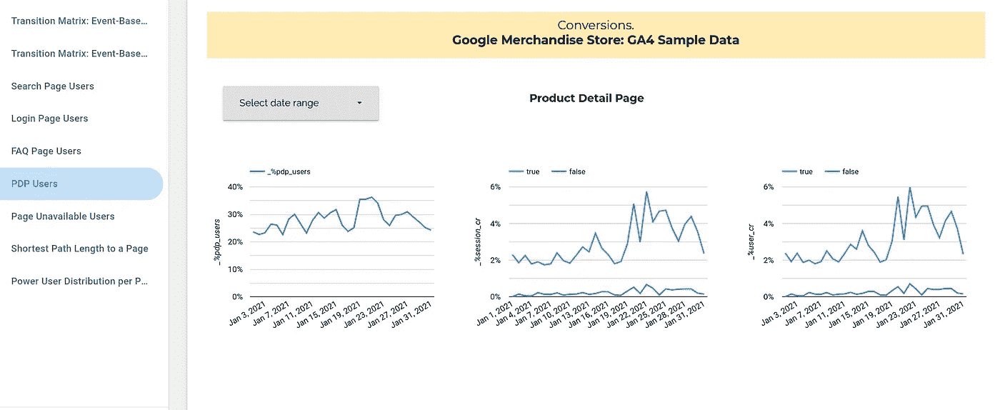
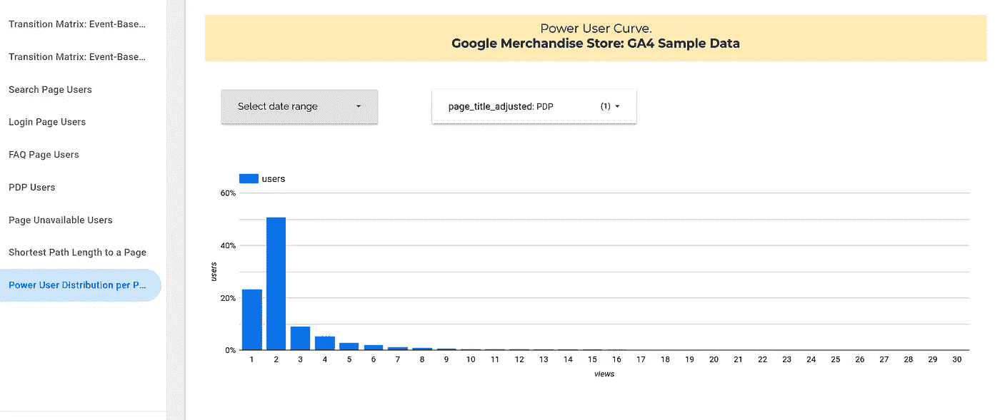
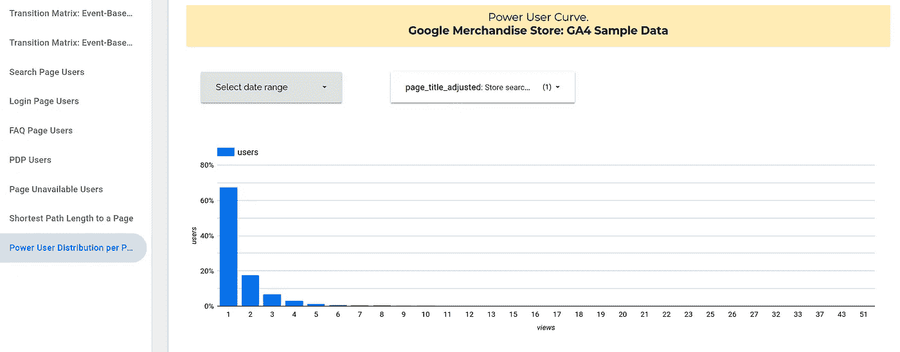
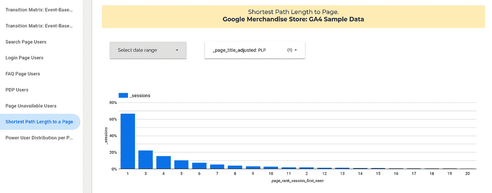

# 寻找超级用户旅程

> 原文：<https://towardsdatascience.com/looking-for-power-user-journeys-in-e-commerce-746f5f68b697>

## BigQuery SQL + Data Studio 解决方案

奈杰尔·塔迪亚恩多在 [Unsplash](https://unsplash.com?utm_source=medium&utm_medium=referral) 拍摄的照片

这是这篇文章的后续文章，在这篇文章中，我分享了如何使用 BigQuery 数据来理解用户的旅程。我们在一个奢侈品电子商务设置中使用了一个类似的框架，这不仅有助于理解我们的用户在做什么，还可以了解产品工作的重点领域。

第一篇文章谈到了如何在 BigQuery export 中使用 Firebase 触发的自动`screen_view`事件来询问和回答用户如何使用你的应用程序的问题。虽然第一篇文章是一组指南，但我希望第二篇文章更具战术性，提供可行的 SQL 代码和 Data Studio 示例。

这篇文章对分析师很有用，尤其是那些希望利用 BigQuery GA4 或 Firebase 数据来了解用户旅程的产品分析师。如果你没有对窗口函数感到困惑，你可以在下面的代码片段中找到一些例子，希望对你有所帮助。

# 数据集

我将使用 BigQuery 沙盒和带有点击流数据的[公共数据集](https://developers.google.com/analytics/bigquery/web-ecommerce-demo-dataset)来说明概念和想法。BigQuery 沙盒是免费使用的，所以你不会产生任何费用。它有局限性，但是，这与我们的用例无关。

如果你想跟进，这是一个到 BQ 控制台[https://console.cloud.google.com/bigquery](https://console.cloud.google.com/bigquery)的链接。这里有一个视频描述了如何设置沙箱。

数据集是[谷歌商品商店](https://shop.googlemerchandisestore.com) GA4 数据的样本。这是一个网站，而不是一个应用程序，然而，大多数 GA4 事件将被测量类似于一个应用程序。在应用程序中，你最有可能追踪`screen_view`事件，而在网络上，你很可能遇到性质相似的`page_view`事件。

对于 web 和 app，这些是 GA4 中[增强测量事件的一部分。如果你感兴趣的话，你可以点击链接查看剩下的活动。对于 web，当您在 GA 上启用增强的电子商务时，会跟踪事件，不需要额外的开发。](https://support.google.com/analytics/answer/9216061?hl=en&ref_topic=9756175)

同样，对于应用程序——包括 Android 和 iOS——以及 Firebase。

> 当你将 Google Analytics for Firebase SDK 添加到你的应用程序中时，有许多不同的事件[开始自动收集](https://support.google.com/firebase/answer/6317485?hl=en)——包括你的 Android 和 iOS 应用程序的`*screen_view*`事件。

# 理解你在测量什么

数据面试的时候经常能碰到。虽然我不打算把重点放在漏斗和潜在用户旅程来演示代码，但每一个现实生活中的分析都应该从 ***理解您正在测量的东西*** 开始。通常，您对以下内容感兴趣:

*   你为什么要进行分析，以及将如何使用它
*   行动发生在漏斗或用户旅程中的什么地方
*   了解测量前后发生的事情是很有用的，例如，如果它是漏斗中的一个步骤，那么测量点的入口和出口在哪里

你需要这些点，不仅是为了更好地理解你的分析，也是为了解决问题和当场发现奇怪的结论。

谷歌商品商店的片段:主页。[https://shop.googlemerchandisestore.com/](https://shop.googlemerchandisestore.com/)。作者图片

“立即购买”将带您进入产品列表页面(PLP)。

谷歌商品商店 PLP 的片段。[https://shop.googlemerchandisestore.com/Super+G?tpt = theme 1 _ en&sortci =最新的+desc](https://shop.googlemerchandisestore.com/Super+G?tpt=theme1_en&sortci=newest+desc) 。作者图片

Google 商品商店中产品详细信息页面的片段。[https://shop . Google merchandise store . com/Google+design/Apparel/Super+G+ultra light+运动衫](https://shop.googlemerchandisestore.com/Google+Redesign/Apparel/Super+G+Ultralight+Sweatshirt)。作者图片

# 屏幕视图的数据模型

一旦您知道了事件在哪里以及如何被触发，数据集就更有意义了。

## 基于事件的数据的基础

BigQuery 中的 GA4 数据是基于事件的。在 GA4 中，Google 取消了会话和跟踪会话的概念，转而支持基于用户和事件的指标。如果您曾经在 BQ 中使用过 Universal Analytics 数据集，您会注意到不同之处。这在很多层面上都是有意义的，因为它让你思考跨会话、站内和站外的用户行为，这种思维方式本身就是有价值的。

在大多数情况下，BQ 中的事件会有*键*和*参数*。那些位于公共数据集表中的`event_params`嵌套字段下的。

BigQuery 公共数据集片段:事件表。作者图片

展开`event_params`，参数有 key 和 parameters，可以是 3 种类型:string、integer、float (+double)。如果您的应用程序试图发送类似数组的东西，您可以考虑使用 [items array](https://developers.google.com/analytics/devguides/collection/ga4/ecommerce?client_type=gtag#implementation) 。它有一个具体的实现，感兴趣的可以去看看。

在我们的例子中，感兴趣的事件是`page_view`。感兴趣的参数是`page_title`。这里有一个简单的查询来查看一个`page_title`被查看的频率。

来源:[https://gist . github . com/Khun reus/8c2e 10463 EC 6 bb 8 b 18 e 17 DC 558 a 6 fdba](https://gist.github.com/khunreus/8c2e10463ec6bb8b18e17dc558a6fdba)。按作者

查询的最佳结果:

Google 商品商店上点击量最高的屏幕片段——基于上面的查询。作者图片

在电子商务和增长黑客中，你通常对漏斗的起点、终点以及其间发生的事情感兴趣。你可以优化的漏斗的一端是购买。或者，也许你公司的目标之一是提高简讯订阅率，有一个页面可以实现这一目标——找出它的名称并包含在你的分析中——类似于我将在下面重点介绍的购买。

现在让我们假设家是用户购物之旅的起点，结账确认页面是用户转换的起点。了解这些，我们可以:

*   找出用户在这两点之间做什么
*   他们到达结账确认页面的速度
*   按`users who reached Checkout Confirmation / Users who landed on Home Page`或 1069/37265 `1,069/37,265 = 2.87%`特定时期的用户转化率计算的近似用户转化率。
*   我们还可以发现遵循或不遵循特定路径或访问页面的用户组之间的转换差异。例如，使用搜索的用户——可以用标题为`Store search results`的页面的浏览量来近似——转化率更高吗？对于遇到`Page Unavailable`的人来说，这种转变看起来如何？

***注意页面标题上的*** *。*如果您运行上面的查询，您会注意到一些`page_title`值带有产品名称。对于我们的分析来说，这是相当细粒度的，因此可以通过应用自定义规则对它们进行分组。你可以看看这个链接后面的代码片段[，下面的两段解释了操作。](https://gist.github.com/khunreus/17d0f5377bd15b41b2e4956a7166710a)

查看`page_location`键的值，当 string_value 在`/`上拆分时，这些位置具有至少 5 个元素，第 4 或第 5 个元素(从 1 开始计数)包含类别的名称，例如:*配件、服装、品牌、校园+收藏、饮料、电子产品、Google+重新设计、生活方式、nest、new+2015+徽标、笔记本+日志、办公室、商店+by+品牌、小商品、文具、可穿戴设备*，最后一个元素包含`+`。我们可以将属于此类页面位置的页面标题标记为产品详细信息页面(PDP)。这并不能捕捉到所有的情况，但是可以捕捉到大多数的情况。

`page_locations`最后一个元素不包含`+`，但第 4 或第 5 个元素包含上述类别，可归类为产品列表页面(PLP)。

您可能需要也可能不需要对公司的数据进行类似的操作，但是，这种转换并不少见。

***关于 cte 和子查询的注释。与我共事过的一些伟大的数据工程师强调，用 cte 而不是嵌套子查询来阅读别人的 SQL 代码要容易得多。虽然简单查询的性能通常是相似的，但我更喜欢使用 CTE，因为您可以在一个 CTE 的基础上构建，并且代码仍然易于管理。一个 CTE 可以自连接，用于计算每个 CTE 的`min`和`max`以及其他计算，在其他 cte 和其他子查询中重复使用。这可能会影响扫描数据的大小，影响大型查询的性能和成本。下面的代码演示了 cte 的一些优点。***

例如，我正在创建一个 CTE `base_table`，它将包含来自`bigquery-public-data.ga4_obfuscated_sample_ecommerce.events`表的列、嵌套字段和日期的子集。

来源:[https://gist . github . com/Khun reus/05fa 134 e 408 ad 5 BD 6 bdbfac 4c 8 CB 0675](https://gist.github.com/khunreus/05fa134e408ad5bd6bdbfac4c8cb0675)。按作者

# 数据分析

## Data Studio 数据探索

您可以使用查询结果中的菜单在 Data Studio 中轻松浏览您的数据。注意数据的大小——Data Studio 并不总是缓存它，在现实生活中您可能会产生成本。将查询结果保存在一个单独的 BQ 表中并在其上创建一个仪表板通常是值得的。

或者，您可以开始在 Data Studio 中创建一个仪表板，并添加一个查询作为数据源——当我知道我不会马上完成可视化并且 temp 表即将过期时，我更喜欢这个选项。

BigQuery 结果片段:数据探索。作者图片

如果您想继续了解，请随意查看[这个仪表盘](https://datastudio.google.com/s/jb3KuKAbMbo)。

## 标记会话

为浏览过潜在重要页面的访问者或用户设置标志是很有用的，比如`Checkout Confirmation`。您可以直接在 BI 工具中完成，因为您可以更灵活地操作数据。

用结帐确认标记访问。作者图片

您可以使用这些过滤器来突出显示到达旅程中所需点的会话和用户的转换。

转换矩阵片段:前 10 页。作者图片

***转移矩阵***

*主要目的*:了解用户流量、主要过渡和退出。

在行中，转换矩阵具有引用的“当前”页，或在列中对数据透视表的行的`page_title_adjusted`——下一页，或`next_page`。这些值是从行到列的转换次数。从那里，你可以说，例如，如果一个用户登陆了一个 PLP 或商店搜索结果页面，他们下一步可能会去哪里。

在上面的表格中，显示了前 10 页从行到列的转换次数。其他选项是查看`_session_id`——一个`user_pseudo_id`和`visitID`的串联，以及用户的不同`user_pseudo_id`的计数。在上面，我使用`Record Count`的计数作为一个值字段(`Metric`字段)。在这种情况下，值显示有多少事件从一行中的一页转换到一列中的一页。

例如，有从 PLP 到空页面的`40,697`转换，这是从网站的退出，因为大多数页面都被正确跟踪。这代表 PLP 的总转换数的`40,697/140,608=29%` ——根据行总数计算得出。从 PLP 浏览到 PLP `62,533/140,608=44%`的用户比例较高，从 PLP 浏览到 PDP `21,633/140,608=15%`的用户比例较低，这意味着用户在浏览产品列表页面时，不会表现出对点击 PLP 项目的浓厚兴趣。如果是正规的电商店铺，那就太惊人了。

在上面的基础上，在转换矩阵中，虽然有转换的绝对值是好的，但您也想了解该转换与来自`page_title_adjusted`的总转换相比如何。这在 Tableau、Google Sheets 或 Excel 中的数据透视表或 Python 中很容易做到，但需要在 DataStudio 中做一些工作。这里有几篇关于使用数据混合的好博客文章[和这里的](https://datastudio.google.com/u/0/reporting/fa64ba20-08ed-40b1-be7e-a005223a1075/page/E75FB)[和使用查询参数的好博客文章](https://datamonkeysite.com/2020/08/22/how-to-calculate-percentage-of-row-using-google-data-studio-parameter/)——都是同一作者写的。

这里大概是你能得到的。

Data Studio 代码段:% 1 从一页过渡到下一页。作者图片

***信号搜寻——什么行动可能导致积极的结果***

*主要目的*:围绕用户行为和要转换的信号制定假设。

最好能有一点预感，哪些功能应该与业务的积极成果相关联。在电子商务中，我们通常从思考更高的转化率开始。信号可以是，例如，愿望清单上的访问、购物袋、搜索屏幕、关于支付方法的信息等。

在这个例子中，让我们挑选出几个候选人:

*   `Store search results`
*   `The Google Merchandise Store — Log In`
*   `Frequently Asked Questions`

您还可以注意与转换的负面关联，例如，通过查看以下页面

*   `Page Unavailable`

这些也可能是没有搜索结果的页面，各种错误页面等等。

要标记会话或用户，您可以使用类似于上面第一个查询片段中第 108 行的`pages_on_a_visit`的聚合。休息可以按照上面的`Flagging Sessions`部分来做。您可以将这些控件添加到过渡矩阵中，以查看过渡是如何变化的。

如果结帐页面上的`page_title`被正确跟踪，这将是一个胜利，它将使转换更加容易。如果不是这样，可以探索`screen_view`之外的事件，比如`ecommerce_purchase`或者`purchase`、`checkout_progress`等。在谷歌商品商店的情况下，让我们假设上面标记的`Checkout Confirmation`页面可以作为一个很好的代理。

基于页面视图的会话转换率(CR)定义。作者图片

基于页面浏览量的用户转化率(UCR)定义。作者图片

为了可视化与可能的转换信号的连接，我们希望有一个带有分解维度的图表，如 Data Studio 中的折线图。

分析潜在信号时，至少有两点值得注意:

*   *有多少用户*这样做——你可以看到是否有足够多的用户使用这个页面或某个功能，以及是否有潜在的改进；
*   相对于那些没有做你想让他们做的事情的用户,*他们的转化*看起来如何——所以你可以假设让更多的用户参与旅程的这一部分是否会对业务产生积极的影响，或者在这种情况下对转化产生积极的影响。

了解这两点将有助于你形成假设，从观察开始，比如“做 X 的用户比不做 X 的用户转化率高 2 倍。也就是说，做 X 的用户只占 Y%。我们可以分析这些用户的行为并试图吸引更多类似的用户使用我们的产品，或者引导更多的用户做 X。如何测试？”

例如，这是使用了`The Google Merchandise Store — Log In`的用户和没有使用的用户之间的对比。

信号搜索:查看登录页面及其每日 CR 的用户。作者图片

从上面可以看出，只有 3.4-7.55%的用户访问了登录页面，但是他们的用户转化率是 7.5-30%，与转化率低于 0.5%的不访问该页面的用户相比，这种差异相当明显

会是什么呢？

在谷歌商品商店，你必须登录才能继续购买，所以它解释了上面的图表。然而，在一般的电子商务案例中，你可能想知道*是什么让这些用户与众不同，他们在应用上还做什么，他们来自哪里。*从另一个角度来看，并不是所有登录的用户都会转化，你如何帮助他们联系他们可能感兴趣的产品？

然而，这并不意味着你*必须*让每个用户登录才能购买。这可能对一些企业有用，但很可能会降低转化率，如果不是成为转化率杀手的话。

让我们看另一个例子，即`Store search results`页面。这是一个更公平的比较，因为虽然用户必须登录才能转换，但他们不必进行搜索。

信号搜索:查看搜索页面的用户及其每日 CR。作者图片

3.97–5.73%的用户在谷歌商品商店上查看了搜索页面，我们可以用它作为搜索的代理。给定转换，我们可以提出一个假设，这个动作特别表明用户更有可能转换。可能是搜索返回相关结果，用户发现这很方便，或者简单地说，使用搜索的用户如果找到产品就会表现出购买的意图，因为他们或者知道他们想要什么，或者打算找到与他们想要的产品相似的产品。可以肯定的是，这些因素将以不同的比例混合，为个人用户制作独特的配方。

在陈述假设时需要小心——那些不是事实，必须放在上下文中理解。随着越来越多的用户采用该特性，这种差异可能会缩小或消失，因此任何开发的特性都必须经过测试。

你会发现进入`Product Detail Pages`的用户也有类似的信号。当然，我们必须转到 PDP 来将产品添加到购物车，这使得该页面类似于日志以防万一。然而，这也可能因业务而异，因此为了举例，值得研究一下。

与我们上面看到的其他潜在信号相比，相当多的用户会访问产品详情页面:大约 22-26%。他们的转换率波动很大，但在 1 月下半月达到 6%，所以这可能是一个有趣的信号。另请注意，一月的下半月似乎有更高的会话和用户转换率，这可能与业务的季节性有关，也是深入探讨的一个有趣点。

没有进入 PDP 的用户，假设所有页面都被正确跟踪，他们的购物车中可能已经有商品了。

信号搜索:查看产品详细信息页面及其每日 CR 的用户。作者图片

另一方面，可能有些页面你不想让你的用户看到，因为它们与用户体验有负面关系。其中一个例子就是`Page Unavailable`。

0.3-1.3%的用户点击了页面，但是看看转化率是如何被拉平在 0%的。对于这些“负面”案例，不仅要看转化的短期指标，更要深入了解这种负面体验如何长期影响用户保留率、LTV 等。

反向信号搜索:查看登陆“页面不可用”的用户及其每日 CR。作者图片

***电力用户***

*主要目的*:了解用户动态，他们的行为，监控用户质量。

在最初的[陈楚翔](https://andrewchen.com/power-user-curve/)博客文章中，超级用户曲线描绘了在特定的时间段内，例如 28 天、1 个月、1 周等，活跃的用户数量或使用这些用户活跃的天数。作为这一思想的发展，您可以绘制出在特定时期内用户数量与操作执行次数的关系图。

上面的主查询需要对组用户稍加修改。

来源:[https://gist . github . com/Khun reus/399 baa 529 c 6d 02 AC 09 bb 3 Abd 0 bee 008 a](https://gist.github.com/khunreus/399baa529c6d02ac09fb3abd0bee008a)。按作者

下面是 Data Studio 为观看过`PDP`的用户进行的概念演示。2021 年 1 月，约 50%的用户观看了 2 个 PDP。对于一个正规的电商来说，曲线应该更多的向右偏移。随着业务致力于吸引更高质量的用户(这些用户实际上对产品足够感兴趣，足以看到其细节)或引导更多用户使用 PDP，曲线应该开始向右移动，并可以作为诊断工具。

超级用户曲线:有产品详情页面访问量的用户。作者图片

几乎 70%登陆搜索结果页面的用户只登陆过一次。是不是意味着他们找到了想要的东西？他们后来到底做了什么？

超级用户曲线:有搜索的用户。作者图片

超级用户分析，结合信号搜索练习，可以用作构建电子商务框架的垫脚石，以评估积极成果的概率，并坚持我们在这里的例子——转化率。简单来说就是“转化倾向”。

***用户通常在哪个步骤…？***

*主要用途*:诊断用户到达旅程中某一点的速度。

需要很长时间才能完成的旅程可能是主动浏览的标志，也可能是用户迷路的标志。在没有用户输入的情况下，区分这两者可能很难，但在某些情况下，可能没有那么难。

例如，如果用户转换的唯一方式是浏览产品列表页面，而用户在 70%的情况下最早看到的是屏幕排名第 10。一定有什么不对劲。更常见的情况是用户从主页直接或通过菜单进入 PLP，这样他们就不会被大量的横幅、不清楚的导航、弹出窗口等阻挡。

在 SQL 中，您可以获得与主查询的第 115 行类似的屏幕等级([也链接到这里](https://gist.github.com/khunreus/05fa134e408ad5bd6bdbfac4c8cb0675))。

下面是它如何寻找一些网页。

几乎 70%浏览过 PLPs 的用户都是在第一页浏览的。如果你把这个放在流量来源上，这些用户可能是通过搜索或付费链接直接来自搜索引擎的。

谷歌商品商店 PLP 的最短用户路径。作者图片

然而，最早登陆搜索屏幕的用户是在 3-5 号屏幕附近，这是完全有道理的。它在用户旅程中并不太远，因为使用搜索的用户倾向于以更高的速度转化，我们可以假设搜索栏很容易找到，用户更喜欢使用它而不是浏览导航栏。

第一个搜索页面的路径长度。作者图片

先不说其他的，看看用户需要多长时间才能达到一个转化点总是非常有趣的。在这里，我们有一种更均匀的分布方式，大多数用户，大约 5%在第 16 屏结账。

结账页面的路径长度。作者图片

# 最后

这是一个谷歌商品商店的例子，在我看来，如果这是一个常规的电子商务，用户行为看起来不健康。对于一家核心业务不是在网上销售商品的公司来说，这可能已经足够好了。

您可以在您的角色中使用类似的分析来了解用户在没有第三方工具的情况下的行为，或者在第三方工具的基础上帮助您了解用户行为。

有很多东西需要解开，特别是当涉及到“可操作的见解”时，但我相信一旦你将数据切片，你至少会了解到一些关于你的用户的有价值的东西。您可以在分析的基础上对用户级别以及流量和交易数据进行分层，以进行更深入的分析，并与营销、产品、CRM 和其他职能部门合作，创建漂亮的产品和渠道，将用户与您提供的真正价值联系起来。

也许你有最喜欢的技术，或者讨厌我提到的一些技术。分享你的想法！

# 资源

             