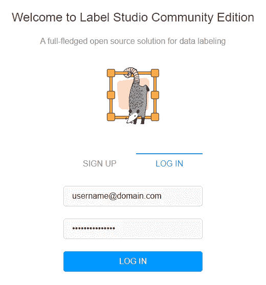
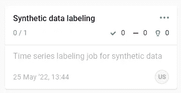
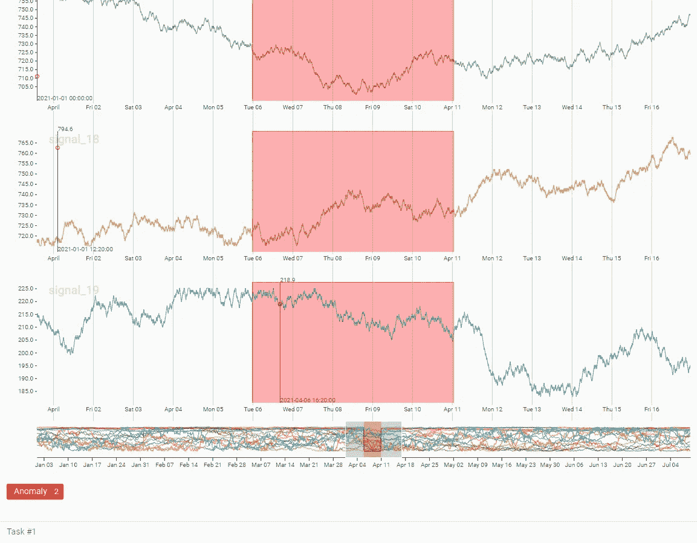

# 希望将时间序列注释无缝集成到 ML 工作流中吗？不要再看了

> 原文：<https://towardsdatascience.com/looking-to-seamlessly-integrate-your-time-series-annotation-in-your-ml-workflow-look-no-further-d7721c8f59e0>

## 在 Amazon SageMaker 上运行 Label Studio，将标签无缝集成到您的机器学习工作流程中


由[维克多·福加斯](https://unsplash.com/@sonance?utm_source=medium&utm_medium=referral)在 [Unsplash](https://unsplash.com?utm_source=medium&utm_medium=referral) 上拍摄的照片

我在工业用例的时间序列异常检测方面做了很多工作，大多数时候我依赖于无监督的方法。然而，半监督方法可以增加有价值的增值。在其他情况下，您可能还希望确认无监督的模型输出，因此必须使用标注工具来轻松集成到您的工作流中。

这就是 [**标签工作室**](https://labelstud.io/) 的用武之地！

前段时间，我的一个同事( *Sofian* ，你可以 [**关注此处**](https://medium.com/@sofian-hamiti) )写了下面这篇文章，讲解如何在 [**亚马逊 SageMaker**](https://aws.amazon.com/sagemaker/) 上部署 Label Studio:

[](https://medium.com/geekculture/labeling-data-with-label-studio-on-sagemaker-e4b2d1b562f7) [## 使用 SageMaker 上的 Label Studio 标注数据

### 在笔记本实例上部署 Label Studio 的分步指南

medium.com](https://medium.com/geekculture/labeling-data-with-label-studio-on-sagemaker-e4b2d1b562f7) 

我过去一直在玩弄这个开源包来标记时间序列数据:我认为这是展示我如何将这个标记工具集成到我的机器学习工作流中的完美时机。

在本文中，我将向您展示我运行的笔记本，以便在我的 SageMaker 环境中自动部署 Label Studio 实例。然后我将展示如何自动配置我的注释环境来处理我想要注释的时间序列数据的结构。

我鼓励你跟随这篇博文，浏览 GitHub，获得 [**这一系列的 Jupyter 笔记本**](https://github.com/aws-samples/amazon-lookout-for-equipment/tree/main/apps/annotation-label-studio) 。因为目标是在 Amazon SageMaker 上部署 Label Studio，所以您需要有一个 AWS 帐户。然后您可以创建一个 SageMaker notebook 实例(如果您有一个新帐户，可以使用 t3.medium 类型从免费层中获益)。从那里，克隆这个 GitHub 库:

```
git clone https://github.com/aws-samples/amazon-lookout-for-equipment.git
```

导航到`apps/annotation-label-studio/`文件夹并打开`1-initialize-label-studio.ipynb`笔记本。

在我们开始一步一步地从头配置您自己的环境之前，让我们先来概述一下我们将组装什么…

# 技术概述

在本文中，您将在 SageMaker 笔记本实例中部署 Label Studio 的 Docker 映像。然后将 Label Studio 连接到亚马逊 S3 存储桶，时间序列数据将存储在那里。

[**Label Studio**](https://labelstud.io/) 是一个灵活的数据标注工具，可以用来标注每一种数据类型:文本、图像、表格数据或者时间序列数据。在本文中，我们将通过编程配置一个自定义用户界面来标记时间序列数据，以便进行异常检测。

[**Amazon sage maker**](https://aws.amazon.com/sagemaker)是一项托管的机器学习服务，可以帮助您通过完全托管的基础设施、工具和工作流，为任何用例构建、训练和部署机器学习模型。在本文中，我们将使用 SageMaker Notebook Instances 提供的托管 JupyterLab 体验。

# 安装 Label Studio

首先，我们将下载 Label Studio docker 映像，并将其部署到我们的笔记本环境中。为此，我们需要配置一些参数:

为 Label Studio 安装生成 shell 脚本(由作者编写代码)

前面的代码生成了一个 shell 脚本，它将运行 Label Studio 的 dockerized 版本。这个实例将配置一个初始用户，您可以通过更改`username`、`password`和`token`来自定义这个用户。注意`username` **必须**遵循电子邮件地址格式。否则，在启动 Label Studio 实例时不会创建用户。如果您在此阶段没有创建用户，您将有机会在登录应用程序时创建一个。

`token`当然可以随机产生。例如，您可以为此使用以下代码:

生成唯一令牌(由作者编码)

这将生成一个类似于这个的令牌:`2edfe403f2f326e810b9553f8f5423bf04437341`。

使用下面的方法定义了`get_notebook_name()`方法:这用于生成 Label Studio 实例的 URL。

提取笔记本实例的当前名称(按作者编码)

一旦生成了 shell 脚本，就可以通过运行`!source ./label-studio.sh`在 Jupyter 的一个单元中运行它。第一次，它将为 Label Studio 下载 docker 映像。然后它将使用您在上面定义的参数运行它。几秒钟后，您应该会看到以下消息:

```
Django version 3.1.14, using settings 'core.settings.label_studio'
Starting development server at http://0.0.0.0:8080/
Quit the server with CONTROL-C.
```

这意味着您的 Label Studio 实例已经启动并正在运行！

是时候对其进行配置以适应您想要标记的时间序列数据集了…

# 准备示例数据集

如果你正在用配套的 GitHub repo 阅读这篇文章，你现在可以打开第二个 Jupyter 笔记本(`2-configure-label-studio.ipynb` ) **，同时让另一个笔记本运行**。您应该会在浏览器中的 JupyterLab 选项卡名称旁边看到一个沙漏图标。这是一个进程正在实际运行的提示(在本例中，是 Label Studio 实例)。

我在 repo 中放了一个合成的时间序列数据集:如果你对这个数据集是如何创建的感兴趣，请随意查看这篇文章:

[](/unhappy-about-your-time-series-anomalies-synthesize-them-908495475947) [## 对你的时间序列异常不满意？合成他们！

### 生成您自己的具有真实异常的多元时间序列数据集

towardsdatascience.com](/unhappy-about-your-time-series-anomalies-synthesize-them-908495475947) 

如果你已经准备好了，你当然可以使用你自己的时间序列数据集！您可以将数据集本地存储在实例中，并让 Label Studio 从这里访问它。

然而，如果你是一个 AWS 用户，大多数时候你可能已经把你的数据存储在亚马逊 S3 桶里了。然后 Label Studio 必须从那里访问你的数据，默认情况下**没有被授权**。要启用此访问，您需要为您的 S3 时段启用跨来源资源共享(CORS)。CORS 为在一个域中加载的客户端 web 应用程序(在我们的例子中，我们的 Label Studio 实例运行在 SageMaker notebook 实例中)定义了一种与不同域中的资源(您的数据集存储在亚马逊 S3)进行交互的方式。为此，您可以查看 [**CORS 文档**](https://docs.aws.amazon.com/AmazonS3/latest/userguide/enabling-cors-examples.html) ，并使用以下 JSON 文档来配置您的访问权限。您需要更新下面的`AllowedOrigins`参数:

```
[
    {
        "AllowedHeaders": [
            "*"
        ],
        "AllowedMethods": [
            "GET"
        ],
        "AllowedOrigins": [
            "https://**<<notebook_name>>**.notebook.**<<current_region>>**.sagemaker.aws"
        ],
        "ExposeHeaders": [
            "x-amz-server-side-encryption",
            "x-amz-request-id",
            "x-amz-id-2"
        ],
        "MaxAgeSeconds": 3000
    }
]
```

是时候配置您的标注模板以匹配您想要标注的数据了…

# 配置 Label Studio 实例

让我们假设您现在已经准备好一个数据集，并将其加载到 Panda 数据帧中。下一步是配置注释模板。Label Studio 附带了几个现有的模板。然而，您的模板将取决于您的文件中有多少时间序列(或频道)。构建适应数据集的自定义模板是一个两步过程。首先，我们构建一个通道列表，多变量时间序列数据集中的每个字段对应一个通道:

在 Label Studio 中为时序注释模板生成频道列表(由作者编写代码)

给定的通道将采用以下格式:

```
<Channel
    column="signal_00" 
    legend="signal_00" 
    strokeColor="#1f77b4" 
    displayFormat=",.1f" 
/>
```

您可以自定义用于绘制时间序列的通道名称和颜色。

然后，您使用这个`channel_fields`来生成注释模板:

以编程方式为 Label Studio 生成注释模板(由作者编写代码)

我们的模板已经准备好，现在我们将:

*   创建新的注释项目
*   配置存储配置
*   登录我们的 Label Studio 实例并创建一些标签
*   收集结果，以便在您的机器学习管道中进一步使用

## 创建新的注释项目

我们将使用 Label Studio API 与 Label Studio 实例进行交互。创建项目需要使用创建项目 API:

创建新的 Label Studio 项目(由作者编写代码)

运行这段代码后，将在 Label Studio 环境中为您的用户(由上面的`token`变量标识)创建一个新项目。我们现在可以将 Label Studio 连接到您的数据存储。

## 配置存储以使用亚马逊 S3 作为数据源

使用 Label Studio 的 S3 配置 API，您可以知道在哪里可以找到要标注的时间序列数据:

将 Label Studio 与作为数据源的亚马逊 S3 连接起来(由作者编写代码)

要配置这个数据位置，您需要知道您的时间序列数据将位于亚马逊 S3 上的`bucket`和`prefix`。但是，您还需要将 AWS 凭证传递给 Label Studio。可以使用以下代码从当前的 SageMaker 环境中收集这些凭证:

提取当前 AWS 凭证(按作者编码)

一旦创建了项目，就可以对其进行同步:同步时，Label Studio 会在配置的数据源中搜索有效文件(在我们的示例中为 CSV ),并将它们添加到项目中，以便您可以开始标注工作。触发同步非常简单，只需要在项目创建 API 调用之后获得项目 ID:

将 Label Studio 项目与您的数据源同步(由作者编写代码)

我们的项目现在已经准备好了，在同步之后应该已经添加了一些注释任务…

## 创建一些标签

现在，我们将通过在浏览器的新选项卡中打开此链接来访问 Label Studio 实例:

[https://**{ notebook _ name }**. notebook .**{ region }**. sagemaker . AWS/proxy/8080/](https://{notebook_name}.notebook.{region}.sagemaker.aws/proxy/8080/)

您必须用自己的参数替换 URL 中粗体显示的变量。您应该会看到登录页面，并且可以使用您在第一个笔记本中配置的凭据登录:



标签工作室登录页面(图片由作者提供)

登录后，您应该会看到一个已经填充并同步的项目(我们可以在项目标题下看到一个 0/1 任务，这意味着还有一个未完成的注释任务):



一个标签工作室项目准备就绪(图片由作者提供)

单击该项目图标，调出要注释的时间序列。每个时间序列数据集将显示为一个单独的任务来标记:


要注释的时间序列任务(图片由作者提供)

向下滚动到右侧时间序列视图的底部，使用概览滑块缩短时间段，直到时间序列图出现。然后您可以开始标注您的数据(如果您想了解更多关于实际标注过程的信息，请访问 [**标注工作室网站**](https://labelstud.io/) ):



注释过程正在进行中(图片由作者提供)

完成一些标签后，向上滚动并点击`Submit`按钮。标注保存在 Label Studio 的本地数据库中(您也可以在亚马逊 S3 上配置一个目标位置)。您现在可以收集您的结果了！

## 收集注释

使用以下 API 调用从之前的标记作业中获取标签，并将其保存为 CSV 格式，以备异常检测机器学习服务使用，如[**Amazon Lookout for Equipment**](https://aws.amazon.com/lookout-for-equipment/):

提取注释结果(作者代码)

这就是了！恭喜您读到这里，您现在知道如何将标签工作流程无缝集成到您的时间序列异常检测流程中了！

# 结论

在本文中，您学习了如何…

*   在本地 SageMaker 笔记本实例上部署一个带有 Docker 的 Label Studio 实例。
*   创建一个用户、一个项目，并对其进行配置，以从亚马逊 S3 存储桶中访问您的时间序列数据。
*   从您的亚马逊 S3 桶授权 CORS，允许 Label Studio 从那里直接访问您的时间序列数据，而无需在您的实例中本地复制它。
*   标注工作完成后，收集注记结果。

我希望你觉得这篇文章很有见地:如果你不想错过我即将发布的帖子，请随时在这里给我留下评论，并不要犹豫订阅我的 [**中型电子邮件订阅源**](https://michoara.medium.com/subscribe) ！想支持我和以后的工作？**通过我的推荐链接加入 Medium** :

[](https://michoara.medium.com/membership) [## 通过我的推荐链接加入 Medium-Michal Hoa RAU

### 作为一个媒体会员，你的会员费的一部分会给你阅读的作家，你可以完全接触到每一个故事…

michoara.medium.com](https://michoara.medium.com/membership)