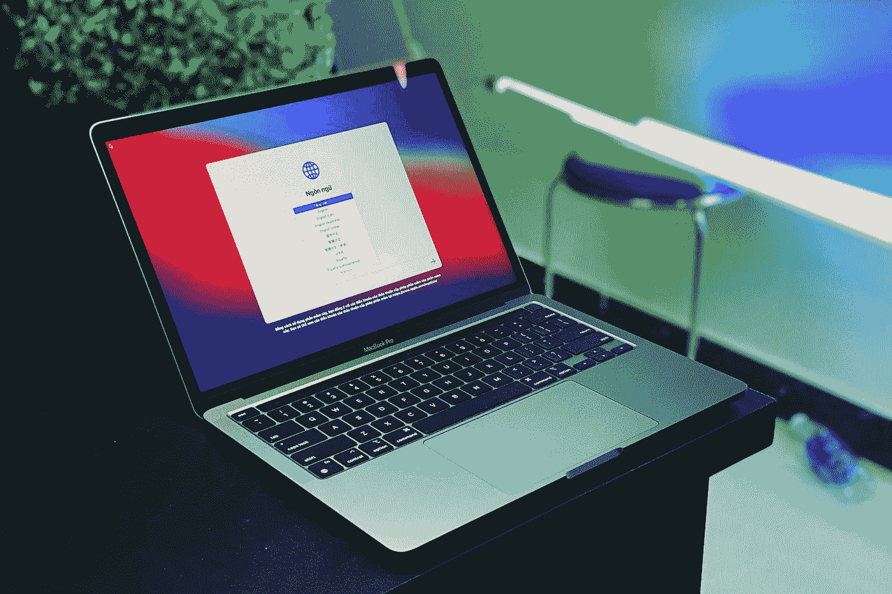

# MacBook M1 与 Google Colab 在数据科学领域的较量——意想不到的结果

> 原文：<https://towardsdatascience.com/macbook-m1-vs-google-colab-for-data-science-unexpected-results-f50127e72d1e>

## **苹果 2020 年售价 1299 美元的 beast 与完全免费的环境相比，TensorFlow 的速度更快？**



在 [Unsplash](https://unsplash.com?utm_source=medium&utm_medium=referral) 上由 [Anh Nhat](https://unsplash.com/@anhnhat1205?utm_source=medium&utm_medium=referral) 拍摄的照片

早在 2020 年，苹果的 M1 芯片就是一项惊人的技术突破。它没有支持科学家们在发布时日常需要的许多工具数据，但自那以后发生了很多变化。我们甚至为专业用户定制了新的 [M1 Pro 和 M1 Max 芯片](https://betterdatascience.com/macbook-m1-vs-m1-pro-for-data-science/)。

*但是如果你可以在云中做任何事情，那么昂贵的笔记本电脑又有什么意义呢？*

今天，我们将只比较数据科学使用案例，而忽略笔记本电脑比云环境更实用的其他场景。在测试中，我们有一个来自 2020 年的基本模型 MacBook M1 和带有 GPU 环境的 Google Colab。以下是规格:


图 1 —硬件规格对比(图片由作者提供)

Google Colab 环境在纸面上看起来更好——这一点毋庸置疑。我们将不得不看看它如何转化为用 TensorFlow 训练图像分类模型。

请记住:分配给我的 Colab 环境是完全随机的。您可能会得到不同的结果，因此基准测试结果可能会有所不同。

不想看书？请观看我的视频:

# MacBook M1 vs. Google Colab —数据科学基准设置

如果您继续学习，您将需要安装 TensorFlow。这里有一整篇文章致力于在苹果 M1 上安装 TensorFlow:

[](https://betterdatascience.com/install-tensorflow-2-7-on-macbook-pro-m1-pro/) [## 如何在 MacBook Pro M1 Pro 上轻松安装 tensor flow 2.7 |更好的数据科学

### 早在 2020 年，苹果的 M1 芯片就彻底改变了这个行业。新的 M1 专业和 M1 马克斯是什么…

betterdatascience.com](https://betterdatascience.com/install-tensorflow-2-7-on-macbook-pro-m1-pro/) 

此外，您还需要一个影像数据集。我使用了 Kaggle 的[狗和猫的数据集](https://www.kaggle.com/pybear/cats-vs-dogs?select=PetImages)，它是在知识共享许可下授权的。长话短说，你可以免费使用。

有关如何组织和预处理它的详细说明，请参考以下文章:

[](https://betterdatascience.com/top-3-prerequisites-for-deep-learning-projects/) [## 用于图像分类的 TensorFlow 深度学习项目的三大先决条件|更好的数据…

### 想训练一个用于图像分类的神经网络？确保做到这一点首先识别图像中的对象是一个…

betterdatascience.com](https://betterdatascience.com/top-3-prerequisites-for-deep-learning-projects/) 

我们今天会做两个测试:

1.  **具有定制模型架构的 tensor flow**—使用我在 [CNN 文章](https://betterdatascience.com/train-image-classifier-with-convolutional-neural-networks/)中描述的两个卷积块。
2.  **带迁移学习的 tensor flow**—使用 [VGG-16 预训练网络](https://betterdatascience.com/tensorflow-transfer-learning/)对图像进行分类。

让我们检查一下测试中使用的代码。

## 自定义张量流模型—代码

我将这个测试分为两部分——一个有数据增强和没有数据增强的模型。一次仅使用一对`train_datagen`和`valid_datagen`:

```
import os
import warnings
from datetime import datetime
os.environ['TF_CPP_MIN_LOG_LEVEL'] = '2'
warnings.filterwarnings('ignore')

import numpy as np
import tensorflow as tf
tf.random.set_seed(42)

# COLAB ONLY
from google.colab import drive
drive.mount('/content/drive')

####################
# 1\. Data loading
####################
# USED ON A TEST WITHOUT DATA AUGMENTATION
train_datagen = tf.keras.preprocessing.image.ImageDataGenerator(
    rescale=1/255.0
)
valid_datagen = tf.keras.preprocessing.image.ImageDataGenerator(
    rescale=1/255.0
)

# USED ON A TEST WITH DATA AUGMENTATION
train_datagen = tf.keras.preprocessing.image.ImageDataGenerator(
    rescale=1/255.0,
    rotation_range=20,
    width_shift_range=0.2,
    height_shift_range=0.2,
    shear_range=0.2,
    zoom_range=0.2,
    horizontal_flip=True,
    fill_mode='nearest'
)
valid_datagen = tf.keras.preprocessing.image.ImageDataGenerator(
    rescale=1/255.0
)

train_data = train_datagen.flow_from_directory(
    directory='data/train/',
    target_size=(224, 224),
    class_mode='categorical',
    batch_size=64,
    seed=42
)
valid_data = valid_datagen.flow_from_directory(
    directory='data/validation/',
    target_size=(224, 224),
    class_mode='categorical',
    batch_size=64,
    seed=42
)

####################
# 2\. Model
####################
model = tf.keras.Sequential([
    tf.keras.layers.Conv2D(filters=32, kernel_size=(3, 3), input_shape=(224, 224, 3), activation='relu'),
    tf.keras.layers.MaxPool2D(pool_size=(2, 2), padding='same'),
    tf.keras.layers.Conv2D(filters=32, kernel_size=(3, 3), activation='relu'),
    tf.keras.layers.MaxPool2D(pool_size=(2, 2), padding='same'),
    tf.keras.layers.Flatten(),
    tf.keras.layers.Dense(128, activation='relu'),
    tf.keras.layers.Dense(2, activation='softmax')
])
model.compile(
    loss=tf.keras.losses.categorical_crossentropy,
    optimizer=tf.keras.optimizers.Adam(),
    metrics=[tf.keras.metrics.BinaryAccuracy(name='accuracy')]
)

####################
# 3\. Training
####################
time_start = datetime.now()
model.fit(
    train_data,
    validation_data=valid_data,
    epochs=5
)
time_end = datetime.now()
print(f'Duration: {time_end - time_start}')
```

接下来我们来看一下转移学习代码。

## 迁移学习张量流模型——代码

大部分导入和数据加载代码是相同的。同样，一次只使用一对`train_datagen`和`valid_datagen`:

```
import os
import warnings
from datetime import datetime
os.environ['TF_CPP_MIN_LOG_LEVEL'] = '2'
warnings.filterwarnings('ignore')

import numpy as np
import tensorflow as tf
tf.random.set_seed(42)

# COLAB ONLY
from google.colab import drive
drive.mount('/content/drive')

####################
# 1\. Data loading
####################
# USED ON A TEST WITHOUT DATA AUGMENTATION
train_datagen = tf.keras.preprocessing.image.ImageDataGenerator(
    rescale=1/255.0
)
valid_datagen = tf.keras.preprocessing.image.ImageDataGenerator(
    rescale=1/255.0
)

# USED ON A TEST WITH DATA AUGMENTATION
train_datagen = tf.keras.preprocessing.image.ImageDataGenerator(
    rescale=1/255.0,
    rotation_range=20,
    width_shift_range=0.2,
    height_shift_range=0.2,
    shear_range=0.2,
    zoom_range=0.2,
    horizontal_flip=True,
    fill_mode='nearest'
)
valid_datagen = tf.keras.preprocessing.image.ImageDataGenerator(
    rescale=1/255.0
)

train_data = train_datagen.flow_from_directory(
    directory='data/train/',
    target_size=(224, 224),
    class_mode='categorical',
    batch_size=64,
    seed=42
)
valid_data = valid_datagen.flow_from_directory(
    directory='data/validation/',
    target_size=(224, 224),
    class_mode='categorical',
    batch_size=64,
    seed=42
)

####################
# 2\. Base model
####################
vgg_base_model = tf.keras.applications.vgg16.VGG16(
    include_top=False, 
    input_shape=(224, 224, 3), 
    weights='imagenet'
)
for layer in vgg_base_model.layers:
    layer.trainable = False

####################
# 3\. Custom layers
####################
x = tf.keras.layers.Flatten()(vgg_base_model.layers[-1].output)
x = tf.keras.layers.Dense(128, activation='relu')(x)
out = tf.keras.layers.Dense(2, activation='softmax')(x)

vgg_model = tf.keras.models.Model(
    inputs=vgg_base_model.inputs,
    outputs=out
)
vgg_model.compile(
    loss=tf.keras.losses.categorical_crossentropy,
    optimizer=tf.keras.optimizers.Adam(),
    metrics=[tf.keras.metrics.BinaryAccuracy(name='accuracy')]
)

####################
# 4\. Training
####################
time_start = datetime.now()
vgg_model.fit(
    train_data,
    validation_data=valid_data,
    epochs=5
)
time_end = datetime.now()
print(f'Duration: {time_end - time_start}')
```

最后，让我们看看基准测试的结果。

# MacBook M1 vs. Google Colab —数据科学基准测试结果

我们现在将在定制模型架构上比较 M1 和 Google Colab 每个时期的平均训练时间。请记住，训练了两个模型，一个有数据增强，一个没有数据增强:


图 2 —基准测试结果—定制模型(图片由作者提供)

事实证明，MacBook M1 在非增强图像集上的速度慢了 20%左右，但在增强图像集上，它与 Colab 完全不相上下。M1 总体上更加稳定。

但是现在谁会从头开始写 CNN 的模型呢？如果您的数据有限，并且您的图像不是高度专业化的，则始终推荐迁移学习。以下是迁移学习模型的结果:


图 3 —基准结果—迁移学习模型(图片由作者提供)

认为不看好 M1 MacBook。由于专用的 GPU，Google Colab 的速度明显更快。M1 有一个 8 核 GPU，但它远没有 NVIDIA 的 TESLA 强大。

尽管如此，我不得不承认，对于一台不是为数据科学和机器学习而设计的轻薄笔记本电脑来说，看到这些结果令人印象深刻。2021 年的 [M1 Pro 车型处理这些任务要好得多](https://betterdatascience.com/macbook-m1-vs-m1-pro-for-data-science/)。

# 离别赠言

是的，你绝对可以将 2020 年的 13 英寸 M1 Macbook Pro(甚至 Air)用于数据科学和机器学习——至少是较轻的任务。如果你只关心这两个地区，那么 M1 可能不是最划算的选择。Google Colab 是完全免费的，在今天的大多数测试中，它的表现都超过了 M1。

如果你在寻找一台能够处理典型数据科学工作负载的笔记本电脑，并且没有廉价的塑料和不必要的红色细节，M1 可能是最佳选择。它速度快，反应灵敏，重量轻，屏幕精美，电池续航时间长达一整天。另外，你绝对可以用它来研究数据科学。当然，它的价格不菲，但它们提供了许多 Windows 笔记本电脑无法比拟的东西。

*您对最佳便携式数据科学环境有什么想法？像 M1 这样的多面手+云，还是更便宜的笔记本电脑+更多时间在云中？或者介于两者之间？*请在下面的评论区告诉我。

*喜欢这篇文章吗？成为* [*中等会员*](https://medium.com/@radecicdario/membership) *继续无限制学习。如果你使用下面的链接，我会收到你的一部分会员费，不需要你额外付费。*

[](https://medium.com/@radecicdario/membership) [## 通过我的推荐链接加入 Medium-Dario rade ci

### 作为一个媒体会员，你的会员费的一部分会给你阅读的作家，你可以完全接触到每一个故事…

medium.com](https://medium.com/@radecicdario/membership) 

# 保持联系

*   注册我的[简讯](https://mailchi.mp/46a3d2989d9b/bdssubscribe)
*   订阅 [YouTube](https://www.youtube.com/c/BetterDataScience)
*   在 [LinkedIn](https://www.linkedin.com/in/darioradecic/) 上连接

*原载于 2022 年 1 月 14 日*[*https://betterdatascience.com*](https://betterdatascience.com/macbook-m1-vs-google-colab/)T22。