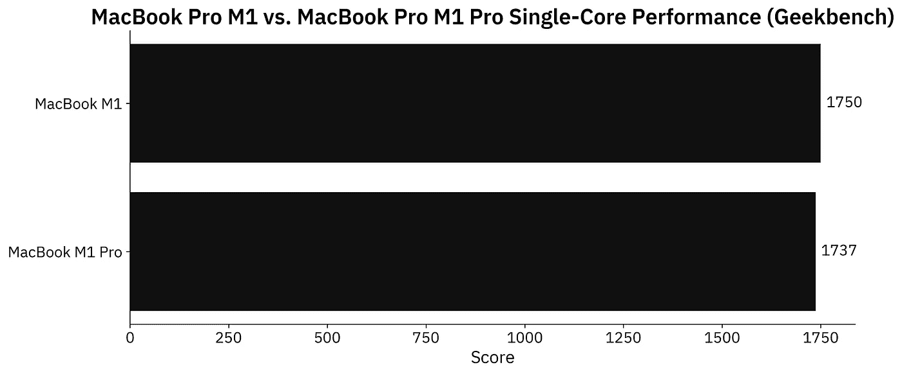
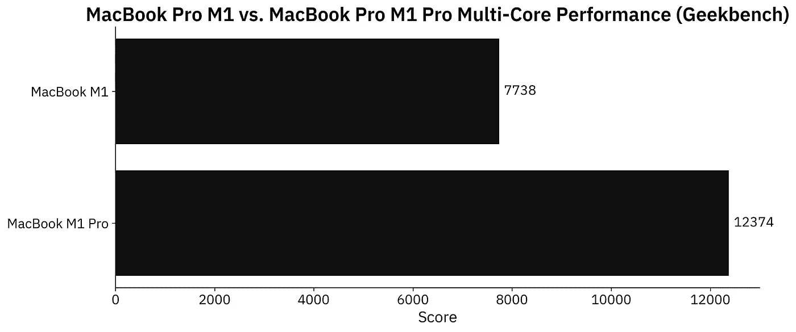
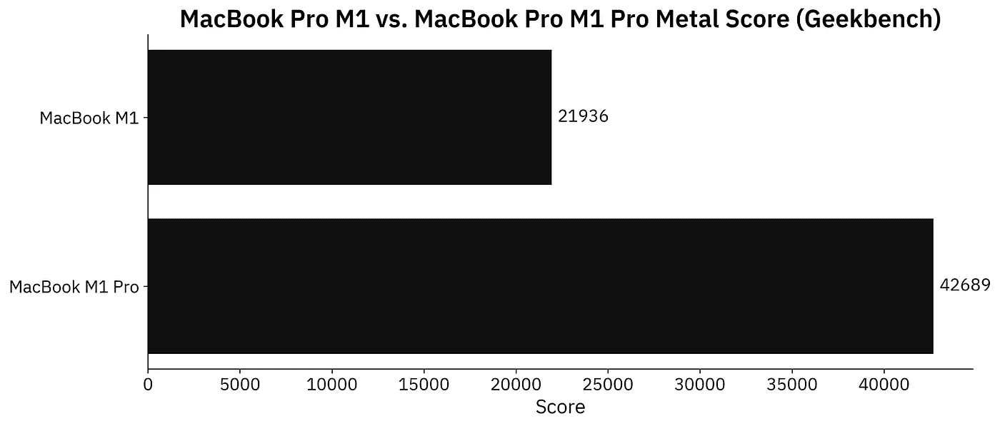

# MacBook M1 与 M1 Pro 在数据科学领域的较量——新芯片真的更好吗？

> 原文：<https://towardsdatascience.com/macbook-m1-vs-m1-pro-for-data-science-is-the-new-chip-radically-better-3d6098ef3694>

## **从 8 到 16 个 GPU 核心——这是它在 TensorFlow 中产生的巨大差异**


安东尼·乔伦在 [Unsplash](https://unsplash.com?utm_source=medium&utm_medium=referral) 上的照片

早在 2020 年，苹果的 M1 芯片就是一项惊人的技术突破。它还不支持科学家们在发布时日常需要的许多工具数据。从那以后，很多事情都变了。我们甚至为专业用户定制了新的 M1 Pro 和 M1 Max 芯片。这些对数据科学有好处吗？绝对的。请继续阅读，了解更多信息。

苹果将专业用户视为内容创作者和电影制作者，而不是数据科学家。尽管如此，新的 M1 Pro 芯片有两个额外的 CPU 核心，两倍的 GPU 核心，并配备两倍的内存。作为数据科学家，我们应该感受到不同。

今天，我正在测试 2020 年的 M1 和 2021 年的 M1 Pro 16”的基本型号，规格如下:


图 1 —硬件规格对比(图片由作者提供)

2020 年的 M1 起价为 1299 美元，但如果你想让它配备 16 GB 内存和 512 GB 固态硬盘，它会跳到 1699 美元。如果你能多花 800 美元，你将获得 2 个额外的 CPU 和 8 个额外的 GPU 核心。哦，还有额外的 3 英寸屏幕空间。

首先，我们将检查综合基准，看看我们在处理什么。

不想看书？请观看我的视频:

# M1 vs M1 专业版——极客 bench

综合基准不一定描绘真实世界的使用情况，但它们是一个很好的起点。我们不应该看到单核性能的任何差异，因为单个内核是相同的。M1 专业版只是有更多不同的排列方式。



图 2 — Geekbench 单核性能(图片由作者提供)

正常的 M1 多得了 13 分，但这一差距在误差范围内。接下来让我们比较一下多核性能——2020 年的 M1 有 8 个内核(4 个性能和 4 个效率)，而 2021 年的 M1 Pro 有 10 个内核(8 个性能和 2 个效率):



图 3 — Geekbench 多核性能(图片由作者提供)

M1 专业版在多核测试中的得分高出约 60%。这是意料之中的，因为它有更多的内核，可以更好地组织高要求的任务。

最后，让我们比较一下 GPU。你可以用 Geekbench 进行金属测试。它很有用，因为 macOS 上的 TensorFlow 可以使用 Metal 插件来加速模型训练。新的 M1 Pro 拥有 16 个 GPU 核心，比基本的 2020 型号增加了一倍:



图 4 — Geekbench 金属性能(图片由作者提供)

它显示——新的 M1 Pro 在金属测试中快了大约 95%。如果你的钱包允许，你可以指定 2021 年的型号具有 24 和 32 个 GPU 核心。如果你选择了这些版本，让我知道你能得到什么样的金属乐谱。

总的来说，M1 Pro 芯片前景看好。让我们进行几个真实世界的测试，看看基准测试中显示的性能提升是否转化为数据科学。

# M1 vs M1 Pro—数据科学基准设置

如果您继续学习，您将需要安装 TensorFlow。这里有一整篇文章致力于在苹果 M1 上安装 TensorFlow:

[](https://betterdatascience.com/install-tensorflow-2-7-on-macbook-pro-m1-pro/)  

此外，您还需要一个影像数据集。我使用了来自 Kaggle 的[狗和猫的数据集](https://www.kaggle.com/pybear/cats-vs-dogs?select=PetImages)，它是在知识共享许可下授权的。长话短说，你可以免费使用。

有关如何组织和预处理它的详细说明，请参考以下文章:

[](https://betterdatascience.com/top-3-prerequisites-for-deep-learning-projects/)  

我们今天会做两个测试:

1.  **具有定制模型架构的 tensor flow**—使用我在 [CNN 文章](https://betterdatascience.com/train-image-classifier-with-convolutional-neural-networks/)中描述的两个卷积块。
2.  **带迁移学习的 tensor flow**—使用 [VGG-16 预训练网络](https://betterdatascience.com/tensorflow-transfer-learning/)对图像进行分类。

让我们检查一下测试中使用的代码。

# 自定义张量流模型—代码

我将这个测试分为两部分——一个有数据增强和没有数据增强的模型。一次仅使用一对`train_datagen`和`valid_datagen`:

```
import os
import warnings
from datetime import datetime
os.environ['TF_CPP_MIN_LOG_LEVEL'] = '2'
warnings.filterwarnings('ignore')

import numpy as np
import tensorflow as tf
tf.random.set_seed(42)

####################
# 1\. Data loading
####################
# USED ON A TEST WITHOUT DATA AUGMENTATION
train_datagen = tf.keras.preprocessing.image.ImageDataGenerator(
    rescale=1/255.0
)
valid_datagen = tf.keras.preprocessing.image.ImageDataGenerator(
    rescale=1/255.0
)

# USED ON A TEST WITH DATA AUGMENTATION
train_datagen = tf.keras.preprocessing.image.ImageDataGenerator(
    rescale=1/255.0,
    rotation_range=20,
    width_shift_range=0.2,
    height_shift_range=0.2,
    shear_range=0.2,
    zoom_range=0.2,
    horizontal_flip=True,
    fill_mode='nearest'
)
valid_datagen = tf.keras.preprocessing.image.ImageDataGenerator(
    rescale=1/255.0
)

train_data = train_datagen.flow_from_directory(
    directory='data/train/',
    target_size=(224, 224),
    class_mode='categorical',
    batch_size=64,
    seed=42
)
valid_data = valid_datagen.flow_from_directory(
    directory='data/validation/',
    target_size=(224, 224),
    class_mode='categorical',
    batch_size=64,
    seed=42
)

####################
# 2\. Model
####################
model = tf.keras.Sequential([
    tf.keras.layers.Conv2D(filters=32, kernel_size=(3, 3), input_shape=(224, 224, 3), activation='relu'),
    tf.keras.layers.MaxPool2D(pool_size=(2, 2), padding='same'),
    tf.keras.layers.Conv2D(filters=32, kernel_size=(3, 3), activation='relu'),
    tf.keras.layers.MaxPool2D(pool_size=(2, 2), padding='same'),
    tf.keras.layers.Flatten(),
    tf.keras.layers.Dense(128, activation='relu'),
    tf.keras.layers.Dense(2, activation='softmax')
])
model.compile(
    loss=tf.keras.losses.categorical_crossentropy,
    optimizer=tf.keras.optimizers.Adam(),
    metrics=[tf.keras.metrics.BinaryAccuracy(name='accuracy')]
)

####################
# 3\. Training
####################
time_start = datetime.now()
model.fit(
    train_data,
    validation_data=valid_data,
    epochs=5
)
time_end = datetime.now()
print(f'Duration: {time_end - time_start}')
```

接下来我们来看一下转移学习代码。

# 迁移学习张量流模型——代码

大部分导入和数据加载代码是相同的。同样，一次只使用一对`train_datagen`和`valid_datagen`:

```
import os
import warnings
from datetime import datetime
os.environ['TF_CPP_MIN_LOG_LEVEL'] = '2'
warnings.filterwarnings('ignore')

import numpy as np
import tensorflow as tf
tf.random.set_seed(42)

####################
# 1\. Data loading
####################
# USED ON A TEST WITHOUT DATA AUGMENTATION
train_datagen = tf.keras.preprocessing.image.ImageDataGenerator(
    rescale=1/255.0
)
valid_datagen = tf.keras.preprocessing.image.ImageDataGenerator(
    rescale=1/255.0
)

# USED ON A TEST WITH DATA AUGMENTATION
train_datagen = tf.keras.preprocessing.image.ImageDataGenerator(
    rescale=1/255.0,
    rotation_range=20,
    width_shift_range=0.2,
    height_shift_range=0.2,
    shear_range=0.2,
    zoom_range=0.2,
    horizontal_flip=True,
    fill_mode='nearest'
)
valid_datagen = tf.keras.preprocessing.image.ImageDataGenerator(
    rescale=1/255.0
)

train_data = train_datagen.flow_from_directory(
    directory='data/train/',
    target_size=(224, 224),
    class_mode='categorical',
    batch_size=64,
    seed=42
)
valid_data = valid_datagen.flow_from_directory(
    directory='data/validation/',
    target_size=(224, 224),
    class_mode='categorical',
    batch_size=64,
    seed=42
)

####################
# 2\. Base model
####################
vgg_base_model = tf.keras.applications.vgg16.VGG16(
    include_top=False, 
    input_shape=(224, 224, 3), 
    weights='imagenet'
)
for layer in vgg_base_model.layers:
    layer.trainable = False

####################
# 3\. Custom layers
####################
x = tf.keras.layers.Flatten()(vgg_base_model.layers[-1].output)
x = tf.keras.layers.Dense(128, activation='relu')(x)
out = tf.keras.layers.Dense(2, activation='softmax')(x)

vgg_model = tf.keras.models.Model(
    inputs=vgg_base_model.inputs,
    outputs=out
)
vgg_model.compile(
    loss=tf.keras.losses.categorical_crossentropy,
    optimizer=tf.keras.optimizers.Adam(),
    metrics=[tf.keras.metrics.BinaryAccuracy(name='accuracy')]
)

####################
# 4\. Training
####################
time_start = datetime.now()
vgg_model.fit(
    train_data,
    validation_data=valid_data,
    epochs=5
)
time_end = datetime.now()
print(f'Duration: {time_end - time_start}')
```

最后，让我们看看基准测试的结果。

# M1 vs M1 Pro—数据科学基准测试结果

我们现在将比较 M1 和 M1 专业版在定制模型架构上每个时期的平均训练时间。请记住，训练了两个模型，一个有数据增强，一个没有数据增强:


图 5 —基准测试结果—定制模型(图片由作者提供)

M1 Pro 比默认型号快 1.5 倍左右。奇怪的是，对于使用数据扩充的模型，结果几乎是相同的。

但是现在谁会从头开始写 CNN 的模型呢？如果您的数据有限，并且您的图像不是高度专业化的，则始终推荐迁移学习。以下是迁移学习模型的结果:


图 6 —基准结果—迁移学习模型(图片由作者提供)

M1 Pro 大幅度淘汰了旧的 2020 M1 MacBook。在没有增强的模型上大约快 2.45 倍，在增强的模型上大约快 2.72 倍。

我不得不承认，在 MacBook 上看到这些结果令人印象深刻，这不是数据科学家的想法。这是不是意味着你应该买一个？大概不会。

# 离别赠言

有一点是肯定的——在我们今天进行的所有数据科学测试中，M1 Pro 的表现都优于普通 M1。尽管如此，如果你只关心数据科学和机器学习，这并不是最好的选择。你可以买一台 500 美元的笔记本电脑，在云中完成所有繁重的工作。您可以购买一个带有一个或多个专用 GPU 的桌面工作站。在这种情况下，苹果公司没有任何机会。

如果你在寻找一台能够处理典型数据科学工作负载的笔记本电脑，并且没有廉价的塑料和不必要的红色细节，M1 可能是最佳选择。它速度快，反应灵敏，重量轻，屏幕精美，电池续航时间长达一整天。另外，你绝对可以用它来研究数据科学。当然，这可能不是最划算的选择，但它们提供了许多 Windows 笔记本电脑无法比拟的东西。

你对用于数据科学的新 M1 Pro 和 Max 芯片有何看法？你能在你的机器上运行我的基准测试并分享结果吗？请在下面的评论区告诉我。

*喜欢这篇文章吗？成为* [*中等会员*](https://medium.com/@radecicdario/membership) *继续无限制学习。如果你使用下面的链接，我会收到你的一部分会员费，不需要你额外付费。*

[](https://medium.com/@radecicdario/membership)  

# 保持联系

*   注册我的[简讯](https://mailchi.mp/46a3d2989d9b/bdssubscribe)
*   订阅 [YouTube](https://www.youtube.com/c/BetterDataScience)
*   在 [LinkedIn](https://www.linkedin.com/in/darioradecic/) 上连接

*原载于 2022 年 1 月 7 日*[*https://betterdatascience.com*](https://betterdatascience.com/macbook-m1-vs-m1-pro-for-data-science/)*。*