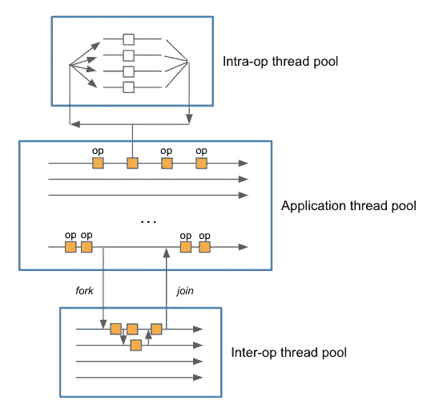
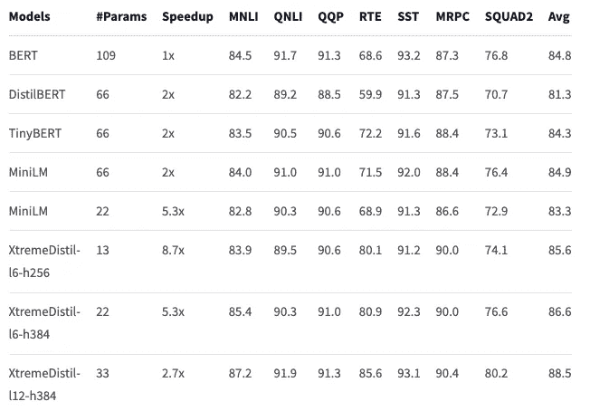
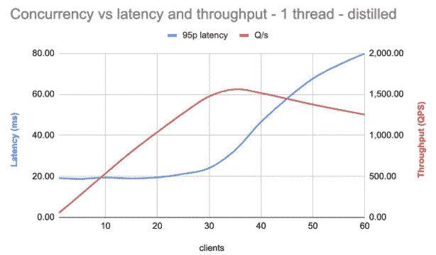

# 大规模服务的机器学习模型

> 原文：<https://towardsdatascience.com/machine-learned-model-serving-at-scale-86f6220132c8>

# 大规模服务的机器学习模型


Jukan Tateisi 在 [Unsplash](https://unsplash.com?utm_source=medium&utm_medium=referral) 上拍摄的照片

假设您有一个机器学习模型，希望在某些应用程序中使用，例如，一个从文本生成矢量表示的 transformer 模型。您测量单个模型评估所需的时间。然后，对模型能够足够快地被评估感到满意，您在某个模型服务器中将这个模型部署到生产环境中。流量增加，模型执行速度突然变慢，根本无法维持预期的流量，严重违反了 SLA。会发生什么事？

你看，大多数用于评估机器学习模型的库和平台在默认情况下被调整为使用机器上所有可用的资源进行模型推断。这意味着并行执行利用的线程数量等于机器上可用内核或 CPU 的数量。这对于单个模型评估来说非常好。

不幸的是，这在并发评估中会失效。这是一个未被充分沟通的重要点。

让我们来看看会发生什么。在下面，我们使用 [Vespa.ai](https://vespa.ai) 服务一个变压器模型。Vespa 是一个高性能和 web 可伸缩的开源平台，适用于在大型数据集上执行实时数据处理的应用程序。Vespa.ai 使用 [ONNX 运行时](https://onnxruntime.ai/)进行模型加速。我们将使用最初的 [BERT-base](https://huggingface.co/bert-base-uncased) 模型，一个 12 层、1.09 亿参数的变压器神经网络。我们在 32 核 Xeon Gold 2.6GHz 机器上测试了该模型的性能。最初，这个模型可以在大约 24 毫秒内在这个特定的机器上被评估。


并发性与延迟和吞吐量。图片作者。

这里，蓝线是 95%的延迟，这意味着 95%的请求的延迟低于这个值。红线是吞吐量:机器每秒可以处理的请求数。横轴是并发连接数(客户端)。

随着并发连接数的增加，延迟会急剧增加。大约在 10 个并发请求时达到最大吞吐量。此时，第 95 百分位的延迟约为 150 毫秒，与预期的 24 毫秒相差甚远。结果是高度可变的和差的体验。

应用程序的类型决定了低延迟和高吞吐量之间的最佳平衡。例如，如果该模型用于终端用户查询，对于给定的预期流量水平，(可预测的)低延迟是重要的。另一方面，如果模型在某些数据存储中摄取之前生成嵌入，那么高吞吐量可能更重要。两者的驱动力都是成本:需要多少硬件来支持所需的吞吐量。举一个极端的例子，如果您的应用程序每秒处理 10 000 个查询，95%的延迟要求为 50 毫秒，那么按照上面的设置，您将需要大约 200 台机器。

当然，如果你期望只有少量的流量，这可能完全没问题。然而，如果您正在扩展到每秒数千个请求，这是一个真正的问题。因此，我们将在下文中看看我们能做些什么来扩大规模。

# 模型的并行执行

我们需要解释在模型推断过程中使用的线程模型，看看这里发生了什么。一般来说，有 3 种类型的线程:推理(应用程序)、操作间和操作内线程。这是多个框架中的一个常见特性，比如 TensorFlow、PyTorch 和 ONNX Runtime。

**推理线程**是主应用程序的线程。每个请求都在自己的推理线程中处理，推理线程最终负责交付给定请求的模型评估结果。

**内部操作线程**使用多线程实现评估单个操作。这对于许多操作都很有用，比如对大型张量的元素操作、一般的矩阵乘法、嵌入查找等等。此外，许多框架将几个操作组合成一个更高级的操作，可以并行执行以提高性能。

**互操作线程**用于并行评估模型的独立部分。例如，一个包含两个不同路径的模型可能会从这种形式的并行执行中受益。例子是宽和深模型或双塔编码器架构。



推理中的各种线程池。图片作者。

在上面使用 ONNX 运行时的例子中，默认情况下禁用操作间线程。但是，内部操作线程的数量等于机器上 CPU 的数量。在这种情况下，32。因此，每个并发请求都在自己的推理线程中处理。但是，有些操作是通过使用操作内线程池中的线程来并行执行的。因为这个池是在请求之间共享的，所以并发请求需要等待可用的线程在执行中前进。这就是延迟增加的原因。

该模型包含顺序运行和并行运行的操作。这就是为什么即使延迟增加，吞吐量也会增加到一定水平。然而，在那之后，吞吐量开始下降，因为我们遇到了这样一种情况，更多的线程执行 CPU 绑定的工作，而不是机器中的物理核心。由于过多的线程交换，这显然对性能有害。

# 按比例放大

为了避免这种线程过度订阅，我们可以确保每个模型在其自己的推理线程中顺序运行。这避免了操作内线程的并发求值之间的竞争。不幸的是，它也避免了使用并行执行来加速单个模型评估的好处。

让我们看看当我们将操作内线程的数量设置为 1 时会发生什么。


1 个操作内线程的并发性与延迟和吞吐量。图片作者。

正如所见，延迟相对稳定，直到并发性等于机器上的内核数量(大约 32)。之后，由于线程数量超过了执行线程的实际内核数量，因此延迟会增加。此时，吞吐量也增加了，达到每秒大约 120 个请求的最大值，提高了 40%。然而，第 95 百分位的延迟现在约为 250 毫秒，与预期相差甚远。

因此，最初看起来很有前途的模型可能并不适合高效的服务。

第一代变压器模型，如上面使用的 BERT-base，相对较大，评估速度较慢。因此，已经开发出了更有效的模型，可以使用相同的标记器和词汇表作为替代。xtremedithtransformers 系列就是一个例子。这些是从 BERT 中提取的，在许多不同的任务上具有与 BERT-base 相似的精度，而计算复杂度显著降低。

在下文中，我们将使用[xtremediate-l6-h256](https://huggingface.co/microsoft/xtremedistil-l6-h256-uncased)模型，与 BERT-base 的 109M 相比，它只有大约 13M 的参数。尽管只有 12%的参数计数，但该模型的准确性与完整的 BERT-base 模型相当:



提炼模型的准确性。来自[https://hugging face . co/Microsoft/xtremediate-l6-h256-un cased](https://huggingface.co/microsoft/xtremedistil-l6-h256-uncased)。

使用默认的线程数量(与系统上可用的相同)，该模型可以在大约 4 毫秒的 CPU 上进行评估。但是，对于多个并发请求，它仍然会遇到与上面相同的伸缩问题。因此，让我们看看这如何随着单线程执行的并发请求而扩展:



在提取模型上使用 1 个操作内线程时并发性与延迟和吞吐量的关系。图片作者。

正如预期的那样，在我们达到与机器上的内核数量相等的并发水平之前，延迟要稳定得多。这提供了更好和可预测的体验。吞吐量现在达到每秒大约 1600 个请求，大大优于另一个模型，后者达到每秒大约 120 个请求。这使得实现所需性能水平所需的硬件更少。

# 实验细节

为了衡量扩展的效果，我们使用了 Vespa.ai，这是一个开源平台，用于构建对大型数据集进行实时数据处理的应用程序。它被设计成高性能和网络可扩展的，用于各种任务，如搜索、个性化、推荐、广告、自动完成、图像和相似性搜索、评论排名，甚至[寻找爱情](https://tech.okcupid.com/vespa-vs-elasticsearch/)。

Vespa.ai 有许多集成的[特性](https://docs.vespa.ai/en/features.html)，并且支持开箱即用的多种用例。因此，它提供了在生产中部署的简化途径，而没有维护许多不同子系统的复杂性。在本文中，我们将 Vespa.ai 作为一个[易用的模型服务器](https://docs.vespa.ai/en/stateless-model-evaluation.html)。在 Vespa.ai 中，很容易将[线程模型调整为对每个模型使用](https://docs.vespa.ai/en/stateless-model-evaluation.html):

```
<model-evaluation>
  <onnx>
    <models>
      <model name="reranker_margin_loss_v4">
        <intraop-threads> number </intraop-threads>
        <interop-threads> number </interop-threads>
        <execution-mode> parallel | sequential </execution-mode>
      </model>
    </models>
  </onnx>
</model-evaluation>
```

此外，很容易横向扩展以使用额外的节点进行模型评估。在这篇文章中，我们没有探讨这个问题。

本文中的数据是使用 Vespa 的 [fbench](https://docs.vespa.ai/en/performance/vespa-benchmarking.html) 工具收集的，该工具将负载驱动到系统进行基准测试。Fbench 提供了关于系统管理工作负载情况的详细而准确的信息。

# 摘要

在这篇文章中，我们看到默认的线程设置不适合生产中的模型服务，特别是对于具有高度并发请求的应用程序。并行模型评估之间对可用线程的竞争会导致线程超额订阅，从而影响性能。等待时间也变得高度可变。

问题在于共享的内部操作线程池。也许应该考虑一种不同的线程模型，它允许在低流量情况下使用多线程，但在需要高并发性时会退化为顺序评估。

然而，目前的解决方案是确保模型在它们自己的线程中运行。为了管理增加的延迟，我们转向了模型提取，这在不牺牲准确性的情况下有效地降低了计算复杂性。还有一些我们在这里没有提到的优化，比如[模型量化](https://blog.vespa.ai/from-research-to-production-scaling-a-state-of-the-art-machine-learning-system/)。对于变压器模型来说，另一个重要因素是限制输入长度，因为评估时间是输入长度的平方。

这里我们没有考虑 GPU 求值，它可以显著加速执行。然而，规模成本也是一个真正的问题。

这里没有充分沟通的一点是，承诺推理延迟非常低的平台只是讲述了故事的一部分。例如，考虑一个平台承诺给定模型 1 毫秒延迟。天真地说，这可以支持每秒 1000 个查询。然而，考虑一下如果 1000 个请求几乎同时到达会发生什么:最后一个请求在返回之前必须等待将近 1 秒。这与预期的 1 毫秒相差甚远。