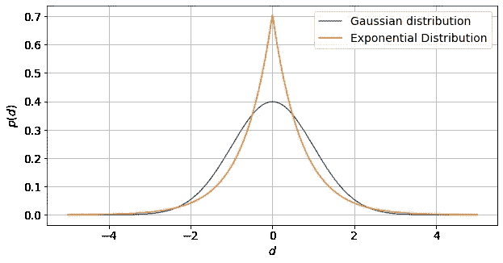

# 机器学习 101:线性回归

> 原文：<https://towardsdatascience.com/machine-learning-101-linear-regression-72ba6c04fbf1>

# 机器学习 101:线性回归

## 回到数据科学的基础

自从被称为“21 世纪最性感的工作”以来，机器学习和数据科学已经取得了很大进展——我们现在有非常强大的深度学习模型，能够自动驾驶汽车，或者在不同语言之间无缝翻译。所有这些强大的深度学习模型的基础是一个不起眼的模型，我今天想深入探讨它的细节。那个模型是线性回归！

尽管简单，但对线性回归的良好理解是理解更高级模型如何工作的先决条件！毕竟，一个人必须先学会走，然后才能跑！今天，我将在这篇文章中详细探讨:

*   线性回归背后的基本数学。
*   损失函数。
*   普通最小二乘回归的解析解。
*   如何创建 Python 普通最小二乘求解器🐍

如果你刚刚开始学习机器学习和数据科学，或者你只是想修改一些你在高级职业生涯中留下的基本概念，请继续阅读，直到本文结束！


[新西兰埃格蒙特国家公园塔拉纳基山](https://unsplash.com/s/photos/mount-taranaki%2C-egmont-national-park%2C-new-zealand)。由[大卫·比林斯](https://unsplash.com/@dav_billings?utm_source=unsplash&utm_medium=referral&utm_content=creditCopyText)在 [Unsplash](https://unsplash.com/?utm_source=unsplash&utm_medium=referral&utm_content=creditCopyText) 上拍摄的照片。

# 数据中的数学线性关系

线性回归模型假设因变量 *d* 与 *m* 解释变量 *g* ₁、 *g* ₂、… *gₘ* 呈线性关系:

*d*=*c*₁*g*₁+*c*₂*g*₂+…*+cₘgₘ*，

其中 *c* ₁、 *c* ₂、… *cₘ* 为与解释变量相关的系数。例如，因变量 *d* 可以是房价，解释变量 *g* ₁、 *g* ₂、… *gₘ* 可以是地理坐标、年龄、建筑面积等。那栋房子。

上面的线性方程可以简洁地写成下面的内积:

*d*=σ*ᵢcᵢgᵢ=***m**ᵀ**g***，*

其中 **m** 是长度为*m*:**m**=**[*c*₁、 *c* ₂、… *cₘ* ]ᵀ、 **g** 也是长度为 *m* 的向量:**g**=*g*g*，g***

**由于 **m** 包含允许我们使用 **g** *对 *d* 进行预测的系数向量，* **m** 也被称为定义 *d* 和 **g** *之间线性关系的模型参数向量。***

**在数据分析中，我们通常不得不处理一组因变量，而不是单个值。因此，我们通常使用一个包含 *n* 因变量的向量:**d**=【*d*₁、 *d* ₂、… *dₙ* ]ᵀ，其中 **d** 中的 *u* th 元素与相应的一组 *m* 解释变量 *Gᵤ* ₁ *、Gᵤ***

***dᵤ*=*gᵤ*₁*c*₁*+gᵤ*₂*c*₂+…+*gᵤₘcₘ*=σ*g \u\u g \u\u c。***

**向量**d**=【*d*₁、 *d* ₂、… *dₙ* ]ᵀ中所有 *n* 元素的这种线性关系可以简洁地写成以下矩阵乘积:**

****d** = **Gm** ，**

**其中 **G** 是大小为 *n* × *m* 的矩阵，结构如下:**

****g**=[*g*₁₁， *G* ₁₂，… *G* ₁ *ₘ* ，
。…….【 *G* ₂₁、 *G* ₂₂、… *G* ₂ *ₘ* 、
。…….…
。…….[ *Gₙ* ₁、 *Gₙ* ₂、… *Gₙₘ* ]]，**

**其中 **G** 的第 *u* 行包含 **d** 中第 *u* 元素的解释变量向量。和上面一样， **m** 是一个长度为 *m* 的向量:**m**=**[*c*₁， *c* ₂，……*cₘ*]ᵀ包含模型参数。****

****因此，给定一组解释变量 **G** 和相应的因变量 **d** ，线性回归的目标是确定最能描述 **d** 和 **G** 之间线性关系的 **m** 。****

# ****上下确定线性系统****

****现在，如果 *n，*d，中的数据点数大于 *m* 中的模型参数数 **m** ，那么数据提供了足够的信息来唯一地确定所有的模型参数。我们说这个系统被过度决定了。****

****然而，如果 *m* 大于 *n* ，那么不幸的是，数据没有提供足够的信息来唯一地确定所有的模型参数。我们说这个系统是不确定的。****

****对于本文的其余部分，我们将只处理超定线性系统，这通常是大多数数据科学项目中的情况。对于确定系统下的，需要[拉格朗日乘子](https://en.wikipedia.org/wiki/Lagrange_multiplier)来获得解，使得所涉及的数学稍微复杂一些。****

# ****预测误差和损失函数****

****为了最好地确定 **m** ，我们需要最小化 **d** 和 **Gm** 之间的预测误差(或损失函数):****

******e**=**d**-**Gm**。****

****如果 **m** 完美地描述了 **d** 和 **G** 之间的关系，那么 **Gm** 将等于 **d** ，预测误差 **e** 将为 **0** 。****

****为了进一步量化跨越 **d** 中所有 *n* 元素的整体预测误差，我们将误差向量 **e** 减少到一个标量。这通常是通过使用向量的某种范数来完成的。常用的规范有:****

1.  ****L1 常模:σ*ᵤ*|*eᵤ*|****
2.  ****L2 范数:√(σ*ᵤeᵤ*)****

****L1 规范假设 **d** 中的数据来自[指数分布](https://en.wikipedia.org/wiki/Exponential_distribution)，而 L2 规范假设数据来自[高斯分布](https://en.wikipedia.org/wiki/Normal_distribution)。****

****如下图所示，指数分布比高斯分布有更长的尾部。这意味着数据点远离平均值的概率在指数分布中比在高斯分布中更高。这个结果反过来意味着指数分布对于远离平均值的异常数据点比高斯分布更稳健。****

********

****指数分布比高斯分布有更长的尾部，这使得它对异常值更稳健。作者创建的图像。****

****当确定使用哪个范数时，理解哪个概率分布控制 **d** 很重要，因为这将极大地影响 **m** 的估计值。然而，令人欣慰的是，由于[中心极限定理](https://en.wikipedia.org/wiki/Central_limit_theorem)，高斯分布非常频繁地出现，并且在大多数情况下，使用 L2 范数应该会导致模型参数 **m** 的合理的良好估计。****

****另一方面，更复杂的损失函数可以通过使用 L1 和 L2 规范的组合来构建，例如[胡伯损失](https://en.wikipedia.org/wiki/Huber_loss)，或者通过引入[正则化项](https://en.wikipedia.org/wiki/Regularization_(mathematics))使最优解唯一。可能性是无限的！****

# ****超定普通最小二乘解****

****假设 **d** 中的数据由高斯分布控制，我们希望最小化与预测误差**e**=**d**-**Gm**的 L2 范数相关的损失函数 *L* ( **m** ):****

*****l*(**m**)=σ*ᵤeᵤ*=**e**ᵀ**e**=(**d**-**GM**)ᵀ(**d**-**GM**)=(**d**ᵀ-**m**ᵀ**g** =**d**ᵀ**d**-**d**ᵀ**GM-****m**ᵀ**g**ᵀ**d**+**m**ᵀ**g**ᵀ**GM**。****

****由于 *L* ( **m** )是由误差的平方组成的，这个问题也被称为普通最小二乘问题。我们通过对 *L* ( **m** )相对于 **m** 求微分并将结果等于零，来最小化相对于模型参数 **m** 的损失函数 *L* ( **m** ):****

******∂***l*(**m**)/**∂m**= 0-**g**ᵀ**d**-**g**ᵀ**d+**2**g**ᵀ**GM**= 0，
**g**ᵀ**GM-g****** 

****(如果你不太熟悉向量的微分，你可以参考杨、曹、钟和莫里斯的这组笔记[。)](https://onlinelibrary.wiley.com/doi/pdf/10.1002/0471705195.app3)****

****于是， **d** = **Gm** 的超定普通最小二乘解就简单了:**m**=【**g**ᵀ**g**]⁻**g**ᵀ**d**！****

# ****普通最小二乘 Python 求解器****

****数学够了！现在让我们用 Python 实现上面导出的普通最小二乘解！****

```
**import numpy as npdef least_squares(G, d):
    """
    Over determined ordinary least squares solver. Inputs
    G: np.array of nxm kernel matrix of explanatory variables. 
    d: np.array of n observations. 
    Returns
    M: np.array of m estimated model parameters
    """
    M = np.dot(np.linalg.inv(np.dot(G.T, G)), G.T)
    M = np.dot(M, d)
    return M**
```

****让我们也创建一个一维线性系统来解决使用我们的代码。我们假设有 10 个无噪声测量值，由一个非常简单的线性系统生成，该系统有两个模型参数:****

*****d*=*c*₀+*c*₁*g，*****

****这里我们定义*c*₁=π*和 *c* ₀ = exp(1)。*****

```
***g = np.arange(0, 10)
d = np.exp(1) + np.pi * g***
```

*****我们现在需要准备解释变量的矩阵 **G** 。为了做到这一点，我们注意到上面的等式相当于 *c* ₀是一个解释变量的系数，其值始终为 1:*****

******d*=*c*₀*g*⁰+*c*₁*g =*1*c*₀+*c*₁*g .******

*****矩阵 **G** 因此将具有对应于 2 个模型参数 *c* ₀和 *c* ₁.的 2 列第一列包含 *g* 的值，而第二列仅包含 1。该矩阵 **G** 可以使用二阶[范德蒙矩阵](https://en.wikipedia.org/wiki/Vandermonde_matrix)创建，使用`np.vander`:*****

```
***# The 2 here means: create a 2nd order Vandermonde matrix from g.
G = np.vander(g, 2)
print(G)[[0 1]  
 [1 1]  
 [2 1]  
 [3 1]  
 [4 1]  
 [5 1]  
 [6 1] 
 [7 1] 
 [8 1]  
 [9 1]]***
```

*****我们现在需要做的就是将 **G** 和 **d** 传递给最小二乘解算器来求解模型参数:*****

```
***print(least_squares(G, d))[3.14159265, 2.71828183]***
```

*****它正确地返回了*c*₁=π*和 *c* ₀ = exp(1)的值！******

******虽然这可能是一个非常简单的例子(使用我们事先已经知道模型参数的数据)，但它准确地显示了线性回归是如何工作的，并且可以应用到更复杂的问题中。******

# ******更高级的线性回归******

******我们今天做了大量的数学和一些编码，最终达到这一点！然而，线性回归并没有完全完成！还有其他更复杂的方法来获得上面获得的最小二乘解，例如使用矩阵****的[奇异值分解](https://en.wikipedia.org/wiki/Singular_value_decomposition)或者通过[最大似然法](https://en.wikipedia.org/wiki/Maximum_likelihood_estimation)！每种方法都有适合不同场景的特点。**********

********此外，我们还没有探索欠定的情况下，需要一个稍微复杂的数学来获得解决方案！我们也没有试图为 L1 范数损失函数创建求解器，这需要更高级的数值方法来求解，例如[线性规划方法](https://en.wikipedia.org/wiki/Linear_programming)或[随机梯度下降](https://en.wikipedia.org/wiki/Stochastic_gradient_descent)方法。********

********线性回归可能是最简单的回归模型，但它也非常深奥，充满了复杂的细节！一定要花时间探索这些更高级的主题，以便更好地理解线性回归是如何工作的！********

# ********摘要********

********今天我们探索了线性回归背后的数学，并用 Python 创建了一个普通的最小二乘解算器。今天探讨的概念，如最小化损失函数可能是基本的，但适用于所有其他更高级的模型，如神经网络！我希望您能够从这篇文章中更好地理解回归是如何工作的。感谢您的阅读！********

# ********参考********

********[1] W. M. Menke (2012)，*地球物理数据分析:离散逆理论 MATLAB 版*，Elsevier。
【2】杨，曹，钟，莫理斯(2007)，*利用 MATLAB 应用数值方法*，Wiley .********