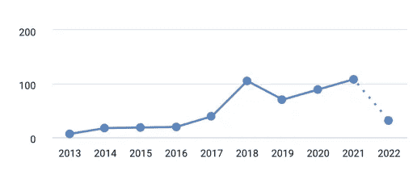
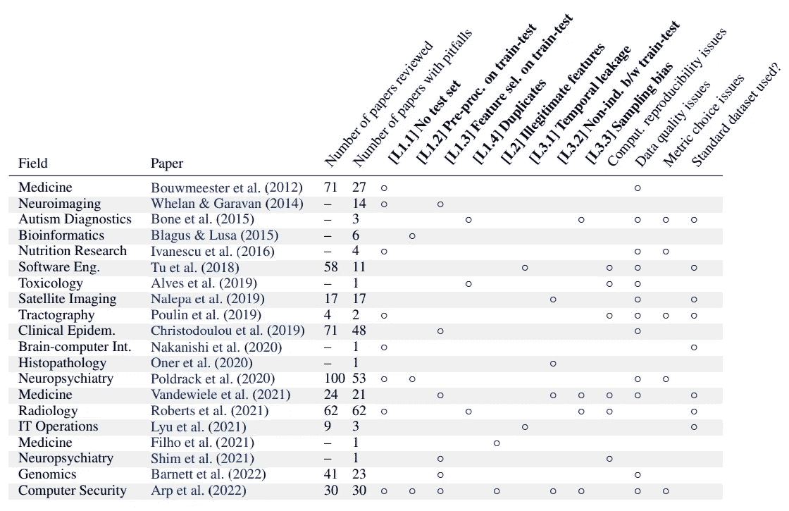
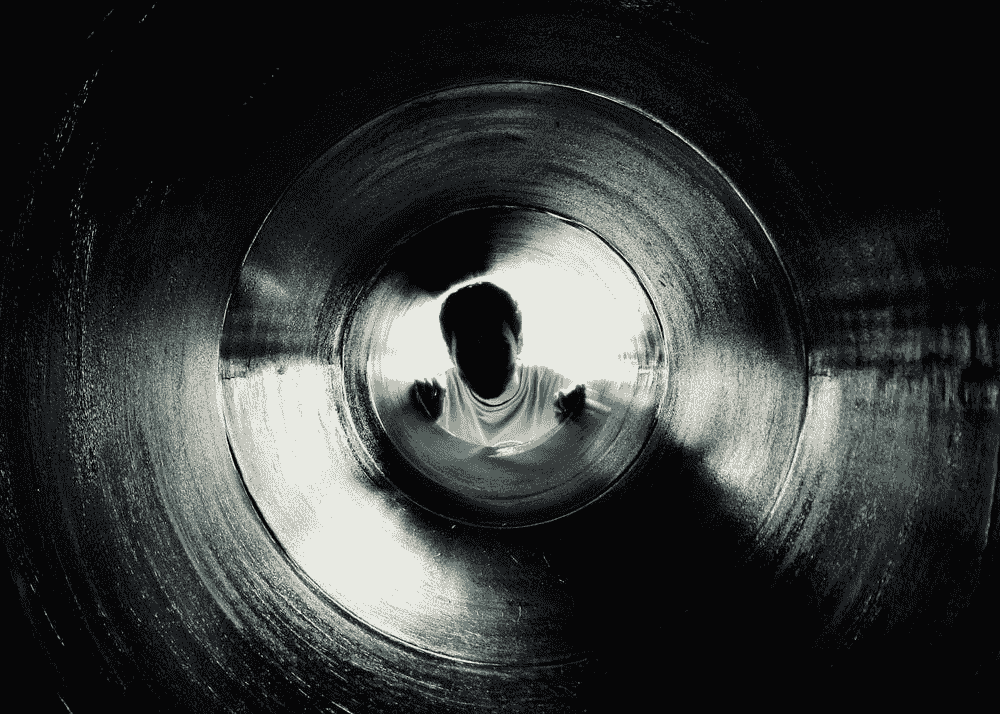

# 机器学习:科学的朋友还是敌人？

> 原文：<https://towardsdatascience.com/machine-learning-a-friend-or-a-foe-for-science-9c0b421eabd8>

## 机器学习如何影响科学再现性以及如何解决它

图片由作者使用 [DALL-E 2](https://openai.com/dall-e-2/) 拍摄

再现性是科学进步的基础，但机器学习的日益使用正在影响它。为什么再现性很重要？为什么机器学习的使用有一个有问题的副作用？我们如何解决它？

**并非所有闪亮的东西都是钻石**

复制另一篇文章的结果。图片由作者使用 [DALL-E 2](https://openai.com/dall-e-2/)

2016 年，科学杂志《自然》发表了一项调查的结果。他们要求 1576 名研究人员回答一份关于研究中可重复性的简短问卷。结果显示，超过 70%的科学家未能重现另一位研究员的实验。调查中超过 50%的研究人员宣称存在再现性危机。

这个问题涉及到所有的科学学科，从医学到生物学，从经济学到物理学，从心理学到化学。这位科学家回答说，这背后的主要原因是两个因素:发表的压力(“[发表或灭亡](https://en.wikipedia.org/wiki/Publish_or_perish)”)和选择性报道。其他人指出，统计能力低和技术困难也可能是一个原因。事实上， [p 值](https://www.investopedia.com/terms/p/p-value.asp)和其他统计方法[正在接受审查](https://badgerherald.com/news/2022/03/08/the-reproducibility-crisis-what-happens-when-scientists-cant-recreate-established-findings/)以找到更好的方法来分析数据。

研究人员宣称，当试图复制学术发现时，不到 40%的尝试是成功的。此外，实验室中的许多本科生对复制失败感到沮丧([导致他们精疲力竭](https://badgerherald.com/news/2022/03/08/the-reproducibility-crisis-what-happens-when-scientists-cant-recreate-established-findings/))。此外，通常当一位科学家能够复制这些发现时，其结果远不如最初的论文热情([效应的大小远小于宣称的](https://www.sciencenews.org/article/cancer-biology-studies-research-replication-reproducibility))。事实上，通常他们所寻求的突破性发现对结果的影响要小得多。

> "疯狂的定义是一遍又一遍地做同样的事情，却期待不同的结果."归功于爱因斯坦

然而，再现性危机的影响超出了学术界。该行业经常试图重现研究人员的发现。例如，制药公司正在寻找有前景的研究，以开发新的潜在疗法。然而，他们在复制结果时也遇到了困难。这是导致 II 期临床试验[成功率](https://pharmaintelligence.informa.com/resources/product-content/2021-clinical-development-success-rates)(尤其是肿瘤学[)较低的原因之一。](https://en.wikipedia.org/wiki/Replication_crisis)

你能信任这台机器吗？

在过去的十年里，机器学习已经在许多不同的领域产生了影响(从政治学到心理学，从物理学到生物医学)。例如，欧洲核子研究中心的实验或新的韦伯望远镜正在产生大量的数据。在医学领域，有成千上万的电子病历、庞大的患者数据图像数据集等等。生物学也是如此，由于组学革命，我们正在积累数据。

越来越多的政治学文章使用机器学习(这里的术语“内战”和“机器学习”用于数据库中的研究)。图片来源([原文](https://arxiv.org/pdf/2207.07048.pdf))。

因此，数据科学和机器学习为许多研究应用找到了空间。然而，[最近发表的一篇文章](https://arxiv.org/pdf/2207.07048.pdf)对机器学习在科学中的应用投下了阴影。

> “机器学习正在作为一种工具出售，研究人员可以在几个小时内学会并自行使用。但是你不能指望一个化学家能够通过网络课程学习如何管理实验室”——萨亚什·卡普尔[在《自然》杂志上说](https://www.nature.com/articles/d41586-022-02035-w)

作者在不同的科学领域使用机器学习方法时发现了不同的错误。事实上，作者对 20 篇科学文章(17 个研究领域的 20 篇综述)进行了元分析，发现了 329 篇研究论文的结果无法重复，他们确定了机器学习错误应用的原因。该图显示，大多数论文中的突出错误是某种形式的数据泄漏。

对 20 篇科学文章的调查，这些文章确定了在不同领域采用机器学习方法的陷阱。在表中，代表某种形式的数据泄漏的标题被作者用粗体突出显示。图片来源([原创文章](https://arxiv.org/pdf/2207.07048.pdf))。

**用胶带封好你的管子(管线)**

在 Unsplash.com，米凯拉·帕兰特拍摄的照片

[数据泄露](https://machinelearningmastery.com/data-leakage-machine-learning/)，在机器学习中，是指模型在训练期间访问了不应该被允许看到的信息。例如，它应该是测试集和训练集之间的信息泄漏，因为模型将在其上进行评估。事实上，由于模型已经看到了答案，它会比现实中表现得更好。

虽然防止某些形式的数据泄漏(如缺少测试集、重复条目)很容易，但其他形式的泄漏则更加微妙。数据集预处理过程中的一个常见错误是缺乏训练和测试的清晰分离。事实上，标准化、缺失值插补和过采样/欠采样步骤应该在训练集和测试集上分别执行。此外，即使不太明显，特征选择应该为训练集和测试集分别执行(否则模型将知道哪些特征在集合上执行得更好)。

> *事实是，作为一名数据科学家，你随时都有可能出现数据泄露的情况，比如准备、清理数据、估算缺失值、删除异常值等。*——[做数据科学:直话直说](https://www.oreilly.com/library/view/doing-data-science/9781449363871/)

一个常见但更难注意到的错误是时间泄漏，即来自较晚时间的数据点包含在测试数据中。例如，如果用于预测股票价值的模型是用未来的数据点训练的。例如，2011 年，研究人员声称他们的模型可以利用 Twitter 用户的情绪预测股市。然而，令人难以置信的准确性(87%)是由于时间泄漏误差。要处理的其他复杂错误是训练和样本之间的非独立性(例如，训练和测试集包含来自相同患者的图像)和测试分布中的采样偏差。

有趣的是，作者正确地表明了数据泄漏错误对许多模型的性能有很大的影响。

该图表明，通过纠正不同政治学文章中的数据泄漏错误，已发布模型的性能正在急剧下降。图片来源([原创文章](https://arxiv.org/pdf/2207.07048.pdf))。

此外，研究人员经常声称他们的模型比其他模型表现更好。作者表明，通过纠正数据泄漏错误，复杂模型(如[随机森林](https://en.wikipedia.org/wiki/Random_forest)、 [AdaBoost](https://blog.paperspace.com/adaboost-optimizer/) 、[梯度增强树](https://en.wikipedia.org/wiki/Gradient_boosting)等)实际上比简单模型(如[逻辑回归](https://en.wikipedia.org/wiki/Logistic_regression))表现更差。下表中有几个例子:

由于某些情况下的数据泄漏，复杂模型比逻辑回归表现得更好。图片来源([原文](https://arxiv.org/pdf/2207.07048.pdf))。

**结论**

再现性是科学的基础。随着机器学习和人工智能在科学领域的使用越来越多，再现性面临着额外的变化。事实上，这种重复性的缺乏正在影响从科学论文中获得应用的可能性。

传统上，科学论文在发表之前必须通过一个被称为同行评议的过程(论文由该领域的专家进行修改)。然而，如今的评论者更难找到(因为他们没有报酬)，而且他们往往对机器学习知之甚少。因此，文章中的方法错误很容易在审查过程中被忽略。

> “到目前为止，人工智能最大的危险是，人们过早地断定他们理解它。”—埃利泽·尤德科夫斯基

作者在文章中提出了一个模型信息表，以确保科学论文检测/防止数据泄漏。然而，许多科学文章呈现不完整的方法部分，并且经常不发布代码。此外，代码通常写得不好或者没有适当的文档，因此很难重用。因此，科学期刊的编辑在选择审稿人时应该更加小心，并要求根据标准指南发布和记录代码。

例如，心理学从统计学的使用中获得了有益的效果，但是它的[粗心使用](https://www.nature.com/articles/526182a)造成了[再现性问题](https://www.nature.com/articles/nature.2013.14232)。同样，机器学习(和人工智能)在科学研究中具有变革力量，但应该由专家来处理(或至少与知道如何使用它的人合作)。

**其他资源**

*   关于再现性危机([此处](https://www.science.org/content/blog-post/reproducibility-crisis-not)，[此处](https://www.ncbi.nlm.nih.gov/pmc/articles/PMC5579390/))
*   关于数据泄露([此处](https://machinelearningmastery.com/data-leakage-machine-learning/)，[此处](https://www.kaggle.com/code/alexisbcook/data-leakage))
*   机器学习中的再现性([这里](https://www.decisivedge.com/blog/the-importance-of-reproducibility-in-machine-learning-applications/)，[这里](https://neptune.ai/blog/how-to-solve-reproducibility-in-ml))

# 如果你觉得有趣:

你可以寻找我的其他文章，你也可以 [**订阅**](https://salvatore-raieli.medium.com/subscribe) 在我发表文章时获得通知，你也可以在**[**LinkedIn**](https://www.linkedin.com/in/salvatore-raieli/)**上连接或联系我。**感谢您的支持！**

**这是我的 Github 知识库的链接，我计划在这里收集代码和许多与机器学习、人工智能等相关的资源。**

**  

或者随意查看我在 Medium 上的其他文章:

     **