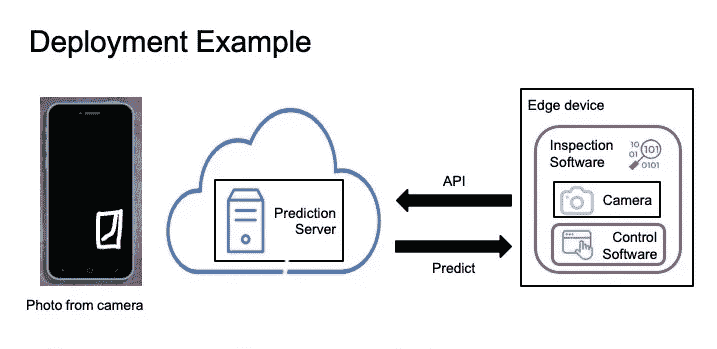
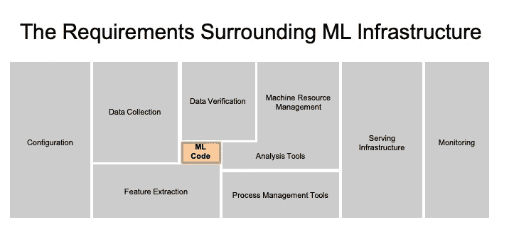
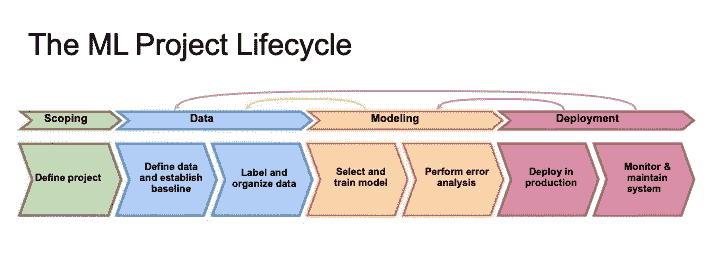
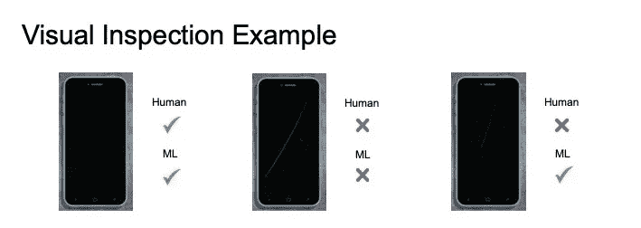
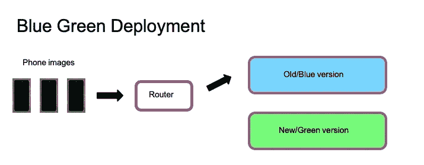
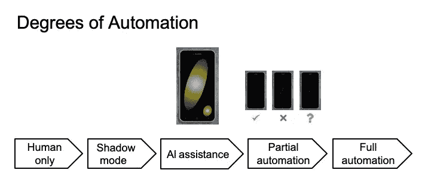
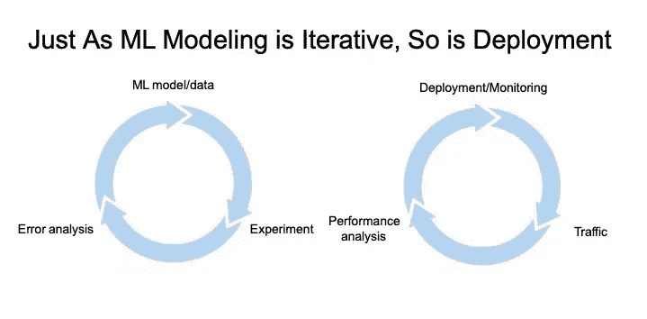
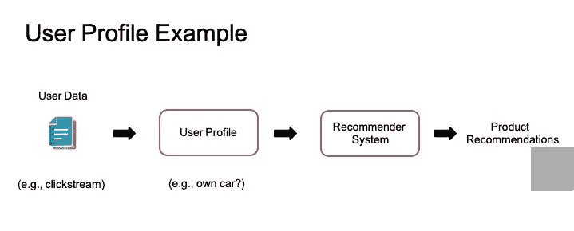

# 生产中的机器学习

> 原文：<https://towardsdatascience.com/machine-learning-in-production-mlops-80ab59628d97>

[(istockphoto.com)](https://www.istockphoto.com/nl/foto/slimme-industrie-robotarmen-voor-digitale-fabriek-productietechnologie-gm1277976646-377040021)

# 介绍

机器学习模型很棒，但除非你知道如何将它们投入生产，否则很难让它们创造最大的可能价值。机器学习项目的工作流程是系统地规划出机器学习项目的生命周期。当构建机器学习系统时，思考机器学习项目的生命周期是计划出所有需要努力的步骤的有效方法。

例如，我们正在使用计算机视觉来检查从生产线上下来的手机，看看它们是否有缺陷。在下图中，左边的手机没有任何划痕。但如果有一段裂缝或其他什么，计算机视觉算法将有望找到这种类型的裂缝或缺陷。也许在它周围放上边框作为质量控制的一部分。如果你得到一组有划痕的手机的数据，你可以训练一个可能在你的网络中的计算机视觉算法来检测这些类型的缺陷。但是，为了将其投入生产部署，您现在需要做些什么呢？

图 1:示例计算机视觉项目，用于检查从生产线上下来的手机，看它们是否有缺陷。

这是一个如何部署这样一个系统的例子。您可能有一个边缘设备，即位于制造这些智能手机的工厂内的设备。边缘设备会有一个检查软件，它的工作是拍摄手机照片，看看是否有拉伸，然后决定这款手机是否可以接受。这实际上通常在工厂中完成，并被称为自动化视觉缺陷检查。检测软件所做的是，它将控制一台相机，当智能手机从生产线上下线时，该相机将拍摄智能手机的照片。然后，它必须进行 API 调用，以将该图片传递给预测服务器。预测服务器的工作是接受这些 API 调用，接收图像，决定该手机是否有缺陷，并返回该预测。最后，检测软件可以做出适当的控制决定，是否让它继续在生产线上运行。

# ML 基础设施要求

在过去的十年里，机器学习模型受到了很多关注。然而，部署机器学习模型和产品需要的不仅仅是机器学习代码。所以你的神经网络或者另一种算法，学习从一些输入到一些输出的函数映射。这是机器学习模型的惊人进步。

但事实证明，如果你看一个生产中的机器学习系统，如果这个橙色的小矩形代表机器学习代码，机器学习模型代码[1]。然后这些就是你整个机器学习项目需要的所有代码。很多机器学习项目，可能只有 5–10%，甚至更少的机器学习代码。

图 2:只有一小部分真实世界的 ML 系统由 ML 代码组成，如中间的橙色小框所示。所需的周边基础设施庞大而复杂[1]。

这也是为什么当你在 Jupyter 笔记本上使用概念验证模型时。从最初概念验证到生产部署，仍然有许多工作要做。所以有时人们会提到 POC。或者对生产差距的概念证明。这种差距很大程度上是因为除了最初的机器学习模型代码之外，还要编写所有这些代码。

除了机器学习代码，还有许多组件，尤其是用于管理数据的组件，如数据收集、数据验证、特征提取。在你服务它之后，如何监控系统将监控回来的数据，帮助你分析它。但是通常还需要构建许多其他组件来支持工作生产部署。

# 机器学习项目生命周期

机器学习项目的工作流程是系统地规划出机器学习项目的生命周期。这些是机器学习项目的主要步骤。首先是范围界定，你必须定义项目或者决定做什么。你到底想对什么应用机器学习，什么是 X，什么是 y，在选择了项目之后，你就必须收集数据或者获取你的算法需要的数据。这包括定义数据和建立基线，然后标记和组织数据。有了数据之后，就必须训练模型。在建模阶段，您必须选择和训练模型，还要执行错误分析。

图 3: MLOps(机器学习操作)是一个新兴的学科，由一套工具和原则组成，以支持 ML 项目生命周期的进展[2]。

你可能知道机器学习通常是一项高度迭代的任务。在错误分析过程中，您可能会返回并更新模型，或者您也可能会返回到早期阶段并决定还需要收集更多数据。在部署系统之前，作为错误分析的一部分，您通常还会执行最终检查，可能是最终审计，以确保系统的性能足够好，并且对于应用程序来说足够可靠。当你第一次部署一个系统时，你可能已经完成了一半的工作，因为通常只有在你开启实时流量后，你才能学到使系统运行良好所需的重要课程的后半部分。

# **部署**

任何机器学习项目中最令人兴奋的时刻之一是当你开始部署你的模型时，但是是什么使得部署变得困难呢？部署机器学习模型有两大类挑战。首先，是机器学习或统计问题，其次，是软件引擎问题[4]。

# **概念漂移和数据漂移**

许多部署面临的挑战之一是概念漂移和数据漂移。不严格地说，这意味着如果您的数据在您的系统已经部署之后发生了变化，该怎么办呢？在我们之前的制造示例中，您可能已经训练了一个学习算法来在一组照明条件下检测智能手机上的划痕，然后工厂中的照明可能会发生变化。这是数据变化分布的一个例子。重要的是，你要认识到数据是如何变化的，以及你是否因此需要更新你的学习算法。当数据发生变化时，有时是一种渐进的变化，例如英语确实在变化，但变化非常缓慢，新词汇的引入速度相对较慢。有时，当系统突然受到冲击时，数据会突然改变。

# **新冠肺炎和**信用卡诈骗系统

当疫情袭击新冠肺炎时，许多信用卡欺诈系统开始失效，因为个人的购买模式突然改变了。许多很少进行网上购物的人突然开始更多地使用网上购物。所以人们使用信用卡的方式突然改变了，这实际上触发了很多反欺诈系统。这种向数据分布的突然转变意味着，许多机器学习团队在 COVID 的开始阶段有点混乱，以收集新数据并重新训练系统，以便使它们适应这种非常新的数据分布。

有时，描述这些数据变化的术语并不完全一致，但有时，术语数据漂移用于描述输入分布 x 是否发生变化，例如，如果一位新的政治家或名人突然变得众所周知，他被提及的次数比以前多得多。术语概念漂移指的是从 x 到 y 的期望映射是否改变，例如在新冠肺炎之前的 if。也许对于一个给定的用户来说，许多令人惊讶的网上购物应该已经标志着该帐户的欺诈。在新冠肺炎开始后，就萎靡不振而言，也许同样的购买不会真的引起任何恐慌。那张信用卡可能被偷了。

# **软件工程问题**

除了管理这些数据的变更之外，第二组问题是软件工程问题，您必须设法成功地部署一个系统。您正在实现一个预测服务，它的工作是接受查询 x 并输出预测 y，对于如何实现这个软件，您有很多设计选择。这里有一个问题清单，可以帮助你做出管理软件工程问题的正确决定。对于您的应用程序，您必须做出的一个决定是，您需要实时预测还是批量预测？例如，如果您正在构建一个语音识别系统，其中用户说话，您需要在半秒钟内得到响应，那么显然您需要实时预测。相比之下，为医院建立系统，记录病人的病历。拿走电子健康记录，运行一个通宵批处理程序，看看是否有与病人相关的东西，我们可以发现。因此，在这种类型的系统中，如果我们只是每晚在一批患者记录中运行一次，就没问题了。无论你是否需要编写实时软件，它们可以在数百毫秒内做出响应，或者你是否可以编写一夜之间完成大量计算的软件，这将影响你如何实现你的软件。

# **部署模式**

当你训练学习算法时，部署它的最佳方式通常不是打开它并抱最好的希望，因为，嗯，如果出了问题怎么办？首次部署与维护和更新部署之间的一些差异。让我们把它充实得更详细一点。一种类型的部署是，如果您提供以前没有提供过的新产品或新功能。例如，如果您正在提供以前没有提供过的语音识别服务，在这种情况下，常见的设计模式是启动少量流量，然后逐渐增加流量。第二个常见的部署用例是，如果有人已经在做一些事情，但我们现在希望使用一种学习算法来自动完成或帮助完成这项任务。例如，如果你让工厂里的人检查智能手机的划痕，但现在你想使用一种学习算法来帮助或自动完成这项任务。人们以前这样做的事实为您如何部署提供了更多的选择。

# **阴影模式部署**

让我们从视觉检查的一个例子开始，也许你已经让人工检查员检查智能手机的划痕缺陷。你现在想用一个学习算法来自动完成一些工作。当您最初让人们执行任务时，一种常见的部署模式是使用影子模式部署。

图 4: ML 系统遮蔽了人，并行运行。在此阶段，ML 系统的输出不用于任何决策。样本输出并验证 ML 系统的预测

这意味着，你将首先让一个机器学习算法跟随人类检查员，并与人类检查员并行运行。在这个初始阶段，学习算法输出不用于工厂的任何决策。因此，无论学习算法说什么，我们现在都要遵循人类的判断。假设这个智能手机，人们说它很好，没有缺陷。学习算法说没问题。也许对于这个中间大拉伸的例子，这个人说这不好，学习算法也同意。也许对于这个拉伸较小的例子，也许这个人说这不好，但学习算法犯了一个错误，实际上认为这是好的。影子模式部署的目的是让您收集数据，了解学习算法的执行情况以及与人类判断的对比情况。使用影子模式部署是一种非常有效的方法，可以让您在让学习算法做出任何真正的决定之前验证它们的性能。

# **金丝雀部署**

当您准备好让学习算法开始做出真正的决策时，常见的部署模式是使用金丝雀部署。在金丝雀部署中，您可能会部署一小部分流量，可能是 5%，可能最初甚至更少，并开始让算法做出真正的决策。

图 5:最初推出一小部分流量(比如说 5%)。监控系统并逐渐增加流量。

但是，如果只在一小部分流量上运行这种算法，如果算法出现任何错误，它将只影响一小部分流量。这为您提供了更多的机会来监控系统，并且只有在您对此性能更有信心的情况下，才会逐渐提高流量百分比。Canary 部署允许您在问题可能对工厂或您部署学习算法的其他环境产生过大后果之前，及早发现问题。

# **蓝绿色展开**

有时使用的另一种部署模式是蓝绿色部署。假设我们有一个系统，相机软件，用于在您的工厂收集手机图片(图 6)。这些手机图像被发送到一个软件，该软件获取这些图像并将其发送到一些视觉检测系统。在蓝绿色部署的术语中，您的软件的旧版本被称为蓝色版本，而新版本，即您刚刚实现的学习算法被称为绿色版本。在蓝绿色部署中，您要做的是让路由器向旧版本或蓝色版本发送图像，并让它们做出决策。

图 6:启用回滚的简单方法。

然后，当您想要切换到新版本时，您需要做的是让路由器停止向旧版本发送图像，并突然切换到新版本。因此，蓝绿部署的实现方式是，您将拥有一个旧的预测服务，它可能运行在某种类型的服务上。然后你会启动一个新的预测服务，绿色版本，你会让路由器突然将流量从旧的切换到新的**。**蓝绿色部署的优势在于可以轻松实现回滚。在蓝绿部署的典型实施中，人们会想到同时 100%地切换流量。

# **自动化程度**

MLOps 工具可以帮助实现这些部署模式，或者您可以自己实现它们。考虑如何部署系统的最有用的框架之一是考虑部署，而不是像 0，1 那样要么部署要么不部署，而是设计一个系统，考虑什么是适当的自动化程度。例如，在智能手机的视觉检测中，一个极端是如果没有自动化，那么只有人类的系统。如果您的系统运行的是影子模式，那就是稍微自动化的模式。所以你的学习算法是把预测，但它实际上并没有用在工厂里。这就是影子模式。自动化程度稍高一点的将是人工智能辅助，给定一张像这样的智能手机照片，你可能会让人类检查员做出决定。

图 7:设计一个系统，考虑什么是适当的自动化程度。您可以选择在实现完全自动化之前停止。

但也许人工智能系统可以影响用户界面，突出显示有划痕的区域，以帮助吸引人们的注意力，让他们看起来最有用。用户界面或 UI 设计对于人工协助至关重要。但这可能是一种在保持人在循环中的同时获得稍微更高程度的自动化的方法。更大程度的自动化可能是部分自动化，如果给我们一部智能手机，如果学习算法确定它没问题，那就是它的决定。它肯定是有缺陷的，然后我们就去算法的决定。但是如果学习算法不确定，换句话说，如果学习算法预测不太有把握，0 或 1，也许只有这样我们才会把这个发给人类。所以这是部分自动化。对于学习算法的性能对于完全自动化来说不够好的应用程序，部分自动化有时是一个非常好的设计点。

当然，除了部分自动化，还有完全自动化，我们可以让学习算法做出每一个决定。因此，在左边有一个只使用人类决策的范围，一直到在右边只使用人工智能系统的决策。而且很多部署应用会从左边开始，逐渐向右移动。我发现，消费者的互联网应用程序，如如果你运行一个网络搜索引擎，写一个在线语音识别系统。许多消费软件互联网企业不得不使用完全自动化，因为每次有人进行网络搜索或产品搜索时，让后端的人做一些工作是不可行的。但是在消费软件互联网之外，例如，检查东西和工厂。它们实际上是许多应用程序，其中最佳设计点可能是人在回路中的部署，而不是完全自动化的部署。

# **监控**

你如何监控一个机器学习系统，以确保它满足你的性能预期？监控机器学习系统最常见的方式是使用仪表板来跟踪它如何超时工作。根据您的应用程序，您的仪表板可能会监控不同的指标。例如，您可能有一个仪表板来监控服务器负载，或者有一个不同的仪表板来监控非空输出的衍射。当你试图决定监控什么时，我建议你和你的团队坐下来，头脑风暴所有可能出错的事情。然后你想知道是否有什么事情出错了。对于所有可能出错的事情，头脑风暴一些统计数据或一些度量标准来检测问题。例如，如果您担心用户流量激增，导致服务过载，那么服务器负载可能是一个指标，您可以跟踪其他示例。

当我第一次设计我的监控仪表板时，我认为可以从许多不同的指标开始，监控一个相对较大的集合，然后逐渐删除那些随着时间的推移你发现不是特别有用的指标。这里有一些我们的观点或者我见过的其他人在各种项目中使用的度量标准的例子。首先是软件指标，如内存、计算、延迟、吞吐量、服务器负载等，这些指标有助于您监控预测服务的软件实现或围绕您的学习算法的其他软件的健康状况。除了软件指标，我经常会选择其他指标来帮助监控统计健康或学习算法的性能。

当然，对于 web 搜索，您也可以使用非常粗略的指标，如点击率或 CTR，只是为了确保整个系统是健康的。这些输出指标可以帮助您找出您的学习算法，输出 y 是否以某种方式发生了变化，或者在您的学习算法输出之后是否发生了一些事情，例如用户切换到打字，是否以某种方式发生了重大变化。因为输入和输出指标是特定于应用程序的，所以大多数 MLOps 工具都需要专门配置来跟踪应用程序的输入和输出指标。

# 正如 ML 建模是迭代的一样，部署也是迭代的

你可能已经知道机器学习建模是一个高度迭代的过程，部署也是如此。以建模为例，你会提出一个机器学习模型和一些数据，训练模型，这是一个实验。然后进行误差分析，并使用误差分析来找出如何改进模型或数据，通过多次迭代这个循环，你就有希望得到一个好的模型。

图 8:选择正确的度量集进行监控的迭代过程。

强烈建议将部署视为一个迭代过程。当您启动并运行您的第一批部署，并设置一组监控仪表板时。这只是这个迭代过程的开始。一个运行的系统让你获得真实的用户数据或者真实的流量。通过查看您的学习算法在真实流量的真实数据上的表现，您可以进行性能分析，这反过来有助于您更新部署并持续监控您的系统。在您选择了一组要监控的指标之后，通常的做法是设置警报的阈值。您可以根据这个设置来决定，如果服务器负载超过 0.91，可能会触发警报或通知，让您或团队知道是否有问题，并可能启动更多的服务器。或者，如果不是这样，一小部分缺失值会高于或低于某组阈值，这可能会触发警报，如果您随时间推移调整指标和阈值，以确保它们向您标记最相关的问题案例，也没关系。如果这是与学习算法的准确性相关的性能问题，那么您可能需要更新您的模型。或者，如果这是一个与学习算法的准确性相关的问题，那么您可能需要回去修复它。这就是为什么随着时间的推移，许多机器学习模型需要一点维护或再培训。

# **管道监控**

许多人工智能系统不仅仅是运行预测服务的单一机器学习模型，而是涉及多个步骤的流水线。那么什么是机器学习管道，你如何为此建立监控系统呢？让我们看一个涉及用户配置文件的例子。也许我使用了诸如点击流数据之类的数据来显示用户正在点击什么。并且这可以用来建立试图捕捉用户的关键属性或关键特征的用户简档。例如，我曾经建立了用户档案，试图预测用户的许多属性，包括用户是否拥有汽车。

图 9:点击流数据，显示用户点击什么来建立用户简档，试图捕捉用户简档的关键属性或关键特征。

因为这将帮助我们决定是否值得尝试向用户提供汽车保险办公室。建立用户档案的典型方法是使用学习算法来预测汽车用户。这种类型的用户配置文件可以有一个很长的预测属性列表，然后可以提供给推荐系统。然后，另一种学习算法利用这种对用户的理解，尝试生成产品推荐。现在，如果点击流数据发生变化，也许这种输入分布发生变化，那么随着时间的推移，如果我们失去了判断用户是否拥有汽车的能力，那么未知标签的比例可能会上升。并且因为用户简档输出改变，推荐系统的输入现在改变，并且这可能影响产品推荐的质量。当你有一个机器学习管道时，管道中的这些级联效应可能很复杂，难以跟踪。但是，如果未知标签的百分比确实上升了，这可能是您想要提醒的事情，以便您可以在需要时更新推荐系统，以确保您继续生成高质量的产品推荐。

# 摘要

随着机器学习(ML)社区继续积累多年的实时系统经验，一种普遍而令人不安的趋势已经出现:开发和部署 ML 系统相对快速而便宜，但随着时间的推移维护它们是困难和昂贵的。除了机器学习代码，还有许多组件，尤其是用于管理数据的组件，如数据收集、数据验证、特征提取。在你服务它之后，如何监控系统将监控回来的数据，帮助你分析它。但是通常还需要构建许多其他组件来支持工作生产部署。因此，我们在所有这些其他软件中所学到的东西对于有价值的生产部署是必需的。但是，比起查看所有这些复杂的部分，这是最有用的组织框架之一。机器学习项目的工作流程是系统地规划出机器学习项目的生命周期。我们深入研究了机器学习项目的整个生命周期。希望这个框架对你未来计划部署的所有机器学习项目都非常有用。

👋感谢阅读。如果你喜欢我的作品，别忘了喜欢，在 [medium](https://medium.com/@rashidkazmi) 上关注我。这将激励我为媒体社区提供更多的内容！😊

# 参考资料:

[1]斯卡利博士、霍尔特博士、戈洛文博士、达维多夫博士和菲利普博士(未标明)。机器学习系统中隐藏的技术债务。2021 年 4 月 28 日从 Nips 检索。[https://papers . nips . cc/paper/2015/file/86 df 7 dcfd 896 fcaf 2674 f 757 a 2463 EBA-paper . pdf](https://papers.nips.cc/paper/2015/file/86df7dcfd896fcaf2674f757a2463eba-Paper.pdf)

【2】深度学习。人工智能

[3] AndKonstantinos，Katsiapis，Karmarkar，a .，Altay，a .，Zaks，a .，Polyzotis，n .，…李，Z. (2020)。迈向 ML 工程:张量流扩展简史(TFX)。http://arxiv.org/abs/2010.02013

[4]帕里耶斯，a .，乌尔马，R.-G .，&劳伦斯，未标明日期(2020 年)。部署机器学习的挑战:案例研究调查。【http://arxiv.org/abs/2011.09926 