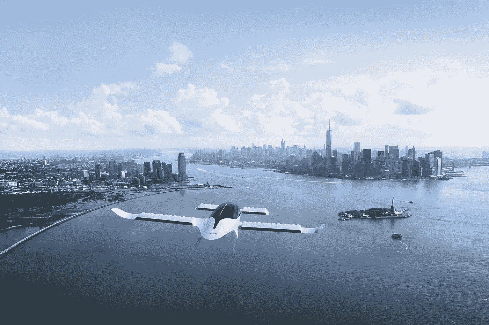
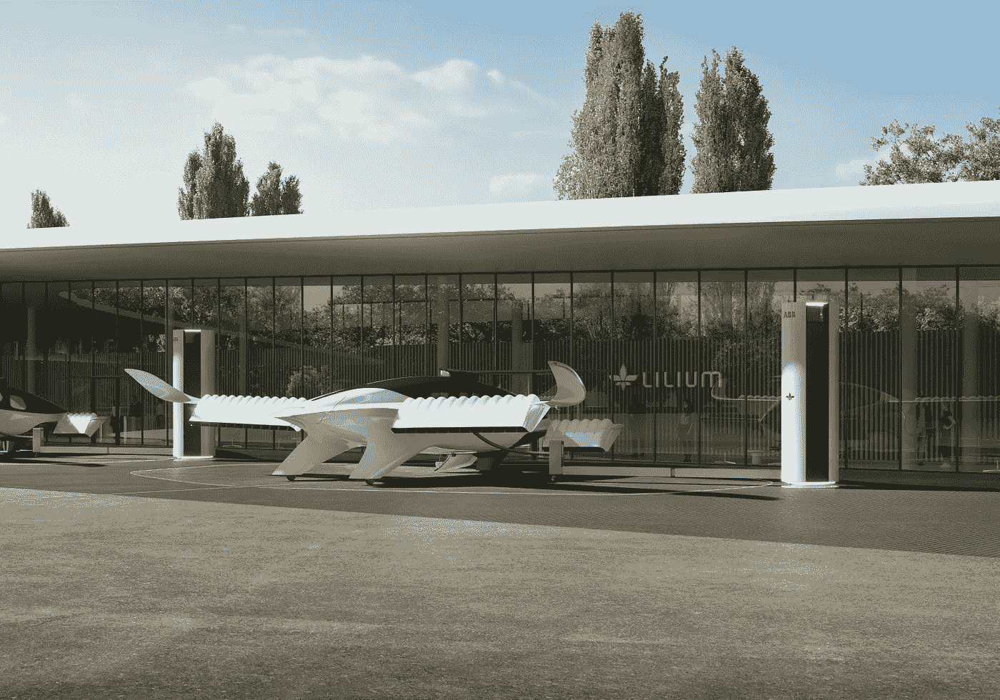
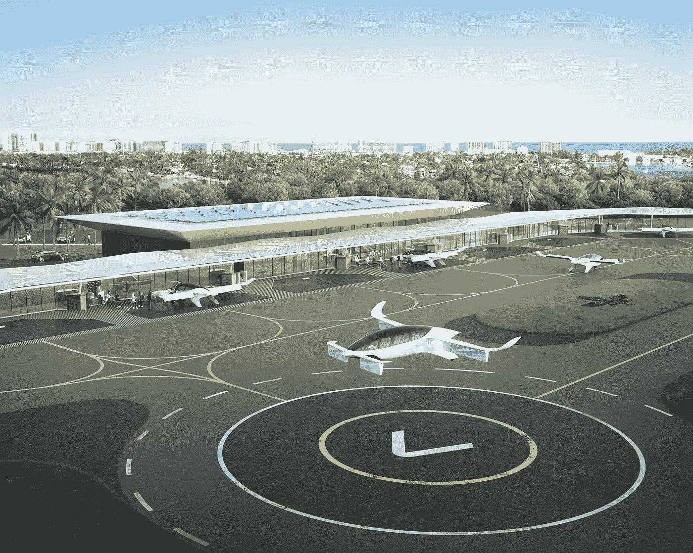

# 机器学习在城市空中机动性和电动垂直起降中的应用

> 原文：<https://towardsdatascience.com/machine-learning-ml-applications-in-urban-air-mobility-and-evtol-a6baec5ba0ba>

人工智能(AI)已经改变了几乎每个行业的格局。它现在正在创造超越地球表面的印记。

Lilium Jet 是由 Lilium GmbH 设计的德国电动垂直起降电动飞机原型。计划推出七座量产版。鸣谢:lilium.com 媒体工具包

在过去的十年里，人工智能(AI)已经全面革新了各个行业。它现在留下的足迹已经延伸到了陆地之外。航空业就是这样一个行业。人工智能已经与自动驾驶汽车行业相交，它正在推动这场革命。自动驾驶汽车只是通往自动驾驶汽车数字化转型的漫长道路上的第一步。这股浪潮继续进入城市空中交通(UAM)行业，人工智能有可能实现自动飞行汽车的梦想。

# 城市空中交通的现状(UAM)

UAM 引进了一种新的运输方式——空运。航空是一种在城市之间连接和运送人员的交通方式。随着城市的无序扩张，在地面基础设施日益拥堵的情况下，快速穿越密集的人口变得更加困难。UAM 拥有从根本上改变景观和人们以安全、高效和可持续的方式出行的潜力。直升机、直升机停机坪和空中交通管制(ATC)服务构成了 UAM 的初始生态系统。基于这一生态系统，已经开发或正在开发许多其他用例。无人驾驶客机就是这样一个充满希望的市场，因为它们大大减少了旅行时间。考虑一架大到足以运送一名人类乘客的无人机！无人或自主飞行器是一个优于传统飞行器(UAV)的概念。现在可以驾驶一架完全自主的电动多用途直升机，使用电力来减少碳足迹。这种类型的飞机被称为电动垂直起降——电动垂直起降。

电动垂直起降飞机是一种起飞时不需要跑道的飞机。它通常可以搭载五名乘客(这取决于制造商)，这使得它比传统直升机明显更节能。它由电力驱动，因此减少了排放，电动汽车是缓解交通拥堵的有效方式。

第一台电动垂直起降是由德国 Volocopter 公司开发的 Volocopter VC200。第一艘商业电动垂直起降于 2016 年 12 月在迪拜起飞。

# 高级空中机动性

AAM 的目标是在目前地面运输或现有航空模式不能或不容易服务的地区之间运输人员和货物，这是一种利用电动垂直起降(电动垂直起降)飞机的空中运输新概念。高级空中机动(AAM)有时被称为城市空中机动(UAM)，但它的潜在用途超出了人口稠密的城市地区。从单人飞机到大型飞机，这些飞机将为城市、缺医少药的社区和地理上孤立的地区带来便利。

佛罗里达州诺娜湖的百合喷气机和 ABB 充电桩。鸣谢:Lilium.com 媒体工具包

# 人工智能满足城市空气流动性

当城市空气流动性与人工智能相结合时，航空业受益。人工智能(AI)和机器学习(ML)在航空领域的应用数不胜数，它们有潜力解决当今行业的主要挑战。例如，不可预测的天气变化会影响飞机的行程。我们可以使用机器学习来预测天气状况和关键路线的天气模式，以确保安全可靠的旅程。机器学习可以用来优化一切，从 UAM 电池技术到预测电动汽车的需求。

在 eVTOLs 的背景下，机器学习有很大的潜力。

# 潜在的使用案例

以下是机器学习在电动垂直起降市场的一些可能应用。我将深入研究三个潜在的用例；

# 预测交通拥堵和交通量需求

使用机器学习，我们可以实时预测给定城市的交通拥堵情况。这可用于预测一天中不同时间和不同地理区域的 eVTOLs 需求。机器学习模型评估各种交通参数，以便预测交通拥堵。随着时间的推移，该模型通过分析交通数据来学习识别给定小时、周或月的交通模式。这对于预测一个城市对电动汽车的季节性需求非常有用。当交通拥堵严重时，对电动汽车的需求就会增加。

提前规划资源分配有助于旅行者拥有愉快的旅程。预测电动汽车的需求对于制造商和城市规划者来说至关重要。他们必须配备必要的工具来进行航空作业。通过分析各个地区对 evt ol 的需求，我们可以确定 vertiport 部署的最佳位置(处理 evt ol 着陆和起飞操作的站点)。

在这种情况下，机器学习可以作为地理信息系统(GIS)中空间分析的关键组成部分。它可以用来确定最佳着陆位置，使人们能够快速乘飞机旅行。机器学习可以用来开发一个能够为飞机进行智能、实时调度和路由决策的系统。它有可能减少客户乘车时间和成本。此外，我们可以通过优化航班运营来提高需求满足率。

已经进行了大量研究来评估各种机器学习架构，以预测空中出租车和城市空中交通(UAM)服务的需求。一项研究[1]开发了四种机器学习模型来映射预测因素和需求水平之间的关系:多项式逻辑回归、人工神经网络(ann)、随机森林和梯度推进。梯度提升(GB)算法在分类性能方面一直优于其他架构。它采用集成方法，将众多弱学习模型结合起来，形成一个稳健的预测模型。梯度推进似乎是映射低需求水平和高需求水平预测值之间关系的有效方法。据观察，GB 算法能够准确地估计需求水平。此外，它们在训练期间需要最少的计算时间。

# 自主驾驶

尽管我们非常接近完全自主的陆地运输，但向自主飞行的过渡是一个漫长而渐进的过程。话虽如此，机器学习是工具箱中的一个工具，可以帮助将自主飞行的梦想变成现实。

与自动驾驶汽车一样，机器学习正被用于调查视觉技术执行关键飞行任务的能力。其中包括探测地面和空中的危险、定位安全的紧急着陆点、在没有全球导航卫星系统的环境中定位和导航，以及在预先标记和未标记的地点安全而精确地着陆。

视觉交通检测是机器学习的一个应用，它允许对空中的危险和交通进行连续扫描。对人类来说，持续跟踪天空是一项困难且容易出错的任务。通过自动流量检测，它变得更加专注、可靠和永无止境。在安全关键的航空电子设备中，已经讨论了神经网络。深度卷积神经网络能够扫描整个天空，以确定是否存在危险。因此，它们可以集成到复杂的系统中，用于检测空中交通、空中危险以及无人机和鸟类等不合作交通。有趣的是， [Daedalean](https://daedalean.ai/) ，一家瑞士初创公司，已经开发了一种基于神经网络的飞行员辅助技术[2],它可以精确地跟踪超过 95%的入侵者。

机器学习可以完成的另一项任务是精确着陆。精确着陆利用基于视觉的位置和地图资源，使无人机能够以大约 10 英寸的精度着陆在目标上。无人机可以通过计算机视觉输出视野中适合紧急和正常着陆的区域。该系统能够实时监控地面上的障碍物，并识别出有障碍物的跑道。这些信息可以帮助系统自主选择安全着陆的最佳着陆点。神经元网络可用于构建自主精确着陆系统。在飞机下面，可以安装航空电子级摄像机，为神经网络提供实时输入。在不使用 GPS 的情况下，系统可以通过观察图像随时间的变化来确定其位置。这些参数可以被用作算法的输入，以提供一直到地面的精确着陆引导。

机器学习有可能最终实现不需要人类飞行员的飞行。然而，自主飞行提出了独特的监管挑战。对于城市空中交通工具来说，安全性是首要考虑的因素。我怀疑很多人会放心地把自己的安全托付给一架无人驾驶飞机。天气变化影响小型无人机，其持续的位置跟踪需要稳定的连接。因为机器学习模型的结果高度依赖于它遇到的情况的性质和它已经看到的数据，所以不是所有的情况都可以预测。

然而，通过额外的测试，我们可以随着时间的推移完善和提高自主飞机的性能和可靠性。

# 空中交通管制

空中交通管制技术的进步对于为无人机提供强大可靠的运输基础设施至关重要。机器学习可以应用于空中交通管制，以克服当前的技术限制，为自动化铺平道路。

垂直机场是一个集合术语，指的是专门为空空导弹飞机起飞和着陆而设计的区域，就像直升机场是直升机的指定区域一样。鸣谢:Lilium.com 媒体工具包

机器学习可以提供关键的见解，以帮助空中交通管制系统的决策过程。

ATC 系统必须确保飞机保持最小间隔距离，以避免间隔损失。要考虑的其他因素包括飞机在不同区域之间的有序转移、高效的燃油消耗和优化的着陆顺序。机器学习可以帮助优化这些元素中的每一个。它能够了解每次飞行的潜在未来，并预测潜在的冲突。

存在许多不确定性，包括天气条件、飞行员行为、飞机质量和偏好。机器学习可以解决所有这些不确定性，同时优化一个目标，即安全飞行。开发 ATC 系统的一个有前途的方法是强化学习，机器学习的一个子领域[3]。在这种情况下，人工智能代理将考虑有关 ATC 环境的可用信息。它将监控潜在的问题，如交通、天气和拥堵，然后向各种无人驾驶飞行器发出命令。当人工智能代理接收到有关 ATC 环境新状态的信息时，它会评估以前的命令。如果命令导致情况的改善，他们将获得“奖励”

然而，如果命令导致飞机之间的额外冲突，他们将受到处罚。这将使系统能够根据实时反馈不断更新自身。强化学习方法教导 ATC 系统确定完成给定目标的最有效方式。这将提供有见地的数据，并为自动化铺平道路。

# **总之**

人工智能(AI)在全球范围内重塑了企业。城市空中交通的现状(UAM) UAM 增加了一种新的交通方式——空中旅行。当城市空中交通与人工智能相结合时，航空业将受益。人工智能(AI)和机器学习(ML)在航空领域有多种用途。机器学习可以用于优化各种各样的流程，从 UAM 电池技术优化到估计 eVTOLs 的需求。

# 参考

[1]拉金德兰、斯里尼瓦斯和格里姆肖(2021 年)。使用机器学习算法预测空中出租车城市航空服务的需求。ArXiv，abs/2103.14604。

[2][https://daedalean . ai/blog/tpost/mou 9 nieca 1-neural-networks-design-assurance-with-ea](https://daedalean.ai/blog/tpost/mou9nieca1-neural-networks-design-assurance-with-ea)

[3][https://www . turing . AC . uk/research/impact-stories/put-ai-air-traffic-control](https://www.turing.ac.uk/research/impact-stories/putting-ai-air-traffic-control)

 [## 如何提交？

### 数据驱动的小说

medium.com](https://medium.com/data-driven-fiction/how-to-submit-5e0808dce313)