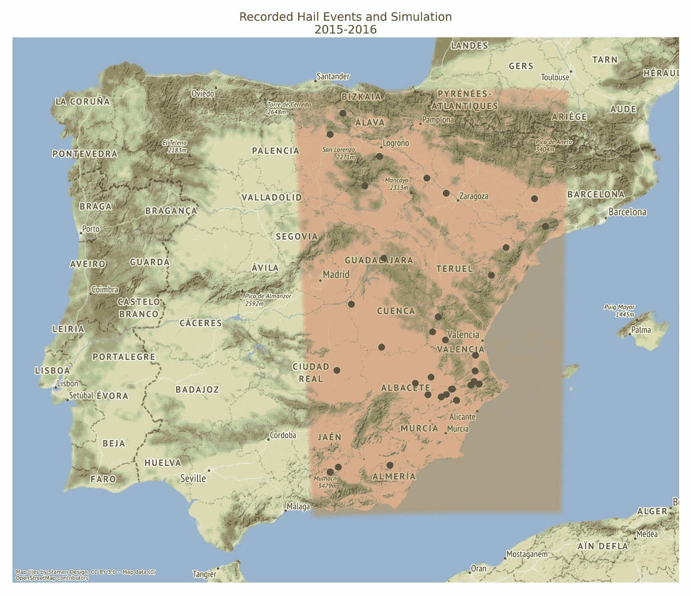

# 我如何将数据处理时间从 5 天缩短到 5 小时

> 原文：<https://towardsdatascience.com/machine-learning-on-supercomputers-data-processing-aa403e51516b>

## 关于高性能计算的人工智能的文章第 1 篇:并行数据处理


图片提供: [CINECA](https://www.flickr.com/photos/cineca/25618574166) 。

在这一系列文章中，我将概述在开发更快更精确的机器学习(ML)项目中利用高性能计算(HPC)的各种方法。

作为 CINECA[高性能计算部门的一名数据科学家，我的任务是 EU-资助的](https://www.cineca.it/) [CYBELE](https://www.cybele-project.eu/) 项目的提前一天冰雹预测问题。该项目的目的是开发一个集成在 Cybele Demonstrator 3 中的冰雹预测模型，该模型是 CINECA、 [GMV](https://gmv.com/en-es) 和 [CACV](http://www.cooperativesagroalimentariescv.com/) 之间合作的结果，这是一个位于瓦伦西亚的农民联盟，提供用户要求和历史观测数据。这些帖子中介绍的工作是与我在 CINECA 的同事一起完成的，他们是 Giorgio Pedrazzi、 [Roberta Turra](https://it.linkedin.com/in/roberta-turra-3897826) 、 [Gian Franco Marras](https://it.linkedin.com/in/gian-franco-marras-27442217) 和 [Michele Bottazzi](https://it.linkedin.com/in/michele-bottazzi-phd-a0a28990) 。



红色表示预测区域，黑色表示历史冰雹事件。图片提供:作者。

冰雹是一种只有在特定的大气条件下才有可能发生的现象。这种不确定性使得冰雹事件很少发生，也很难预测。我们的方法旨在通过从过去发生的真实事件中学习，在给定的天气条件下区分冰雹事件和非冰雹事件。因此，我们的冰雹预测模型是基于自动学习技术建立的，使用天气预报数据和导出的气候不稳定指数作为输入，并根据现场收集的冰雹事件数据执行
验证。

## 问题是

输入数据由 ECMWF 提供，时间分辨率为 1 小时，空间分辨率为 5 公里，覆盖了西班牙大约 20 万平方公里的土地。数据由 73 个字段组成，描述了一天中每个小时每个网格点(由经度和纬度描述)的天气情况，其中一些字段是在地面以上 65 个不同高度计算的。因此，产生的变量数量约为 1000。


原始数据集中的 GRIB 文件概述。图片提供:作者。

输入数据需要缩小到 2.2 公里的分辨率，以便与西班牙目标区域的农业地块和农作物的范围相匹配。205 x 333 ~ 68000 个网格点的更精细网格是通过小规模建模模拟获得的，适用于感兴趣的区域，这需要 HPC 机器上的 640 个核心(20 个节点),每次预测消耗 128 个核心小时。在 ECMWF 提供的 2015-2019 年的历史数据中，每天运行两次预测(提前 48 小时和 24 小时)，总计约 2100 天。这项任务由我在 CINECA 的同事负责，他们是[吉安·佛朗哥·马拉什](https://it.linkedin.com/in/gian-franco-marras-27442217)和[米歇尔·博塔齐](https://it.linkedin.com/in/michele-bottazzi-phd-a0a28990)。**由此产生的输入数据量约为 6 TB，即 5 年内每天 3 GB 的数据量**。

## 解决方案

第一项任务是为 ML 准备好这些数据。原始数据被写成每小时一次的 GRIB 文件，这是一种在气象学中广泛使用的二进制格式。人们可以将其视为张量(或 N 维数组)，其中任何给定的网格点都有自己的一组值，在我们的情况下，最终的 68000 个网格点中的每一个都有对应于 1000 个气象特征的值。

## 数据格式

考虑到为了将数据制成表格，我必须编写 2100 x 24 ~ **50000 个文件(5 年的数据，每天每小时一个)，68000 行(当时的数据样本)和 1000 列(当时的特征)**，我决定使用相对于 *csv* 更紧凑的数据格式。我选择了 ***羽毛*** (或者*拼花*)，这是一种**高度轻便的样式。**如果安装了正确的 Apache Arrow 绑定，或者简单地说就是“ [PyArrow](https://arrow.apache.org/docs/python/index.html) ”包，Python 可以轻松处理 Feather 文件。此处提供了对相同内容的极好概述[。](/the-best-format-to-save-pandas-data-414dca023e0d)

## 数据准备

现在的任务是读取二进制 GRIB 文件，并将其重写为羽毛文件的形式。所有 50000 个文件都必须这样做。虽然这一步不是必需的，但它很方便，因为可以用熊猫来读取羽毛文件，但对 GRIB 文件来说就不一样了。IO 操作的伪代码可以定义如下:

```
def grib_to_feather(grib_file):
    grib_data = pygrib.read(grib_file)
    tabulated_file = tabulate(grib_data)
    pyarrow.write(tabulated_file)for grib_file in GRIB_FILES:
    grib_to_feather(grib_file)
```

函数 *grib_to_feather* 每个文件花费 **10 秒(平均)，因此处理所有的 **50000 个文件我们大概需要 5 天！****

## 并行数据准备

我决定在“令人尴尬的并行”范例下并行 IO 操作。之所以这么叫，是因为并行处理手头的任务需要很少的努力，尤其是因为在产生的单个并行任务之间没有通信。在我们的例子中，我们可以利用这种思想，因为原始数据是作为单独的文件写入的(每小时一个文件)，我们只需要以不同的形式(和格式)读入和写出它。换句话说，我们可以异步地读入原始数据并写出处理过的文件。


使用 8 个 CPU 异步并行执行 IO 操作。图片提供:作者。

在 CINECA，我们拥有欧洲最大的超级计算设施之一。因此，我决定在一台名为“[马可尼 100](https://www.hpc.cineca.it/hardware/marconi100) ”的机器上只使用一个节点(32 核)。我用 python 中的[多重处理](https://docs.python.org/3/library/multiprocessing.html)模块修改了代码。伪代码如下:

```
from multiprocessing import Pooln_workers = 30
p = Pool(n_workers)
p.map(grib_to_feather,GRIB_FILES)
```

就这么简单！由于文件是相互独立的，并且对每个文件的处理都是独立的，所以这种方法非常适用。 *map* 调用可以将一个具有给定输入的函数‘映射’到一系列可行的输入。换句话说，它创建了 30 个并行任务，其中一个任务被定义为对从存储在列表 *GRIB 文件*中的文件名列表中提取的文件名运行函数 *grib_to_feather* 。当一个任务在处理器上完成时(即，一个原始 GRIB 文件被读入、处理并写出为羽毛文件)，下一个可用的文件名被传递给处理器。调用图*在幕后负责这个文件处理器关联。*

因此，使用并行版本的 IO 脚本，我获得了与使用的内核数量成比例的速度提升，即 **4 小时而不是 5 天！**

在下一篇文章中，我们将看到如何利用*数据并行性*在超级计算机上加速神经网络。

*注:文章中的所有图片均由作者创作，并归作者所有。*