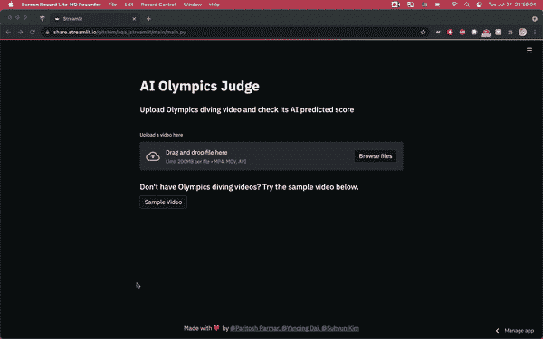
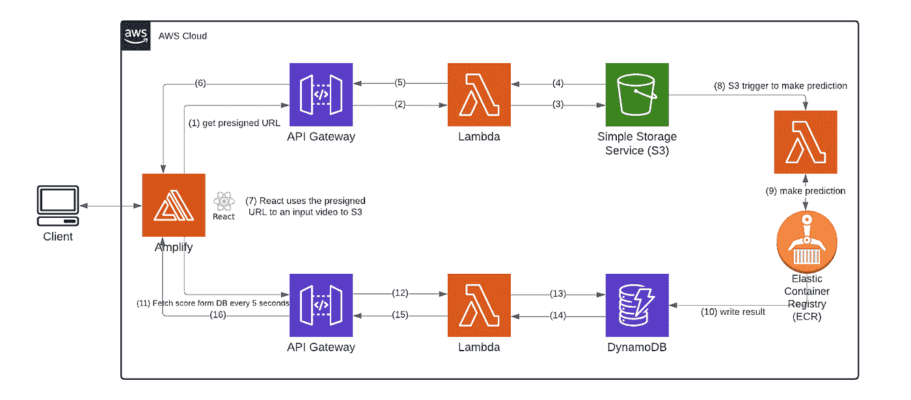
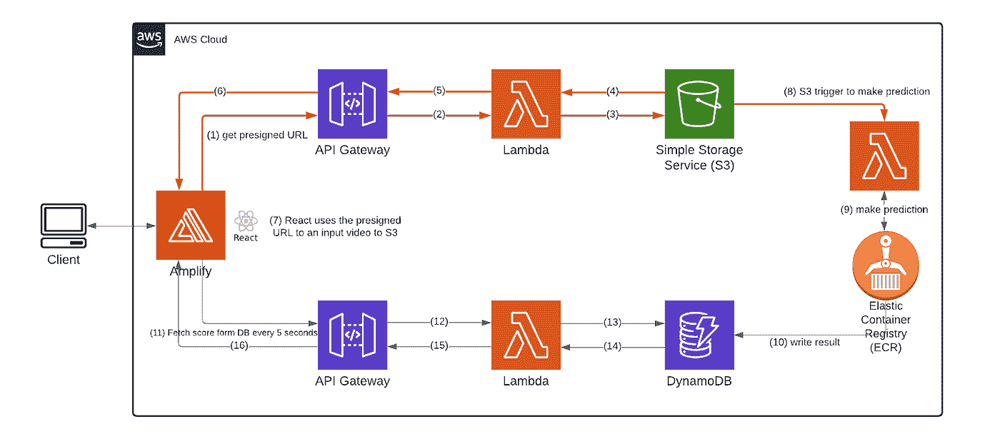
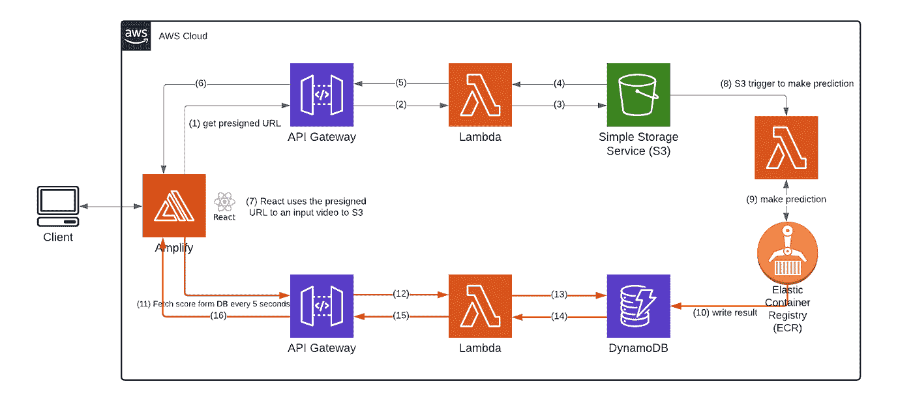

# 使用 AWS Lambda、Docker、ECR、S3 和 API Gateway 的无服务器机器学习

> 原文：<https://towardsdatascience.com/machine-learning-serverlessly-1a532685fa7c>

# 使用 AWS Lambda、Docker、ECR、S3 和 API Gateway 的无服务器机器学习

## **如何在 AWS 上无服务器地构建复杂的机器学习 web 应用**

作者 GIF

大量的工作和努力投入到生产基于机器学习的产品中。我们最近完成了一个[网络应用](https://share.streamlit.io/gitskim/aqa_streamlit/main/main.py)的开发，用来预测奥运会跳水运动员的表现。给定一个奥运跳水运动员的视频，该网络应用程序预测人类裁判会给出什么分数，并输出分数。ML 模型已经在内部进行了训练，我们必须将它们部署并生产成服务。我们选择了无服务器架构，这样我们就不必供应、运行和维护服务器，而是专注于开发用户友好的应用程序。下面是实现无服务器架构的 React web 应用程序。

作者图片

在这篇文章中，我们将介绍我们在 AWS 上托管的一个简单但“复杂”的机器学习 web 应用程序的部署设计和实现。这是一个非常简单的项目，只有一个功能，从一个用户上传的视频潜水动作的预测得分。但是我们确实认为这个项目“复杂”,原因如下:

1.  web 应用程序需要接收用户上传的视频作为输入，该视频相对较大(高达 200MB)。
2.  预测过程中涉及的机器学习模型相对较大(564MB)。
3.  web 应用程序需要等待预测过程，这需要相当长的时间(可能超过几分钟)才能完成。

对于我们预测过程的机器学习部分背后的理论，如果你感兴趣，可以在本文中找到更多[。这里我们将只介绍我们的部署设计，并详细讨论我们使用的工具。下面是我们的云架构设计图，我们将在下面详细讨论架构的每个部分。](https://medium.com/@logicdevildotcom/training-ai-to-score-olympic-events-649b41574160)

作者图片

简而言之，我们的前端 React 服务托管在 AWS Amplify 中，它与连接到 AWS Lambda、AWS 简单存储服务(S3)和 AWS DynamoDB 的 AWS API 网关端点进行交互。

# 我们如何处理(大量)用户上传的数据？

用户通过我们的前端 React 服务上传一个视频文件作为输入。由于视频文件很大，在前端处理它并不容易。在我们的例子中，用户可以一次上传一个视频，每个文件必须小于 200 MB。红色箭头(#1 — #8)描述了对来自客户端的输入文件的处理，这就是我们将在下面描述的内容。

作者图片

当用户上传一个大文件时，在前端处理它的最好方法是不要上传。我们遵循了 AWS 关于如何将视频直接发送到 S3 的文档，它会在检测到新上传的视频时通知我们的后端。视频文件源自用户的计算机，我们的前端代码将文件上传到 S3 桶中(箭头 1 到 7)；S3 桶上有一个触发器(箭头 8)，这样一旦上传完成，包含模型的 lambda 就会在新的视频输入上被调用(箭头 9)。

简而言之，我们的前端做这两件事:

1.  当接收到一个视频时，前端向我们的 HTTP API(箭头 1)和它后面的 lambda 函数发送一个 GET 请求，以获取存储所有用户上传视频的 S3 桶的预签名 URL(箭头 2 和 3)。
2.  在获得预签名的 URL(箭头 4、5 和 6)之后，前端向该 URL 发送 PUT 请求，其中视频以二进制数据的形式包含在正文中，该请求被存放到 S3 桶中(箭头 7)。一旦数据被上传到桶中，一个触发器被触发，警告模型 lambda 新数据准备好了(箭头 8)。

上面的教程足够详细，可以让你理解它的基础。但是有时根据我们自己的特定需求调整教程仍然是一个挑战。因此，我们将在这里链接我们的代码库。

这是一个 lambda 函数，它从 S3 生成一个预签名的 URL。

[https://github . com/yumyumqing/AQA _ S3 _ pre signed _ URL/blob/main/getSignedURL/app . py](https://github.com/yumyumqing/AQA_s3_presigned_url/blob/main/getSignedURL/app.py)

这是我们为这个 lambda 函数和它前面的 HTTP API 准备的 [SAM](https://docs.aws.amazon.com/serverless-application-model/latest/developerguide/what-is-sam.html) 模板。

[https://github . com/yumyumqing/AQA _ S3 _ pre signed _ URL/blob/main/template . YAML # L6-L70](https://github.com/yumyumqing/AQA_s3_presigned_url/blob/main/template.yaml#L6-L70)

您可以看到，我们为前端应用程序实现了一个 AWS API 网关，以获得一个预签名的 URL [这里是](https://github.com/yumyumqing/AQA_s3_presigned_url/blob/main/template.yaml#L65)。当您使用***SAM deploy-guided***部署堆栈时，按照 AWS 的[文档，您可能会遇到 AWS SAM CLI 错误:](https://aws.amazon.com/blogs/compute/uploading-to-amazon-s3-directly-from-a-web-or-mobile-application/)

> "不满足安全约束。"当您对这个问题回答“否:HelloWorldFunction 可能没有定义授权，这样可以吗？[是/否]。您可以在此找到修复问题[的详细信息。](https://docs.aws.amazon.com/serverless-application-model/latest/developerguide/serverless-deploying.html)

设置所有这些似乎有点复杂(这意味着我们需要先学习所有这些工具！)我们可以将视频从前端直接发送到运行推理代码的主机。然而，在这种情况下，我们将负责更多的操作细节:大视频的多部分传输，等待大文件的到达，编码，检查，这些数据的临时和永久存储处理，以及许多我们甚至没有想到的事情。

# 如何无服务器部署大型机器学习模型

接下来，用户数据在 AWS lambda 中得到处理。AWS Lambda 是“一种无服务器的事件驱动计算服务，让您无需配置或管理服务器即可运行代码。”它几乎是一个抽象的后端，你可以像实现一个函数一样实现它。AWS Lambda 代表客户管理扩展，并支持高可用性和容错。Lambda 部署包是一个 zip 文件，其中包含代码、库和依赖项。然而，lambda 的包大小限制妨碍了我们，因为我们要部署的文件和 ML 模型的总大小至少是 564MB，但是 Lambda 施加了以下大小限制:

> 压缩文件的部署包大小限制:50MB

2020 年 12 月，AWS 开始支持将 Docker 容器映像部署为 lambda 函数的功能。你可以在这里查看 Docker 的更多信息(https://www.docker.com/)。这意味着 docker 容器映像可以部署到 lambda，而不是 zip 文件。我们只需要确保容器映像是基于 linux 的。对我们来说，对 Lambda 使用 docker 映像的好处是它提供了更多的空间。我们的模型甚至没有接近 Lambda 允许的 50 MB，但确实符合当您将 Docker 映像部署到 Lambda 时得到的限制。这些限制处理起来有点复杂，但是仍然为你的模型提供了更多的空间。

至于模型的无服务器部署，没有太多可用的选项，lambda 容器是我们能够包含 5g 模型的最佳选择。与 Sagemaker 不同，lambda docker 不需要管理端点和端点配置等多项内容。最重要的是，lambda 提供了一个真正的无服务器解决方案，无需选择特定的实例进行部署。Lambda 容器部署有以下限制，记住这些限制很重要:

> lambda 容器映像的部署包大小限制:10GB
> 
> /tmp 上的临时文件系统存储:512 MB

以上信息对于确定 ML 模型的归属非常重要。我们考虑了两个选项:(1) S3，以及(2)用推理代码文件将模型附加到容器映像。对于选项#1，ML 模型需要从 S3 加载到容器映像中。从其他地方(比如 S3)加载的任何额外文件都被写入临时文件存储区/tmp，这是外部文件下载的唯一路径。可写入该路径的最大文件大小为 512 MB。然而，我们的模型的总大小是 564MB，这超过了临时文件系统存储的限制。因此，我们选择了选项#2，将我们的模型作为一个代码文件附加到容器映像中。

## **第一步。写一个 Dockerfile**

在我们的示例中，我们从公共 aws 存储库中提取一个映像，并用 lambda python 3.7 设置基本映像。将基础映像设置为 lambda 基础映像非常重要。大多数 docker 文件以 FROM 指令开始，图像可以是任何有效的图像。然后，lambda 的推理代码包被复制到工作目录，以便该代码可用于后续指令。由于我们有了一个全新的映像，我们正在安装必要的库，并在运行后设置变量，这将执行 docker 映像中的命令。Requirements.txt 包含了我们希望安装在全新映像中的所有库。最后，CMD 执行一个命令行来调用 lambda 处理程序，并指定 lambda 处理程序所在文件的名称。

## **第二步。编写推理逻辑**

*   **模型位置**

我们考虑将我们的 ML 模型放在 S3 并下载它们，但是这次我们将模型附加到 docker 容器中。这意味着当我们打包我们的容器时，我们将模型作为文件留给我们的推理逻辑来直接使用模型。这里，我们在部署中附加了模型及其权重文件。

*   **处理程序文件**

在 docker 文件中指定的处理函数名称下，您可以添加您的推理逻辑。对于处理程序，建议使用以下模板:

***def handler_name(事件，上下文):***

您可以选择返回值或不返回值。在我们的例子中，我们返回一个预测值，以便客户端应用程序可以显示该预测值。

## **第三步。添加云形成模板**

[https://github . com/yumyumqing/AQA _ S3 _ pre signed _ URL/blob/main/template . YAML # L75](https://github.com/yumyumqing/AQA_s3_presigned_url/blob/main/template.yaml#L75)

您可以为云的形成配置您的 lambda 容器，以自动化部署。确保类型为“AWS::Serverless::Function ”,包类型为“Image ”,以表明它是 lambda docker 图像容器。您可以从这里获得更多信息:[https://docs . AWS . Amazon . com/lambda/latest/DG/configuration-images . html # configuration-images-cloud formation](https://docs.aws.amazon.com/lambda/latest/dg/configuration-images.html#configuration-images-cloudformation)此外，您还可以轻松集成 lambda 函数，以便在 S3 发生变化时得到通知。正如 Events 部分所提到的，我们让 S3 在创建或删除对象时向 lambda 函数发送一个事件。

## **第四步。本地测试:验证功能**

为了在本地测试其功能，我们将通过运行 *sam build* 进行测试。在本地测试 docker 之前，请确保下载并运行它。然后，确保 sample_data.json 中有正确的样本数据信息。在我们的例子中，我们使用 s3 中的视频文件，所以我们在 sample_data.json 中有我们的视频和 s3 信息。然后运行 sam 本地调用<函数名> -e <样本事件文件>

*sam 本地调用" ProcessPredictFunction "-e getPredScore/sample _ event . JSON*

还有一种方法可以在本地测试你的 lambda 函数，这种方法不涉及 aws sam，它是 AWS Lambda 运行时接口仿真器(RIE)。你可以在这里得到更多信息，但是我发现使用 SAM 来测试我的 lambda 函数要容易得多。

## **第五步。使用 sam 构建进行部署**

然后，您可以再次使用 sam 部署应用程序。简单来说就是 ***sam 部署——制导*** 。部署结束后，您将看到 docker 映像被部署到 AWS 弹性容器注册中心(ECR ), lambda 函数引用 ECR 中的映像。

Lambda docker 容器映像为无服务器启动我们的 ML 模型提供了一个有趣的解决方案。将模型作为代码附加并部署在打包的容器中是很简单的。S3 与 lambda 的方便集成提供了一个更加独立和安全的解决方案。它是独立的，因为我们的前端应用只需将输入的视频数据放入 S3，而无需触及架构的其他部分，我们的 lambda 函数会自动触发，以处理输入视频并对其进行预测。它是安全的，因为前端应用程序在尝试直接调用 lambda 函数时不需要包含任何身份验证信息。

## **如何处理长的预测请求？**

机器学习预测有时需要相当长的时间来处理。我们现在将描述我们如何处理来自机器学习模型的预测结果，该过程在图中用红色箭头表示。

作者图片

我们没有让我们的前端等待和监听缓慢的响应，而是加入了 DynamoDB 来存储从后端发送的结果，并让我们的 React 前端每五秒钟 ping 一次数据库，以检查结果是否就绪，并用最新状态刷新浏览器。这样，我们使用更多的 pings 来避免长时间的开放连接。

在我们进行预测的 lambda 函数中，每当分数准备好了，我们就将其发送到 DynamoDB 表中，您可以在这里看到代码。我们的前端一直 ping 一个与 lambda 函数相关的 HTTP Api，该函数与我们的 DynamoDB 表进行对话。[这里是](https://github.com/yumyumqing/aqa_frontend/blob/main/src/App.js#L108)为预测结果可用性持续 pinging 的前端实现。

**还可以查看一下背后的 HTTP Api 和 lambda 函数**:

[https://github . com/yumyumqing/AQA _ S3 _ pre signed _ URL/blob/e 5e 23 e 16 cab 7 dad 246 f 300 e 39 c 31d 28 b 097576 Fe/template . YAML # L100-L118](https://github.com/yumyumqing/AQA_s3_presigned_url/blob/e5e23e16cab7dad246f300e39c31d28b097576fe/template.yaml#L100-L118)

[https://github . com/yumyumqing/AQA _ S3 _ pre signed _ URL/blob/e 5e 23 e 16 cab 7 dad 246 f 300 e 39 c 31d 28 b 097576 Fe/fetchScore/app . py](https://github.com/yumyumqing/AQA_s3_presigned_url/blob/e5e23e16cab7dad246f300e39c31d28b097576fe/fetchScore/app.py)

**我们的前端部署(AWS Amplify)。**

我们使用 AWS Amplify 来部署我们的前端代码。它有很好的持续部署功能，因为我们的代码库驻留在 AWS CodeCommit 上，每当我们推出新的更改，它都会默认重建和重新部署我们的应用程序，而不会使我们的网站宕机。AWS Amplify 还可以很好地检测 React 应用程序，以便直接获取我们的配置文件并开始自行工作。这里有更多关于如何在 AWS Amplify 上部署 React 应用程序的[信息](https://aws.amazon.com/getting-started/hands-on/build-react-app-amplify-graphql/module-one/?e=gs2020&p=build-a-react-app-intro)。

作者图片

## **结论**

我们为我们的机器学习服务演示了一个无服务器架构设计。设计并不像我们服务的功能听起来那么简单。使用了多个 AWS 组件，包括 AWS Amplify、HTTP API Gateway、Lambda、简单存储服务(S3)、弹性容器注册中心(ECR)和 DynamoDB。

*这是与* [*延庆戴*](https://www.linkedin.com/in/yanqing-dai-2001948a/) 的协同工作

# 注意

[*延庆戴*](https://www.linkedin.com/in/yanqing-dai-2001948a/)*我开始了我们的自由职业生涯。我们接受专注于生产机器学习服务、数据工程和分布式系统的自由职业者的工作。*