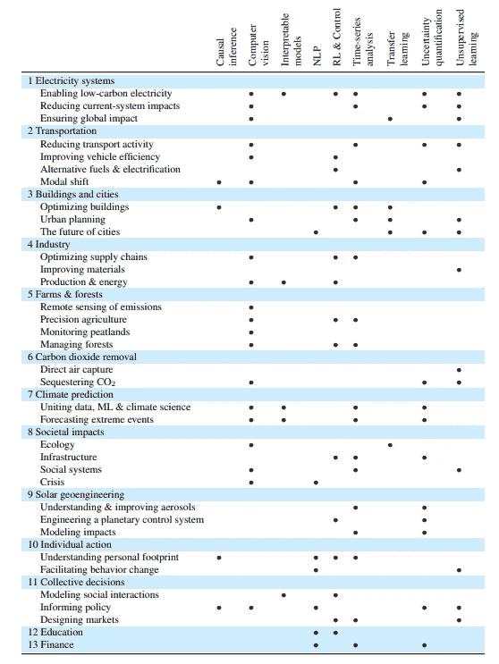

# 机器学习应对气候变化

> 原文：<https://towardsdatascience.com/machine-learning-to-tackle-climate-change-7911e004c3a2>

## 人工智能如何帮助对抗全球变暖并从人类手中拯救世界

图片由作者使用 [DALL-E 2](https://openai.com/dall-e-2/) 拍摄

去年夏天表明，变暖是一个我们不能再忽视的问题。全球气温上升正在导致越来越多的极端事件，未来可能会更糟。

机器学习和人工智能可以帮助对抗全球变暖。在本文中，我们将尝试回答这些问题:如何解决？目前人工智能已经在该领域的应用有哪些？

# **为什么现在这么急？**

图片来源:【unsplash.com】的[林丽安](https://unsplash.com/)的

六月，孟加拉国和印度遭受了有史以来最严重的洪水袭击。不到三个月后，巴基斯坦遭受洪水袭击，导致该国三分之一的土地被水淹没。与此同时，西班牙和葡萄牙今年遭遇了 1000 年来最严重的干旱。今年夏天影响欧洲大陆的持续热浪期间，法国和其他欧洲国家经历了可怕的森林火灾。在过去的十年里，加利福尼亚正在经历破坏性野火数量的增加。

图片来自[unsplash.com](https://unsplash.com/@adam_yod)YODA·亚当

总之，我们知道这些破坏性事件和气候变化之间存在联系。全球气温上升越多，预计这些事件将会更加频繁和更具破坏性。所有的气候模型都同意，如果不减少二氧化碳，我们将会看到全球气温上升和极端事件。

> “没有所有部门的立即和深入的减排，将全球变暖限制在 1.5 摄氏度是不可能的”——IPCC 新闻稿

如果这还不足以解释事情的紧迫性，那么欧盟已经发现其能源供应链是多么的脆弱，以及对俄罗斯天然气的依赖程度。因此，有人呼吁从化石燃料过渡到可再生能源。

> “我们正处于十字路口。我们现在做出的决定可以确保一个可居住的未来。我们拥有限制变暖所需的工具和技术，”—[hoe sung Lee，IPCC 新闻稿](https://www.ipcc.ch/2022/04/04/ipcc-ar6-wgiii-pressrelease/)

在这篇文章中，我将讨论机器学习和人工智能如何在能源转型和二氧化碳减排中发挥关键作用。

# **机器学习如何拯救世界？**

图片由作者使用 [DALL-E 2](https://openai.com/dall-e-2/) 制作

自 2019 年[气候变化人工智能(CCAI](https://www.climatechange.ai/about) )是一个志愿者驱动的社区(由学术界和工业界的成员组成)，其使命是催化气候变化和机器学习专业知识的交叉。

他们最近发布了一份报告，其中列出了一长串机器学习有助于应对气候变化的领域和应用。文章将可能的策略划分为:

*   **高杠杆**，非常适合 ML 工具的领域
*   **长期**，预计应用在 2040 年前不会产生主要影响的领域
*   **不确定影响**，难以解释应用策略是否会有帮助或导致不良影响的领域(由于技术不够成熟或效果不可预测)

一个表格总结显示了不同的气候变化解决方案领域，其中机器学习可能是有益的。表来自原文章:[此处](https://arxiv.org/pdf/1906.05433.pdf)

作者认为电力系统是一个高杠杆领域。事实上，他们提出机器学习可以有助于电力系统技术的运行(帮助向低碳能源过渡、能源需求优化、电网管理等等)。

有趣的是，他们标记为高杠杆，但也标记为现有植入物减少排放的不确定影响。事实上，在向可再生能源过渡的同时，我们可以优化现有的植入物(例如，使用机器学习来避免天然气管道中的甲烷泄漏)。然而，优化的化石燃料植入可能被视为“更加绿色”，并可能推迟过渡(因此，影响不确定)。

该报告对许多人工智能技术的应用细节进行了投资。虽然更容易思考如何使用强化学习和自动驾驶汽车，但它们显示出人工智能的几乎所有子领域都可能是相关的(从自然语言处理到因果推理等等)。

> “机器学习，像任何技术一样，并不总是让世界变得更好——但它可以”——气候变化人工智能[报道](https://arxiv.org/pdf/1906.05433.pdf)

# **实施 ML 减缓气候变化的真实案例**

图片由作者使用 [DALL-E 2](https://openai.com/dall-e-2/)

该报告为未来的应用和战略提供了详细的建议。好消息是，已经有公司和研究人员致力于实现这些目标。

事实上，即使风力涡轮机的成本直线下降，风也不是恒定的，它是不可预测的。为此， [DeepMind 应用了 ML 算法](https://www.deepmind.com/blog/machine-learning-can-boost-the-value-of-wind-energy)来预测风力发电。利用神经网络模型，他们优化了向电网输送所产生能量的承诺。[谷歌和 DeepMind](https://blog.google/technology/ai/machine-learning-can-boost-value-wind-energy/) 在美国中部的一个风电场测试了该模型(700 MW 植入)。

最近，谷歌决定通过谷歌云向风电场出售这项技术。谷歌宣布，这种算法可以提前三十六小时预测风力输出。6 月，Engie(一家法国公司)宣布成为该项目的第一个客户。

图片由来自 unsplash.com[的](https://unsplash.com/)卡拉什尼科夫拍摄

另一个有趣的应用是[气候追踪](https://climatetrace.org/)，这是一个利用计算机视觉追踪温室气体排放的大学联盟。他们利用卫星图像和遥感技术来识别温室气体来源，并对其进行监控以促进气候行动。此外，大量收集的数据可供社区自由用于新的潜在应用。您可以在此视频中了解更多信息:

卫星图像也被用来监测海平面上升或者预测对干旱敏感的地区，追踪森林砍伐等等。此外，Pano AI 和黄锦雯技术公司等初创公司正在实施计算机视觉，以识别火灾风险区域，检测野火，并预测如何蔓延。

由于太阳能和风能是可变的，也有其他项目对改善电池存储感兴趣。例如，卡内基梅隆大学与 Meta AI 合作，建立了[开放催化剂项目](https://opencatalystproject.org/index.html)。他们还发布了一个大型数据集[来改进 catalyst 模拟，并组织了不同的相关公开挑战。](https://github.com/Open-Catalyst-Project/ocp/blob/main/DATASET.md)

此外，农业占全球排放量的 10 %以上，化肥不仅破坏环境，还会产生强大的温室气体。这导致了一个新领域的出现:精准农业。事实上，不同的公司正在使用人工智能来优化资源消耗和肥料使用

图片由来自 unsplash.com 的罗曼·辛克维奇·🇺🇦拍摄

此外，建筑物产生的碳排放量接近总排放量的五分之一，因此对其进行优化极其重要。有些公司专注于如何改善建筑过程，有些初创公司专注于改善空调、寻找新材料等等。此外，最近 DeepMind 宣布使用人工智能将谷歌数据中心[的冷却费用减少 40%](https://www.deepmind.com/blog/deepmind-ai-reduces-google-data-centre-cooling-bill-by-40) 。

其他的应用就不那么简单了，然而，它们已经引起了几家公司的兴趣。计算一家公司的碳足迹也不容易，不同的初创公司现在都提议为大公司计算碳足迹。一旦一家公司意识到哪个流程的碳足迹更高，就可以考虑采取行动和进行优化。例如，[分水岭](https://www.bloomberg.com/news/articles/2021-02-24/how-measuring-and-reducing-emissions-has-become-its-own-business)评估其他公司的二氧化碳排放量，并提出减排方案。

> "世界上第一个万亿美元将在气候变化中产生."—[Chamath Palihapitiya](https://twitter.com/chamath/status/1318910679856807937?s=20)的预测

所有这些项目都显示了公司如何投资使用人工智能来应对气候变化。如果这对环境有好处，对商业也有好处。

# **离别的思念**

> “我们强调，在每个应用中，ML 只是解决方案的一部分；它是一个跨领域启用其他工具的工具。”—气候变化人工智能[报告](https://arxiv.org/pdf/1906.05433.pdf)
> 
> 因此，人工智能在气候变化方面没有单一的“灵丹妙药”。相反，广泛的机器学习用例可以帮助我们在世界脱碳的竞赛中获胜。”——[福布斯](https://www.forbes.com/sites/robtoews/2021/06/20/these-are-the-startups-applying-ai-to-tackle-climate-change/?sh=1540f46e7b26)

年复一年，全球变暖被证明是一个日益紧迫的问题。极端事件的频率每年都在增加，导致大范围的破坏。预言说，如果我们不采取紧急和激烈的行动，我们将面临更糟糕和更频繁的事件。

机器学习和人工智能并不是可以单独解决全球变暖的神奇药水(更何况人工智能和大数据的[使用还会产生二氧化碳](/how-ai-could-fuel-global-warming-8f6e1dda6711))。然而，ML 和 AI 被认为是对抗全球变暖的关键手段:既用于能源转换又用于减排。该报告详细说明了哪些策略和应用将从 ML 和 AI 中受益最多。

学术界一直致力于研究和提出解决方案。好消息是，今天也有几家公司正在致力于开发这些策略和新的应用程序。此外，[在能源转型](https://www.axios.com/2021/04/09/climate-spending-century-investment)(可再生能源、电动汽车等)方面的投资近年来大幅增长，并且出现了新的消费者意识和关注。另一方面，政府方面需要有全球性的更强有力的承诺。

如果你知道关于使用人工智能应对气候变化的其他倡议、其他公司和项目，请告诉我。

# 如果你觉得有趣:

你可以寻找我的其他文章，你也可以 [**订阅**](https://salvatore-raieli.medium.com/subscribe) 在我发表文章时获得通知，你也可以在**[**LinkedIn**](https://www.linkedin.com/in/salvatore-raieli/)**上连接或联系我。**感谢您的支持！**

**这是我的 GitHub 知识库的链接，我计划在这里收集代码和许多与机器学习、人工智能等相关的资源。**

** [## GitHub - SalvatoreRa/tutorial:关于机器学习、人工智能、数据科学的教程…

### 关于机器学习、人工智能、数据科学的教程，包括数学解释和可重复使用的代码(python…

github.com](https://github.com/SalvatoreRa/tutorial) 

或者随意查看我在 Medium 上的其他文章:

 [## 科学贡献如何变成一个有毒的环境

### 计算机科学是如何继承了其他学科同样的错误的

towardsdatascience.com](/how-science-contribution-has-become-a-toxic-environment-6beb382cebcd)  [## 人工智能如何加剧全球变暖

### 新的大型模型是能源密集型的。他们的训练需要多少二氧化碳？

towardsdatascience.com](/how-ai-could-fuel-global-warming-8f6e1dda6711)  [## 说生命的语言:AlphaFold2 和公司如何改变生物学

### 人工智能正在重塑生物学研究，并开辟治疗的新领域

towardsdatascience.com](/speaking-the-language-of-life-how-alphafold2-and-co-are-changing-biology-97cff7496221)  [## AI 新绽放？为什么布鲁姆模式可以改变游戏规则

### 我们现在已经习惯了大型语言模型，为什么这个如此特别呢？

pub.towardsai.net](https://pub.towardsai.net/a-new-bloom-in-ai-why-the-bloom-model-can-be-a-gamechanger-380a15b1fba7) 

**附加资源**

*   关于全球变暖:[这里](https://climate.nasa.gov/global-warming-vs-climate-change/)，[这里](https://climate.nasa.gov/)，[这里](https://www.nrdc.org/stories/global-warming-101)
*   关于二氧化碳和气候变化:[这里](https://www.climate.gov/news-features/understanding-climate/climate-change-atmospheric-carbon-dioxide)，[这里](https://news.climate.columbia.edu/2021/02/25/carbon-dioxide-cause-global-warming/)，[这里](https://climate.nasa.gov/vital-signs/carbon-dioxide/)，[这里](https://www.pnas.org/doi/10.1073/pnas.0812721106)
*   关于可再生能源投资和能源转型:[此处](https://eciu.net/analysis/reports/2021/taking-stock-assessment-net-zero-targets)，[此处](https://www.cnbc.com/2020/12/16/blackrock-makes-climate-change-central-to-investment-strategy-for-2021.html)
*   关于谷歌数据中心 DeepMind AI 解决方案:[此处](https://www.google.com/about/datacenters/efficiency/#servers)，[此处](https://blog.google/outreach-initiatives/environment/powering-internet-renewable-energy/)，[此处](https://blog.google/outreach-initiatives/environment/data-centers-get-fit-on-efficiency/)
*   关于风能预测的 DeepMind AI 解决方案:[此处](https://about.google/intl/en-GB/stories/renewable-energy-is-boosting-economies/)**