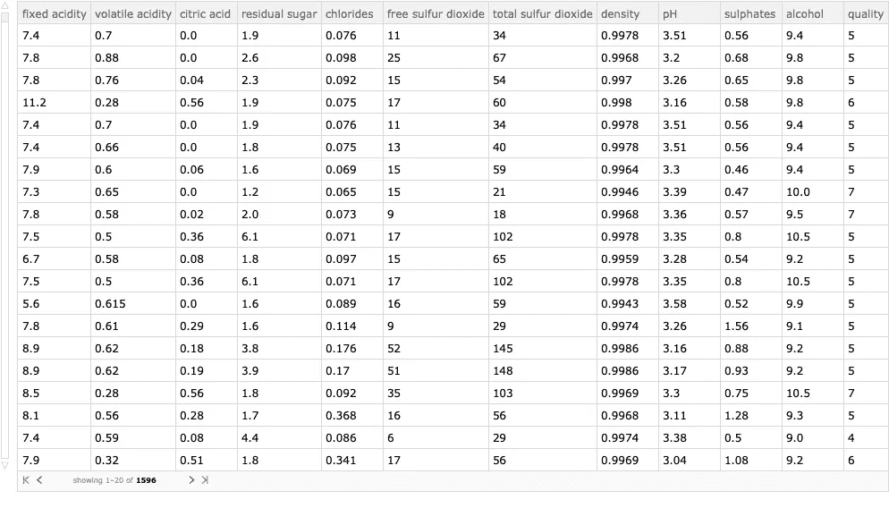
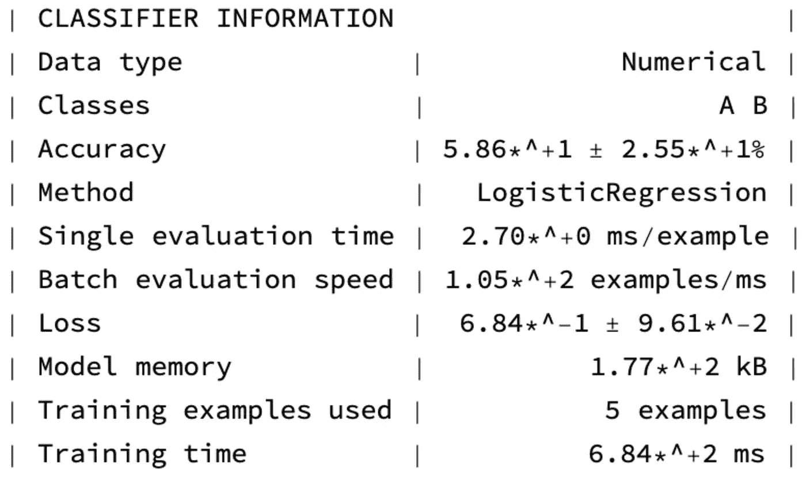
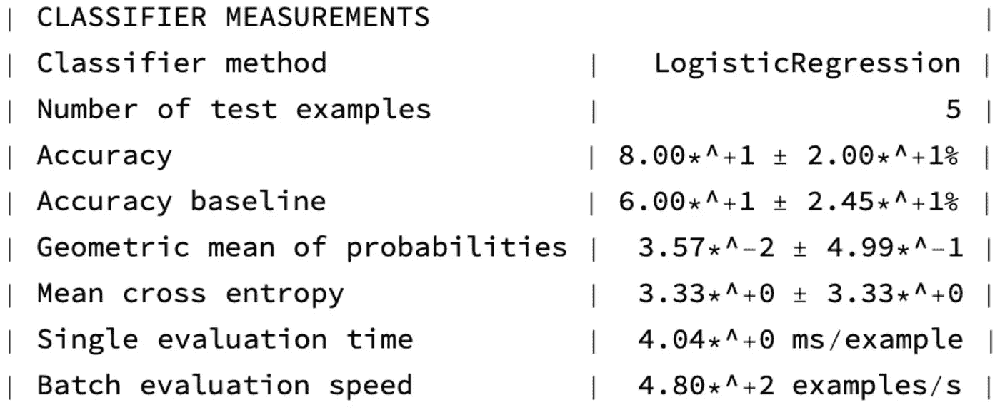
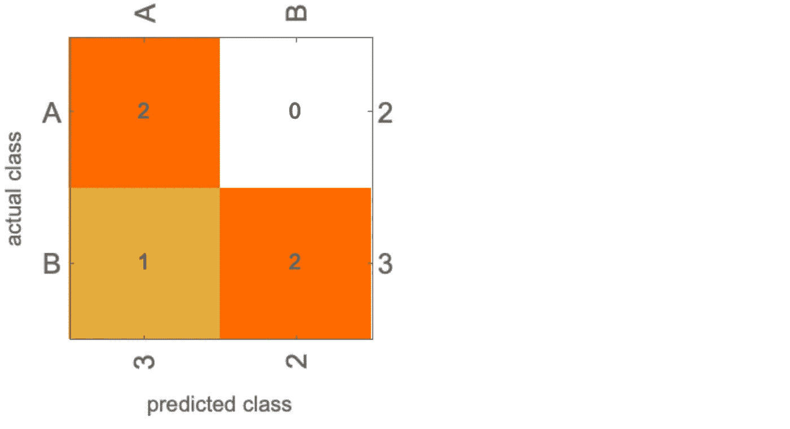

# 用 Mathematica 进行机器学习

> 原文：<https://towardsdatascience.com/machine-learning-with-mathematica-4c0da30b3073>

## 主要概念的介绍


法比安·伯奇利在 [Unsplash](https://unsplash.com/?utm_source=unsplash&utm_medium=referral&utm_content=creditCopyText) 上的照片

Wolfram Mathematica(或简称 Mathematica)是科学计算和多任务处理的最佳软件之一。有了 Mathematica，人们基本上可以执行所有的科学计算，包括机器学习(ML)。

Mathematica 最强的一点是符号计算，在这方面，没有软件可以与 Mathematica 竞争。另一方面，关于 ML 领域，有几种软件可以执行出色的计算，如 Python、R、Java、Matlab 和 Maple。

Mathematica 的早期版本有效执行 ML 的能力非常有限，但是随着时间的推移，它已经集成了许多不同的 ML 功能，这些功能易于使用短代码行。最后两个版本，即 Mathematica 12 和 13 有许多内置的 ML 函数，可以执行几乎所有需要的 ML 计算。

在本文中，我想展示如何使用 Mathematica 执行 ML，并了解它的主要优点和缺点。我假设读者至少知道如何使用 Mathematica，如果你不知道如何使用它，我建议学习它，因为在我看来，由于许多内置的函数和方法，它非常容易学习。在我的脚本中，我将使用 *Mathematica 13* 。

# 回归

要使用 Mathematica 执行 ML，首先需要一个数据集，使用 Mathematica 可以创建或导入它，或者加载任何现有的默认数据集。

Mathematica 有许多著名的默认数据集，用于许多经典的 ML 示例中。其中之一就是 **W *不等式*** dataset[1，2]。这个数据集是众所周知的，人们可以在 ICS ML 数据集上找到它，并直接[下载](https://archive.ics.uci.edu/ml/datasets/wine+quality)为 CSV 文件。

第一件事是以包含行和列的表格的形式查看数据集。这将允许我们看到什么是特性和它们的价值。一旦在计算机上下载了 CSV 文件，就可以运行下面的 Mathematica 代码:

```
**Code 1:****[In]**: PATH = "path of your CSV file on your computer"
**[In]**: dataset = **SemanticImport**[PATH]
**[Out]**:
```



图一。对于红酒类型，输出包含 1596 条记录的数据库表。

**代码 1** 中的第一个输入命令是您计算机上的 CSV 文件路径。第二个输入命令是使用 **SemanticImport[]** 函数将 CVS 文件转换成 Mathematica 数据集，并以行列表格的形式显示数据集。每列的功能名称也清晰可见。

Mathematica 的一个重要特性是，在大多数情况下，不需要像 R 和 Python 那样导入任何模块或库。Mathematica 有许多内置函数，你只需要知道它们是做什么的，然后直接调用它们。

**葡萄酒质量**数据集包括不同葡萄酒的几种化学特性，如 PH 值、酒精含量、葡萄酒质量等。对于这种类型的数据集，人们常常试图使用回归或分类来从其他特征中预测葡萄酒的质量。在这种情况下，可以将葡萄酒质量视为输出(目标)变量( *y* =葡萄酒质量)，特征矩阵 *X* 由剩余的特征组成。葡萄酒质量通常在区间[1，10]内评分，其中 10 是一个葡萄酒品牌的最大质量值。

Mathematica 对于 ML 最重要的功能之一是**预测[…]** 功能。该函数可用于不同的数据类型，如数字、分类、文本、图像、声音等。正如这个函数的名字所说，Predict[…]的目标是在给定一组不同数据的情况下，用 ML 进行预测。Mathematica 在输入数据类型和预测方法方面非常灵活。详情可以在 Mathematica [网页](https://reference.wolfram.com/language/ref/Predict.html?q=Predict)上找到。

Mathematica **Predict[…]** 功能灵活性的重要方面是不同的*选项*，用户可以从中受益。这些选项包括:

1.  ***法*** 。此选项指定要使用的回归算法。可能的回归算法有线性回归、决策树、随机森林、最近邻等。
2.  ***绩效目标*** *。*该选项允许用户使用不同类型的 ML 性能，如算法计算的“质量”和“速度”。“质量”优化最终结果的质量，而“速度”优化获得最终结果的速度。
3.  ***ValidationSet。*** 该选项允许用户在训练过程中选择验证数据集。可以直接指定验证集或使用自动默认选项。
4.  **。*该选项设置计算期间内部使用的随机伪生成器的种子。*

*现在是时候给出一个具体的例子，说明回归实际上是如何与 Mathematica 一起工作的。作为数据集，我使用白葡萄酒类型的葡萄酒质量数据集。这个数据集实际上默认包含在 [**ExampleData[…]** 函数](https://reference.wolfram.com/language/ref/ExampleData.html?q=ExampleData)中。为了提取数据集，我运行以下代码:*

```
***Code 2:****[In]**: trainset = ExampleData[{"MachineLearning", "WineQuality"}, "Data"];* 
```

*代码 2 默认提取*白葡萄酒*数据集，并且不显示输出，因为我在它的末尾添加了分号。在代码 2 中，“trainset”只是一个 Mathematica 变量。ExampleData 函数的一般语法是 **ExampleData[" *type* "，" *name* "}，" Properties"]，**其中" *type* "指定特定类别的默认数据集类型， *name* 是从" *type* "类别中选择的数据集名称。*

*另一方面，“属性”是一个给出所选数据集属性的选项。例如，以下代码给出了白葡萄酒数据集的一些属性:*

```
***Code 3:****[In]**: ExampleData[{"MachineLearning", "WineQuality"}, "Properties"]**[Out]**:{Data, Description, Data, Dimensions, LearningTask, LongDescription, MissingData, Name, Source, TestData, TrainingData, VariableDescriptions, VariableTypes}**[In]**: ExampleData[{"MachineLearning", "WineQuality"}, "Dimensions"]**[Out]**: <|NumberFeatures -> 11, NumberExamples -> 4898|>**[In]:** ExampleData[{"MachineLearning", "WineQuality"}, "VariableDescriptions"]
**[Out]:** {fixed acidity, volatile acidity, citric acid, residual sugar, chlorides, free sulfur dioxide,
total sulfur dioxide, density, pH, sulphates, alcohol} → wine quality (score between 1-10)*
```

*在代码 3 中，在第一部分可以看到 **WineQuality** 数据集的一些属性，如 TrainingData、TestData 等。在第二部分，我们可以看到数据集的“维度”,它有 11 个特征和 4898 个例子。在第三部分中，可以看到变量描述选项，而输出显示数据集的特征名称和目标变量(葡萄酒质量)。*

*现在让我更详细地介绍一下白葡萄酒数据集的回归问题，并做一些真正的预测。我运行以下代码:*

```
***Code 4:****[In]:** trainset = ExampleData[{"MachineLearning", "WineQuality"}, "TrainingData"];
**[In]:** predictor = Predict[trainset, Method -> "LinearRegression", PerformanceGoal -> "Quality"]
**[Out]:***
```

**

*在代码 4 中，第一个输入从 ML 类别的数据集提取 WineQuality 数据集,“TrainingData”属性自动选择 WineQuality 数据集的一部分作为训练数据。在我定义了一个新的变量 predictor 之后，这个变量在训练过程中被赋予了学习到的函数。对于这个特殊的例子，我选择了方法选项“线性回归”。人们也可以自由选择其他方法。另一个选项是我上面描述的“绩效目标”。最后，作为输出，Mathematica 给出了“预测函数[…]”，这是在训练集中学习到的函数。*

*要获得关于学习的预测函数的更多信息，需要运行以下代码:*

```
***Code 5:****[In]**: Information[predictor]
**[Out]:***
```

**

*既然我已经展示了如何使用 Mathematica 进行培训，那么让我向您展示如何在验证数据集上评估我们的模型的性能。在这种情况下，需要运行以下代码:*

```
***Code 6:****[In]:** validationset = ExampleData[{"MachineLearning", "WineQuality"}, "TestData"];
**[In]:** PredictorMeasurements[predictor, validationset, {"StandardDeviation", "RSquared"}]**[Out]:** {0.726808, 0.177385}*
```

*现在让我解释一下代码 6 中的步骤。第一个输入从 MachineLearning Mathematica 存储库中提取 WineQuality 数据集，它自动为验证集(或测试集)选择一部分数据。第二个输入使用 PredictorMeasurements 函数来估计验证集残差的标准偏差。它使用在代码 4 中通过选项“标准偏差”和“RSquared”在验证数据集上学习的预测函数作为参数。Mathematica 的前一个选项对应于残差的 RMS。作为最终输出，残差的 RMS 约为 0.73，而确定系数为 *R = 0.17。**

*此外，Mathematica 使得绘制与训练和测试性能相关的结果变得非常容易。例如，如果要创建残差图，运行以下代码就足够了:*

```
***Code 7:****[In]:** PredictorMeasurements[predictor, validationset, "ResidualPlot"]
**[Out]:*** 
```

**

*图二。用代码 7 获得的残差图。*

# *分类*

*现在我向你展示如何使用 Mathematica 解决分类问题。类似于回归问题的预测[…]函数，分类问题的相应函数是**分类[…]。** It 可用于多种类型的数据，包括数字、文本、声音和图像，以及这些数据的组合。*

***分类[…]** 与上述预测[…]功能共享多个选项和方法。要看 Classify[…]是如何工作的，最好举一个具体的例子。假设我们有以下特征{1，2，3.5，4，5}和以下对应的类{“A”，“A”，“A”，“B”，“B”}。现在我用下面的代码训练分类器:*

```
***Code 8:****[In]:** class = Classify[{1, 2, 3.5, 4, 5} -> {"A", "A", "A", "B", "B"}, Method -> "LogisticRegression"]
**[Out]:***
```

**

*在代码 8 中，我使用 Classify[...]来训练具有上述特征和类的模型，结果是 classifier function[...]，这是在训练步骤中学习的分类函数。我用“逻辑回归”作为训练方法。类是代码 8 中的一个变量。*

*要获得有关训练步骤的更多信息，只需运行以下代码:*

```
***Code 9:****[In]:** Information[class]
**[Out]:***
```

**

*为了在一个验证数据集{ 1.4-->“A”，5.3-->“B”，1.2-->“B”，4.6-->“B”，-3-->“A”}上用 Mathematica 符号测试已学习的分类函数，我运行以下代码:*

```
***Code 10:****[In]:** validationset = {1.4 -> “A”, 5.3 -> “B”, 1.2 -> “B”, 4.6 -> “B”, -3 -> “A”}
**[In]:** CM = ClassifierMeasurements[class, validationset]
**[Out]:***
```

**

*从代码 10 的输出可以看出，应用于验证数据集的分类器给出了 0.8 的准确度，这是非常好的。输出还提供了额外的测量信息。*

*如果想了解模型性能的更多信息，可以运行下面的代码并获得混淆矩阵:*

```
***Code 11:****[In]:** CM["ConfusionMatrixPlot"]
**[Out]:***
```

**

*图 3。分类混淆矩阵。*

# ***结论***

*在本文中，我向您展示了如何使用 Mathematica 来执行 ML。尽管我展示了如何使用 Mathematica 进行回归和分类，但它也可以用于与深度学习和神经网络相关的其他目的。*

*在我看来，使 Mathematica 成为 ML 最佳软件之一的一个关键特性是它的简洁和最少的代码编写。的确，你可以看到在 Mathematica 中，大多数情况下不需要导入任何库。这是因为 Mathematica 有许多内置函数，简化了用户与软件的交互，减少了代码编写的时间。*

*Mathematica 的另一个重要方面是，很容易用很少的线条绘制 EDA 并构建流程管道。我在这篇文章中没有展示这一点，你可以通过 Mathematica 实验来验证这一点。*

## *参考资料:*

*[1] P .科尔特斯、a .塞尔代拉、f .阿尔梅达、t .马托斯和 j .赖斯。通过从理化特性中进行数据挖掘来建立葡萄酒偏好模型。在决策支持系统中，爱思唯尔，47(4):547–553，2009。*

*[2]Dua d .和 Graff c .(2019 年)。UCI 机器学习知识库[http://archive . ics . UCI . edu/ml]。加州欧文:加州大学信息与计算机科学学院。*

## *如果你喜欢我的文章，请与你可能对这个话题感兴趣的朋友分享，并在你的研究中引用/参考我的文章。不要忘记订阅将来会发布的其他相关主题。*