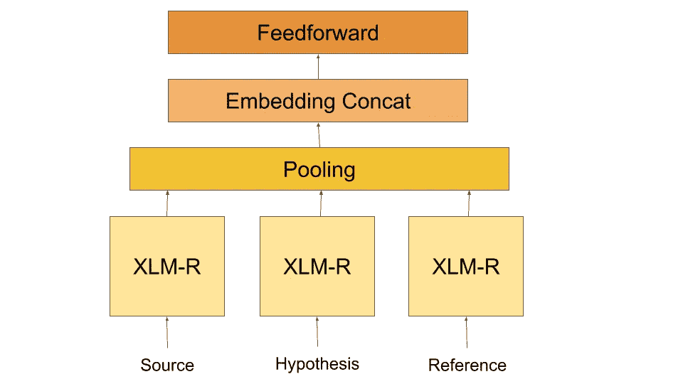

# 使用 Cometinho 进行机器翻译评估

> 原文：<https://towardsdatascience.com/machine-translation-evaluation-with-cometinho-c89880731409>

## 着眼于性能，减少模型大小、节省计算时间和金钱的实用建议

什洛莫·沙莱夫在 [Unsplash](https://unsplash.com?utm_source=medium&utm_medium=referral) 上拍摄的照片

欧洲机器翻译协会(EAMT)会议是机器翻译研究人员、用户和翻译人员聚集在一起讨论行业最新进展的场所。去那里看看欧洲大陆在机器翻译开发和采用方面的进展真的很有意思。在这篇文章中，我想分享今年最佳论文奖的一些想法。它的标题是“搜索 COMETINHO:可能的小度量”，来自葡萄牙里斯本 Unbabel 公司的研究实验室，该公司提供使用机器翻译和人工翻译的翻译服务。你可以在 ACL 选集里找到这篇论文的在线版本。

本文的目的是展示如何在实际场景中使用文献中的几种技术来加速大型模型的执行并节省计算量，同时降低翻译质量的损失。这篇文章的重点是简化机器翻译(MT)自动评估的模型 Comet，但是其中描述的许多点都很通用，足以让任何处理大型和缓慢模型的人感兴趣，因为金钱或时间的原因需要节省计算。

# 彗星是什么？

最初在这篇[论文](https://aclanthology.org/2020.emnlp-main.213/)中描述的 Comet 是基于 [XML-R](https://ai.facebook.com/blog/-xlm-r-state-of-the-art-cross-lingual-understanding-through-self-supervision/) 的机器翻译评估模型。大型语言模型用于分别对源、假设和参考句子进行编码，以便将它们中的每一个简化为单个向量。然后，这些向量被组合以在输出中产生代表假设质量分数的单个实数。

彗星拓扑，有一种比萨斜塔的感觉。图片作者。

 [## XLM:跨语言语言模型

### 了解基于变压器的自监督架构

towardsdatascience.com](/xlm-cross-lingual-language-model-33c1fd1adf82) 

在 WMT 的 [metrics 共享任务](https://www.statmt.org/wmt21/pdf/2021.wmt-1.73.pdf)中，Comet 因与人类判断的相关性而排名靠前。然而，它是一个具有 500M 参数的相当大的模型，并且运行缓慢。当我们需要经常运行它时，这尤其是一个问题，例如以最小的风险[解码](https://aclanthology.org/N04-1022.pdf)或[训练](https://aclanthology.org/P16-1159/)。

# 代码加速

Cometinho 论文中获得的第一对加速是关于纯代码修改的。它们是，长度排序和缓存。

深度学习模型以小批量运行，以更好地利用 GPU 并行化能力。对于文本和其他可变长度的输入，小批量将具有其中最长序列的长度。其他序列用零填充，为填充位置执行的所有计算基本上都被浪费了。一种有效且众所周知的减少计算量的方法是在开始解码过程之前，根据句子的长度对句子进行排序。长度排序总是能提高速度，而且实现起来又快又容易。因此，当以批处理模式执行推理时，应该**总是**使用，并且所有最著名的深度学习工具都实现了它。

Comet 编码其三元组的方式使缓存成为可能:源、假设和引用被编码成三个独立的向量。这样，就有可能存储代表一个句子的向量，并在它再次出现时检索它。你是问多久发生一次吗？假设您正在使用 Comet 来比较两个不同的 MT 模型。两个模型通过完全相同的测试集运行，因此所有的源句子和参考句子至少出现**两次。**另一个例子是，当 Comet 用于最小贝叶斯风险解码时，为相同的源句子计算许多假设，并且再次节省了大量资源。这个想法是，如果你要为一个速度很重要的任务设计一个深度学习模型，在可能的情况下，尝试以一种可以利用缓存来节省重要资源的方式来设计它。

长度排序和缓存的结合在对一个系统评分时带来了高达 39%的速度提升，在对 8 个系统评分时带来了高达 65%的速度提升，因此缓存更加有效。

# 层修剪

接下来是实际缩小模型的部分，本文用两种方法进行了实验。第一种是从模型中物理移除整个层，第二种是减少一些子层的大小。

在第一种情况下，一个层被认为是一个完整的变换器层，包括自关注、前馈、剩余连接和层归一化。

在本文的情况下，很容易从编码器模型的顶部删除层，因为池层不直接使用最后一个编码器层的输出。相反，他们使用相同的方法来生成带有 [Elmo](https://arxiv.org/abs/1802.05365) 的嵌入向量，并对各层的输出进行加权平均。权重都是正的，并归一化为 1.0，在训练期间学习，之后保持不变。对权重的快速分析表明，最顶层的权重最低，因此这些层的贡献最少*。然后作者决定只移除它们，这在推断过程中不会造成伤害，因为编码器输出总是许多层之间的平均值。结果显示，删除最上面的 4 层时，性能**略有提高**，删除 5 层时，性能没有下降。考虑到该模型由 25 层组成，这是 20%的免费参数缩减(排除仍然代表参数计数的大部分但不影响推断那么多的嵌入权重)。

第二种方法是从每个自我关注层中去掉两个头(总共 16 个头)。此外，它们还将前馈大小从 4096 减小到 3072(原始大小的 75%)。由此产生的模型称为 Prune-Comet，其结果与 Comet 相当，但推理时间加快了 37%。

使用 [TextPruner](https://textpruner.readthedocs.io/en/ latest) 执行修剪，这是一个开源工具，为许多预训练的变压器实现层修剪。如果这是你的任务，就查一下。

 [## 神经网络修剪 101

### 你需要知道的是不要迷路

towardsdatascience.com](/neural-network-pruning-101-af816aaea61) 

*权重成比例地降低向量的大小，但这只是故事的一部分。Kobayashi 和他的同事的这篇论文表明，矢量的原始大小也必须被考虑。这也很直观，因为外部权重也可以重新平衡不平衡的向量。

# 知识蒸馏

虽然层修剪有助于以较小的退化减少参数计数，但是模型仍然太大而不能有效地使用。事实上，它的大尺寸极大地影响了计算能力和时间，特别是对于需要重复 MT 评估计算的应用，例如最小贝叶斯风险解码。为了实现显著的参数缩减，需要[知识提炼](https://arxiv.org/abs/1503.02531)。

 [## 知识蒸馏:简体

### 窥探师生网络的世界

towardsdatascience.com](/knowledge-distillation-simplified-dd4973dbc764) 

通过知识提炼，使用原始模型的输出作为学习目标来训练一个新的更小的模型。对于这个特定的任务，作者使用 OPUS 语料库的 15 个语言对，用两个不同质量的机器翻译模型翻译其 2500 万个句子对，并使用 5 个 Comet 模型的集合来评估翻译。由于这些是没有经过人工评估的机器翻译训练数据，所以没有用来训练 Comet。

学生模型保持了与教师模型相同的深度学习架构，但它要小得多:12 层，12 个注意头，前馈大小为 1576，嵌入向量大小为 384。它的参数计数是 119M 参数，而不是原来的 582M。

最终结果显示，模型大小减少约 80%，质量下降 10%，速度提高 53%。确实需要新的训练，但是在实际的应用场景中，训练只做一次，而推理要做上千次甚至更多。

# 结论

Cometinho 的论文具有实际意义，因为它展示了如何应用模型简化技术，这些技术可以很容易地转移到不同的应用领域。

你应该带什么回家？首先，有许多方法可以在性能损失很小甚至没有损失的情况下节省计算，并且它们可以在不同的域之间重用。尽可能使用它们。

第二，从某种意义上来说，模型应该被设计成可缩减的。在本文的示例中，Elmo 类层平均值允许层修剪。

第三，顺便说一下，如果他们也显示从零开始训练基线模型到缩小尺寸的结果，而不是使用这里提出的技术，这篇论文会更完整。证明减少现有模型比训练更小的模型更好总是更好的。

如果你对这个话题感兴趣，你的下一步可以是研究量化作为进一步的技术，以减少模型的大小和提高推理时间。

 [## 挑选你的深度学习工具

### 为什么您的工具可以依赖于您组织的团队结构

towardsdatascience.com](/pick-your-deep-learning-tool-d01fcfb86845)  [## 双语机器翻译的大量预训练

### 通过 mBART，一个编码器-解码器语言模型，打开了多语言有趣的视角的导游…

towardsdatascience.com](/massive-pretraining-for-bilingual-machine-translation-3e26bfd85432)  [## 向 Argparse | Python 模式动态添加参数

### 如何使用 argparse.ArgumentParser 根据用户输入指定不同的参数。

towardsdatascience.com](/dynamically-add-arguments-to-argparse-python-patterns-a439121abc39)