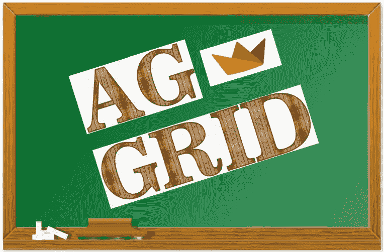
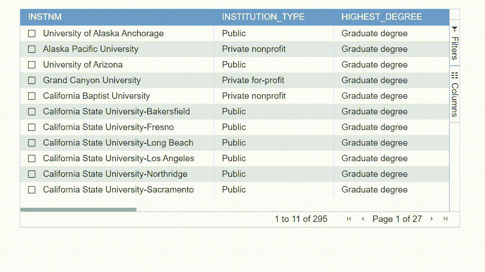
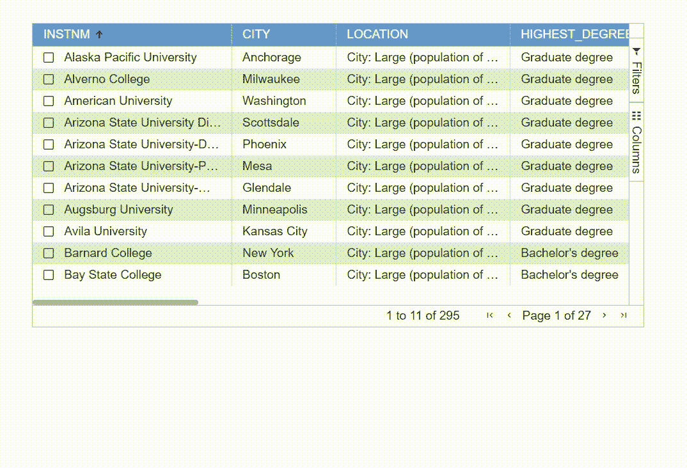

# 在 Streamlit 中使数据框架具有交互性

> 原文：<https://towardsdatascience.com/make-dataframes-interactive-in-streamlit-c3d0c4f84ccb>

## 如何使用 Streamlit-Aggrid 在 Streamlit 中显示漂亮的交互式表格



图片由 [Pixabay](https://pixabay.com/illustrations/alphabet-letter-initial-background-2051722/) 提供(作者修改)

使用 Streamlit 构建数据应用程序时，有时您可能需要在应用程序中将数据框显示为表格。Streamlit 自带数据显示元素，可以使用`st.write()`、`st.dataframe()`或`st.table()`方便地显示表格数据。

这些方法的一个缺点是应用程序中显示的表格看起来简单而静态。您可以上下或左右滚动来查看数据，甚至可以使用`pandas.Styler`和`st.dataframe()`来在某种程度上改变呈现的数据帧的样式，但就样式化表格并使其具有交互性而言，您能做的也就这么多了。


使用 st.write()显示的数据帧(图片由作者提供)

在这篇文章中，我想和你分享一个很棒的 Streamlit 定制组件`streamlit-aggrid`，它是建立在 [AG 网格](https://www.ag-grid.com/javascript-data-grid/) ( *不可知网格*)之上的。您可以使用`streamlit-aggrid`在 Streamlit 中将 pandas 数据帧显示为可编辑的交互式表格。您可以像在 Excel 中一样编辑、排序和过滤表格。您还可以选择或多选数据框中的行，并将所选数据传递给应用程序中的另一个组件，例如，图表、地图、另一个表格等。

`streamlit-aggrid`有许多奇妙的特性，可以在数据帧上执行各种各样的交互活动。在这篇文章中，我将主要关注以下功能:

*   给你的桌子添加一个“主题”
*   给表格添加分页
*   对表格中的行进行排序、过滤和选择/多选
*   将所选数据传递给应用程序中的另一个组件

下面是使用`streamlit-aggrid`创建的交互式表格的快速演示。不再拖延，让我们看看它是如何工作的！

作者的 YouTube 视频

在使用`streamlit-aggrid`创建交互式表格之前，让我们安装`streamlit-aggrid`并将我们的样本数据集导入到 pandas 数据框架中。样本数据集是从美国教育部的[大学记分卡](https://data.ed.gov/dataset/college-scorecard-all-data-files/resources)公开数据(许可:[知识共享署名](http://www.opendefinition.org/licenses/cc-by))中创建的。

```
pip install streamlit-aggrid
```


作者图片

现在我们已经准备好了样本数据框架，让我们首先使用`streamlit-aggrid`创建一个基本的交互式表格。只需一行代码，您的表就已经比前面显示的普通 dataframe 好看多了！

```
AgGrid(df)
```


作者图片

接下来，让我们使用以下代码向该表添加更多的交互式功能:

第 1–5 行:我们配置了各种`gridOptions`特性，包括分页、侧栏和行选择。

第 7–18 行:我们通过将数据帧名称、`gridOptions`、`theme`和其他参数传递给`AgGrid()`来构建网格。第 10–11 行允许基于行选择更新网格数据，并将其发送回 streamlit。

第 20–22 行:如果从网格中选择了任何行，那么所选的数据将被传递到一个中间数据帧中，并且可以被其他组件重用。

下面的屏幕记录显示了与表交互的各种方式，例如排序、过滤、分页、选择行以及将选择的数据传递到中间数据帧。



作者 GIF

最后，我们可以通过将选择的数据传递到一个叶子地图来使这个练习更有趣。对于任何选定的大学，我们可以立即在地图上显示它们的位置，并在工具提示中显示一些关于这些机构的附加信息。这里你需要做的只是使用中间数据帧(df)作为你的叶子图的输入。



作者 GIF

我已经写了两篇详细的文章，关于如何创建一个带有自定义标记和工具提示的叶子地图，就像上面显示的那样，所以我不会在这篇文章中花时间解释这部分是如何完成的。你可以阅读我的文章[在这里](/folium-map-how-to-create-a-table-style-pop-up-with-html-code-76903706b88a)了解更多关于叶地图。

</folium-map-how-to-create-a-table-style-pop-up-with-html-code-76903706b88a>  </use-html-in-folium-maps-a-comprehensive-guide-for-data-scientists-3af10baf9190>  

正如我前面提到的，`streamlit-aggrid`有更多的特性可以探索。例如，您可以使单元格可编辑，根据最大/最小值突出显示单元格，使列可分组，等等。你可以查看 streamlit-aggrid 的 [GitHub](https://github.com/PablocFonseca/streamlit-aggrid) 页面来获得更多的例子。

请注意，AG-Grid Enterprise 是由 AG-Grid 技术人员提供支持的商业产品，由 [EULA](https://www.ag-grid.com/eula/AG-Grid-Enterprise-License-Latest.html) 经销。如果要使用企业功能，您需要从 Ag-Grid 购买许可证。价格信息可以在这里找到:[https://www.ag-grid.com/license-pricing.php](https://www.ag-grid.com/license-pricing.php)

感谢阅读，我希望你喜欢这篇文章。

# 参考资料和数据来源:

## 参考:

Github 中的 Streamlit-Aggrid 文档页面:[https://github.com/PablocFonseca/streamlit-aggrid](https://github.com/PablocFonseca/streamlit-aggrid)

## 数据源:

美国教育部大学记分卡开放数据平台([https://data . ed . gov/dataset/College-score card-all-data-files/resources](https://data.ed.gov/dataset/college-scorecard-all-data-files/resources))。

许可:[知识共享署名](http://www.opendefinition.org/licenses/cc-by)。本作品根据知识共享署名许可协议进行许可。

访问级别:公共

访问网址:[https://ed-public-download . app . cloud . gov/downloads/colleges corecard _ Raw _ Data _ 02072022 . zip](https://ed-public-download.app.cloud.gov/downloads/CollegeScorecard_Raw_Data_02072022.zip)

你可以通过这个[推荐链接](https://medium.com/@insightsbees/membership)注册 Medium 会员(每月 5 美元)来获得我的作品和 Medium 的其他内容。通过这个链接注册，我将收到你的一部分会员费，不需要你额外付费。谢谢大家！