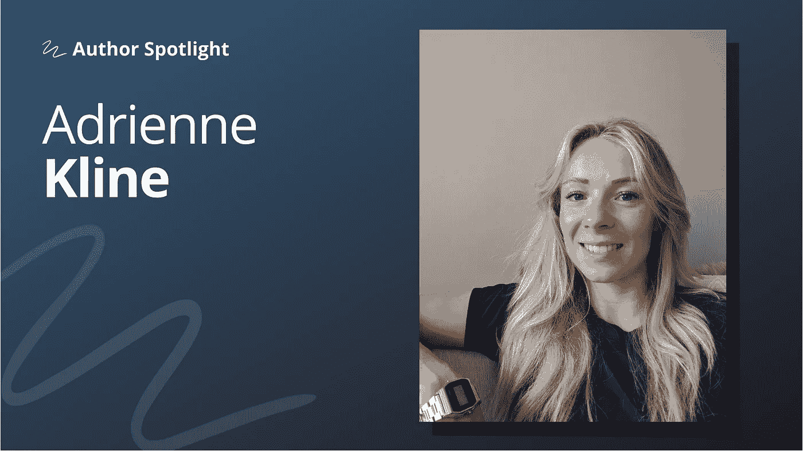

# 产生影响有时意味着为了广度而牺牲深度

> 原文：<https://towardsdatascience.com/making-an-impact-sometimes-means-sacrificing-depth-for-breadth-26869f26efec>

## [作者聚焦](https://towardsdatascience.com/tagged/author-spotlights)

## 阿德里安娜·克莱恩思考了一个跨越医学、机器学习和工程的多学科职业生涯

*在 Author Spotlight 系列中，TDS 编辑与我们社区的成员谈论他们在数据科学领域的职业道路、他们的写作以及他们的灵感来源。今天，我们很高兴与* [*艾德丽安·克莱恩*](https://medium.com/u/7cd59d41e4d7?source=post_page-----26869f26efec--------------------------------) *分享我们的对话。*

照片由阿德里安娜·克莱恩提供

*Adrienne Kline 是西北大学预防医学系的博士后研究员。她完成了生物医学工程博士学位(机器学习中的成像专业)，医学博士学位，之前获得了电气工程学士学位。*

*她的兴趣在于医学和工程的交叉，特别是利用算法决策支持医学转化应用。她的工作导致了处理缺失数据的新方法、评估机器学习预测可靠性的创新指标以及多模态数据流的信息融合的发展。通过强调结构数据、计算机视觉、强化学习和生成算法，她希望改变医学实践的效率和可靠性。*

## 最近你最感兴趣的话题和项目是什么？

我的工作总是由新颖的应用和方法组成。应用程序，因为我经常想利用现有的工具来完成任务；但是当我想要的工具不存在的时候，我就努力去创造它。目前，我正在研究新的插补和机器学习能力工具，这两者都是方法和数学密集型的。

我在心脏病学领域从事的另外两个项目是生成模型和强化学习。这些都是以应用为基础的，用于提高心力衰竭患者决策的可靠性。此外，当我看到需要的问题时，我会寻找结合硬件和软件的新颖项目。我总是回归理论，解决一个有意义的问题。

## 作为一个拥有工程、机器学习和医学等多学科背景的人，你是如何决定走哪条职业道路的？

我的机器学习生涯始于我工程本科学位的后期。我的顶点项目是关于脑机接口(BCIs)——利用脑电图(EEG)进行信号/图像处理以控制机器人手。

本科毕业后，我同时被博士和医学博士项目录取，并选择在完成研究生学业的同时推迟医学院的学习。在博士期间，我继续将机器学习应用到我为脊髓损伤患者设计的 BCI 机器人中，这些机器人使用了 fMRI(功能性磁共振成像)和 EEG。

当我带着工程学的视角进入医学院时，我开始体会到医学决策的细微差别和困难。医学是一个要求很高的职业，但当我学会如何像临床医生一样思考时，我开始注意到我希望在当前范式上改进的许多方式。尽管对我焦虑的同学来说很前卫，我还是参加了一场住院医师比赛，因为我认为自己是两个世界之间的桥梁，而不是执业医师。

我喜欢照顾病人，但我的理想角色，发挥我的嵌合体优势，成为一个我可以为我从未谋面的病人提供照顾的角色，为了广度牺牲深度。我总是说我不是在找工作，我是在找一个角色——一个我可以“坐在板凳上”工作，管理一支工程师和科学家团队，与我们的临床医生合作伙伴合作，并且可信地说两种语言的角色。

最终，我希望开发和转化技术(算法、设备、信息)，以提高可靠性、降低成本并提高患者护理的效率。

## 今天的数据从业者有很多职业选择。你会建议他们在开始旅程时问自己什么样的问题？

在这个蓬勃发展和令人兴奋的领域有大量的机会。

我认为人们很容易被过度使用的“人工智能”一词所迷惑归根结底，职业决策是基于个人价值的判断。如果你的动机是薪水，那么你在工业界会更好。如果你想按照自己的节奏前进，也许学术界或创业公司适合你。

也就是说，这曾经是学术界与工业界的较量，但许多公司都有强大、纯粹的 R&D 部门发布白皮书，许多学术界人士在实验室里为他们的研究和出生公司申请专利。因此，在做任何决定时，就像任何好的算法一样，找到对你来说最重要的方面(薪水、向上的流动性、自主性、地域流动性等等。)作为决策的基础。然后根据你的每一个预期选项满足这些内在愿望的程度，对它们进行评分(如果你愿意，也可以对它们进行不同的加权);这就是我如何做出生活和职业决定的。

无论在哪个领域，适应性和灵活性对于保持现状都是绝对必要的，为了发展技能，人们需要在工作中有发展空间。因此，如果你更看重行业，要谨慎行事，确保工作描述中包含一些发展空间；它往往被自动构建到学术学习中心。

不管职业阶段如何，我鼓励人们永远不要放弃数学、统计学、计算机科学和工程学的基础知识。这些基本原则是创新赖以建立的关键。每天都有新的架构和算法出现，如果你只关注树叶，你就会看不到树。总是问自己“那又怎样？”给你的工作打基础，并提醒你回答大问题。

## 你为什么决定为更广泛的受众撰写关于数据和机器学习的文章？

我关于 TDS 的第一篇文章是关于我创建的一个 [Python 包——*pspy*](/psmpy-propensity-score-matching-in-python-a3e0cd4d2631)。现在有一个正式的白皮书，我已经在媒体文章中引用过了。白皮书的提交发生在 2022 年初，直到 7 月份才在 IEEE 会议上提交。但是因为这篇论文需要一个工作包，我觉得它提供了一个独特的机会，让数据科学和统计社区意识到它的存在，而不是通过一个隐藏在看不见的存储库中的自述文件。

奇怪的是，它成了一篇受欢迎的文章，所以我开始写其他文章，灵感来自我们的研究生在实验室问我的问题。我一直喜欢教学，并且非常重视指导。通过创建这些文章的存储库，我有了可供学生参考的资源。这些文章既是教学的资源，也减少了我被问到的问题中的一些重复。

## 最近几个月，你已经出版了优秀的[统计训练营系列](https://towardsdatascience.com/tagged/statistics-bootcamp)。是什么激发了这个想法，你希望你的读者从中学到什么？

我有幸教过本科生和研究生。教学一直是一种有益的经历，我的学生一直是我的灵感来源。训练营建立在我以前教过的统计学研究生入门课程的基础上。

我对训练营的希望是，它可以成为那些上过研究生院的人(可能想更新一下)和那些想从研究生水平的统计学课程中获得知识但没有机会这样做的人容易获得和负担得起的笔记库。通过阅读，人们成为更好的信息生产者和消费者。

## 无论是在你自己的特定领域还是在更广泛的生态系统中，你希望在近期或中期看到什么样的进步？

在接下来的几年里，我希望看到更多的机器学习部署到翻译应用中。我要补充的告诫是，我希望在一个预测的可靠性或不确定性与首先获得预测的能力同等重要的环境中工作和建设。

了解算法的局限性，也就是说，它适合谁，不适合谁，是非常重要的。这是算法和专家决策者之间的权衡，应该根据具体情况而定。

最后，在医疗领域，我希望看到多模态数据推动更多的患者决策。在医学上，许多决定被称为临床诊断；这意味着它不是一个单一的实验室或影像学研究，而是一个星座的迹象，症状，实验室，成像等。这就是 ML 真正闪光的地方:它可以将不同的数据类型加权到一个统一的诊断中，因为临床医生(以及更广泛的人类)在检查病人时并不擅长执行矩阵代数。

要了解更多关于艾德丽安的工作，了解她的最新文章，请点击[媒体](https://medium.com/@askline1)、[推特](https://twitter.com/klineadrienne1)和[谷歌学术](https://scholar.google.ca/citations?user=-z88fzEAAAAJ&hl=en)关注她。为了体验阿德里安娜的 TDS 文章，这里有一些突出的:

*   浏览 [**统计训练营**系列](https://towardsdatascience.com/tagged/statistics-bootcamp)中的所有当前帖子。
*   </creating-a-dashboard-app-with-dash-heroku-a-streamlined-process-26bce4fbf2c8>**插补方法的实施与限制(2022 年 5 月，9 分钟)**
*   **[**用 Dash/Heroku 创建仪表盘 App:精简的流程**](/creating-a-dashboard-app-with-dash-heroku-a-streamlined-process-26bce4fbf2c8)**(2022 年 6 月，5 分钟)****
*   ****[**参数与非参数测试，以及何时使用它们**](/parametric-vs-non-parametric-tests-and-where-to-use-them-85130b3877dc)(2022 年 4 月，4 分钟)****

****想和广大观众分享一些你自己的作品吗？我们很乐意收到你的来信。****

*****这个 Q & A 是为了长度和清晰而稍加编辑的。*****