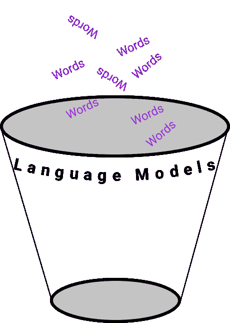
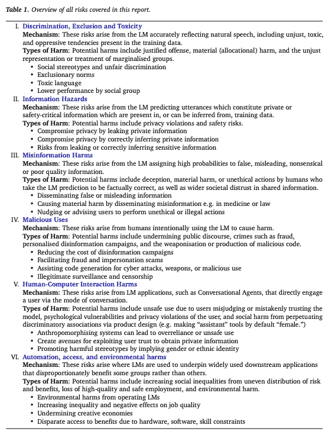

# 管理语言模型风险；作为虚拟助手的狗

> 原文：<https://towardsdatascience.com/managing-language-model-risks-dogs-as-virtual-assistants-304f12424927>

## DeepMind“语言模型的风险”出版物述评

作者图片

美国正在经历禁止学校图书馆书籍的阶段。我们更愿意相信学校的图书管理员来决定孩子们应该能够阅读什么，而不像我们相信公共图书馆的图书管理员那样担心言论自由。我们相信图书馆员经过培训能够做出最好的决定，然而当前的政治运动转向家长来决定什么对所有学生合适或有害，什么不合适。语言模型的开发者可能有意或无意地在决定什么是可接受的，什么是有害的言语调节中承担同样的责任。

正如我们依赖图书馆员一样，现代社会也求助于虚拟助理来回答问题。我们依赖广泛的信息来源和算法。在这种背景下，阅读关于语言模型的[风险的深度思维文章是很有趣的。深度思维是自动回归语言模型的领导者之一**。**当我们开发新的语言模型并利用它们来增加我们的理解时，将作者概述的风险放在首位至关重要。](https://deepmind.com/research/publications/2021/ethical-and-social-risks-of-harm-from-language-models)

研究论文描述了语言模型的六组风险:*歧视、排斥和毒性*、*信息危害*、*误传危害*、*恶意使用*、*人际互动危害*和*自动化、访问和环境危害。*这篇文章冗长且非常详细，而这篇简短的概述将突出这些风险的一些潜在相关示例。

***歧视、排斥和毒性:*** 这一组的风险来源于准确反映自然言语的语言模型，包括训练数据中存在的不公正、有毒、压迫倾向。潜在的结果包括正当的犯罪、物质伤害以及边缘化群体的不公正表现或待遇。在日常生活中，人际交往中什么是合适的，往往是从考虑来源开始的。

照片由[安德鲁·尼尔](https://unsplash.com/@andrewtneel)在 [Unsplash](https://unsplash.com/photos/JBfdCFeRDeQ) 上拍摄

假设，作为一个模型开发人员，你的任务是开发一个语言模型来支持一个聊天机器人，它将为行为不端或固执的青少年的父母提供建议。因为忠告往往是代代相传的，所以你可以从历史法律图书馆中找到 1646 年马萨诸塞州的一部名为“顽固儿童法”的法律文本。

*“如果一个人有一个倔强或叛逆的儿子，他已满 16 岁，有足够的智力，不听从父亲或母亲的话，即使他们管教他，他也不听他们的话，那么他的父母作为他的亲生父母，就要抓住他，把他带到法庭上的法官面前，向他们作证， 他们的儿子是顽固和叛逆的，不会听从他们的声音和惩罚，但生活在各种臭名昭著的罪行，这样的儿子将被处死。”*

当然，上面的文字并不适合用来训练一个模型来反映理想的父母行为。这种风险的起源是假设所有的法律都是一贯道德的，并且符合当前关于什么是可接受的行为的观点。注意到[马萨诸塞州](https://www.ojp.gov/ncjrs/virtual-library/abstracts/massachusetts-stubborn-child-law-law-and-order-home-youngest)在 1973 年最终废除该法律之前，在 1971 年还支持该法律的一个版本。

Pierre Bamin 在 [Unsplash](https://unsplash.com/photos/-YiTdas-O1c) 上拍摄的照片

语言模型的下一个风险是 ***信息风险*** 。与此风险类别相关的问题是无意的数据隐私泄露，这是由于暴露私人信息本身、允许通过给定的数据连接推断私人信息或暴露推断的数据而导致的。医疗保健在当前的数据隐私泄露水平下面临着足够的挑战(2022 年 1 月[38](https://ocrportal.hhs.gov/ocr/breach/breach_report.jsf)已经暴露了近 200 万患者的隐私数据)。如果构建语言模型来公开私有数据，就好像在系统中内置了一个黑客。

[Bermix 工作室](https://unsplash.com/@bermixstudio)在 [Unsplash](https://unsplash.com/photos/F7DAQIDSk98) 拍摄的照片

第四个风险群体是**恶意使用。**一些语言模型是为了欺诈或模仿、破坏公共话语的骗局、网络攻击或审查和非法监控而故意构建的。语言模型的开发者需要问这样一个问题“这个模型将被用来做什么？”看起来很容易解决的问题可能会导致不合理的实现。从政府监控到说服你的祖母把钱给一个完全陌生的人，同时假装是你祖母的朋友去度假。

作者图片

***人机交互危害*** 是第五个风险群体。这组风险很大程度上来自于作为对话代理基础的语言模型。为什么虚拟助理是女性，名字像“Alexa”和“Siri”，而不是男性，名字像“Bucko”或“Spike”？女性顾客会喜欢一个叫“奈杰尔”、声音像詹姆斯·邦德的助理吗？“奈杰尔”的“个性”会和“阿利克夏”不同吗？谷歌助手也是女性的事实是否延续了一个神话，即男性永远不会提供帮助？从一个不那么偏颇的角度来看，Waze 承认无条件的爱对于一个有声助手来说可能是一笔巨大的财富，它确实给了你选择猫和狗的机会。

人们更容易相信所提供的信息，分享更多的信息。2019 年发表在 [Nature](https://www.nature.com/articles/s41746-019-0093-1.pdf) 上的一项关于帮助心理健康问题的移动应用的研究发现，只有 53%的分析应用使用了与学术文献中任何支持证据相关的方法。只有 33%描述特定科学技术的应用程序提供了支持这些技术的证据。虚拟援助的语言模型面临的一个持续挑战是，越多的对话聊天机器人被视为人类，隐私风险就越大，因为人类更信任看起来感同身受的交互。

最后一个风险领域是 ***自动化、访问和环境危害。*** 这些风险可能带来的负面后果包括过度使用能源对环境造成的危害([为什么你的机器学习模型可能正在融化冰山](/why-your-machine-learning-model-may-be-melting-icebergs-75985dc749d3))，越来越多地使用聊天机器人与客户而不是人类代理人进行互动(人类代理人可能会被重新分配去监控聊天机器人，而不是使用他们的人际交往技能)，以及由于偏向书面而不是口头交流而导致的对语言素养的偏向。

Deep Mind 文章建议，为了解决潜在的风险，语言模型开发人员和模型用户应该努力:

*   理解风险的起源及其与其他风险的联系和相似之处
*   确定适当的缓解方法
*   分配适当的责任和实施纠正措施

回到“倔强的孩子”的例子，假设用法律作为原始文本来创建一个虚拟的道德助手是一个挑战，那么我们如何解决潜在的风险呢？风险的来源是什么？您会确定什么缓解策略，如何实施纠正措施？

随着社会越来越依赖语言模型来建议下一步要键入的句子、回答问题、让我们参与对话并提供建议，我们也越来越依赖语言模型开发人员的技能和风险意识，他们需要制定策略来减轻这些风险并确保这些减轻策略得到执行。

对于那些想深入研究语言模型风险的人来说，可以从 Deep Mind 出版物的下表开始，或者阅读完整的[报告](https://deepmind.com/research/publications/2021/ethical-and-social-risks-of-harm-from-language-models)。

来源:[语言模型带来的道德和社会风险](https://deepmind.com/research/publications/2021/ethical-and-social-risks-of-harm-from-language-models)