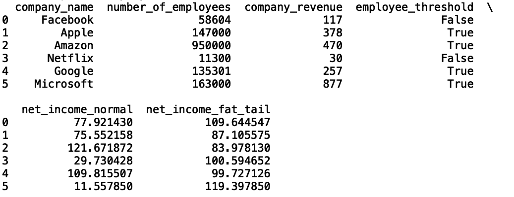

# 在 Python 中操作列表

> 原文：<https://towardsdatascience.com/manipulating-lists-in-python-8edcfb30b9bd>

## 在 Python 中使用列表创建附加数据结构


图片由[像素](https://www.pexels.com/photo/notebook-1226398/)上的[苏西·黑兹尔伍德](https://www.pexels.com/@suzyhazelwood/)拍摄

列表和数组是 [Python](https://builtin.com/learn/python-data-science) 中最广泛使用的两种[数据结构](https://builtin.com/learn/data-structures)。Python 中的列表只是对象的集合。这些对象可以是整数、浮点数、字符串、布尔值，甚至是字典之类的其他数据结构。数组，特别是 Python NumPy 数组，类似于 Python 列表。主要区别在于 NumPy 阵列速度更快，并且对对象的同质性有严格的要求。例如，字符串的 NumPy 数组只能包含字符串，不能包含其他数据类型，但是 Python 列表可以包含字符串、数字、布尔值和其他对象的混合。因为像计算平均值或总和这样的操作在 NumPy 数组上要快得多，所以这些数据结构在优先考虑速度性能的环境中更常见。

lists 和 NumPy 数组都有大量的内置方法来执行各种任务，包括排序、查找最小值/最大值、截断、追加、连接等等。

列表也可以定义其他数据结构，比如字典，它们在软件工程和数据科学中都有应用。例如，列表可以生成字典，字典可以转换成 json 文件。软件工程师通常使用这些文件类型。

字典也可以转换成数据框，这是数据科学家经常使用的。更重要的是，Python 列表允许您轻松构建对许多数据任务有用的各种数据框。这包括用新的字段扩充现有的数据表，使用构造的列表计算新的数据字段，对通过 API 访问的数据执行探索性的数据分析，等等。对 Python 列表和 NumPy 数组的透彻理解为许多有用的数据任务打开了大门。

列表和数组经常用于生成合成数据等任务。在许多情况下，数据科学团队对真实数据的访问是有限的。当构建依赖于数据 ETL 和[机器学习](https://builtin.com/machine-learning)的软件时，合成数据通常是构建应用原型的唯一选择。Python 使您能够生成综合列表，例如姓名、州、身高、职业和任何其他可以表示为字符串的分类值。此外，它还可以生成数字值，如人口、收入和交易金额。对于 Python 中的列表理解，简单的特征工程也很简单。总之，列表和数组都提供了许多操作和生成数据的有用方法。

在这里，我们将调查一些使用列表和数组的最常见的方法和数据结构。这将为初级软件工程师或数据科学家在 Python 中使用列表进行数据操作打下坚实的基础。

**构建 Python 列表**

用 Python 构建一个列表非常简单。您可以构造一个字符串、浮点值、整数和布尔值的列表。Python 字符串列表是对应于 unicode 字符序列的值列表。浮点列表包含表示实数的值。整数列表包含可以是正数、负数或零的整数值。最后，布尔列表是真/假值的列表。您还可以构造一个混合类型的列表。

让我们首先构建一个包含脸书、亚马逊、苹果、网飞和谷歌公司的字符串列表:

```
tech_company_names = ['Facebook', 'Apple', 'Amazon', 'Netflix', 'Google']
```

让我们构建一个整数列表，代表 2021 年这些公司的员工人数。我们的整数列表中的顺序将与我们公司名称列表中的顺序相同。例如，在我们的公司名称列表中，“脸书”是第一个元素的值，在我们的员工列表中，58，604 是脸书的员工数。

```
tech_company_employees = [58604, 147000, 950000, 11300, 135301]
```

接下来，让我们构建一个与 2021 年每家公司的收入(以十亿美元计)相对应的浮动列表:

```
tech_company_revenue = [117, 378, 470, 30, 257]
```

最后，让我们创建一个布尔列表。我们将使用叫做列表理解的东西来构造我们的布尔值列表。列表理解是一种基于其他列表中的值构建新列表的简单而有用的方法。列表理解的结构通常如下所示:

```
list = [expression for element in iterable]
```

表达式可以是 iterable 本身的元素，也可以是元素的某种转换，比如检查条件的真值。这就是我们将要做的来创建布尔列表。该列表将基于我们的技术公司员工列表中的值。如果雇员超过 60，000 人，则该值为 true，否则为 false:

```
tech_company_employee_bool = [x > 60000 for x in tech_company_employees ]
```

这将创建以下列表:

```
[False, True, True, False, True]
```

也可以构造混合类型的列表。假设我们有公司名称、收入、员工数量和基于员工数量的布尔值。让我们考虑一下微软的混合类型值列表:

```
new_company_info = ['Microsoft', 163000, 877, True]
```

我们可以使用 append 方法来更新每个列表。如果我们打印更新的列表，我们会看到添加了新的值:

```
print('Company: ', tech_company_names)
print('Employees: ', tech_company_employees)
print("Revenue: ", tech_company_revenue)
print("Employee_threshold: ", tech_company_employee_bool)
```


作者图片

Python 列表还配备了各种有用的方法。例如，我们可以对公司列表(按字母顺序)和员工数量(按升序)进行排序:

```
tech_company_names.sort()tech_company_employees.sort()
```

这将我们的列表修改为以下内容:


作者图片

请注意，这将改变这些列表的顺序，使它们不再匹配。更安全的选择是使用内置的 Python 方法 sorted，它返回一个排序列表，我们可以将它存储在一个新的变量中，而不是修改旧的列表。

```
sort_company = sorted(tech_company_names)sort_employee = sorted(tech_company_employees)print(sort_company)print(sort_employee)
```


作者图片

**构造一个 NumPy 数组**

NumPy 是一个用于生成数组的 Python 包，它与 Python 列表有很多区别。最大的区别是 NumPy 数组比 Python 列表使用更少的资源，这在存储大量数据时变得很重要。如果您正在处理成千上万的元素，Python 列表将适合大多数目的。然而，当列表中的元素数量接近数百万或数十亿时，NumPy 数组是更好的选择。

NumPy 对于生成合成数据也很有用。例如，假设在我们的技术公司数据示例中，我们缺少净收入的值，其中净收入是总销售额减去商品成本、税收和利息。我们想以某种方式估算这些值。此外，我们希望从正态分布中对这些估算值进行采样。让我们创建一个 NumPy 数组，其中包含每家公司的净收入列表。

要继续，让我们导入 NumPy 包:

```
import numpy as np
```

为了生成我们的样本，我们需要一个平均净收入和净收入标准差的值。让我们做一个简单的假设，跨公司的平均净收入为 800 亿美元，标准差为 400 亿美元。我们将分别把均值和标准差μ和σ称为变量:

```
mu, sigma = 80, 40
```

我们还需要指定我们想要生成的值的数量。我们可以简单地将科技公司列表的长度存储在一个新变量中，我们称之为 n_values:

```
n_values = len(tech_company_names)
```

我们还应该指定一个随机种子值，以确保我们的结果是可重复的:

```
np.random.seed(21)
```

为了生成我们的数组，我们将使用 NumPy random 模块中的常规方法。我们将把平均值(mu)、标准偏差(sigma)和值的数量(n_values)的参数值传递给正常方法，并将结果存储在一个名为 net_income 的变量中:

```
net_income_normal = np.random.normal(mu, sigma, n_values)print(net_income_normal)
```


作者图片

在这里，我们为脸书(770 亿美元)、苹果(750 亿美元)、亚马逊(1250 亿美元)、网飞(290 亿美元)、谷歌(1090 亿美元)和微软(110 亿美元)的净收入生成了合成值。由于这些数字是合成的，我们使用汇总统计的合成值来估算所有公司的价值，它们不太现实。

生成这些合成值的一种更准确的方法是使用每家公司的平均净收入和净收入的标准偏差(如果可以获得)，从每家公司的唯一正态分布中得出。就目前而言，我们假设我们可以获得所有公司的平均值和标准差的简单方法就足够了。

对于本例，我们假设净收入的分布是正态的(或形状像钟形曲线)。另一种常见模式是胖尾分布，当一个分布包含大量的极端正值或负值时就会出现这种情况。这也称为偏斜度。我们可以使用 NumPy 中的 gumbel 方法生成一个来自胖尾分布的净收入合成值列表:

```
np.random.seed(64)net_income_fat_tail = np.random.gumbel(mu, sigma, n_values)print(net_income_fat_tail)
```


作者形象

同样，这里值得注意的是，尽管这些值不太现实，但通过使用实际的汇总统计值并为每家公司生成一个分布，它们可以很容易地得到改善。有了正确的领域专业知识，这些方法可以生成高质量、逼真的合成数据。

**使用列表构建字典、JSON 文件、数据帧和 CSV 文件**

有了我们生成的列表，我们现在可以构建一个 Python 字典，这是一种将列表存储在键:值对中的有用方法。我们有一个公司名称、员工人数、收入、收入阈值布尔人、正态分布净收入和胖尾分布净收入的列表。让我们为每个列表创建一个字典映射:

```
company_data_dict = {'company_name': tech_company_names,
                     'number_of_employees': tech_company_employees,
                     'company_revenue': tech_company_revenue,
                     'employee_threshold': tech_company_employee_bool, 
                     'net_income_normal': list(net_income_normal), 
                     'net_income_fat_tail': list(net_income_fat_tail)}
print(company_data_dict)
```


作者形象

我们看到，在这个数据结构中，我们有键，它们是唯一的字符串，或者我们给每个列表和相应的列表命名。我们可以通过以下逻辑很容易地将这个字典转换成一个 JSON 文件:

```
import json 
with open('company_data.json', 'w') as fp:
    json.dump(company_data_dict, fp)
```

我们可以读取 JSON 文件并打印结果:

```
f = open('company_data.json')
company_json = json.loads(f.read()) 
print(company_json)
```


作者形象

我们也可以很容易地使用熊猫数据框架构造器将 Python 字典转换成熊猫数据框架

```
import pandas as pdcompany_df = pd.DataFrame(company_data_dict)print(company_df)
```


作者形象

我们还可以使用 to_csv 方法，使用 panasus 将此数据框写入 CSV 文件:

```
company_df.to_csv("comapany_csv_file.csv", index=False)
```

我们可以使用 read_csv 方法读入我们的文件:

```
read_company_df = pd.read_csv("comapany_csv_file.csv")
```

并显示我们的数据:

```
print(read_company_df)
```



作者形象

我们看到，通过一行代码，我们就可以使用之前创建的列表和字典来生成熊猫数据框架。

这篇文章中的代码可以在 [GitHub](https://github.com/spierre91/builtiin/blob/main/list_tutorial.py) 上找到。

**结论**

在 Python 中构造列表和数组对于各种任务都很有用。Python 允许您轻松地创建和操作字符串、布尔值、浮点数和整数的列表。此外，list comprehension 允许您以一种可读和简洁的方式基于另一个列表中的值创建新列表。

NumPy 数组是一种资源效率更高的列表替代方法，列表还配备了用于执行复杂数学运算和生成合成数据的工具。这两种可迭代对象都可以用来构建更复杂的数据结构，比如字典和数据框。此外，从这些由列表创建的数据结构中创建 json 和 csv 文件非常简单。对于每个工程师和数据科学家来说，很好地理解 python 中用于生成和操作列表和数组的工具是必不可少的。

如果你有兴趣学习 python 编程的基础知识、Pandas 的数据操作以及 python 中的机器学习，请查看[*Python for Data Science and Machine Learning:Python 编程、Pandas 和 sci kit-初学者学习教程*](https://www.amazon.com/dp/B08N38XW2Q/ref=sr_1_1?dchild=1&keywords=sadrach+python&qid=1604966500&s=books&sr=1-1) *。我希望你觉得这篇文章有用/有趣。*

***本帖原载于*** [***内置博客***](https://builtin.com/data-science/) ***。原片可以在这里找到***<https://builtin.com/data-science/how-to-create-list-array-python>****。****