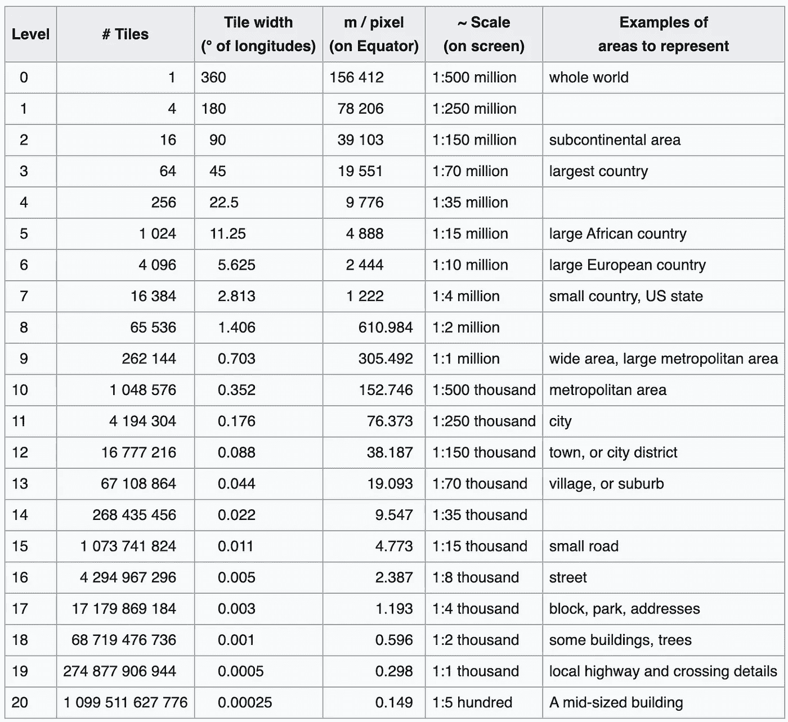
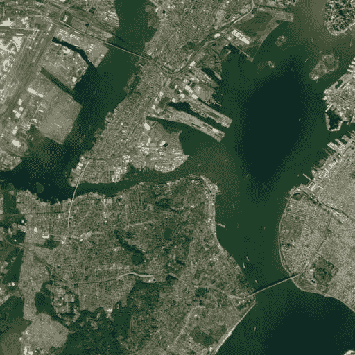
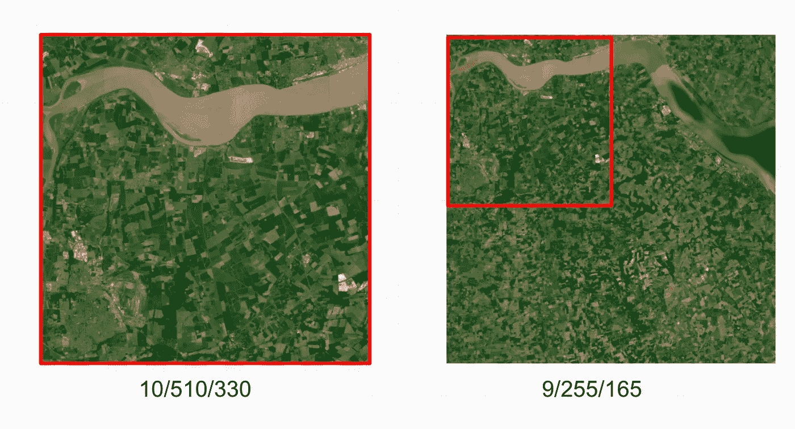

# 地图切片:定位区域、嵌套/父切片、坐标和边界框

> 原文：<https://towardsdatascience.com/map-tiles-locating-areas-nested-parent-tiles-coordinates-and-bounding-boxes-e54de570d0bd>

## 使用位置或缩放级别来确定要使用的图块，并以编程方式计算它们的坐标。


在 [Unsplash](https://unsplash.com?utm_source=medium&utm_medium=referral) 上 [Deva Darshan](https://unsplash.com/@darshan394?utm_source=medium&utm_medium=referral) 拍摄的照片

在可视化地理信息时，数据通常被分割成段——跨越整个地球并根据缩放级别递减的块。这意味着作为用户，我们可以只加载我们感兴趣的信息。

然而，问题在于希望从 tileset 中提取数据，而不必每次都手动重新定位地图。为此，我们有两种方法:

*   使用缩放级别和地理坐标查找单幅图块
*   找到一个缩放级别上的图块，并从另一个缩放级别定位任何相应的图块。
*   最后，我们可以颠倒整个过程，以获得瓷砖坐标，因此包围盒

# 基于坐标定位图块

查找相关图块的最简单方法(除了手动操作加载的地图)是从感兴趣的地方开始，决定我们想要的细节，并直接搜索它。

## 选择缩放级别

第一步是决定我们在地图上需要多少细节。OpenStreetMap 的下表给出了每个级别的规模。对于此示例，我将查看纽约，因此将基于代表列的“*区域示例”选择缩放级别 11。*



显示不同缩放级别及其相对比例的表格。来源:[https://wiki.openstreetmap.org/wiki/Zoom_levels](https://wiki.openstreetmap.org/wiki/Zoom_levels)

## 从坐标计算图块

接下来，我们需要获得我们感兴趣的城市的纬度和经度。对于纽约，这是:`40.7128° N, 74.0060° W`。

我们现在可以使用上面的下列函数来确定我们需要什么样的图块，如下等式:

```
import mpmath as mp **def** get_tile(**lat_deg,lon_deg,zoom**): *''' A function to get the relevant tile from lat,lon,zoom)'''*

   lat_rad = mp.radians(lat_deg)
   n = 2 ** zoom

   xtile = n * ((lon_deg + 180) / 360)
   ytile = n * (1 - (mp.log(mp.tan(lat_rad) + mp.sec(lat_rad)) / mp.pi)) / 2 **return** 'tile %d/%d/%d '%(zoom,xtile,ytile)
```

*注意:由于我们坐标系的性质，由于这是向西 74 度，我们需要在计算时将其输入为负数。* `*40.7128,* ***—*** *74.0060*`



返回的卫星视图左(`© Mapbox, © OpenStreetMap`)和缩小的谷歌地图(地图数据:2022 谷歌)在右边。

将`get_tile(*40.7128,* ***—*** *74.0060 , 11)*` 与 Mapbox 卫星 tileset 一起使用，我们得到了纽约最左边的图像`tile: 11/602/770`。这可以与谷歌地图进行比较，以确保我们有正确的位置。

# 从另一缩放级别查找嵌套或父平铺

我们可能面临的另一个问题是希望同一区域的分辨率更高或更低。在这种情况下，我们可能只有一个单独的位置，而没有产生它所需的坐标。我们可以简单地使用“n”来调整缩放级别，而不是逆向工程上述等式:

```
def tile_translator(z,x,y,newzoom):*'''Find the linking (left top) most tile from another zoom level'''* n = 2 ** z
   x /= n
   y /= n n2 = 2 ** newzoom
   x *= n2
   y *= n2 return '%d/%d/%d'%(newzoom,x,y)
```

在英国东北部`(10/510/330)`随机取一块瓷砖，我们可以根据`newzoom`参数的值生成它的父元素和子元素。



` tile_translator 的输出(`10,510,330,9). — via © Mapbox, © OpenStreetMap`

在需要右边单元格的坐标的情况下，我们可以将 1 加到`x` (511)并将`+1`加到`y` (331)以得到向下的单元格。如果探索子块，这个过程也是有用的(见下文)。


` tile_translator( `10,510,330,11) — via © Mapbox, © OpenStreetMap`的输出

将所有这些放在一起会产生以下结果:

```
def get_children(z,x,y):
   ''' Return the children of a tile '''

   tile = list(tile_translator(z,x,y,z+1).split('/').map(float)) return [[tile[0],tile[1]+i,tile[2]+j] for i in [0,1] for j in [0,1]]
```

# 查找图块边界

最后，我们可以颠倒这个过程来获得每个瓷砖的角点:

```
def tile2lon(z,x,y) :
   return x / 2**z * 360 - 180;def tile2lat(z,x,y) :
   n = mp.pi - 2 * mp.pi * y / 2**z;
   return float((180 / mp.pi) * (mp.atan(0.5 * (mp.exp(n) - mp.exp(-n)))))
```

将数字`x`和`y`加 1，我们现在可以计算包围我们的图块的边界框:

```
def tile_bbox(z,x,y):
'''Return the bounding box of a tile'''

   w = tile2lon(z,x,y)
   s = tile2lat(z,x,y) 
   e = tile2lon(z,x+1,y)
   n = tile2lat(z,x,y+1) return [w,s,e,n]
```

# 结论

我们已经学习了如何使用经度和纬度以编程方式定位图块，以及在另一个缩放级别上找到相应的图块。其用途包括提取特定领域的信息，然后用于机器学习(文章即将发表)。

# 资源

代码的完整副本，以及一些进一步的阅读材料。

## 密码

## 关于 Tilesets 的更多信息

[](https://docs.microsoft.com/en-us/bingmaps/articles/bing-maps-tile-system?redirectedfrom=MSDN) [## Bing 地图平铺系统- Bing 地图

### Bing 地图提供了一个世界地图，用户可以直接操纵它进行平移和缩放。为了让这种互动变得快速和…

docs.microsoft.com](https://docs.microsoft.com/en-us/bingmaps/articles/bing-maps-tile-system?redirectedfrom=MSDN) [](https://wiki.openstreetmap.org/wiki/Slippy_map_tilenames) [## 滑动地图磁贴名称

### 本文描述 Slippy 地图应用程序的文件命名约定。拼贴是 256 × 256 像素的 PNG 文件…

wiki.openstreetmap.org](https://wiki.openstreetmap.org/wiki/Slippy_map_tilenames)