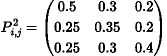

# 马尔可夫链:平稳分布

> 原文：<https://towardsdatascience.com/markov-chains-stationary-distribution-bedd67140112>

## 用 Python 模拟解释和推导马尔可夫链的平稳分布


马库斯·温克勒在 [Unsplash](https://unsplash.com?utm_source=medium&utm_medium=referral) 上的照片

# 介绍

在我以前的文章中，我们开始发展我们对 [**马尔可夫链**](https://en.wikipedia.org/wiki/Markov_chain) 的直觉和知识。到目前为止，我们已经讲述了: [**马尔可夫性质、**](https://en.wikipedia.org/wiki/Markov_property) [**转移矩阵**](https://en.wikipedia.org/wiki/Stochastic_matrix) 和**多步转移**利用 [**查普-柯尔莫哥洛夫方程**](https://en.wikipedia.org/wiki/Chapman%E2%80%93Kolmogorov_equation) **。我建议在继续写这篇文章之前通读这些文章:**

[](/markov-chains-simply-explained-dc77836b47e3) [## 马尔可夫链简单地解释了

### 马尔可夫性和马尔可夫链的直观而简单的解释

towardsdatascience.com](/markov-chains-simply-explained-dc77836b47e3) [](/markov-chains-multi-step-transitions-6772114bcc1d) [## 马尔可夫链:多步转移

### 使用 Chapman-Kolmogorov 方程理解马尔可夫链中的多步转移

towardsdatascience.com](/markov-chains-multi-step-transitions-6772114bcc1d) 

但是，简单总结一下上面的文章:**马尔可夫链是离散时间内有限状态空间中的一系列转移，其中转移的概率只取决于当前状态**。这个系统是完全无记忆的。

**转移矩阵**显示状态空间中状态间转移的**概率。**Chapman-Kolmogorov 方程**告诉我们如何计算**多步跃迁概率。****

在本文中，我们将讨论当我们采用**大量离散时间步长**时，转移矩阵会发生什么。换句话说，我们将描述马尔可夫链如何随着时间**趋于无穷大而发展。**

# 马尔可夫链和转移矩阵

首先，让我们快速回顾一下我以前文章中的内容。下面是一个状态空间为 ***{A，B，C}的马尔可夫链。***


作者制作的图像。

该马尔可夫链具有以下转移矩阵:


由作者在 LaTeX 中生成的矩阵。

其中每个单元格传达在马尔可夫属性下从状态 ***i*** (行)到状态*(列)的转移的概率。然而，该矩阵仅用于单步过渡。如果我们想分两步从 ***i*** 到 ***j*** 呢？*

*这个问题可以通过 Chapman-Kolmogorov 方程来解决，它告诉我们这就是转移矩阵的平方。*

**

*由作者在 LaTeX 中生成的矩阵。*

*如果我们想计算三步概率，我们就要对转移矩阵求立方。一般来说对于 **n 步**:*

**

*作者在 LaTeX 中生成的方程。*

*现在，随着 ***n*** 变大会发生什么？我们接下来会回答这个问题。*

# *稳定分布*

*随着时间的推移，处于某些状态的可能性比其他状态更大。从长远来看，该分布将达到一个**平衡**，并具有处于每个状态的相关概率。这就是所谓的**固定分配**。*

*它是稳定的原因是，如果你将转移矩阵应用于这个给定的分布，结果分布是与之前相同的**:***

******

***作者在 LaTeX 中生成的方程。***

***其中 ***π*** 是某个分布，它是列数等于状态空间中的状态的行向量，而 ***P*** 是转移矩阵。***

# ***特征值分解***

***有些人可能会把上面的方程认作是 ***π*** 是 ***P*** 的一个**特征向量**，其**特征值为 1** 。这确实是真的，所以我们可以用 [**【特征值分解(谱定理)**](https://en.wikipedia.org/wiki/Eigendecomposition_of_a_matrix) **来求解。*****

> ***注意:在这篇文章中，我假设读者已经理解了矩阵的特征值以及如何找到它们。如果没有，我建议阅读一些基础教程来获得一些直觉。***

***让我们看看上面的例子马尔可夫链，它有一个 **3x3** 转移矩阵。根据上面的转换矩阵，我们想要求解下面的等式:***

******

***作者在 LaTeX 中生成的方程。***

***其中 **λ** 为特征向量对应的**特征值。**利用 [**三角形法则**](https://en.wikipedia.org/wiki/Rule_of_Sarrus) ，这等于:***

******

***作者在 LaTeX 中生成的方程。***

***所以我们的**特征值是 0，-0.5 和 1** 。我们知道我们的解**只在特征值等于 1** 的情况下有效，所以我们现在将使用它来找到我们相应的特征向量，这将是我们的平稳分布:***

******

***作者在 LaTeX 中生成的方程。***

***这里，**下标指的是当我们有一个稳定分布时，处于相应状态**的概率。上述方程可以通过**高斯消去**求解得到如下结果:***

******

***作者在 LaTeX 中生成的方程。***

***将上述向量归一化，我们的平稳分布为:***

******

***作者在 LaTeX 中生成的方程。***

***这意味着从长远来看，我们在这三个州中的任何一个州都有同等的可能性！***

> ***注意:这不是平稳分布的密集深度推导，因为我不想把它变成教科书！不过网上有很多关于[特征值分解的深入例子。](https://en.wikipedia.org/wiki/Eigendecomposition_of_a_matrix)***

# ***Python 模拟***

***我们刚刚展示了理论上的稳定分布，现在我们将使用 Python 中的模拟来根据经验计算它**。*****

***下面的代码模拟了开始分布为{1，0，0}的 50 步后处于每个状态的**概率:*****

```
***# import packages
import numpy as np
import matplotlib.pyplot as plt# set transition matrix
transition_matrix =  np.array([[0, 0.4, 0.6],
                               [0.5, 0.3, 0.2],
                               [0.5, 0.3, 0.2]])# set initial distribution
initial_dist = np.array([1,0,0])# simulate 50 time steps
for _ in range(50):
    update = initial_dist @ transition_matrix
    initial_dist = update

print(initial_dist)***
```

***输出:***

```
***[0.33333333 0.33333333 0.33333333]***
```

***这与我们上面推导的平稳分布完全相同！***

***完整代码可以在我的 GitHub 上找到:***

***[](https://github.com/egorhowell/Medium-Articles/blob/main/Statistics/markov_stationary.py) [## Medium-Articles/Markov _ stationary . py at main egorhowell/Medium-Articles

### 此时您不能执行该操作。您已使用另一个标签页或窗口登录。您已在另一个选项卡中注销，或者…

github.com](https://github.com/egorhowell/Medium-Articles/blob/main/Statistics/markov_stationary.py) 

# 摘要

在这篇文章中，我们描述了什么是平稳分布，以及如何为马尔可夫链推导出平稳分布。在我的下一篇文章中，我们将讨论马尔可夫链的不同性质。

# 和我联系！

*   要在媒体上阅读无限的故事，请务必在这里注册！ 💜
*   [T35*😀*](/subscribe/@egorhowell)
*   [*【领英】*](https://www.linkedin.com/in/egor-howell-092a721b3/) 👔
*   [*碎碎念*](https://twitter.com/EgorHowell) 🖊
*   [*github*](https://github.com/egorhowell)*🖥*
*   *[](https://www.kaggle.com/egorphysics)**🏅***

> ***(所有表情符号都是由 [OpenMoji](https://openmoji.org/) 设计的——开源的表情符号和图标项目。许可证: [CC BY-SA 4.0](https://creativecommons.org/licenses/by-sa/4.0/#)******