# Python 中图像处理和深度学习准备的大量教程#1

> 原文：<https://towardsdatascience.com/massive-tutorial-on-image-processing-and-preparation-for-deep-learning-in-python-1-e534ee42f122>

## 随意操纵和变换图像

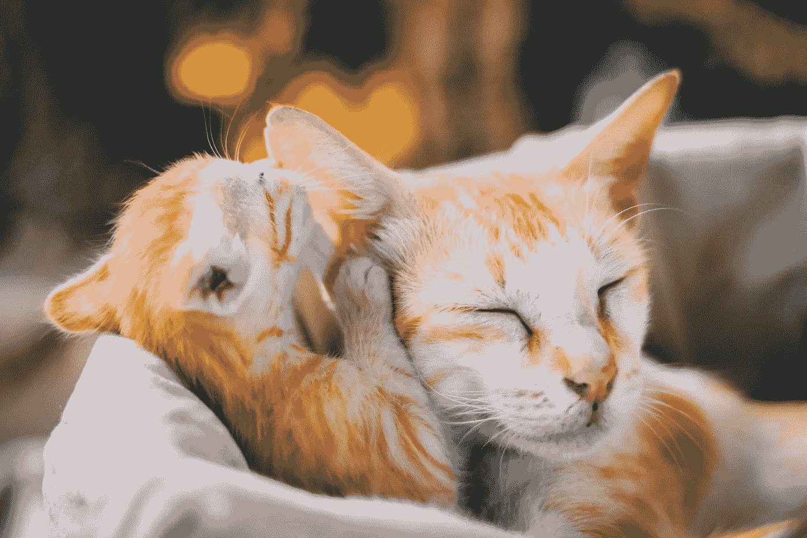

**照片由**[**Prasad Panchakshari**](https://unsplash.com/@pkprasad1996?utm_source=unsplash&utm_medium=referral&utm_content=creditCopyText)**[**Unsplash**](https://unsplash.com/s/photos/kitten?utm_source=unsplash&utm_medium=referral&utm_content=creditCopyText)**

## **介绍**

**我们来这里是为了一件悲伤的事情。真的很悲伤。我们在这里学习如何拍摄美丽、令人惊叹的图像，并把它们变成一堆丑陋的小数字，以便它们对所有那些没有灵魂、没有头脑的机器来说更像样。**

**我们会把动物身上的颜色剥去，变成黑色和白色。抢过色彩鲜艳的花，抢走它们的美丽。我们将看到令人不安的 x 射线图像，并想办法让它们变得更加令人不安。有时候，我们甚至可以用计算机算法来画硬币。**

**换句话说，我们将学习如何执行图像处理。我们的荣誉图书馆将在整篇文章中以 Scikit-Image (Skimage)的形式出现。**

> **这是一篇由两部分组成的文章。你可以在这个之后在这里阅读第二部分[。最后还有一个链接。](/massive-tutorial-on-image-processing-and-preparation-for-deep-learning-in-python-2-14816263b4a5)**

**[](https://ibexorigin.medium.com/membership)  

获得由强大的 AI-Alpha 信号选择和总结的最佳和最新的 ML 和 AI 论文:

[](https://alphasignal.ai/?referrer=Bex)  

# 基础

## 1.什么是图像？

除了文本，图像数据可能是最常见的。那么，计算机是如何理解你在埃菲尔铁塔前的那张自拍的呢？

它使用称为像素的小正方形单元的网格。像素覆盖很小的区域，并且具有代表颜色的值。图像中的像素越多，质量就越高，需要更多的内存来存储。

就是这样。图像处理主要是操纵这些单个像素(有时是一组像素)，以便计算机视觉算法可以从中提取更多信息。

## 2.使用数字和浏览的图像基础

图像在 Matplotlib 和 Skimage 中都作为 NumPy ndarrays 加载。

数字阵列总是给游戏带来灵活性、速度和力量。图像处理也不例外。

Ndarrays 可以轻松检索图像的一般细节，如尺寸:

我们隐藏的`image`高 853 像素，宽 1280 像素。第三维表示 RGB(红、绿、蓝)颜色通道的值。最常见的图像格式是 3D 格式。

您可以通过常规的 NumPy 索引来检索单个像素值。下面，我们尝试对图像进行索引，以检索三个颜色通道中的每一个:

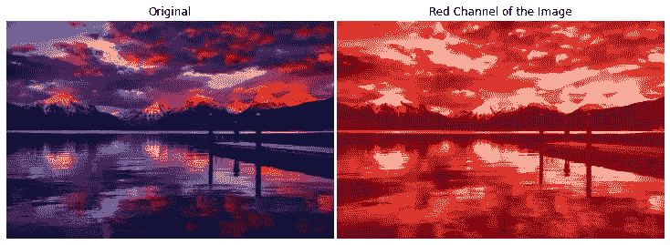

照片由 [Pixabay](https://www.pexels.com/@pixabay?utm_content=attributionCopyText&utm_medium=referral&utm_source=pexels) 从[像素](https://www.pexels.com/photo/dock-under-cloudy-sky-in-front-of-mountain-206359/?utm_content=attributionCopyText&utm_medium=referral&utm_source=pexels)拍摄

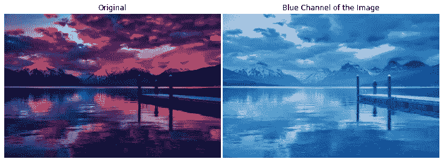

照片由[像素](https://www.pexels.com/photo/dock-under-cloudy-sky-in-front-of-mountain-206359/?utm_content=attributionCopyText&utm_medium=referral&utm_source=pexels)的 [Pixabay](https://www.pexels.com/@pixabay?utm_content=attributionCopyText&utm_medium=referral&utm_source=pexels) 拍摄

红色通道为 0，绿色通道为 1，蓝色通道为 2——非常简单。

我已经创建了两个函数，`[show](https://gist.github.com/BexTuychiev/e65c222f6fa388b22d7cf80eb561a1f4)`和`[compare](https://gist.github.com/BexTuychiev/37898e5a44fae4851f6fc6e951e560d7)`，它们显示一幅图像或者并排显示两幅图像进行比较。我们将在整个教程中广泛使用这两个函数，所以您可能想看看我超链接的代码。

按照惯例，ndarray 的第三维是用于颜色通道的，但是这个惯例并不总是被遵守。Skimage 通常会提供一些参数来指定这种行为。

图像不同于通常的 Matplotlib 图。它们的原点不在左下方，而是在左上方的位置`(0, 0)`。

```
>>> show(image, axis=True)
```

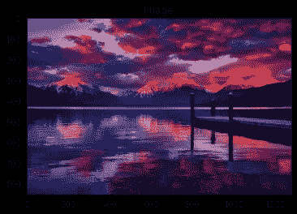

照片由 [Pixabay](https://www.pexels.com/@pixabay?utm_content=attributionCopyText&utm_medium=referral&utm_source=pexels) 从[像素](https://www.pexels.com/photo/dock-under-cloudy-sky-in-front-of-mountain-206359/?utm_content=attributionCopyText&utm_medium=referral&utm_source=pexels)拍摄

当我们在 Matplotlib 中绘制图像时，轴表示像素的顺序，但我们通常会隐藏它们，因为它们不会给查看者带来太多的价值。

## 3.常见转换

我们将执行的最常见的图像转换是将彩色图像转换为灰度图像。许多图像处理算法需要灰度 2D 阵列，因为颜色不是图片的定义特征，并且计算机已经可以在没有它的情况下提取足够的信息。


照片由来自 [Pexels](https://www.pexels.com/photo/selective-focus-photography-of-a-red-rose-593655/?utm_content=attributionCopyText&utm_medium=referral&utm_source=pexels) 的 [Jovana Nesic](https://www.pexels.com/@jovana-nesic-188639?utm_content=attributionCopyText&utm_medium=referral&utm_source=pexels) 拍摄

```
>>> gray.shape(853, 1280)
```

当将图像转换为灰度时，它们会失去第三维空间——颜色通道。相反，图像数组中的每个单元格现在都表示一个`uint8`类型的整数。它们的范围从 0 到 255，给出了 256 种灰度。

你也可以使用像`[np.flipud](https://numpy.org/doc/stable/reference/generated/numpy.flipud.html)`或`[np.fliplr](https://numpy.org/doc/stable/reference/generated/numpy.fliplr.html#numpy.fliplr)`这样的 NumPy 函数，随心所欲地操纵图像，就像操纵 NumPy 数组一样。

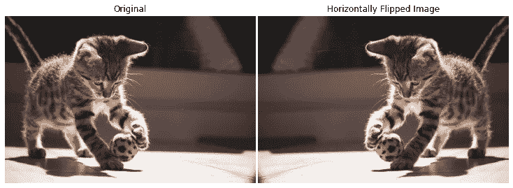

照片由 [Hanna](https://www.pexels.com/@hannaphotography?utm_content=attributionCopyText&utm_medium=referral&utm_source=pexels) 从 [Pexels](https://www.pexels.com/photo/animal-pet-cute-fur-8322213/?utm_content=attributionCopyText&utm_medium=referral&utm_source=pexels) 拍摄


保罗·巴塞尔从 [Pexels](https://www.pexels.com/photo/close-up-photo-of-lensball-1816819/?utm_content=attributionCopyText&utm_medium=referral&utm_source=pexels) 拍摄的照片

在`[color](https://scikit-image.org/docs/dev/api/skimage.color.html)` [模块](https://scikit-image.org/docs/dev/api/skimage.color.html)中，您可以找到许多其他变换函数来处理图像中的颜色。

## 4.颜色通道直方图

有时，查看每个颜色通道的强度有助于了解颜色分布。我们可以通过分割每个颜色通道并绘制它们的直方图来实现。以下是执行此操作的函数:

除了几个 Matplotlib 细节，你应该注意一下`hist`函数的调用。一旦我们提取了颜色通道及其数组，我们将它展平成一个 1D 数组，并将其传递给`hist`函数。面元应该是 256，每个像素值一个面元- 0 是全黑，255 是全白。

让我们为我们的彩色风景图像使用函数:

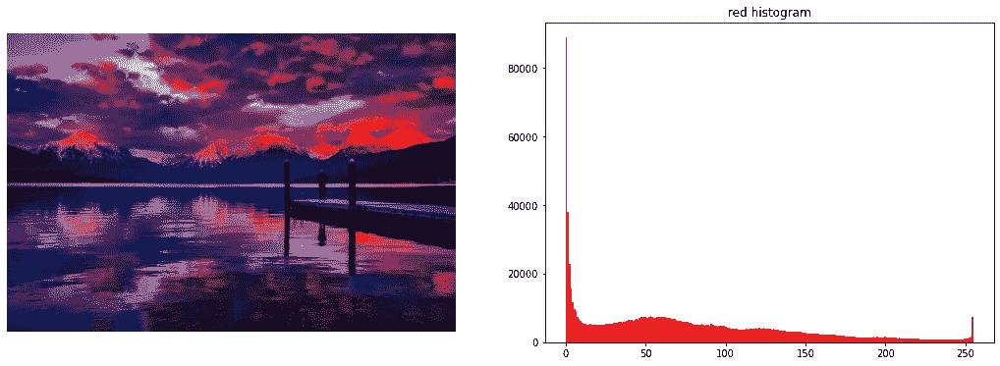

照片由来自 [Pexels](https://www.pexels.com/photo/dock-under-cloudy-sky-in-front-of-mountain-206359/?utm_content=attributionCopyText&utm_medium=referral&utm_source=pexels) 的 [Pixabay](https://www.pexels.com/@pixabay?utm_content=attributionCopyText&utm_medium=referral&utm_source=pexels) 拍摄

```
>>> plot_with_hist_channel(colorful_scenery, "green")
```

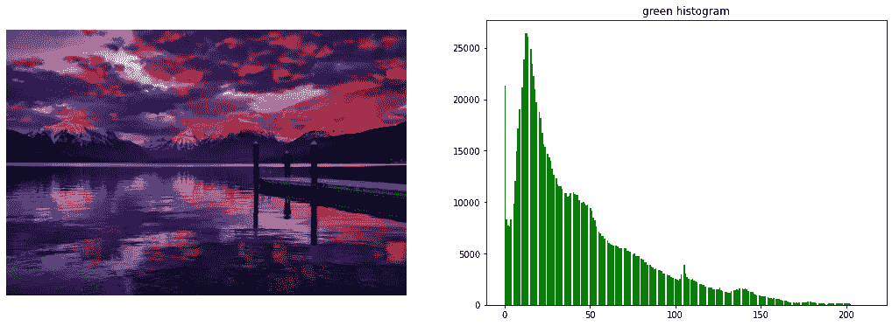

照片由[像素](https://www.pexels.com/photo/dock-under-cloudy-sky-in-front-of-mountain-206359/?utm_content=attributionCopyText&utm_medium=referral&utm_source=pexels)的 [Pixabay](https://www.pexels.com/@pixabay?utm_content=attributionCopyText&utm_medium=referral&utm_source=pexels) 拍摄

```
>>> plot_with_hist_channel(colorful_scenery, "blue")
```

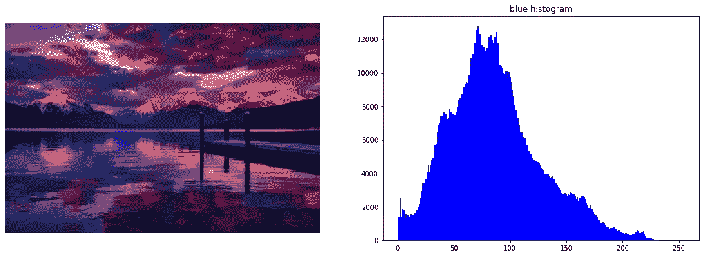

照片由 [Pixabay](https://www.pexels.com/@pixabay?utm_content=attributionCopyText&utm_medium=referral&utm_source=pexels) 从[像素](https://www.pexels.com/photo/dock-under-cloudy-sky-in-front-of-mountain-206359/?utm_content=attributionCopyText&utm_medium=referral&utm_source=pexels)拍摄

您也可以使用直方图找出图像转换为灰度后的亮度:

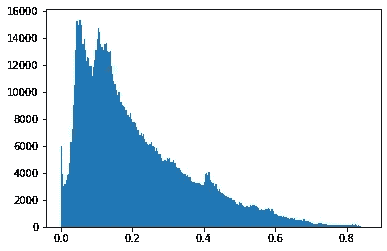

大多数像素值较低，因为风景图像有点暗。

我们将在接下来的章节中探索直方图的更多应用。

# 过滤

## 1.手动阈值

现在，我们开始有趣的事情——过滤图像。我们将学习的第一个操作是阈值处理。让我们加载一个示例图像:

```
stag = imread("images/binary_example.jpg")

>>> show(stag)
```

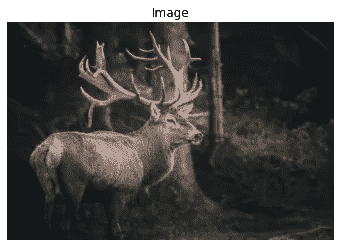

来自[像素](https://www.pexels.com/photo/brown-deer-near-tree-3329812/?utm_content=attributionCopyText&utm_medium=referral&utm_source=pexels)的 [cmonphotography](https://www.pexels.com/@cmonphotography?utm_content=attributionCopyText&utm_medium=referral&utm_source=pexels) 拍摄的照片

阈值处理在图像分割、对象检测、寻找边缘或轮廓等方面有许多应用。它主要用于区分图像的背景和前景。

阈值处理最适用于高对比度灰度图像，因此我们将转换 stag 图像:

```
# Convert to graysacle
stag_gray = rgb2gray(stag)

>>> show(stag_gray)
```


来自[像素](https://www.pexels.com/photo/brown-deer-near-tree-3329812/?utm_content=attributionCopyText&utm_medium=referral&utm_source=pexels)的 [cmonphotography](https://www.pexels.com/@cmonphotography?utm_content=attributionCopyText&utm_medium=referral&utm_source=pexels) 摄影

我们将从基本的手动阈值处理开始，然后转向自动阈值处理。

首先，我们看看灰度图像中所有像素的平均值:

```
>>> stag_gray.mean()0.20056262759859955
```

> 请注意，上面的灰色图像的像素通过将其所有值除以 256，在 0 和 1 之间进行归一化。

我们得到一个平均值 0.2，这给了我们一个可能想要使用的阈值的初步想法。

现在，我们使用这个阈值来屏蔽图像阵列。如果像素值低于阈值，则它的值变为 0 —黑色，否则变为 1 —白色。换句话说，我们得到一张黑白二进制图片:

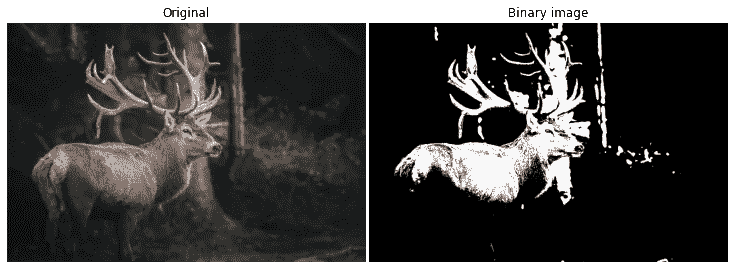

来自[像素](https://www.pexels.com/photo/brown-deer-near-tree-3329812/?utm_content=attributionCopyText&utm_medium=referral&utm_source=pexels)的 [cmonphotography](https://www.pexels.com/@cmonphotography?utm_content=attributionCopyText&utm_medium=referral&utm_source=pexels) 照片

在这个版本中，我们可以更清楚地区分牡鹿的轮廓。我们可以反转蒙版，使背景变成白色:

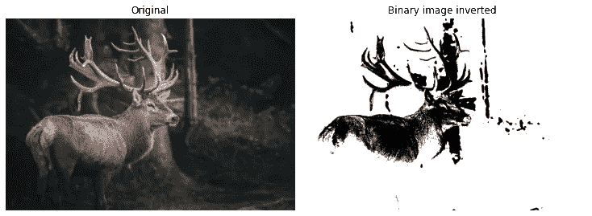

由 [cmonphotography](https://www.pexels.com/@cmonphotography?utm_content=attributionCopyText&utm_medium=referral&utm_source=pexels) 从[像素](https://www.pexels.com/photo/brown-deer-near-tree-3329812/?utm_content=attributionCopyText&utm_medium=referral&utm_source=pexels)拍摄的照片

## 2.阈值处理—全局

虽然尝试不同的阈值并观察它们对图像的影响可能很有趣，但我们通常使用比我们的眼球估计更鲁棒的算法来执行阈值处理。

有许多阈值算法，所以可能很难选择一个。在这种情况下，`skimage`有`try_all_threshold`函数，它对给定的*灰度*图像运行七种阈值算法。让我们加载一个示例并进行转换:

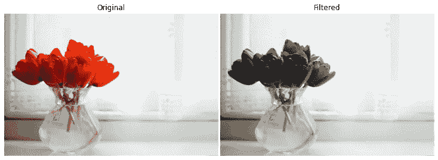

照片由[丽莎·福蒂斯](https://www.pexels.com/@fotios-photos?utm_content=attributionCopyText&utm_medium=referral&utm_source=pexels)从[派克斯](https://www.pexels.com/photo/red-tulips-in-clear-glass-vase-with-water-centerpiece-near-white-curtain-858192/?utm_content=attributionCopyText&utm_medium=referral&utm_source=pexels)拍摄

我们将看看是否可以通过使用阈值来改进郁金香的特征:

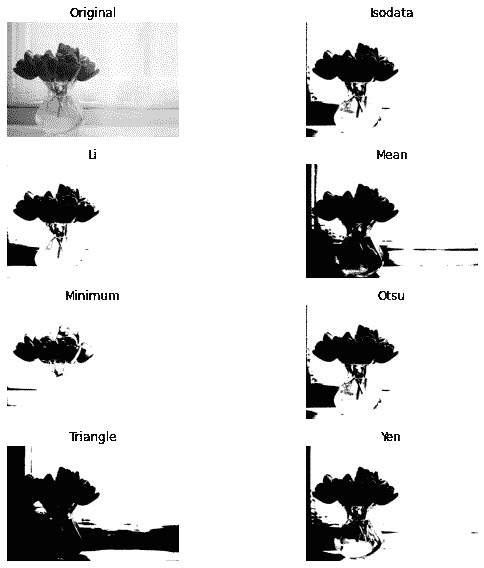

正如你所看到的，在这张图片上，一些算法工作得更好，而另一些则很糟糕。`otsu`算法看起来更好，所以我们将继续使用它。

现在，我想把你们的注意力拉回到最初的郁金香图片上:

```
>>> show(flower)
```


照片由 [Pexels](https://www.pexels.com/photo/red-tulips-in-clear-glass-vase-with-water-centerpiece-near-white-curtain-858192/?utm_content=attributionCopyText&utm_medium=referral&utm_source=pexels) 的[丽莎·福蒂斯](https://www.pexels.com/@fotios-photos?utm_content=attributionCopyText&utm_medium=referral&utm_source=pexels)拍摄

这幅图像的背景不均匀，因为太多的光线来自后面的窗户。我们可以通过绘制灰色郁金香的直方图来证实这一点:

```
>>> plt.hist(flower_gray.ravel(), bins=256);
```

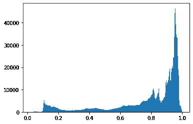

正如预期的那样，大多数像素的值都在直方图的远端，这表明它们大部分都很亮。

为什么这很重要？根据图像的亮度，阈值算法的性能也会改变。为此，阈值算法通常有两种类型:

1.  全局—适用于背景均匀一致的照片
2.  局部—适用于不同图片区域中具有不同亮度级别的图像。

郁金香图像属于第二类，因为右边部分比另一半亮得多，使其背景不均匀。我们不能对其使用全局阈值算法，这也是为什么`[try_all_threshold](https://scikit-image.org/docs/dev/api/skimage.filters.html#skimage.filters.try_all_threshold)`中所有算法的性能如此之差的原因。

我们一会儿将回到郁金香的例子和局部阈值。现在，我们将加载另一个具有更精细亮度的实例，并尝试自动设置阈值:

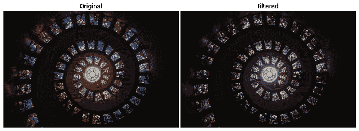

照片由 [Pixabay](https://www.pexels.com/@pixabay?utm_content=attributionCopyText&utm_medium=referral&utm_source=pexels) 从[像素](https://www.pexels.com/photo/worms-eye-view-of-spiral-stained-glass-decors-through-the-roof-161154/?utm_content=attributionCopyText&utm_medium=referral&utm_source=pexels)拍摄

我们将使用一个通用的全局阈值算法`[threshold_otsu](https://scikit-image.org/docs/stable/api/skimage.filters.html#skimage.filters.threshold_otsu)`:

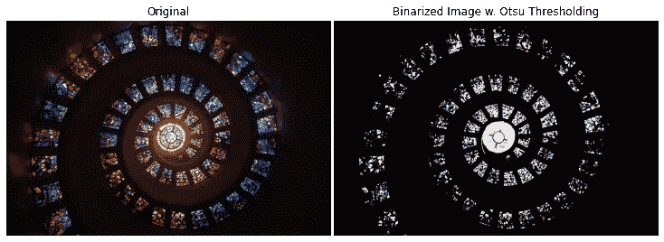

照片由 [Pixabay](https://www.pexels.com/@pixabay?utm_content=attributionCopyText&utm_medium=referral&utm_source=pexels) 从[像素](https://www.pexels.com/photo/worms-eye-view-of-spiral-stained-glass-decors-through-the-roof-161154/?utm_content=attributionCopyText&utm_medium=referral&utm_source=pexels)拍摄

效果好多了！

## 3.阈值处理—局部

现在，我们将使用局部阈值算法。

局部算法不是查看整个图像，而是关注像素邻域，以解决不同区域中亮度不均匀的问题。`skimage`中常见的局部算法为`[threshold_local](https://scikit-image.org/docs/stable/api/skimage.filters.html#skimage.filters.threshold_local)`函数:

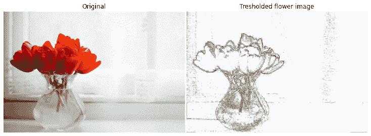

来自 [Pexels](https://www.pexels.com/photo/red-tulips-in-clear-glass-vase-with-water-centerpiece-near-white-curtain-858192/?utm_content=attributionCopyText&utm_medium=referral&utm_source=pexels) 的[丽莎·福蒂斯](https://www.pexels.com/@fotios-photos?utm_content=attributionCopyText&utm_medium=referral&utm_source=pexels)的照片

你必须玩弄`offset`的论点来找到你需要的最佳图像。`offset`是从局部像素邻域的平均值中减去的常数。这个“像素邻域”由`local_threshold`中的`block_size`参数决定，该参数表示算法在每个方向的每个点周围寻找的像素数量。

显然，同时调整`offset`和`block_size`是不利的，但是局部阈值处理是产生比手动或全局阈值处理更好结果的唯一选择。

让我们再举一个例子:

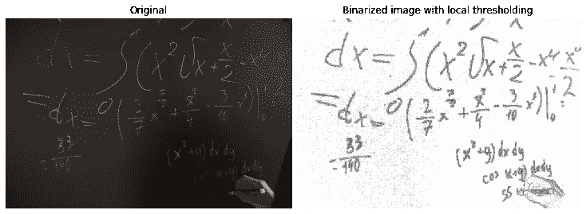

照片由[龟背竹](https://www.pexels.com/@gabby-k?utm_content=attributionCopyText&utm_medium=referral&utm_source=pexels)从[派克斯](https://www.pexels.com/photo/equations-written-on-blackboard-6238297/?utm_content=attributionCopyText&utm_medium=referral&utm_source=pexels)拍摄

如你所见，在阈值化之后，板上的笔迹更加精细。

## 4.边缘检测

边缘检测在许多方面都是有用的，例如识别物体、从物体中提取特征、计数等等。我们将从基本的 Sobel 滤波器开始，它在灰度图像中找到对象的边缘。我们将加载硬币的图片，并对其使用 Sobel 滤镜:

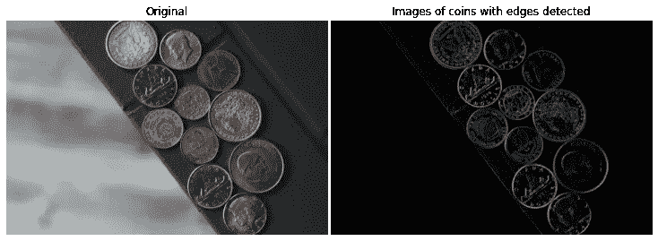

照片由来自 [Pexels](https://www.pexels.com/photo/silver-and-gold-round-coins-3790639/?utm_content=attributionCopyText&utm_medium=referral&utm_source=pexels) 的[德米特里·德米多夫](https://www.pexels.com/@dmitry-demidov-515774?utm_content=attributionCopyText&utm_medium=referral&utm_source=pexels)拍摄

索贝尔是非常简单的；你只需要在灰色图像上调用它，就可以得到上面这样的输出。我们将在后面的章节中看到 Sobel 的更复杂的版本。

## 5.缓和

另一种图像过滤技术是平滑。许多图像，如下面的鸡，可能包含随机噪声，对 ML 和 DL 算法没有任何有价值的信息。

例如，鸡周围的毛发会给图像添加噪声，这可能会使 ML 模型的注意力偏离主要对象本身。在这种情况下，我们使用平滑来模糊噪声或边缘，并降低对比度。

```
chickens = imread("images/chickens.jpg")

>>> show(chickens)
```

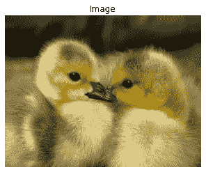

照片由[维克托·伯恩赛德](https://www.pexels.com/@victor-burnside-42505?utm_content=attributionCopyText&utm_medium=referral&utm_source=pexels)从 [Pexels](https://www.pexels.com/photo/2-yellow-ducklings-closeup-photography-157465/?utm_content=attributionCopyText&utm_medium=referral&utm_source=pexels) 拍摄

最流行和最强大的平滑技术之一是`[gaussian](https://scikit-image.org/docs/stable/api/skimage.filters.html#skimage.filters.gaussian)`平滑:

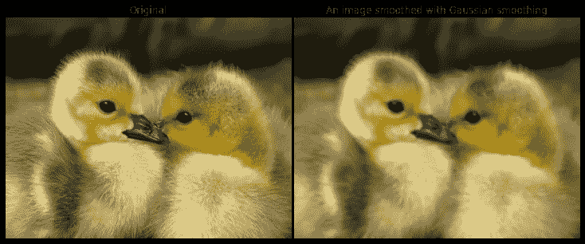

照片由[维克托·伯恩赛德](https://www.pexels.com/@victor-burnside-42505?utm_content=attributionCopyText&utm_medium=referral&utm_source=pexels)从[派克斯](https://www.pexels.com/photo/2-yellow-ducklings-closeup-photography-157465/?utm_content=attributionCopyText&utm_medium=referral&utm_source=pexels)拍摄

您可以通过调整`sigma`参数来控制模糊效果。如果你正在处理一个 RGB 图像，不要忘记设置`multichannel`为真。

如果图像分辨率太高，平滑效果可能肉眼看不到，但在遮光罩下仍然有效。

> 你可以在这里阅读帖子的下一部分[。](/massive-tutorial-on-image-processing-and-preparation-for-deep-learning-in-python-2-14816263b4a5)

[](https://ibexorigin.medium.com/membership)  

**或者订阅我的邮件列表:**

[](https://ibexorigin.medium.com/subscribe)  

**你可以在**[**LinkedIn**](https://twitter.com/BexTuychiev)**或**[**Twitter**](https://twitter.com/BexTuychiev)**上联系我，友好地聊一聊所有的事情数据。或者你可以读我的另一个故事。这些怎么样:**

[](/good-bye-pandas-meet-terality-its-evil-twin-with-identical-syntax-455b42f33a6d)  [](/github-copilot-crushes-data-science-and-ml-tasks-ultimate-review-c8bcbefb928a)  [](/10-minute-guide-to-julia-for-die-hard-python-lovers-a2fcf7dcb860)  [](/6-pandas-mistakes-that-silently-tell-you-are-a-rookie-b566a252e60d)  [](/8-booming-data-science-libraries-you-must-watch-out-in-2022-cec2dbb42437) **