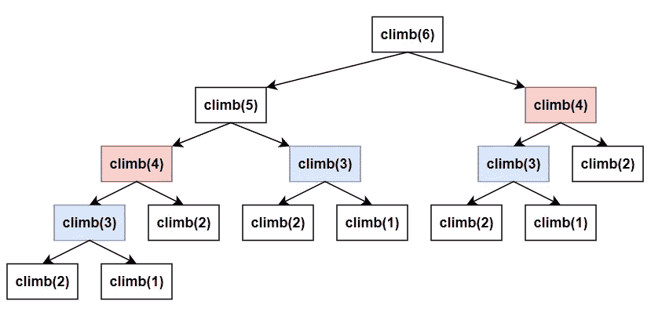
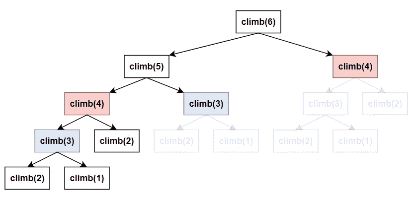
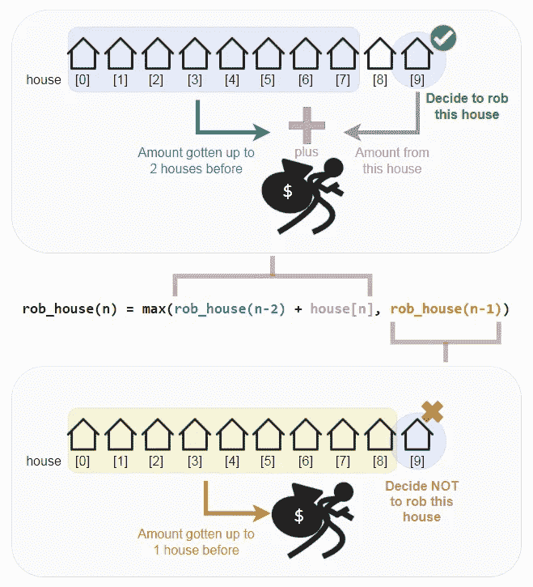
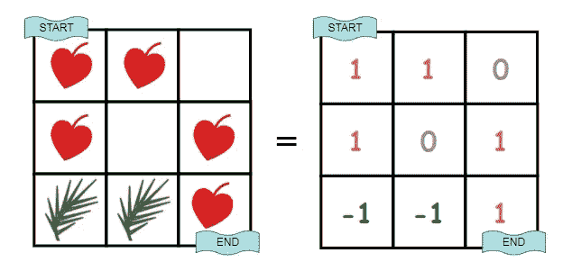
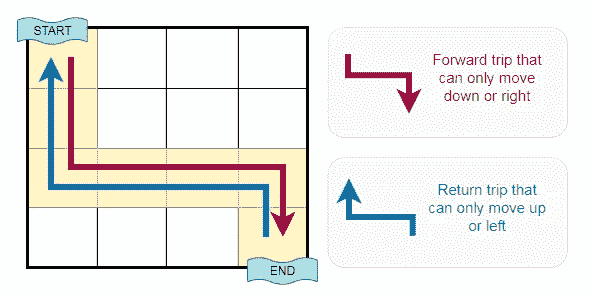

# 掌握动态编程

> 原文：<https://towardsdatascience.com/mastering-dynamic-programming-a627dbdf0229>

## 理解基本原理，知道何时以及如何应用这种优化技术


*除特别注明外，所有图片均为作者所有*

A 你期待去 FAANG 这样的大科技公司面试吗？如果是这样，请准备好进行一轮或多轮技术编码评估。

事实上，越来越多的公司已经开始在数据科学家、机器学习工程师或软件工程师职位的面试过程中纳入技术编码评估。

这种评估通常测试候选人的数据库和 SQL 数据操作技能，或者数据结构和算法的问题解决和编程技能。后者通常包括动态编程，这是一种优化技术，可以产生时间或空间复杂度降低的高效代码。

让我们行动起来，开始学习动态编程。

# **内容**

[**1。动态编程的特点**](#5517)[**2。动态规划题型**](#0862)[**3。实现动态编程的方法**](#a994) **∘**[**自上而下的方法**](#0914) **∘**[**自下而上的方法**](#7a46)[**4。动态编程示例**](#3e46) **∘**[**示例 1:爬楼梯**](#4501) **∘**[**示例 2:入室抢劫犯**](#6909) **∘**[**示例 3:樱桃皮卡**](#aab6)[**什么**](#1dc7)[**概要**](#0d47)

# 1.动态规划的特征

我们许多人都面临着识别动态编程问题的困难。我们如何知道我们能否用动态编程解决一个问题？我们可以问自己以下问题。

*   我们能把这个问题分解成更小的子问题吗？
*   有没有重叠的子问题？
*   如果是，我们能否最优地解决较小的子问题，然后用它们构造一个最优解来解决主问题？
*   在解决问题的同时，当前步骤的决策是否影响后续步骤的结果和决策？

如果你对以上问题的回答是肯定的，那么你可以应用动态规划来解决给定的问题。根据[维基百科](https://en.wikipedia.org/wiki/Dynamic_programming)，

> 一个问题必须具备两个关键属性，才能应用动态规划: [**最优子结构**](https://en.wikipedia.org/wiki/Optimal_substructure) 和 [**重叠子问题**](https://en.wikipedia.org/wiki/Overlapping_subproblem)

> 不要混淆动态编程与分治或贪婪算法。
> 
> [**分治**](https://en.wikipedia.org/wiki/Divide-and-conquer_algorithm) 也是通过组合子问题的最优解来解决一个问题。但《分治法》中的子问题是**不重叠**。
> 
> 一个 [**贪婪算法**](https://en.wikipedia.org/wiki/Greedy_algorithm) 将试图做出贪婪的选择来为每一步提供**局部最优解**。这可能无法保证最终的解决方案是最优的。贪婪算法永远不会回顾并重新考虑它的选择，而动态编程可能会根据对前面步骤的回顾来修改它的决定。

# 2.动态规划问题的类型

动态编程题是什么样子的？

让我们来看看一些最常见的动态编程问题。

第一种类型的动态规划问题，也是经常遇到的一种，是为一个给定的问题找到一个最优解。例子包括寻找最大利润、最小成本、最短路径或最长公共子序列。

第二类动态规划问题是寻找达到某种结果的可能性，到达某一点的可能性，或者在规定的条件下完成一项任务的可能性。

第三种类型通常被称为动态规划计数问题(或组合问题)，如寻找执行或完成一项任务的方法的数量。

注意，我们讨论的所有三种类型的动态规划问题也可以以矩阵的形式作为二维问题出现。更复杂的问题可能涉及多个方面。

# 3.实现动态规划的方法

我们可以用自底向上或自顶向下的方法解决动态规划问题。不管哪种情况，我们都需要定义并得出问题的基本情况。

一般来说，自上而下的方法是从查看全局开始的。从高层开始，它逐渐深入到更小的子问题的解决方案，最后是构建解决方案的基础案例。

与自上而下的方法相反，自下而上的方法从小处着手，首先查看基础案例，然后在整体解决整个问题之前，一步一步地构建更大的子问题的解决方案。

想象以下情况:

***自上而下*** *:“我想做一个好吃的，看起来很华丽的生日蛋糕。如何实现这一点？嗯……我可以用甘美的香蒂伊奶油、浆果果盘、鲜花和新鲜草莓来装饰蛋糕。如何准备它们？我需要用糖搅打浓奶油，切草莓，煮浆果果盘。但是蛋糕在哪里？哎呀，我需要准备蛋糕面糊，然后烘烤它。怎么会？用糖和鸡蛋搅打黄油，然后拌入面粉和牛奶。每种成分的用量是多少？我需要根据所需的比例来衡量它们”。*

***自下而上*** *:“我先从测量和准备蛋糕配料开始。所有的材料都准备好了，我把黄油和糖、鸡蛋搅拌在一起，然后加入面粉和牛奶。接下来，我把它放进烤箱，烤 30 分钟。烤好蛋糕并让它冷却后，我煮浆果果盘，切新鲜草莓，用糖搅打浓奶油。此后，我在蛋糕上涂上尚蒂伊奶油，在上面铺上浆果果盘，最后放上并摆好切好的草莓和可食用的花”。*

你能注意到自下而上的方法是如何从基础开始有序地做事的吗？


由[塞巴斯蒂安·科曼摄影](https://unsplash.com/@sebastiancoman?utm_source=medium&utm_medium=referral)在 [Unsplash](https://unsplash.com?utm_source=medium&utm_medium=referral) 上拍摄

## 自上而下的方法

自顶向下方法的实现使用带记忆的递归。

[记忆化](https://en.wikipedia.org/wiki/Memoization)是一种存储计算结果的技术，这样当程序再次需要它们时，就可以直接检索和使用它们。这对于重叠的子问题特别有用，因为它有助于避免两次执行相同的计算，从而提高效率并节省计算时间。哈希表或数组通常用于记忆。

只要当前状态不是基本情况，这种方法将根据我们定义的递归关系进行递归函数调用。

## 自下而上的方法

为了实现自底向上的方法，我们需要从基础案例开始，以特定的顺序迭代问题的所有状态。

通过这样做，我们从小到大一步一步地构建解决方案，这样当前步骤的答案可以很容易地使用从先前步骤计算的可用子问题解决方案来计算。这个过程会一直持续下去，直到我们构建出完整的解决方案。

自下而上的方法也被称为列表法。由于这种方法会以特定的顺序遍历每一步并执行计算，因此很容易将结果列表成数组或列表，这样就可以通过相关索引方便地检索它们，以便在后续步骤中使用。

对于某些情况，可以避免制表以节省空间和内存。我们将在后面的示例 1 和示例 2 中看到这一点。

> 那么使用哪种方法呢？
> 
> 通常使用这两种方法都可以。毕竟，动态编程不容易理解。你可以使用对你来说更自然的方法，也可以使用你更习惯的方法。
> 
> 虽然有些人可能发现使用自顶向下的方法用递归关系和代码构建解决方案更容易，但自底向上的迭代过程有时会执行得更快，因为它没有递归的堆栈开销。大多数时候，这种差异是微不足道的。不用说，如果你很有技巧，能够编写两种代码，那么就选择时间和空间复杂度较低的一种。

# 4.动态编程示例

在本帖中，我们将详细讨论三个解决动态编程问题的例子。

## 示例 1:爬楼梯

先说一个简单易懂的例子，[爬楼梯](https://leetcode.com/problems/climbing-stairs/)。

> 在这个问题中，我们有一个楼梯，它会带我们走`n`步到达顶端。每次，我们只允许爬 1 步或 2 步。
> 
> 在**中，我们可以用多少种不同的方式**爬到山顶？


让我们从思考基本情况开始。如果我们要迈出第一步，有多少种方法可以做到？当然只有一条路，那就是爬 1 级台阶。

进入第二步怎么样？有两种方法可以做到这一点。我们可以两次爬 1 级台阶，也可以一次爬 2 级台阶。


爬楼梯问题的基本情况

很好！到达第一步和到达第二步构成了这个问题的基本情况。那么，第三步，第四步，等等呢？

对于第三步，只有 3 种可能的方法可以到达那里。它们是:

*   爬 1 级台阶 3 次，或
*   先爬 1 步，再爬 2 步，或
*   先爬两步，再爬一步

我们怎么得到这个数字？就是把第一步和第二步的结果相加(1 + 2 = 3)。这告诉我们，从基础案例出发，我们可以构建其他步骤的解决方案。假设`climb(n)`是返回到达步骤`n`的路径数的函数，那么

```
climb(n) = climb(n-1) + climb(n-2)
```

现在我们有了，这是这个爬楼梯问题的**递推关系**。当前步骤采用前两步的计算结果，并将它们相加。


基本上，这就是我们如何将一个问题分解成子问题，解决子问题将构建主问题的解决方案。

你能看出这些子问题是重叠的吗？

```
climb(6) = climb(5) + climb(4)
climb(5) = climb(4) + climb(3)
climb(4) = climb(3) + climb(2)
climb(3) = climb(2) + climb(1)
```

为了得到`climb(6)`的结果，我们需要计算`climb(5)`和`climb(4)`。为了得到`climb(5)`的结果，我们需要再次计算`climb(4)`。

从下图我们可以清楚的看到，为了得到`climb(6)`，我们要计算`climb(4)`两次，计算`climb(3)`三次。这将导致 O(2^n).的时间复杂度



重叠子问题— `climb(6)`无记忆

有了记忆化，我们可以摆脱多余的计算，只检索先前存储的结果。时间复杂度将降低到 O(n)。



`climb(6)`带记忆功能

好了，我们有了基本情况和递归关系，现在是时候使用自顶向下的方法编写实现了。

这里，为了记忆，我们使用 hashmap (Python 字典)来存储计算结果。如果`n`的结果存在，我们跳过计算并从 hashmap 中检索结果。

该方法的时间和空间复杂度均为 O(n)。这是因为我们实际上经历了每一步，并且对于每一步，我们都将计算结果存储在 hashmap 中。

爬楼梯的自上而下解决方案

下面是使用自下而上方法的解决方案。

通常，我们可以使用一个数组来列出每一步的计算值。然而，对于这个问题，由于当前状态只依赖于前两个状态，我们可以有效地只使用两个变量，`case1`和`case2`，在迭代`for`循环时跟踪它们。

通过这样做，我们能够实现恒定的空间复杂度 O(1)。时间复杂度将与自顶向下的方法相同，O(n)。

爬楼梯的自下而上解决方案

## 例子 2:入室抢劫犯

这是动态编程问题的另一个经典例子，[入室抢劫](https://leetcode.com/problems/house-robber/)。


> 在这个问题中，我们得到了一个整数数组，代表一个强盗可以抢劫的每所房子的钱数。这些房子排列在一条街上。不过有一个限制，即强盗不能抢劫邻近的房子。例如，如果房屋的索引从 0 到 4，强盗可以抢劫房屋 0、2、4 或房屋 1、3。
> 
> 强盗能从这些房子里抢劫的最大金额是多少？

让我们用一个示例输入`*house = [10, 60, 80, 20, 8]*` *来演示一下。*

同样，我们从考虑基本情况开始。如果只有一套房子，`house[0]`，我们怎么办？我们只会抢劫，从`house[0]`那里拿钱。这是因为没有其他选择可以考虑。

现在，如果我们有两栋房子，`house[0]`和`house[1]`，我们抢哪栋？我们不能抢劫两家，因为它们相邻。我们要么抢`house[0]`要么抢`house[1]`。好吧，当然，我们会抢劫装有更多钱的房子。为了找到包含更多钱的房子，我们应用`max(house[0], house[1])`。

注意上面是如何构成这个问题的基础的？


入室抢劫问题的基本情况

现在，如果有很多房子呢？那我们该怎么办？我们这么想吧。如果我们在`house[n]`，我们有两个选择，即是否抢劫房子。


抢还是不抢这房子？

*   假设我们在`house[9]`。如果我们决定抢劫`house[9]`，那么我们将得到的是来自`house[9]`的钱加上我们之前得到的 2 栋房子的钱。
*   如果我们决定不抢劫`house[9]`，那么我们所拥有的仅仅是我们在`house[8]`之前从抢劫房屋中获得的金额。



入室抢劫问题的递推关系

为了找出哪个选项能产生最大金额，我们对这两个选项应用了`max()`函数，这就形成了我们的递归关系:

```
rob_house(n) = max(rob_house(n-2) + house[n], rob_house(n-1))
```

有了基本情况和递归关系，我们现在可以使用自顶向下的方法来编写解决方案。该方法的时间和空间复杂度为 O(n)。

自上而下的入室抢劫解决方案

对于自底向上的方法，我们再次使用两个变量`case1`和`case2`来跟踪前两个状态，而不是将数组列表。

还记得只有一栋房子和有两栋房子的基本情况吗？`case1`用第一个房子的值初始化，`case2`用`max(house[0], house[1])`的结果初始化。

下图说明了我们有 3 个房子时的训练。


对于`n = 2`所在的第三个房子，以及后续的迭代，我们可以通过应用`max(case1 + house[n], case2)`来计算`result`。因为我们正在回收这两个变量，所以在当前计算之后，`case1`将被替换为`case2`，并且当前计算的结果将被赋给`case2`。

仅使用两个变量允许我们实现恒定的空间复杂度 O(1)。时间复杂度将与自顶向下的方法相同，O(n)。

自下而上解决入室抢劫

## 示例 3:樱桃皮卡

让我们来尝试一个更有挑战性的问题，[樱桃皮卡](https://leetcode.com/problems/cherry-pickup/)。



> 在这个问题中，有一个`n x n`网格，其中每个单元格中的值可以是`1`(单元格中有一颗樱桃)`0`(单元格是空的)，或者`-1`(有一根刺，一个挡住去路的障碍物)。
> 
> 从单元格`(0,0)`开始，我们应该移动到位于`(n-1, n-1)`的目的地。如果一路上有樱桃，我们就把它们捡起来。如果我们从一个细胞中拿起樱桃，这个细胞就变成了一个空细胞，`0`。我们只允许向下或向右移动，如果有荆棘，我们将无法通过。
> 
> 在`(n-1, n-1)`到达目的地后，我们必须返回起点`(0,0)`。回程时，我们只允许向上或向左移动，捡起剩余的樱桃，如果有的话。
> 
> 如果我们在`(n-1, n-1)`找不到到达目的地的方法，那么我们就收不到任何樱桃。
> 
> 我们被要求归还我们能够收集的最大数量的樱桃。

首先，我们想到的是建模一个解决方案，如问题所述，在向前的行程中拾取樱桃，然后返回。

但是，让我们用从[这里](https://leetcode.com/problems/cherry-pickup/solution/)采用的方法来尝试一种新的方法。

也就是说，我们将只在向前的行程中遍历，而不是先向前再返回。为什么？这是因为在这个问题中，向前的行程和向后的行程实际上是一样的。换句话说，我们可以在只能向下移动或 right️的向前行程中，以及在只能向上移动或 left️.的返回行程中，遍历相同的路径这有意义吗？



向前行程或返回行程可以穿过相同的路径

接下来，我们可以用两个人同时移动的想法简单地做一次向前的旅行，而不是做两次旅行。因此，在任何时间点上，这两个人都会移动相同的次数。

假设*人员 1* 在位置`(r1,c1)`并且*人员 2* 在位置`(r2,c2)`移动一定次数后，我们有`r1 + c1`等于`r2 + c2`。听起来很奇怪？看看下面的插图。


这意味着我们可以在我们的问题中使用`r1`、`c1`、`r2`、`c2`作为状态变量。但是我们真的需要这四个吗？对于长度为`n`的网格，它将产生 O(n⁴)状态。

我们可以改进并将状态变量减少到只有三个，即`r1`、`c1`、`c2`。但是`r2`怎么样？好吧，我们还需要`r2`，我们可以从等式中导出它的值。这个[状态空间约简](https://www.hackerearth.com/practice/algorithms/dynamic-programming/state-space-reduction/tutorial/)将把这个问题的时间和空间复杂度从 O(n⁴)降低到 O(n)。

```
r1 + c1 = r2 + c2Derive r2 as:
  r2 = r1 + c1 - c2Where
  r1 is the row index of *person1*
  c1 is the column index of *person1*
  r2 is the row index of *person2*
  c2 is the column index of *person2*
```

那么，这个问题中的三个状态变量是怎么算出来的呢？因为我们有两个人同时移动，所以每次移动有四种可能性，如下所示:


使用三个状态变量(r1、c1、c2)来表示每次移动的四种可能性

现在，在对概念有了清晰的理解和足够的信息后，让我们构建自顶向下的解决方案。

这一次，我们将使用来自`[functools](https://docs.python.org/3/library/functools.html#module-functools)`模块的 Python 的`[lru_cache()](https://docs.python.org/3/library/functools.html#functools.lru_cache)`装饰器，而不是使用 hashmap 进行记忆。

在我们的解决方案中，我们将创建一个`get_cherry()`递归函数，并使用一个名为`cherries`的变量来累加采摘的樱桃。

假设*人员 1* 在`(r1,c1)`位置*人员 2* 在`(r2,c2)`位置，并且两个位置都没有刺，我们首先将`(r1,c1)`到`cherries`的值相加。因为没有刺，所以值为`0`或`1`。

其次，为了避免重复计算，只有当*人员 2* 在不同的位置时，我们才会将`(r2,c2)`的值加到`cherries`上。

到目前为止，我们已经在*人员 1* 和*人员 2* 的当前位置积累了樱桃。我们也需要对后续位置进行同样的累积。

还记得我们之前说过的吗，每一步都有四种可能？为了确定哪条路径可以获得后续位置的最大樱桃数量，我们可以对四个选项应用`max()`函数。这就形成了这个问题的递归关系。


樱桃采摘的递归关系

递归函数调用将继续，直到到达目标单元格。当这种情况发生时，函数将返回该单元格的值。因为这是基本情况，所以不会进行进一步的递归函数调用。

樱桃采摘自顶向下解决方案

哇。这是个完美的计划，不是吗？但也有例外。

`(r1,c1)`或`(r2,c2)`有刺怎么办？如果*人员 1* 或*人员 2* 越界了呢？

显然，我们想尽可能避开那些地方。如果发生这种情况，函数将返回一个负无穷大，表示不值得采取特定的路径来寻找最佳答案。负无穷大本质上是最小值，所以`max()`函数会采用另一个值最大的选项。

最后，如果*人员 1* 或*人员 2* 无法到达目的地怎么办？嗯，这是可能的，它可能会发生由于荆棘阻碍。在这种情况下，没有樱桃可以收集，最后的答案将是`0`。

> 对于这个问题，我将把它留给好奇的读者去思考自底向上的解决方案。谁知道呢，你也许能想出一个绝妙的解决方案。

# 下一步是什么？

无论如何，去练习解决动态编程问题。

迈出第一步。如果你不能破解解决方案，不要烦恼。查看一些论坛，在那里您通常可以找到有用的提示和指导。

最知名的可以练习的平台是 [LeetCode](https://leetcode.com/tag/dynamic-programming/) 。其他还有 [GeeksforGeeks](https://practice.geeksforgeeks.org/explore?page=2&category[]=Dynamic%20Programming&sortBy=submissions) 、[hackere earth](https://www.hackerearth.com/practice/algorithms/dynamic-programming/introduction-to-dynamic-programming-1/practice-problems/)和 [HackerRank](https://www.hackerrank.com/domains/algorithms?filters%5Bsubdomains%5D%5B%5D=dynamic-programming) 。

> 我们练习得越多，学到的就越多。我们学得越多，就越容易！

# 摘要

☑️:在这篇文章中，我们讨论了动态编程的特征以及适用于动态编程的关键属性。

☑️:我们揭示了经常被问到的动态编程问题的典型类型。

☑️我们探讨了自顶向下和自底向上方法之间的差异，以及以何种方式实现它们。

☑️:我们通过 3 个例子学习了如何解决动态编程问题，其中包括详细的解释和解决方案。

# 参考

[1] LeetCode，[爬楼梯](https://leetcode.com/problems/climbing-stairs/)，[入室抢劫](https://leetcode.com/problems/house-robber/)，[樱桃皮卡](https://leetcode.com/problems/cherry-pickup/)

[2] GeeksforGeeks，[动态编程](https://www.geeksforgeeks.org/dynamic-programming/)

[3] Prateek Garg *，* [动态编程介绍 1](https://www.hackerearth.com/practice/algorithms/dynamic-programming/introduction-to-dynamic-programming-1/tutorial/)

[4]编程，[动态编程](https://www.programiz.com/dsa/dynamic-programming)

> 动态编程很有趣。有些问题可能是令人生畏和难以置信的，但是学习解决它们并掌握技巧可以打开一个可能性的彩虹！


由 [Unsplash](https://unsplash.com?utm_source=medium&utm_medium=referral) 上的[不锈钢图片](https://unsplash.com/@ramone?utm_source=medium&utm_medium=referral)拍摄

```
***Before You Go...****Thank you for reading this post, and I hope you’ve enjoyed learning dynamic programming as much as I do. Please leave a comment if you’d like to see more articles of this nature in the future.**If you like my post, don’t forget to hit* [***Follow***](https://peggy1502.medium.com/) *and* [***Subscribe***](https://peggy1502.medium.com/subscribe) *to get notified via email when I publish.**Optionally, you may also* [*sign up*](https://peggy1502.medium.com/membership) *for a Medium membership to get full access to every story on Medium.*📑 *Visit this* [*GitHub repo*](https://github.com/peggy1502/Data-Science-Articles/blob/main/README.md) *for all codes and notebooks that I’ve shared in my post.*© 2022 All rights reserved.
```

准备好深入潜水了吗？跳上 [**掌握动态编程 II**](https://peggy1502.medium.com/mastering-dynamic-programming-ii-73149d26b16d)

<https://peggy1502.medium.com/mastering-dynamic-programming-ii-73149d26b16d>  

有兴趣阅读我的其他数据科学文章吗？查看以下内容:

</transformers-can-you-rate-the-complexity-of-reading-passages-17c76da3403>  </advanced-techniques-for-fine-tuning-transformers-82e4e61e16e>  </aws-certified-machine-learning-specialty-97eacbd1a0fe>  <https://pub.towardsai.net/building-a-product-recommendation-engine-with-aws-sagemaker-321a0e7c7f7b> 