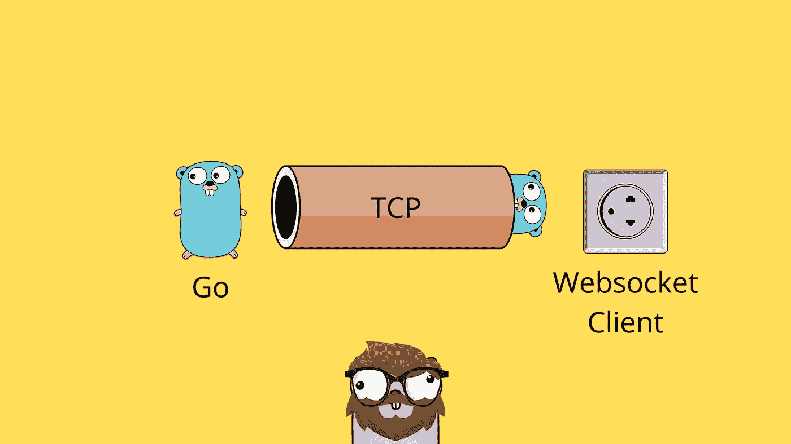
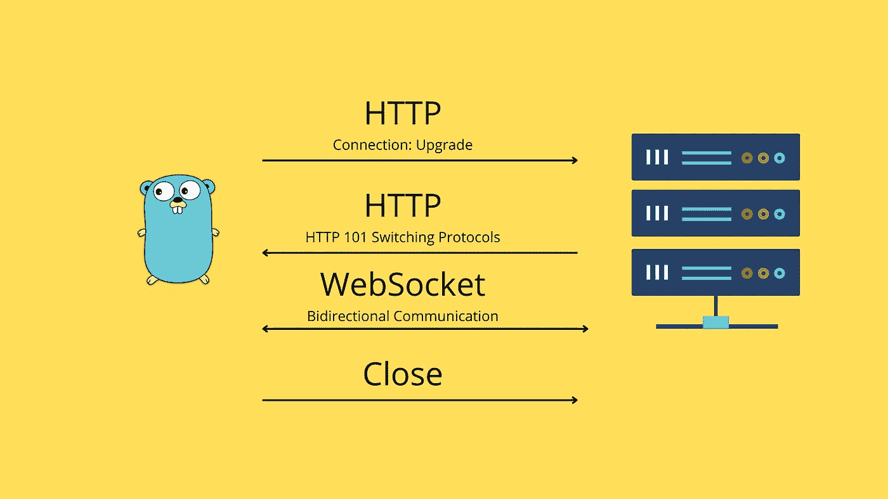
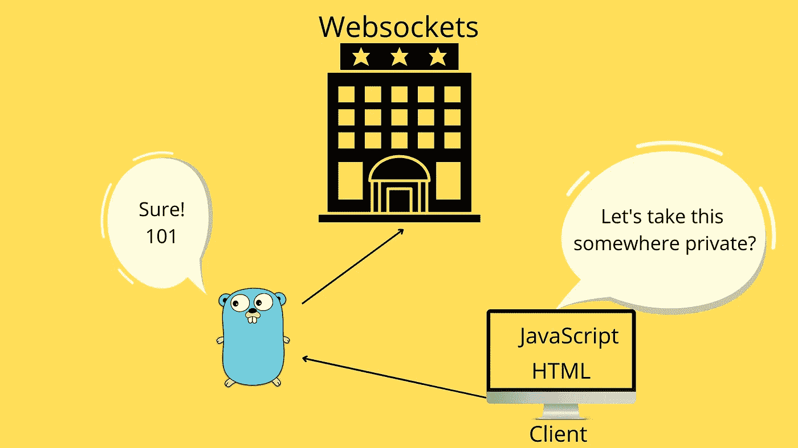
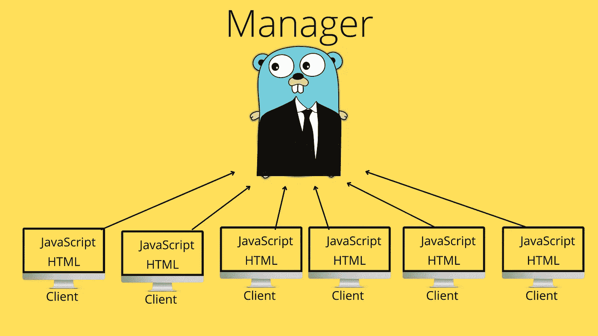
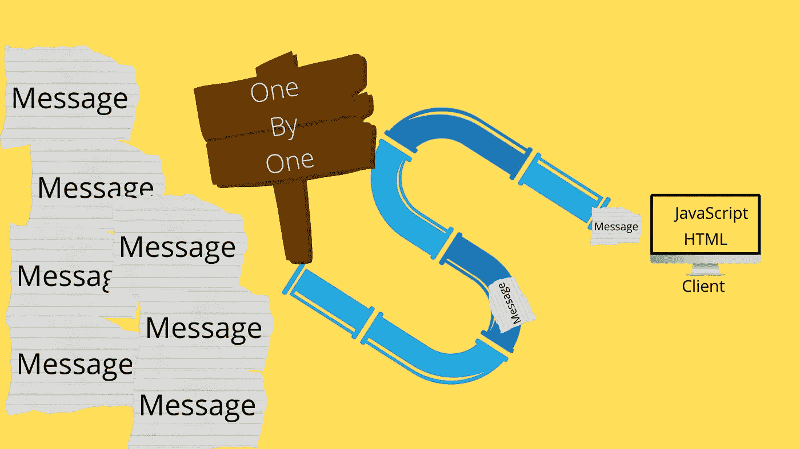
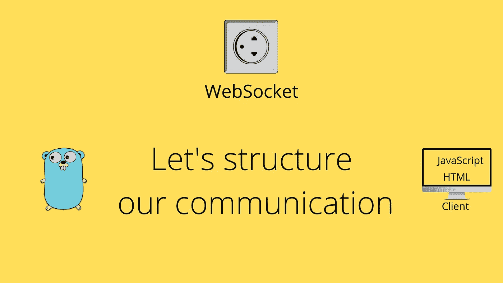
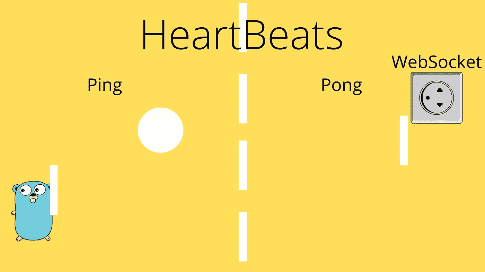
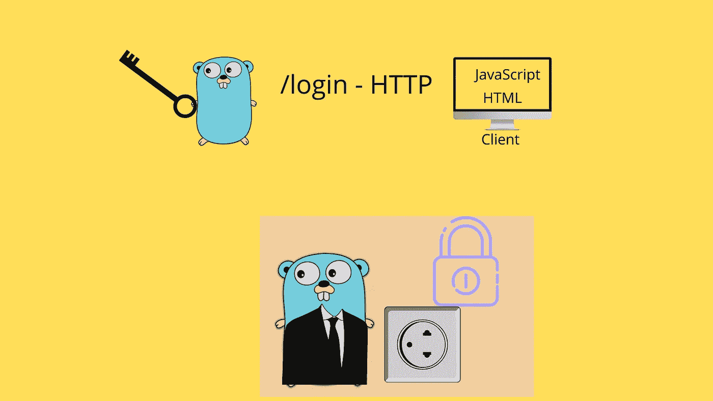
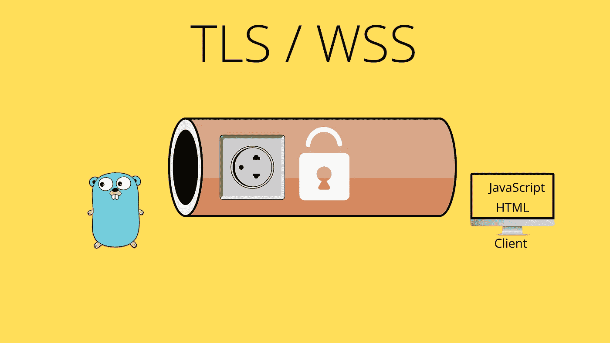

# 用 Go 掌握 WebSockets

> 原文：<https://towardsdatascience.com/mastering-websockets-with-go-c30d0ac48081>

## 关于如何在 Go 中使用 WebSockets 构建实时 API 的教程



图片由珀西·博尔梅尔提供。Gopher 由拓也·上田提供，原始 Go Gopher 由勒内·弗伦奇提供(CC BY 3.0)

如果我们仔细想想，常规的 HTTP APIs 是愚蠢的，就像，真的愚蠢。我们可以通过发送数据请求来获取数据。如果我们必须在网站上保持数据新鲜，我们将不得不不断地请求数据，即所谓的轮询。

> 本文中的所有图片均由珀西·博尔梅尔制作。Gopher 由上田拓也制作，Go Gopher 由蕾妮·弗伦奇原创(CC BY 3.0)

这就像让一个孩子坐在后座上问“我们到了吗”，而不是让司机说“我们到了”。这是我们在设计网站时开始使用的方式，很傻是不是？

令人欣慰的是，开发人员已经通过诸如 [WebSockets](https://developer.mozilla.org/en-US/docs/Web/API/WebSockets_API) 、 [WebRTC](https://webrtc.org/) 、 [gRPC](https://grpc.io/) 、 [HTTP2 Stream](https://web.dev/performance-http2/) 、 [ServerSent Events](https://developer.mozilla.org/en-US/docs/Web/API/Server-sent_events) 以及其他双向通信等技术解决了这个问题。

WebSockets 是最古老的双向通信方式之一，如今被广泛使用。它被大多数浏览器支持，并且相对容易使用。

在本教程中，我们将介绍什么是 WebSockets 以及它们如何工作，如何在 Go 中使用它们在服务器和客户端之间进行通信。我们还将探讨我在 WebSocket APIs 中看到的一些常见缺陷，以及如何解决它们。

在本教程中，我们将建立一个聊天应用程序，您可以进入不同的聊天室。WebSocket 服务器将使用 Go 构建，客户端使用普通 JavaScript 连接。当使用用 Go、Java、React 或任何其他语言编写的 Websocket 客户端进行连接时，我们学习和应用的模式可以很容易地进行调整。

这篇文章也有录音，可以在我的 YouTube 频道上看。

在 YouTube 上掌握 Go 中的 WebSockets

## 什么是 WebSockets &为什么您应该关注它



如何用简单的术语初始化 WebSocket

WebSocket 标准在 [RFC 645](https://www.rfc-editor.org/rfc/rfc6455#section-5.2) 中定义。

WebSockets 使用 HTTP 向服务器发送初始请求。这是一个普通的 HTTP 请求，但是它包含一个特殊的 HTTP 头`Connection: Upgrade`。这告诉服务器，客户机正试图将 HTTP 请求 TCP 连接升级到一个长期运行的 WebSocket。如果服务器用一个`HTTP 101 Switching Protocols`响应，那么连接将保持活动，使得客户端和服务器能够双向、全双工地发送消息。

一旦这个连接被同意，我们就可以发送和接收来自双方的数据。WebSockets 没有更多的内容，这可能是你开始使用它们所需要了解的。

如果你想更多地了解在安装过程中到底发生了什么，我可以推荐 RFC。

您可能想知道是否需要实时解决方案。所以这里有几个经常使用 WebSockets 的领域。

*   **聊天应用** —需要接收消息并转发给其他客户端的应用，这是 WebSockets 的完美匹配。
*   **游戏—** 如果你开发一款多人游戏，并且是基于网络的，那么 WebSockets 就是真正的天作之合。您可以从客户端推送数据，并将其广播给所有其他玩家。
*   **提要—** 对于需要数据提要的应用程序，可以使用 WebSockets 轻松地将更新的数据推送到任何客户端。
*   **实时数据—** 基本上，只要你有实时数据，WebSockets 就是一个很好的解决方案。

## 开始应用程序的基础


项目设置—一个 Go 后端和一个 JavaSript 客户端

我们将首先设置一个简单的 HTTP 服务器，它也使用文件服务器托管我们的 web 应用程序。我想避免使用 React 等任何 web 框架，所以我们将使用原生 JavaScript。通常，当连接到 WebSocket 时，步骤非常相似，所以将它移植到您使用的任何框架中应该没有问题。

首先初始化一个新模块

```
go mod init programmingpercy.tech/websockets-go
```

然后我们创建一个新文件`main.go`，这将是我们的应用程序的起点。

我们将首先设置应用程序来服务 API 并托管 HTML/JS 代码。一旦我们完成了这些，我们将开始实际的 WebSocket 实现，这样更容易理解。

让我们用一个简单的代码填充`main.go`来托管我们即将构建的网站。我们将只服务于`frontend`目录，我们将创建和存储前端代码。

main . go——第一个简单托管前端的版本

现在让我们添加前端，这将是一个简单的原始 HTML/JS/CSS 文件，显示我们惊人的期待聊天应用程序。它由一个表单`chatroom-selection`和另一个表单`chatroom-message`组成，前者供用户进入某个聊天室，后者用于通过 WebSocket 发送消息。

这只是简单的 HTML 和 JavaScript，但是还没有实现 WebSocket 实现。唯一值得一提的是`window["WebSocket"]`，这是一个全局变量，你可以用它来检查客户端的浏览器是否支持 WebSocket。如果没有定义，我们会提醒用户他们的浏览器不受支持。

创建一个名为`frontend`的文件夹和一个名为`index.html`的文件。然后用下列要点填充 index.html。我不会涉及 HTML 和 JS 部分，我希望你熟悉它们。

frontend/index.html —还没有 WebSockets 的简单网站

如果您在终端中运行带有`go run main.go`的应用程序，并访问 [localhost:8080](http://localhost:8080/?chatroom=1) ，您应该会看到一个令人惊叹的网站，它拥有我们开始实现 WebSockets 所需的一切。


localhost:8080 —令人惊叹的聊天应用程序

现在，发送消息和改变聊天室除了打印到控制台之外什么都不做，但这是我们将要实现的。

## 在客户端和服务器之间连接 WebSocket



连接客户端和服务器

为了开始，我们将添加到前端，以便它尝试连接到我们的 WebSocket API。这在 JavaScript 中很容易，只需一行代码就可以完成。

在 JavaScript 中，有一个内置的 WebSocket 库，无需导入任何东西就可以使用。我们可以用`new WebSocket(URL)`创建客户端，但是首先我们需要创建 URL。URL 由协议组成，就像常规的 HTTP URL 一样，后跟路径。将 WebSockets 放在一个`/ws`端点上是一个标准。

我们使用 WebSockets 时有两种协议，一种是`ws`，另一种是`wss`。它的工作原理就像 HTTP 和 HTTPS，额外的 S 代表安全，并将对流量应用 SSL 加密。

强烈建议使用它，但需要证书，我们稍后会应用它。

让我们在 windows.onload 函数中添加一行连接到`ws://localhost/ws`的代码。

index.html—添加了到后端的连接

现在，您可以继续运行程序，当您访问网站时，您应该会看到控制台上打印出一个错误，我们无法连接。这仅仅是因为我们的后端还不接受连接。

让我们更新后端代码以接受 WebSocket 连接。

我们将从构建我们的`Manager`开始，它用于服务连接并将常规 HTTP 请求升级到 WebSocket 连接，管理器还将负责跟踪所有客户端。

我们将使用 [Gorillas WebSocket](https://github.com/gorilla/websocket) 库来处理连接，这是通过创建一个`Upgrader`来完成的，它接收 HTTP 请求并升级 TCP 连接。我们将为升级程序分配缓冲区大小，该大小将应用于所有新客户端。

管理器将公开一个名为`serveWS`的常规 HTTP HandlerFunc，我们将在`/ws`端点上托管它。此时，我们将升级连接，然后简单地再次关闭它，但我们可以验证我们可以通过这种方式连接。

创建一个名为`manager.go`的文件，将要点中的代码填入其中。

manager.go —管理器起点，可以接受和升级 HTTP 请求

我们还需要将`serveWS`添加到`/ws`端点，以便前端可以连接。我们将启动一个新的管理器，并在`main.go`内的`setupAPI`函数中添加 HTTP 处理程序。

main.go —将管理器的服务功能作为端点公开

您可以通过运行以下命令来运行该软件

```
go run *.go
```

如果您继续访问该网站，您应该会注意到控制台中不再显示错误，现在连接已被接受。

## 客户和管理



负责所有客户的经理

我们可以将所有客户端逻辑添加到`serveWS`函数中，但是它可能会变得非常大。我建议创建一个用于处理单个连接的客户端结构，该结构负责与客户端相关的所有逻辑，并由管理器管理。

客户端还将负责以同时安全的方式读/写消息。Go 中的 WebSocket 连接只允许一个并发的 writer，所以我们可以通过使用无缓冲通道来处理这个问题。这是大猩猩库的开发者自己推荐的技术。

在我们实现消息之前，让我们确保创建了客户机结构，并赋予管理器添加和删除客户机的能力。

我已经创建了一个名为`client.go`的新文件，它现在很小，可以保存任何与我们的客户相关的逻辑。

我将创建一个名为`ClientList`的新类型，它只是一个可以用来查找客户端的地图。我还喜欢让每个客户端持有一个对管理器的引用，这允许我们更容易地管理状态，甚至从客户端。

client.go —客户端的第一份草稿

是时候更新`manager`来保存新创建的`ClientList`了。由于许多人可以并发连接，我们也希望管理器实现`sync.RWMutex`，这样我们可以在添加客户端之前锁定它。

我们还将更新`NewManager`函数来初始化一个客户端列表。

函数`serveWS`将被更新以创建一个带有连接的新客户端，并将其添加到管理器中。

我们还将使用插入客户端的`addClient`函数和删除客户端的`removeClient`函数来更新管理器。删除将确保优雅地关闭连接。

manager.go —能够添加和删除客户端的管理器

现在，我们已经准备好接受新客户并添加他们。我们还不能正确删除客户端，但我们很快就会这样做。

我们必须实现，以便我们的客户端可以读取和写入消息。

## 阅读和撰写邮件



以安全的方式同时编写消息

阅读和书写信息看起来似乎是一件简单的事情，事实也的确如此。然而，有一个许多人忽略的小陷阱。WebSocket 连接只允许有一个并发的 writer，我们可以通过让一个无缓冲的通道充当锁来解决这个问题。

我们将更新`manager.go`中的`serveWS`函数，以便在创建之后为每个客户端启动两个 goroutines。现在，我们将注释掉这段代码，直到完全实现。

manager.go —更新服务程序，为每个客户机启动读/写 goroutine

我们将从添加阅读过程开始，因为它稍微容易一些。

从套接字读取消息是通过使用`ReadMessage`完成的，它返回一个`messagetype`、有效载荷和一个错误。

消息类型用于解释发送的是什么类型的消息，是 Ping、pong、数据还是二进制消息等。所有类型都可以在 [RFC](https://rfc-editor.org/rfc/rfc6455.html#section-11.8) 中读到。

如果出现问题，就会返回错误，一旦连接关闭，也会返回一个错误。因此，我们将希望检查某些关闭消息来打印它们，但对于常规关闭，我们不会记录。

client.go —添加了阅读消息功能

我们可以更新前端代码，并尝试发送一些消息来验证它是否按预期工作。

在`index.html`中，我们有一个名为`sendMessage`的函数，它现在在控制台中打印出消息。我们可以简单地更新它，将消息推送到 WebSocket 上。用 JavaScript 发送消息就像使用`conn.send`函数一样简单。

index.html——传递信息

重新启动程序，在 UI 中输入一条消息，然后按 Send Message 按钮，您应该会看到在 stdout 中发送的消息类型和有效负载。

现在我们只能发送消息，但对消息什么也不做，是时候让我们增加写消息的能力了。

还记得我说过我们只能用一个并发进程来写 WebSocket 吗？这可以通过多种方式解决，Gorilla 自己推荐的一种方式是使用无缓冲通道来阻止并发写入。当任何进程想要在客户端的连接上写入时，它将改为将消息写入无缓冲通道，如果当前有任何其他进程正在写入，该通道将会阻塞。这使我们能够避免任何并发问题。

我们将更新`client`结构来保存这个通道，并更新构造函数来初始化它。

client.go —添加充当网关的出口通道

`writeMessages`功能与`readMessages`非常相似。然而，在这种情况下，我们不会收到一个错误，告诉我们连接被关闭。一旦`egress`通道关闭，我们将向前端客户端发送`CloseMessage`。

在 go 中，我们可以通过接受两个输出参数来查看通道是否关闭，第二个输出参数是一个布尔值，表示通道关闭。

我们将使用 connections `WriteMessage`函数，它接受 messagetype 作为第一个输入参数，接受 payload 作为第二个输入参数。

client.go —处理任何应该发送的消息的函数

如果你熟悉 Go，你可能已经注意到我们在这里使用了一个`for select`,它现在是多余的。在本教程的后面，我们将向选择中添加更多的案例。

> 确保在`serveWS`函数中取消`go client.writeMessages`的注释。

现在，在`egress`上推送的任何消息都将被发送到客户端。目前没有进程向出口写入消息，但是我们可以快速破解以测试它是否按预期工作。

我们会将在`readMessages`中收到的每条消息广播给所有其他客户端。我们将通过简单地将所有输入消息输出到每个客户端的出口来实现这一点。

client.go —在收到的每条消息中添加了一个小广播

我们只在第 29 行添加了 for 循环，稍后我们将删除它。这只是为了测试整个读写过程是否按预期进行。

是时候更新前端来处理传入的消息了。JavaScript 通过触发一些我们可以应用监听器的事件来处理 WebSocket 事件。

这些事件都在[文档](https://developer.mozilla.org/en-US/docs/Web/API/WebSocket)中进行了解释。我们可以很快覆盖它们。

*   **关闭** —当 WebSocket 关闭时触发。
*   **错误** —当 WebSocket 由于错误而关闭时触发。
*   **消息** —当 WebSocket 收到新消息时触发
*   **打开** —当 WebSocket 连接打开时触发。

根据您想要在前端做什么，您可以分配这些事件处理程序。我们对`message`事件感兴趣，所以我们将添加一个监听器，暂时只将它们打印到控制台。

一旦连接打开，我们将添加一个简单的函数来打印发送的事件。这个事件对象包含一堆数据，比如发送的时间戳和消息类型。我们将需要包含在`data`字段中的有效载荷。

index.html—添加 onmessage 侦听器来处理传入的消息

你现在可以尝试重启软件，访问网站并发送一些信息。您应该在控制台中看到事件正在被发送和接收。

这意味着现在读和写都有效。

## 使用事件方法进行缩放



构建在 WebSocket 上发送的消息

我们可以连接，我们现在可以发送和接收信息。这一切都很棒，我们有了一个基本的设置。

现在，如果你只想传递一种信息，这可能行得通。我通常发现创建一个基于事件/类型的方法使得扩展 WebSocket 更加容易。

这意味着我们创建了一个发送每条消息的默认格式。在这种格式中，我们有一个特定的字段来解释它是哪种消息类型，然后是一个有效载荷。

怎么，这听起来耳熟吗？

这是应该的，因为这基本上就是 WebSockets 现在正在做的事情。例外情况是，我们将消息作为 JSON 对象发送，我们的应用程序可以使用该对象来路由到要执行的正确操作/功能。

我发现这是一种易于使用、易于扩展并使 WebSocket 在许多用例中得到利用的方法。这是一种 RPC 解决方案。

我们首先在 JavaScript 文件中添加`Event`类，这样我们就可以解析传入的消息。然后，我们将这些事件传递给一个`routeEvent`函数，该函数检查字段`type`的值，并将事件传递给真正的处理程序。

在`onmessage`监听器中，我们希望 JSON 格式的数据适合事件类。

我们还将创建一个名为`sendEvent`的函数，它将接受一个事件名称和有效载荷。它根据输入创建事件，并将其作为 JSON 发送。

每当用户使用`sendMessage`发送消息时，它将调用`sendEvent`。

下面的要点展示了处理这个问题的 JavaScript 部分。

index.html—JavaScript 标签被更新以处理事件。

既然网站已经有了接受`Events`并发送它们的逻辑，我们还需要让后端处理它们。

首先创建一个名为`event.go`的文件，它将包含事件的所有逻辑。

我们希望在后端有一个`Event`结构，它应该是 JavaScript 事件类的一个副本。

Event . go—web socket 事件结构

注意，有效载荷的数据类型是一个`json.RawMessage`，因为我们希望用户能够发送他们想要的任何有效载荷。由事件处理程序来决定有效负载数据的结构。

当在后端接收到消息时，我们将使用`type`字段将其路由到适当的`EventHandler`，eventhandler 是一个函数签名。因此，通过创建满足签名模式的新函数来添加新功能是很容易的。

EventHandler 签名将接受消息来自的`Event`和`Client`。它也会返回一个错误。我们接受客户端，因为一些处理程序可能希望在完成后返回响应或向客户端发送其他事件。

我们还将添加一个`SendMessageEvent`,这是事件有效载荷中预期的格式。

event.go —添加了 EventHandler 签名和 SendMessageEvent

我喜欢让`Manager`存储`EventHandlers`的地图。这允许我很容易地添加东西，在一个真正的应用程序中，管理器可以包含一个数据库存储库，等等。我们将添加它，并添加一个名为`setupEventHandlers`的新函数，用于添加所需的函数。

拥有一堆处理程序的一个好方法是将这些`EventHandlers`存储在一个映射中，并使用`Type`作为键。因此，我们将保留一个包含所有处理程序的映射，而不是使用开关来路由事件。

我们添加了一个`routeEvent`函数，它接收传入的事件并从映射中选择正确的处理程序。

> 如果您有敏锐的眼光，您可能已经注意到 routeEvent 本身是一个 EventHandler，如果需要的话可以这样使用。

manager.go 向管理器添加了事件处理程序

在我们准备好整个事件基础设施之前，最后一件事是更改`Client`。客户端的`readMessages`应该将传入的 JSON 编组到一个`Event`中，然后使用`Manager`对其进行路由。

我们还将修改`Clients`出口通道，使其不发送原始字节，而是发送`Event`。这也意味着我们需要更改`writeMessages`来在发送数据之前整理数据。

client.go 添加了事件而不是原始字节的用法

您可以尝试使用`go run *.go`重启后端并发送消息。您应该会看到类似于`{send_message [34 49 50 51 34]}`的东西正在被打印。由于当前处理程序不解析原始字节，因此有效负载应该打印为字节。

在我们实现它之前，我想确保我们覆盖了一些与 WebSocket 相关的主题。

## 心跳——乒乓球



通过心跳保持连接

WebSockets 允许服务器和客户端发送一个`Ping`帧。Ping 用于检查连接的另一部分是否仍然存在。

但是我们不仅检查我们的其他连接是否还活着，而且我们还保持它活着。一个空闲的 WebSocket 将/可以关闭，因为它已经空闲了太长时间，Ping & Pong 允许我们轻松地保持通道活动，避免低流量的长时间运行的连接意外关闭。

每当发送了一个`Ping`时，另一方必须用一个`Pong`来响应。如果没有发送响应，可以假设对方已经不在人世。

这是合理的，你不能一直和没有回应的人说话。

为了实现它，我们将从`Server`代码开始。这意味着我们的 API 服务器将频繁地向每个客户端发送 ping，并等待 Pong，如果没有，我们将删除该客户端。

让我们从定义要使用的定时器开始。在`client.go`中，我们将创建一个`pongWait`和一个`pingInterval`变量。PongWait 是我们允许的 pong 之间的秒数，它将被来自客户端的每个 pong 重置。如果超过这个时间，我们将关闭连接，假设 10 秒钟的等待是合理的。

是我们向客户发送 pings 的频率。请注意，这必须低于 pongWait。如果我们有一个发送速度比 pongWait 慢的 PingInterval，pongWait 就会取消。

等等，如果我们每 15 秒发送一次 Ping，但只允许服务器在两次 Ping 之间等待 10 秒，那么连接将在 10 秒后关闭。

client.go —添加了计时变量，pingInterval 算法借用了 Gorilla

现在我们需要让服务器向每个客户端发送 ping 消息。这将在客户端的`writeMessages`函数中完成。我们将创建一个基于`pingInterval`触发的计时器，一旦触发，我们将发送一个类型为`PingMessage`的消息，其中包含一个空的有效负载。

我们在同一个函数中这样做的原因是，我们希望记住连接不允许并发写入。我们可以让另一个进程在出口发送一个 Ping，并在事件结构上添加一个 messageType 字段，但是我发现这个解决方案有点复杂。

因为我们在同一个函数中运行它，所以我们防止它并发写入，因为它要么从出口读取，要么从定时器读取，而不是同时从两者读取。

client . go—write messages 现在频繁发出 Pings

我们正在发送 Pings，我们不需要更新前端代码来响应。这是因为 RFC 规范说任何`PingMessage`都应该触发一个`PongMessage`来响应。支持 WebSocket 的浏览器已经自动内置，以便客户端能够响应 ping 消息。

所以`Server`正在向客户端发送 Pings。客户端用 Pong 消息响应，但是现在呢？

我们需要在服务器上配置一个`PongHandler`。PongHandler 是一个将在`PongMessage`上触发的功能。我们将更新`readMessages`来设置一个初始的`PongWait`计时器，一旦启动，它将开始倒计时连接保持活动的时间。

gorilla 软件包允许我们使用`SetReadDeadLine`功能轻松设置。我们将获取当前时间，添加 PongWait，并将其设置为连接。

我们还将创建一个名为`pongHandler`的新函数，每当客户端接收到一个`PongMessage`时，该函数将使用`SetReadDeadLine`重置计时器。

client.go 添加 PongHandler 以重置 pongs 之间的时间

太好了，现在我们保持连接活跃，使网站能够长期运行而不会断开连接。

尝试重新启动您的软件，并看到服务器上的日志打印 Pong 和 Pong。

我们已经实现了大部分的东西，现在是一些安全的时候了。

## 限制邮件大小


限制邮件大小很重要

安全的一个规则是总是预期恶意使用。如果人们可以，他们会的。因此，有一件事是一定要做的，那就是限制服务器上允许处理的最大消息大小。

这是为了避免恶意用户向 DDOS 发送大量帧或在您的服务器上做其他坏事。

Gorilla 使用接受所允许的字节数的`SetReadLimit`使得在后端配置变得非常容易。如果消息大于限制，它将关闭连接。

您必须知道邮件的大小，这样您就不会限制正确使用应用程序的用户。

在聊天中，我们可以对前端施加字符限制，然后指定与最大消息匹配的最大大小。

我将设置一个限制，每条消息最多可以有 512 个字节。

client.go 设置最大读取限制可防止产生大量帧

如果您重新启动并尝试发送长消息，连接将关闭。

## 原产地检查


检查始发位置很重要

目前，我们允许来自任何地方的连接连接到我们的 API。这不是很好，除非那是你想要的。

通常，你有一个托管在某个服务器上的前端，并且那个域是唯一允许连接的源。这样做是为了防止[跨站点请求伪造](https://owasp.org/www-community/attacks/csrf)。

为了处理来源检查，我们可以构建一个接受 HTTP 请求的函数，并使用一个简单的字符串检查来查看来源是否被允许。

这个函数必须跟在签名`func(r *http.Request) bool`之后，因为将常规 HTTP 请求升级为 HTTP 连接的`upgrader`有一个字段接受这样的函数。在允许连接升级之前，它将根据请求执行我们的函数来验证来源。

manager.go 向 HTTP 升级程序添加了原点检查

如果您想测试它，您可以将 switch 语句中的端口改为除了`8080`之外的端口，并尝试访问 UI。你应该会看到它崩溃了，并显示一条消息`request origin not allowed`。

## 证明



验证 WebSocket 连接

API 的一个重要部分是，我们应该只允许能够进行身份验证的用户。

WebSocket 没有内置任何身份验证工具。不过这不是问题。

在允许用户建立 WebSocket 连接之前，我们将在`serveWS`函数中对用户进行身份验证。

有两种常见的方法。它们都有一定的复杂性，但不会破坏交易。很久以前，您可以通过在 Websocket 连接 URL 中添加`user:password`来通过常规的基本认证。这已经被否决了一段时间了。

有两种推荐的解决方案

1.  进行身份验证的常规 HTTP 请求返回一次性密码(OTP ),该密码可用于连接到 WebSocket 连接。
2.  连接 WebSocket，但是不要接受任何消息，直到发送了一个带有凭据的特殊身份验证消息。

我更喜欢第一个选项，主要是因为我们不希望机器人发送垃圾连接。

所以流量会是

1.  用户使用常规 HTTP 进行身份验证，OTP 票证返回给用户。
2.  用户使用 URL 中的 OTP 连接到 WebSocket。

为了解决这个问题，我们将创建一个简单的 OTP 解决方案。注意，这个解决方案非常简单，使用官方 OTP 包等可以做得更好，这只是为了展示这个想法。

我们将制作一个`RetentionMap`,它是一个保存 OTP 的简单地图。任何超过 5 秒的 OTP 都将被丢弃。

我们还必须创建一个新的`login`端点，接受常规的 HTTP 请求并验证用户。在我们的例子中，认证将是一个简单的字符串检查。在实际的生产应用程序中，您应该用实际的解决方案来代替身份验证。涵盖认证本身就是一篇完整的文章。

需要更新`serveWS`,以便一旦用户调用它，它就验证 OTP，并且我们还需要确保前端沿着连接请求发送 OTP。

让我们从改变前端开始。

我们想创建一个简单的登录表单，并呈现它，以及显示我们是否连接的文本。所以我们将从更新`index.html`主体开始。

index.html—在正文中添加了登录表单

接下来，我们将在 document onload 事件中删除 WebSocket 连接。因为我们不想在用户登录之前尝试连接。

我们将创建一个接受 OTP 输入的`connectWebsocket`函数，它被附加为 GET 参数。我们不将其作为 HTTP 头或 POST 参数添加的原因是，浏览器中可用的 WebSocket 客户端不支持它。

我们还将更新`onload`事件，为 loginform 分配一个处理程序。该处理程序将向`/login`发送一个请求，并等待 OTP 返回，一旦返回，它将触发一个 WebSocket 连接。认证失败只会发送一个警报。

使用`onopen`和`onclose`我们可以向用户打印出正确的连接状态。更新`index.html`中的脚本部分，使其具有以下功能。

index.html—在脚本部分添加支持 OTP 的 websocket

您现在可以尝试前端，当您尝试登录时应该会看到一个警告。

在将这些更改应用到前端之后，是时候让后端验证 OTP 了。有许多方法可以创建 OTP，有一些库可以帮助您。为了使本教程简单，我编写了一个非常基本的助手类，它为我们生成 OTP，一旦它们过期就删除它们，并帮助我们验证它们。有更好的方法来处理 OTP。

我创建了一个名为`otp.go`的新文件，其中包含以下要点。

otp.go —删除过期密钥的保留映射

我们需要更新管理器来维护一个`RetentionMap`，我们可以用它来验证`serveWS`中的 OTP，并在用户使用`/login`登录时创建新的 OTP。我们将保持期设置为 5 秒，我们还需要接受一个`context`，这样我们就可以取消底层的 goroutine。

manager.go —更新了结构以具有 RetentionMap

接下来，我们需要实现在`/login`上运行的处理程序，这将是一个简单的处理程序。您应该用一个真正的登录验证系统来替换身份验证部分。我们的处理程序将接受带有`username`和`password`的 JSON 格式的有效载荷。

如果用户名是`percy`而密码是`123`，我们将生成一个新的 OTP 并返回，如果不匹配，我们将返回一个未授权的 HTTP 状态。

我们还更新了`serveWS`来接受一个`otp` GET 参数。

manager.go —更新了 ServeWS 和登录以处理 OTP

最后，我们需要更新`main.go`来托管`login`端点，并向管理器传递一个上下文。

main.go —向管理器添加登录端点和取消上下文

一旦您完成了所有这些工作，您现在应该能够使用前端了，但是只有在您成功地使用了登录表单之后。

试试看，按`Send Message`什么都不会。但是在你登录之后，你可以查看它正在获取消息的 WebSocket。

我们将只把事件打印到控制台，但是我们会到达那里。还有最后一个安全问题。

## 使用 HTTPS 和 WSS 加密流量



加密流量

让我们明确一件重要的事情，现在我们正在使用明文流量，投入生产的一个非常重要的部分是使用 HTTPS。

为了让 WebSockets 使用 HTTPS，我们可以简单地将协议从`ws`升级到`wss`。WSS 是 WebSockets Secure 的首字母缩写。

打开`index.html`，更换`connectWebsocket`中的连接部分，使用 WSS。

index.html 将 wss 协议添加到连接字符串中

如果你现在试用 UI，它将无法连接，因为后端不支持 HTTPS。我们可以通过向后端添加证书和密钥来解决这个问题。

如果您没有自己的证书，请不要担心，我们将自行签署一个证书，以便在本教程中使用。

我已经创建了一个使用 OpenSSL 创建自签名证书的小脚本。你可以在他们的 [Github](https://github.com/openssl/openssl#build-and-install) 上看到安装说明。

创建一个名为`gencert.bash`的文件，如果你使用的是 Windows，你可以手动运行命令。

gencert.bash —创建自签名证书

执行命令或运行 bash 脚本。

```
bash gencert.bash
```

你会看到两个新文件，`server.key`和`server.crt`。你不应该分享这些文件。把它们存储在一个更好的地方，这样你的开发者就不会不小心把它们推到 GitHub 上(相信我，这种情况会发生，人们有发现这些错误的机器人)

> 我们创建的证书只能用于开发目的

一旦有了这些，我们将不得不更新`main.go`文件来托管 HTTP 服务器，使用证书来加密流量。这是通过使用`ListenAndServeTLS`而不是`ListenAndServe`来完成的。它的工作原理是一样的，但是也接受一个证书文件和一个密钥文件的路径。

main.go —使用 ListenAndServeTLS 而不是使用 HTTPs

不要忘记更新`originChecker`以允许 HTTPS 域。

manager.go —必须更新源以支持 https

使用`go run *.go`重启服务器，这一次，改为访问 [https](https://localhost:8080/) 站点。

> 根据您的浏览器，您可能不得不接受该域是不安全的

您可能会看到如下所示的错误

```
2022/09/25 16:52:57 http: TLS handshake error from [::1]:51544: remote error: tls: unknown certificate
```

这是一个远程错误，这意味着它正从客户端发送到服务器。这说明浏览器无法识别您的证书提供商(您),因为它是自签名的。不用担心，因为这是一个自签名证书，只在开发中使用。

如果您使用的是真实的证书，您将不会看到该错误。

恭喜你，你现在使用的是 HTTPS，你的 Websocket 使用的是 WSS。

## 实现一些事件处理程序

在我们结束本教程之前，我希望我们实现实际的事件处理程序，以使聊天正常工作。

我们只实现了关于 WebSockets 的框架。是时候根据处理程序实现一些业务逻辑了。

我不会涵盖更多的架构原则或关于 WebSockets 的信息，我们只会通过最终确定获得一些实际操作，不会太多。希望您将看到使用这种事件方法向 WebSocket API 添加更多的处理程序和逻辑是多么容易。

让我们从更新`manager.go`开始，在`setupEventHandlers`中接受一个实函数。

manager.go 改为将 SendMessageHandler 作为输入添加到事件处理程序中。

我们希望实现`SendMessageHandler`，它应该在传入事件中接受一个有效载荷，对其进行编组，然后将其输出到所有其他客户端。

在`event.go`里面我们可以添加以下内容。

event.go —添加用于广播消息的真实处理程序

这就是我们在后端需要做的一切。我们必须清理前端，以便 javascript 以想要的格式发送有效载荷。所以让我们用 JavaScript 添加相同的类，并在事件中发送它。

在`index.html`的脚本部分的顶部，为两种事件类型添加类实例。它们必须匹配`event.go`中的结构，以便 JSON 格式是相同的。

index.html——在脚本标签中，我们定义了两个类

然后我们必须更新当有人发送新消息时触发的`sendMessage`函数。我们必须让它发送正确的有效载荷类型。

这应该是一个`SendMessageEvent`有效载荷，因为这是服务器中的处理程序所期望的。

index.html——sendMessage 现在发送正确的有效载荷

最后，一旦客户端收到消息，我们应该将它打印到文本区域，而不是控制台。让我们更新`routeEvent`以期待一个`NewMessageEvent`并将其传递给一个函数，该函数将消息追加到文本区域。

index.html—已添加，以便客户端在收到消息后打印该消息

您现在应该能够在客户端之间发送消息了，您可以轻松地尝试一下。打开两个浏览器选项卡上的 UI，登录开始和自己聊天，但是不要熬夜！

我们可以很容易地修复它，这样我们就可以管理不同的聊天室，这样我们就不会把所有的消息都发给每个人。

让我们从在`index.html`中添加一个新的`ChangeRoomEvent`开始，并更新用户已经切换聊天室的聊天。

index.html—增加了更衣室事件和逻辑

将`manager.go`中的新 ChangeEvent 添加到`setupEventHandlers`中，以处理这个新事件。

manager.go —添加了 chattroomevent & chattroomhandler

我们可以在客户端结构中添加一个`chatroom`字段，这样我们就可以知道用户选择了哪个聊天室。

client.go 添加聊天室字段

在`event.go`中，我们将添加`ChatRoomHandler`，它将简单地覆盖客户端中新的`chatroom`字段。

我们还将确保`SendMessageHandler`在发送事件之前检查其他客户端是否在同一房间。

event.go 添加了 ChatRoomHandler

太好了，我们知道这是一个多么优秀的聊天应用程序，它允许用户切换聊天室。

您应该访问 UI 并尝试一下！

## 结论

在本教程中，我们为 Websocket 服务器构建了一个完整的框架。

我们有一个以安全、可伸缩和可管理的方式接受 WebSockets 的服务器。

我们涵盖了以下几个方面

1.  如何连接 WebSockets
2.  如何有效地向 WebSockets 读写消息？
3.  如何用 WebSockets 构建 go 后端 API
4.  如何为易于管理的 WebSocket API 使用基于事件的设计？
5.  如何使用名为乒乓的心跳技术保持联系
6.  如何通过限制消息大小来避免巨型帧，从而避免用户利用 WebSocket。
7.  如何限制 WebSocket 允许的源
8.  如何通过实现 OTP 票务系统在使用 WebSockets 时进行身份验证
9.  如何将 HTTPS 和 WSS 添加到 WebSockets？

我坚信本教程涵盖了在开始使用 WebSocket API 之前需要学习的所有内容。

如果您有任何问题、想法或反馈，我强烈建议您联系我们。

我希望你喜欢这篇文章，我知道我喜欢。