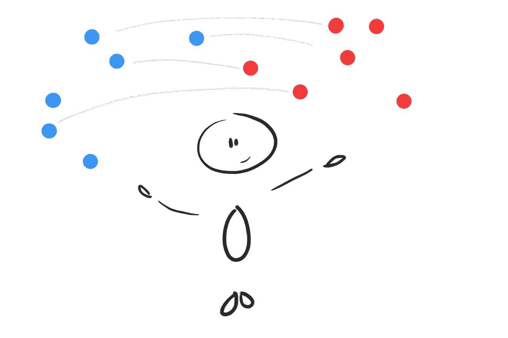
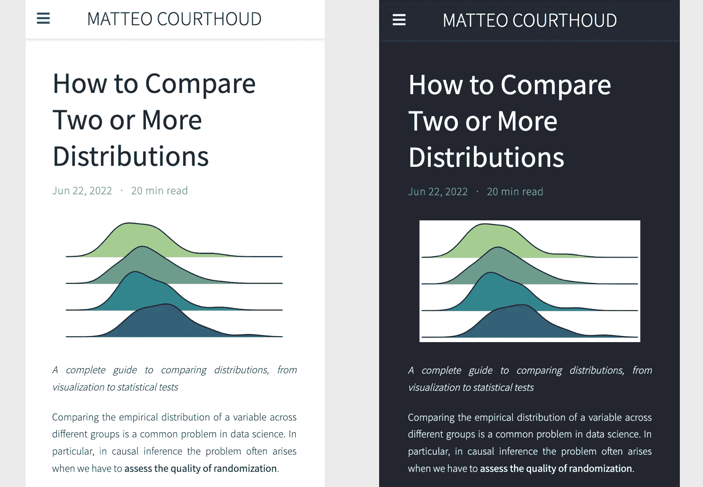
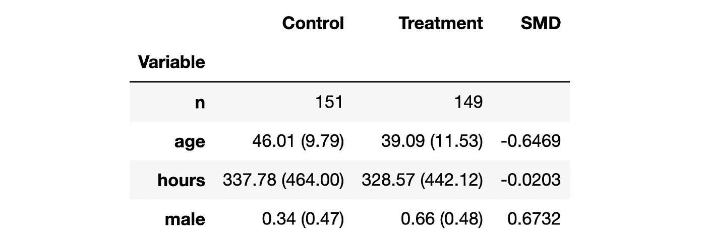
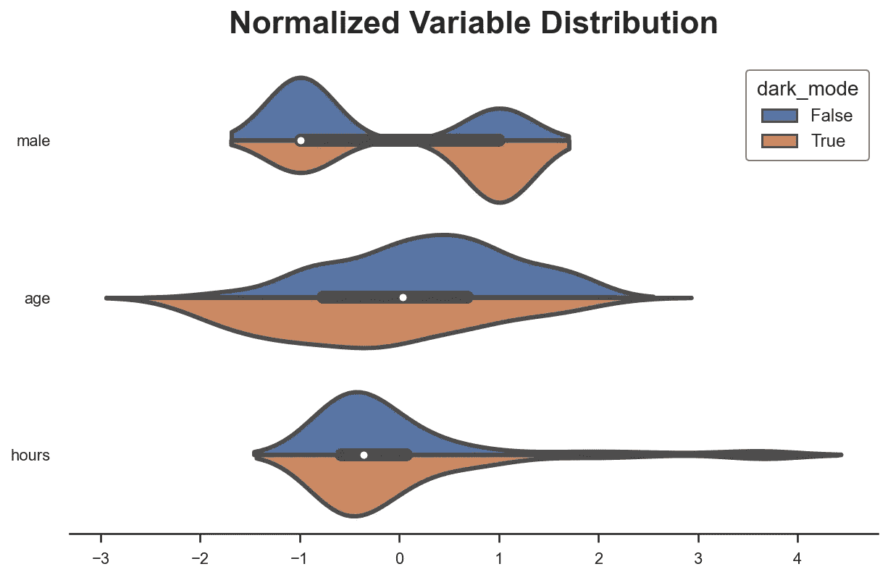
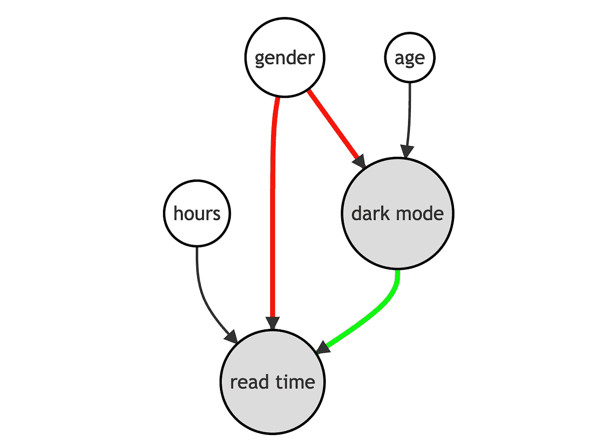
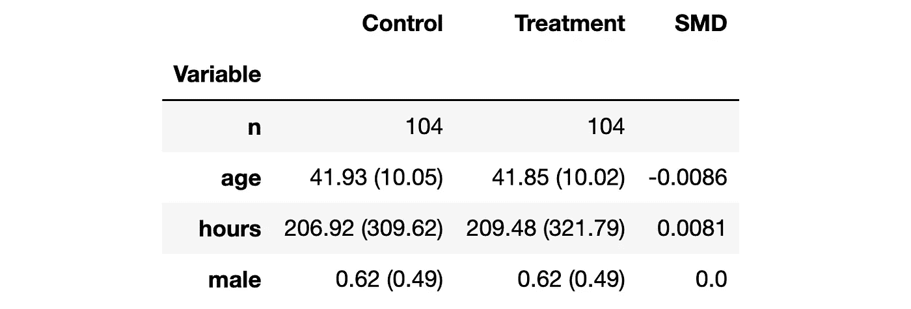
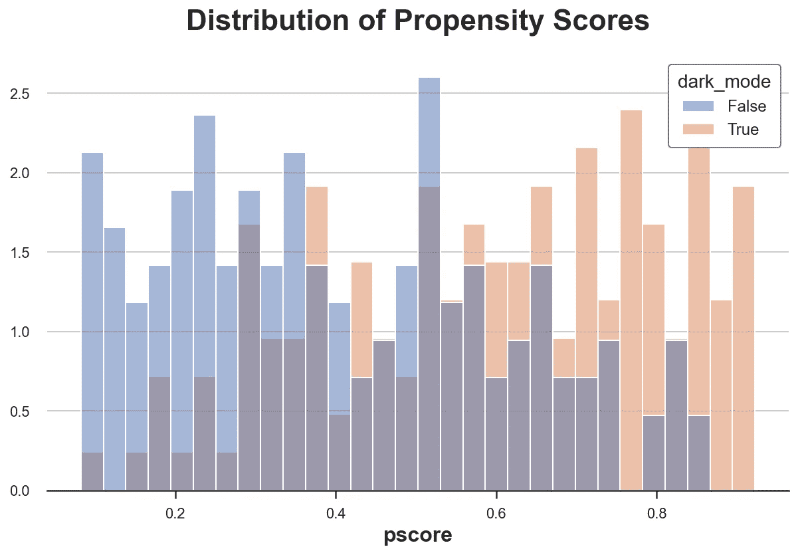
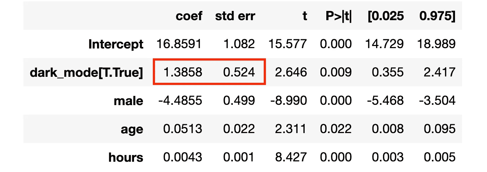

# 匹配，加权，还是回归？

> 原文：<https://towardsdatascience.com/matching-weighting-or-regression-99bf5cffa0d9>

## [因果数据科学](https://towardsdatascience.com/tagged/causal-data-science)

## *理解和比较条件因果推理分析的不同方法*



封面图片，由我的好朋友 [Chiara](https://chiaraaina.github.io/) 绘制

A/B 检验或随机对照试验是因果推断中的**金标准**。通过随机将单位暴露于治疗，我们确保平均而言，治疗和未治疗的个体是可比较的，并且我们观察到的任何结果差异都可以单独归因于治疗效果。

然而，通常治疗组和对照组**并不完全可比**。这可能是由于随机化不完善或不可用的事实。出于伦理或实践的原因，随机处理并不总是可能的。即使我们可以，有时我们没有足够的个人或单位，所以群体之间的差异是可以捕捉的。这种情况经常发生，例如，当随机化不是在个体水平上进行，而是在更高的聚合水平上进行，如邮政编码、县甚至州。

在这些情况下，如果我们有足够的关于个体的信息，我们仍然可以恢复治疗效果的因果估计。在这篇博文中，我们将介绍并比较不同的程序，以评估治疗组和对照组之间存在的**完全可观察到的**不平衡的因果关系。特别是，我们将分析加权、匹配和回归过程。

# 例子

假设我们有一个关于统计和因果推理的博客。为了改善用户体验，我们正在考虑**发布一个黑暗模式**，我们想了解这个新功能是否会增加用户在我们博客上花费的时间。



对照组(左)和治疗组(右)的网站视图，图片由作者提供

我们不是一家成熟的公司，因此我们不进行 A/B 测试，而是简单地释放黑暗模式，我们观察用户是否选择它以及他们在博客上花费的时间。我们知道可能会有**选择**:偏好黑暗模式的用户可能会有不同的阅读偏好，这可能会使我们的因果分析变得复杂。

我们可以用下面的 [**有向无环图(DAG)**](/b63dc69e3d8c) 来表示数据生成过程。


数据生成过程的 DAG，按作者排序的图像

我们使用来自`[src.dgp](https://github.com/matteocourthoud/Blog-Posts/blob/main/notebooks/src/dgp.py)`的数据生成过程`dgp_darkmode()`生成模拟数据。我还从`[src.utils](https://github.com/matteocourthoud/Blog-Posts/blob/main/notebooks/src/utils.py)`引进了一些绘图函数和库。

```
from src.utils import *
from src.dgp import dgp_darkmodedf = dgp_darkmode().generate_data()
df.head()
```


数据快照，图片由作者提供

我们有 300 名用户的信息，我们观察他们是否选择了`dark_mode`(治疗)、他们每周的`read_time`(感兴趣的结果)以及一些特征，如`gender`、`age`和以前在博客上花费的总`hours`。

我们想估计一下新的`dark_mode`对用户`read_time`的影响。如果我们运行一个 [**A/B 测试**](https://de.wikipedia.org/wiki/A/B-Test) 或随机对照试验，我们可以比较使用和不使用黑暗模式的用户，我们可以将平均阅读时间的差异归因于`dark_mode`。让我们看看我们会得到什么数字。

```
np.mean(df.loc[df.dark_mode==True, 'read_time']) - np.mean(df.loc[df.dark_mode==False, 'read_time'])-0.4446330948042103
```

选择`dark_mode`的人平均每周花在博客上的时间少了 0.44 小时。我们应该断定`dark_mode`是一个**坏主意**吗？这是因果关系吗？

我们没有随机化`dark_mode`，因此选择它的用户可能无法与没有选择它的用户直接**比较**。我们能证实这种担忧吗？部分地。在我们的设置中，我们只能检查我们观察到的特征、`gender`、`age`和总计`hours`。我们无法检查用户是否在我们没有观察到的其他维度上存在差异。

让我们使用优步`[causalml](https://causalml.readthedocs.io/)`包中的`create_table_one`函数来生成一个**协变量平衡表**，包含我们在治疗组和对照组中可观察特征的平均值。顾名思义，这应该永远是你在因果推断分析中呈现的第一张表。

```
from causalml.match import create_table_one

X = ['male', 'age', 'hours']
table1 = create_table_one(df, 'dark_mode', X)
table1
```



平衡表，作者图片

治疗组(`dark_mode`)和对照组之间似乎存在**一些差异**。特别是，选择`dark_mode`的用户更年轻，花在博客上的时间更少，他们更有可能是男性。

另一种同时观察所有差异的方法是使用**成对的小提琴手**。成对紫线图的优点是它允许我们观察变量的完整分布(通过[核密度估计](https://en.wikipedia.org/wiki/Kernel_density_estimation)近似)。



变量分布，按作者分类的图像

violinplot 的洞察力非常相似:似乎选择了`dark_mode`的用户和没有选择的用户是不同的。

我们为什么关心？

如果我们不控制可观察的特征，我们就无法估计真实的治疗效果。简而言之，我们不能确定结果的差异(T3)可以归因于治疗(T4)，而不是其他特征。例如，可能男性阅读较少，也更喜欢`dark_mode`，因此我们观察到负相关，即使`dark_mode`对`read_time`没有影响(甚至是正相关)。

就有向无环图而言，这意味着我们有一个 [**后门路径**](/b63dc69e3d8c) ，我们需要**阻塞**以便我们的分析是**因果**。



无条件分析的 DAG，图片由作者提供

我们如何**阻止后门路径**？通过对这些中间变量进行分析，在我们的例子中是`gender`。条件分析允许我们恢复`dark_mode`对`read_time`的**因果关系**。进一步调整`age`和`hours`的分析，可以提高我们估计的**精度**，但不会影响结果的因果解释。


条件分析的 DAG，按作者排序的图像

我们如何在`gender`、`age`和`hours`上对进行分析？我们有一些选择:

*   **匹配**
*   **倾向评分**权重
*   **带控制变量的回归**

让我们一起来探索和比较一下吧！

# 条件分析

我们假设对于一组受试者 *i = 1，…，n* ，我们观察到一个元组 *(Dᵢ，Yᵢ，Xᵢ)* 包括

*   一个治疗分配 *Dᵢ ∈ {0，1}* ( `dark_mode`)
*   一个回应 *Yᵢ ∈ ℝ* ( `read_time`)
*   一个特征向量 *Xᵢ ∈ ℝⁿ* ( `gender`、`age`和`hours`)

**假设 1:不可发现性**(或可忽略性，或对可观察性的选择)


无根据假设，作者的图像

即以可观察特征 *X* 为条件，治疗分配 *D* 几乎是随机的。我们实际假设的是，没有我们没有观察到的其他特征会影响用户是否选择`dark_mode`和他们的`read_time`。这是一个**强假设**，我们观察到的个人特征越多，这个假设就越有可能得到满足。

**假设 2:重叠**(或共同支撑)


重叠假设，作者图片

即没有观察结果被确定地分配给治疗组或对照组。这是一个更技术性的假设，基本上意味着对于任何级别的`gender`、`age`或`hours`，可能存在选择`dark_mode`的个体和不选择`dark_mode`的个体。与未发现假设相反，重叠假设是**可检验的**。

## 相称的

执行条件分析的第一个也是最直观的方法是**匹配**。

搭配的**思路**很简单。例如，由于我们不确定男性和女性用户是否可以直接比较，所以我们在性别范围内进行分析。我们不是在整个样本中比较`read_time`和`dark_mode`，而是针对男性和女性用户分别进行比较。

```
df_gender = pd.pivot_table(df, values='read_time', index='male', columns='dark_mode', aggfunc=np.mean)
df_gender['diff'] = df_gender[1] - df_gender[0] 
df_gender
```


不同性别、不同作者的平均阅读时间差异

现在`dark_mode`的效果似乎颠倒了:对男性用户来说是负的(-0.03)，但对女性用户来说是正的且更大(+1.93)，这表明了正的聚合效应，1.93 - 0.03 = 1.90(假设性别比例相等)！这种符号颠倒是辛普森悖论的一个非常经典的例子。

对于`gender`，这个比较很容易执行，因为它是一个二进制变量。由于多个变量可能是连续的，匹配变得更加困难。一个常见的策略是**使用某种[最近邻算法](https://en.wikipedia.org/wiki/Nearest_neighbour_algorithm)将治疗组中的用户**与对照组中最相似的用户进行匹配。我不会在这里深入算法细节，但是我们可以用`causalml`包中的`NearestNeighborMatch`函数来执行匹配。

`NearestNeighborMatch`功能生成一个新的数据集，其中治疗组中的用户已与对照组中的用户 1:1 匹配(选项`ratio=1`)。

```
from causalml.match import NearestNeighborMatch

psm = NearestNeighborMatch(replace=True, ratio=1, random_state=1)
df_matched = psm.match(data=df, treatment_col="dark_mode", score_cols=X)
```

现在两个群体是不是更有可比性了？我们可以生产新版本的**平衡表**。

```
table1_matched = create_table_one(df_matched, "dark_mode", X)
table1_matched
```



匹配后的平衡表，图片由作者提供

现在两组之间的平均差异已经缩小了至少几个数量级。但是，请注意样本大小略有减少(300 → 208 ),因为(1)我们只匹配经过治疗的用户，而(2)我们无法为所有用户找到良好的匹配。

我们可以用成对的小提琴手来观察分布的差异。

```
plot_distributions(df_matched, X, "dark_mode")
```


匹配后控制变量的分布，按作者排列的图像

可视化匹配前后协变量平衡的一种流行方法是**平衡图**，它基本上显示了每个控制变量匹配前后的标准化平均差异。


平衡情节，作者图像

正如我们所看到的，现在两组之间所有可观察特征的差异基本上为零。我们也可以使用其他度量或测试统计来比较这些分布，例如 [Kolmogorov-Smirnov 测试统计](/9b06ee4d30bf)。

我们如何**估计治疗效果**？我们可以简单地在手段上有所不同。一种自动提供标准误差的等效方法是对治疗结果`dark_mode`进行线性回归`read_time`。

**请注意**，由于我们已经为每个接受治疗的用户执行了匹配*，我们估计的治疗效果是接受治疗者(ATT)的**平均治疗效果，**如果接受治疗的样本不同于总体样本(很可能是这种情况，因为我们首先在进行匹配)，则平均治疗效果可能不同。*

```
smf.ols("read_time ~ dark_mode", data=df_matched).fit().summary().tables[1]
```


匹配后回归结果，按作者排序的图像

这种影响现在是积极的，在 5%的水平上有统计学意义。

**注意**我们可能将多个治疗过的用户与同一个未治疗的用户进行了匹配，这违反了**跨观察的独立性假设**，进而扭曲了推论。我们有两种解决方案:

1.  **聚类**预匹配个体水平的标准误差
2.  通过**引导程序**计算标准误差(首选)

我们通过原始的个体标识符(数据帧索引)来实现第一和集群标准误差。

```
smf.ols("read_time ~ dark_mode", data=df_matched)\
    .fit(cov_type='cluster', cov_kwds={'groups': df_matched.index})\
    .summary().tables[1]
```


聚类 SEs 的匹配后回归结果，按作者排序的图像

现在这种影响在统计学上不那么显著了。

## 倾向得分

[Rosenbaum 和 Rubin (1983)](https://academic.oup.com/biomet/article/70/1/41/240879) 证明了一个非常有力的结果:如果**强可忽略性假设**成立，则足以使分析以治疗的概率**倾向得分**为条件，以便具有条件独立性。


罗森鲍姆和鲁宾(1983)的结果，由作者图像

其中 *e(Xᵢ)* 是个体 *i* 接受治疗的概率，给定可观察特征 *Xᵢ* 。


倾向得分，按作者分类的图像

**注意**在 A/B 测试中，个人的倾向得分是不变的。

Rosenbaum 和 Rubin (1983 年)的结果令人难以置信地**强大而实用**，因为倾向得分是一个**一维**变量，而控制变量 *X* 可能是非常高维的。

在上面介绍的**不成立**假设下，我们可以将平均治疗效果改写为


平均治疗效果，图片由作者提供

注意，这个平均治疗效果的公式并不取决于潜在的结果*yᵢ*⁽⁾*yᵢ*⁽⁰⁾，而仅仅取决于观察到的结果 *Yᵢ* 。

这个平均治疗效果的公式意味着**反向倾向加权(IPW)** 估计量，它是平均治疗效果 *τ* 的无偏估计量。


平均治疗效果的 IPW 估计值，图片由作者提供

这个估计量**不可行**，因为我们没有观察到倾向得分*e(xᵢ】*。但是，我们可以估计它们。实际上， [Imbens，Hirano，Ridder (2003)](https://onlinelibrary.wiley.com/doi/abs/10.1111/1468-0262.00442) 表明，即使你知道真实值(例如，因为你知道抽样程序)，你**也应该**使用估计的倾向得分。这个想法是，如果估计的倾向分数与真实的不同，这可以在估计中提供信息。

估计概率有几种可能的方法，最简单最常见的是 [**逻辑回归**](https://en.wikipedia.org/wiki/Logistic_regression) 。

```
from sklearn.linear_model import LogisticRegressionCVdf["pscore"] = LogisticRegressionCV().fit(y=df["dark_mode"], X=df[X]).predict_proba(df[X])[:,1]
```

最佳实践是，每当我们拟合一个预测模型时，**在一个不同的样本**上拟合该模型，相对于我们用于推断的样本。这种做法通常被称为**交叉验证**或交叉拟合。最好的(但计算代价昂贵的)交叉验证程序之一是**留一法(LOO)** 交叉拟合:当预测观察值 *i、*时，我们使用除了 *i* 之外的所有观察值。我们使用`[skearn](https://scikit-learn.org/)`包中的`cross_val_predict`和`LeaveOneOut`函数实现 LOO 交叉拟合过程。

```
from sklearn.model_selection import cross_val_predict, LeaveOneOutdf['pscore'] = cross_val_predict(estimator=LogisticRegressionCV(), 
                                 X=df[X], 
                                 y=df["dark_mode"],
                                 cv=LeaveOneOut(),
                                 method='predict_proba',
                                 n_jobs=-1)[:,1]
```

在估计倾向分数后，一个重要的检查是在治疗组和对照组之间绘制倾向分数。首先，我们然后可以观察两组是否平衡，这取决于两个分布有多接近。此外，我们还可以检查满足**重叠假设**的可能性。理想情况下，两种分布应该跨越相同的时间间隔。

```
sns.histplot(data=df, x='pscore', hue='dark_mode', bins=30, stat='density', common_norm=False).\
    set(ylabel="", title="Distribution of Propensity Scores");
```



倾向得分分布，按作者分类的图像

正如预期的那样，治疗组和对照组之间的倾向得分分布**显著不同**，这表明两组几乎没有可比性。然而，这两个分布跨越了相似的区间，表明重叠假设可能得到满足。

我们如何**估计平均治疗效果**？

一旦我们计算出倾向得分，我们只需要用各自的倾向得分对**观察值进行加权。然后，我们可以计算加权的`read_time`平均值之间的差值，或者使用`wls`函数(加权最小二乘法)对`dark_mode`进行加权回归`read_time`。**

```
w = 1 / (df["pscore"] * df["dark_mode"] + (1-df["pscore"]) * (1-df["dark_mode"]))
smf.wls("read_time ~ dark_mode", weights=w, data=df).fit().summary().tables[1]
```


IPW 回归结果，图片由作者提供

在 5%的水平上，`dark_mode`的影响现在是积极的，几乎具有统计学意义。

**请注意**`wls`函数会自动对权重进行归一化，使其总和为 1，这大大提高了估计器的稳定性。事实上，当倾向分数接近 0 或 1 时，非标准化的 IPW 估计量可能非常不稳定。

## 控制变量回归

我们今天要复习的最后一种方法是**带控制变量的线性回归**。这个估计器非常容易实现，因为我们只需要将用户特征— `gender`、`age`和`hours` —添加到`dark_mode`上的`read_time`的回归中。

```
smf.ols("read_time ~ dark_mode + male + age + hours", data=df).fit().summary().tables[1]
```



条件回归结果，按作者排序的图像

平均治疗效果再次为阳性，在 1%的水平上具有统计学显著性！

# 比较

不同的方法**如何与**相互关联？

## IPW 和回归

IPW 估计量和有协变量的线性回归之间有一个**紧密联系**。当我们有一个一维的离散协变量 *X* 时，这一点尤其明显。

在这种情况下，IPW 的估计量(即 IPW 估计的数量)由下式给出


IPW 估算要求的等效公式，图片由作者提供

IPW 估计值是治疗效果 *τₓ* 的加权平均值，其中权重由**治疗概率**给出。

有控制变量的线性回归的要求是


OLS 需求的等效公式，作者图片

OLS 估计量是治疗效果 *τₓ* 的加权平均值，其中权重由治疗概率的**方差给出。这意味着线性回归是一个加权的估计量，它对具有我们观察到的治疗可变性更大的特征的观察值给予更大的权重。由于二进制随机变量在其期望值为 0.5 时具有最高的方差， **OLS 对具有我们观察到的治疗组和对照组之间 50/50 分割的特征的观察值给予最大的权重**。另一方面，如果对于某些特征，我们只观察经过治疗或未经治疗的个体，那么这些观察结果的权重将为零。我推荐[安格里斯特和皮施克(2009)](https://www.mostlyharmlesseconometrics.com/) 的第三章了解更多细节。**

## IPW 和匹配

正如我们在 IPW 一节中所看到的，Rosenbaum 和 Rubin (1983) 的结果告诉我们，我们不需要对所有协变量 *X* 进行条件分析，但对倾向得分 *e(X)* 进行条件分析就足够了。

我们已经看到了这个结果是如何暗示一个加权估计量的，但它也延伸到匹配:我们不需要匹配所有协变量 *X* 上的观察值，但在倾向得分 *e(X)* 上匹配它们**就足够了。这种方法被称为**倾向得分匹配**。**

```
psm = NearestNeighborMatch(replace=False, random_state=1)
df_ipwmatched = psm.match(data=df, treatment_col="dark_mode", score_cols=['pscore'])
```

和以前一样，在匹配之后，我们可以简单地将估计值计算为均值差，记住观察值不是独立的，因此我们在进行推断时需要谨慎。

```
smf.ols("read_time ~ dark_mode", data=df_ipwmatched)\
    .fit(cov_type='cluster', cov_kwds={'groups': df_ipwmatched.index})\
    .summary().tables[1]
```


匹配回归结果的倾向得分，按作者排序的图片

`dark_mode`的估计效果为正，在 1%水平显著，非常接近真实值 2！

# 结论

在这篇博文中，我们已经看到了如何使用不同的方法执行**条件分析**。匹配直接匹配治疗组和对照组中最相似的单位。加权只是根据接受治疗的概率，对不同的观察值赋予不同的权重。相反，回归根据条件处理方差对观察值进行加权，对具有处理组和对照组共有特征的观察值给予更大的权重。

这些程序非常有帮助，因为它们可以让我们从(非常丰富的)观察数据中估计因果关系，或者在随机化不完美或我们只有少量样本时纠正实验估计。

最后但同样重要的是，如果你想了解更多，我强烈推荐这个来自[保罗·戈德史密斯-平克姆](https://paulgp.github.io/)的关于倾向分数的**视频讲座**，它可以在网上免费获得。

整个课程是**的瑰宝**，能够在网上免费获得如此高质量的资料是一种难以置信的特权！

## 参考

[1] P. Rosenbaum，D. Rubin，[因果效应观察研究中倾向评分的核心作用](https://academic.oup.com/biomet/article/70/1/41/240879) (1983 年)，*生物计量学*。

[2] G. Imbens，K. Hirano，G. Ridder，[利用估计倾向得分对平均治疗效果的有效估计](https://onlinelibrary.wiley.com/doi/abs/10.1111/1468-0262.00442) (2003)，*计量经济学*。

[3] J .安格里斯特，J. S .皮施克，[大多无害的计量经济学:一个经验主义者的伴侣](https://www.mostlyharmlesseconometrics.com/) (2009)，*普林斯顿大学出版社*。

## 相关文章

*   [理解弗里希-沃-洛弗尔定理](/59f801eb3299)
*   如何比较两个或多个分布
*   [Dag 和控制变量](/b63dc69e3d8c)

## 密码

你可以在这里找到 Jupyter 的原始笔记本:

<https://github.com/matteocourthoud/Blog-Posts/blob/main/notebooks/ipw.ipynb>  

## 感谢您的阅读！

我真的很感激！🤗*如果你喜欢这个帖子并且想看更多，可以考虑* [***关注我***](https://medium.com/@matteo.courthoud) *。我每周发布一次与因果推断和数据分析相关的主题。我尽量让我的帖子简单而精确，总是提供代码、例子和模拟。*

*还有，一个小小的* ***免责声明*** *:我写作是为了学习所以出错是家常便饭，尽管我尽力了。当你发现他们的时候，请告诉我。也很欣赏新话题的建议！*