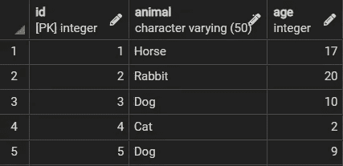
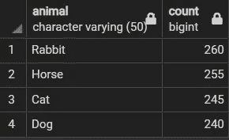
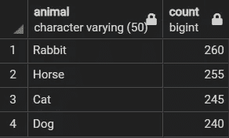
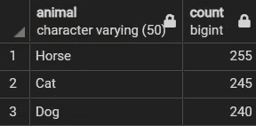

# 物化视图:提取洞察力的经济有效的方法

> 原文：<https://towardsdatascience.com/materialized-views-the-cost-effective-way-to-extract-insights-b4a066f85fb>

## 为什么不应该对每个任务都使用常规视图

照片由 Karolina Grabowska 拍摄:[https://www . pexels . com/photo/style-round-glasses-with-optical-lenses-4226865/](https://www.pexels.com/photo/stylish-round-eyeglasses-with-optical-lenses-4226865/)

很容易习惯于将 SQL 中的视图作为一种方便的工具。视图是通用的，可以省去用户重复编写复杂查询的麻烦。

也就是说，它们并不总是这项工作的最佳工具。

事实上，根据用例的不同，视图可能不如被低估的替代品:物化视图。

在这里，我们提供了物化视图的简要概述，讨论了物化视图胜过视图的方法，并解释了为什么拥抱物化视图对您最有利，即使到目前为止没有物化视图您也能管理得很好。

## 物化视图

物化视图类似于视图，但是它们之间有明显的区别。

与存储查询的视图不同，物化视图存储查询的*输出*。

这似乎是一个微不足道的区别。毕竟，如果返回相同的信息，存储查询输出而不是查询会有什么不同呢？

## 利益

当计算是决定性因素时，物化视图可以胜过视图。物化视图的关键好处是它们不需要太多的计算，因为查询结果已经预先确定了。

图像处理对大量数据执行分析，其中通过连接和聚合定期获得相同的信息。这种方法是有效的，但是重复运行相同的查询来获取相同的信息只是浪费计算。

使用物化视图，用户可以提取相同的信息，而不需要重复运行计算密集型查询。

## 限制

当然，物化视图也有自己的缺点。

因为它们只存储查询输出，所以不会根据底层数据库的变化进行调整。这可能是一个问题，因为物化视图可能会报告可能过时的值。

为了使物化视图保持可用，无论何时数据被以多种方式修改，都必须手动更新它们。

此外，与视图不同，物化视图需要内存使用，因为它们包含的查询结果存储在磁盘上。

## 个案研究

在 SQL 中创建和维护物化视图的过程与视图非常相似，但是有一些区别值得一提。因此，让我们进行一个简单的案例研究来演示物化视图。

我们有一个名为`Animals`的简单表格，显示了动物的记录和它们对应的年龄。

代码输出(由作者创建)

假设我们计划在整个研究中经常检查每种动物的数量。我们可以编写生成该计数的查询，并将其存储在名为`animal_count`的物化视图中。

有了这个物化视图，我们可以随时检查动物数量。

代码输出(由作者创建)

因为现在查询输出是预先计算的，所以现在通过物化视图访问它将需要更少的时间和计算。

不幸的是，与运行存储查询并根据底层数据的任何变化进行调整的视图不同，物化视图需要手动刷新。

为了展示刷新物化视图的重要性，我们可以删除表中兔子的所有记录，并查看修改后物化视图显示的内容。

代码输出(由作者创建)

如输出所示，尽管已经删除了兔子的所有记录，但是兔子的数量仍然存在。这意味着物化视图现在正在报告过时的信息。

为了确保物化视图跟上对数据库所做的更改，用户必须使用`REFRESH`命令。

现在，物化视图与底层数据相匹配。

代码输出(由作者创建)

## 为什么要使用物化视图

物化视图在语法和功能上都类似于视图。但是，它们需要额外的维护才能保持可用。那么，当用户可以坚持使用常规视图时，为什么还要依赖物化视图呢？

对于习惯于使用免费 RDBMS 系统(例如 PostgreSQL)编写查询的用户来说，这可能是一个有效的论据，在这些系统中，查询的计算需求和执行时间是无关紧要的。

这种软件的用户可以免费编写查询，并且可以养成为了方便而单独使用视图的习惯。他们可能不加选择地使用视图来运行和重新运行查询，而不考虑他们的计算需求。

不幸的是，这种方法不能很好地转化为在数据仓库中进行的分析。数据仓库(本地或云)提供了巨大的存储空间和强大的计算能力。作为回报，这些仓库根据自己的定价模式向用户收费。

由于需要更高计算量的查询会导致更高的价格，这些平台的用户需要对他们如何进行分析保持警惕，因为他们可能会因查询而收费。因此，在用数据仓库规划分析时，必须考虑价格优化。

物化视图作为从数据库中提取信息的视图的一种更经济的替代方式(假设数据不经常修改)。

此外，根据所选择的数据仓库，它们的主要缺点(即需要手动维护它们)甚至可能不是问题。许多云数据仓库(如 Snowflake)都包含在数据发生变化后自动更新物化视图的特性，而不需要用户进行任何维护工作。

## 结论

照片由 [Unsplash](https://unsplash.com?utm_source=medium&utm_medium=referral) 上的 [Prateek Katyal](https://unsplash.com/es/@prateekkatyal?utm_source=medium&utm_medium=referral) 拍摄

物化视图是分析很少或没有变化的数据的最佳选择，因为它们使用户无需重新运行相同的查询就能获得信息。

为数据仓库服务付费的企业自然会采用价格友好的分析方法。

因此，即使您习惯于使用免费的 RDMBS 软件来分析数据，您也可能不得不在未来迁移到大数据解决方案，因此熟悉物化视图并接受成本优化的思维方式并没有什么坏处。

希望您已经开始理解物化视图，并将它们更多地结合到您的脚本中。但是，如果您认为需要后退一步，从总体上探索常规视图，请查看下面的文章:

  

我祝你在数据科学的努力中好运！