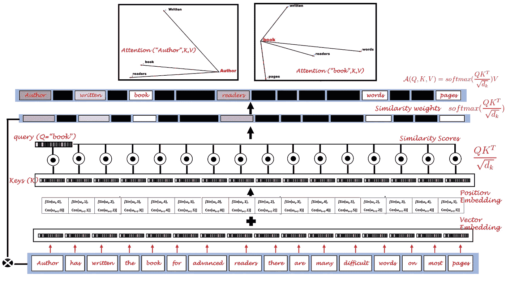
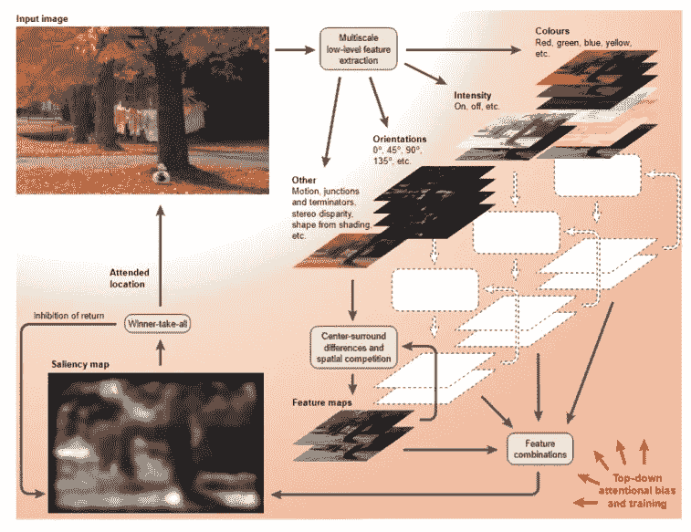
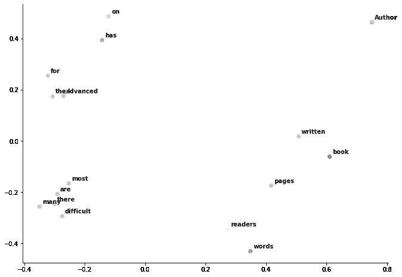
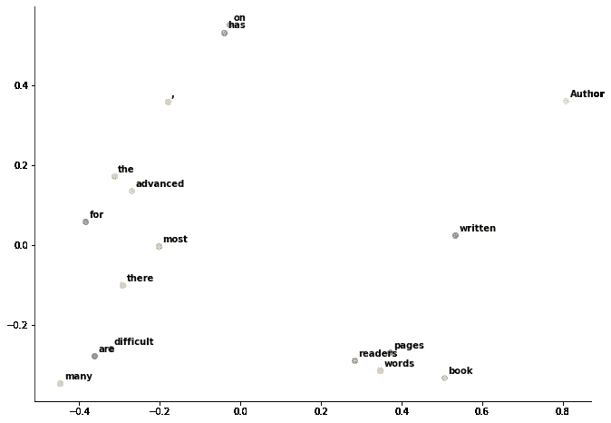
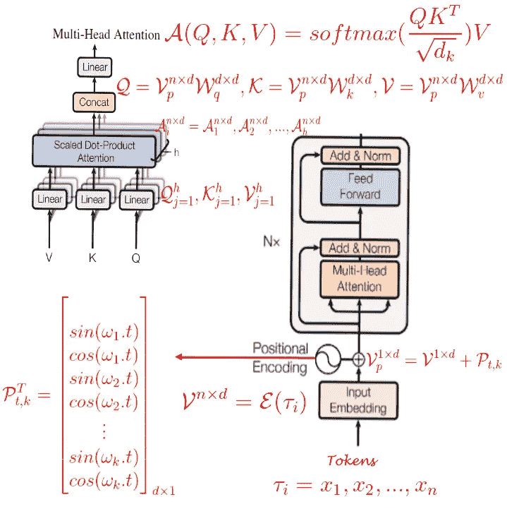

# 注意事项:什么是注意，以及如何在 Transformer 模型中计算注意

> 原文：<https://towardsdatascience.com/matters-of-attention-what-is-attention-and-how-to-compute-attention-in-a-transformer-model-4cbbd3250307>

## **变压器型号注意事项综合简易指南(附示例代码)**

图 1:变压器模型中的注意力(来源:作者)

在这篇文章中，你将学习注意力，它的计算和在一个转换网络中的角色。您还将了解文本转换器中的矢量嵌入、位置嵌入和注意力实现。这将利用概念，“*变形金刚*”和“*自动编码器*”，所以，如果你想了解更多关于这些话题，然后随时检查我的早期职位。

**注意力和视觉注意力**

如果我们分析人类的认知，我们会注意到人类所有的认知能力都归结为一个重要的特征，叫做‘注意力’*。注意力不仅对资源的有效利用很重要，而且也是原始感觉数据语义理解的主要成分。那么，什么是注意力呢？在最简单的形式中，注意力是通过处理并保存在记忆中以备将来回忆来记录环境刺激的能力。由于人类拥有有限的处理能力，因此，注意力就成了选择什么应该被处理和保存在记忆中的标准。通过这种方式，视觉注意力是识别场景中显著的物体/区域并将其记录为有助于实现目标的潜在有意义刺激的过程。来自眼睛的视觉输入在大脑的不同阶段进行处理，每个阶段在大脑的不同区域进行处理，称为视觉皮层。在早期阶段，处理低级特征(例如，方向、运动、颜色和强度)。在稍后阶段，获得高级特征，并且形成聚集的抽象表示，其被称为*显著图* [1]。*

**

*图 2:以显著性图形式的人类视觉注意力处理的框图[1]*

*这些显著图形成了视觉注意力的基础。几乎所有的知识都是通过视觉或听觉获得的，包括语言学习和理解，因此，文本处理也采用了与视觉处理相同的注意机制。因此，在文本处理的情况下，这种注意力是识别序列中各种显著单词的机制，并且构建显著图将意味着构建最能代表给定文本序列的显著单词序列。*

***变压器型号中的注意事项***

*序列建模是以连续表示来表示输入序列(例如，单词)并恢复语义上映射到输入序列的另一序列的过程。这种建模的一个示例应用是语言建模和翻译任务。序列建模任务长期以来被认为是作为递归神经网络(RNN)架构来建模的，因为它们能够捕获输入序列中各种元素之间的语义关系。这种模型通常使用基于*编码器-解码器*的架构，该架构结合了递归层，由此编码器将输入序列压缩成潜在向量，而解码器将其扩展成输出序列。递归层确保在输入和输出序列之间存在位置映射。*

*这些 rnn 试图捕捉我们阅读文本时人类使用的注意力机制。然而，这种方法使问题过于复杂，因此需要很长的训练时间，而表现平平。转换器作为一种补救措施被提出，由于其相对高效和准确，它们很快成为构建语言模型的标准方法。在对文本序列建模时，表示序列中各种元素位置的内部关系也很重要。这种建模通常被称为自我注意或内部注意。变形金刚单独使用自我注意机制来表示和映射输入和输出序列，从而更好地模仿人类语言理解。*

***矢量和位置嵌入***

*transformer 模型使用几个预处理步骤来为核心模块(例如，注意力和前馈网络)准备好输入文本。首先，通过将长文本分割成一组单独的单词来对输入文本进行标记化。在处理这些输入单词标记之前，它们应该以不变的形式表示。这种表示通过使用某种字典模型(例如，单词袋模型)来获得。这些模型通常已经在大量的单词集合上进行了预训练，并为将单个单词表征表示为多维空间中的一组嵌入向量提供了良好的基础。这种多维空间中的单词基于它们与其他单词的语义相似性形成聚类。正如您在图 3 中看到的，在这样的嵌入之后，具有相似含义的单词聚集在一起。*

**

*图 3:示例序列中单词的向量嵌入(来源:作者)*

*在向量嵌入之后，嵌入单词的位置也是有用的，因为它暗示了该单词在给定序列中的上下文。结合这种位置嵌入的一种方式是将序列中单词的索引与其向量嵌入相加/连接。但是，如果您注意的话，您会发现当一个文本文档中有数百万个单词时，这种技术并不适用。随着序列长度的变化，规范化这种基于索引的定位也不起作用。因此，使用了一种嵌入这种定位的巧妙方法，该方法借用了正弦波建模的概念。产生具有变化频率的大的连续信号，然后在离散时间步长获得样本。这提供了一种简单而有效的方法，可以很好地适应大文本。*

**

*图 4:位置向量计算(图片来源:作者)*

*正如你在图 4 中注意到的，向量*的元素是从正弦和余弦波函数中采样的。(余弦波只是正弦波的相移形式)。对于偶数指数，使用正弦函数，对于奇数指数，使用余弦函数。注意正弦函数的波长从 **2pi** 变化到 **2pi * C** 。其中' ***C'*** 是用于控制信号中振荡总数的常数。在[2]中，它的值是一个大整数(如 10000)。**

**在获得每个标记的位置向量之后，通过将向量嵌入与位置嵌入相加来获得组合表示。输出嵌入向量然后被馈送到变换器的注意网络中。图 5 显示了这种嵌入的结果。**

****

**图 5:示例序列中单词的组合嵌入(向量嵌入+位置嵌入)(来源:作者)**

****变压器模型架构中的注意事项****

**注意力在变压器模型架构中起着关键的作用。事实上，这就是变形金刚的语义力量所在。注意力允许确定一个序列中最突出的单词及其相互关系。这样就有可能从一大篇文章中提取要点，并从中得出有意义的抽象概念。注意力取决于三个术语:*查询*、*键*和*值*。顾名思义，查询是一个搜索词，目的是在序列中找到相关的词。这是人们想要引起变压器注意的地方。例如，在前面使用的单词序列中，如果我们选择“*作者*”作为查询，那么我们实际上是在寻找序列中与“*作者*”有密切关系的所有其他单词。**

****

**图 6:变压器模型中的注意力(图片来源:作者，概念图覆盖:作者，图片摘录:[2])**

**如果您有数据库方面的背景，这听起来会很相似。因此，就像对数据库的查询一样，对转换器的查询需要某种字典/数据库(即键、值对)。您将查询作为一个键插入，并获得所需的值。然而，由于我们仍在尝试学习关联，因此需要执行查询与关键字的相似性。**

**以这种方式，键实质上是转换器模型的输入向量，而值是模型的输出。然后，查询是在给定时间从这些关键字中提取的任何样本。然而，在训练时不存在的新单词的情况下，查询也可以不同于关键字。**

****自我关注****

**自我关注是一种关注形式，其中查询、键和值是从输入到转换器模型的相同原始单词序列中采样的。直觉告诉我们，转换器应该能够在训练阶段学习输入序列中的单词关联。这允许 transformer 构建语义单词关联，并能够在给定一个特定单词作为来自序列的查询时推断出其他单词。**

****

**如果我们从另一个角度来看，自我关注类似于协方差分析，它旨在通过构建基于协方差的权重/相似性矩阵来发现序列中各个单词的相似性。事实上,[2]中描述的注意函数只是一个协方差矩阵乘以单词向量的矩阵。**

**因此，在自我注意的情况下， **QK^T** 是位置嵌入词向量之间的成对相似性。并且 *softmax* 根据相似性得分生成概率分布。当这个相似性权重矩阵与嵌入的单词向量 **V** 相乘时，它将作为一个掩码，并且只突出那些与相应查询向量具有最高相似性的单词。**

****可学习的自我关注****

**当在神经网络中使用自注意时，这种*查询*、*键*和*值*的参数是可学习的。更具体地，查询、关键字和值具有专用层，由此相应层的输出是查询矩阵 **Q、**关键字矩阵 **K、**和值矩阵 **V** 。这些层在没有偏差项的情况下被训练，这意味着它们只乘以各自的权重( **WQ** 、 **WK** 、 **WV** )。这些重量是可学习的参数，因此，自我关注通过训练得到改善。**

****编解码器注意****

**除了自我注意之外，作者在[2]中还利用了另一种称为“*编码器-解码器注意*”的注意机制。在这样的关注层中，查询来自先前的解码器层，而*键、值*对来自编码器的输出。这允许使用编码器-解码器架构进行序列建模的能力。这种应用的一个很好的例子是语言翻译任务，其中输入和输出不是一一相关的。**

****多头关注****

**单一的自我注意机制提供了一种对输入和输出序列之间的单词关联进行建模的方式。然而，在一个 transformer 架构中使用多个注意模块(称为*头*)是有益的。这意味着拥有多层注意力矩阵束( **Q** ， **K** ， **V** )以及各自的训练权重( **WQ** ， **WK** ， **WV** )，这允许更好地处理大型文本，并为不同的头部提供不同的注意力输出。这些注意力头的输出然后连接在一起，最终形成线性输出。**

****结束语****

**在本文中，您了解了变压器网络中的注意力以及如何计算注意力。为了进一步阐明概念和实验方法，您可以运行各自的 python 笔记本，该笔记本以清晰简单的方式详细描述了每个步骤。**

****代码请点击链接:****

** [## GitHub-Azad-academy/transformer-attention:A…

### 在 Google Colab 或本地 jupyter 服务器上打开笔记本，安装要求，必要时重启内核…

github.com](https://github.com/azad-academy/transformer-attention) 

**在 Patreon 上支持我:**

 [## J. Rafid Siddiqui 博士正在创建关于 AI/ML/DL(Medium/Substack/Youtube)|…

### 今天就成为 J. Rafid Siddiqui 博士的赞助人:在世界上最大的…

patreon.com](https://patreon.com/azadlab) 

**在子栈上找到我:**

 [## Azad 学院

### 深度学习、机器学习、计算机视觉和人工智能领域的学习场所…

azadwolf.substack.com](https://azadwolf.substack.com) 

**订阅更多:**

[https://azad-wolf.medium.com/subscribe](https://azad-wolf.medium.com/subscribe)

**关注推特更新:**

[https://www.twitter.com/@azaditech](https://www.twitter.com/@azaditech)

**参考文献:**

[1] *L. Itti* ， *C. Koch，*“视觉注意力的计算模型”，自然评论神经科学第 2 卷，第 194-203 页，2001 年

[2] *阿希什·瓦斯瓦尼、诺姆·沙泽尔、尼基·帕尔马、雅各布·乌兹科雷特、利翁·琼斯、艾丹·戈麦斯、卢卡斯·凯泽、伊利亚·波洛舒欣*《注意力是你所需要的一切》，arXiv:1706.03762【cs。CL]，2017**