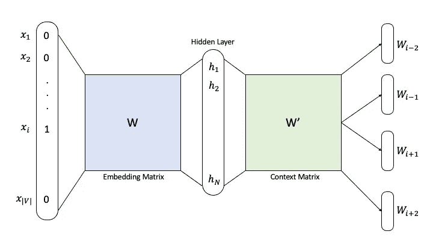
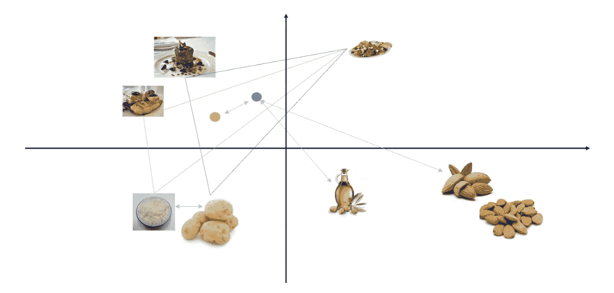

# 衡量食物的相似性

> 原文：<https://towardsdatascience.com/measuring-meals-similarities-3edb8a861f16>

## 在食品领域应用 Word2Vec 生成食品嵌入

[DayTwo](https://www.daytwo.com/) 拥有超过 80000 名会员的超过 1100 万份记录餐(并且每天都在增加)的庞大数据库，这些会员的口味广泛多样。这些食物从早餐到晚餐，从单一食物到复杂的膳食，从小吃到美食，等等。我们的会员投资于记录他们的膳食，以便他们可以跟踪他们的日常食物消耗，并获得关于他们定期糖反应水平的总体消耗的更广泛的概述。

记录的餐食(和会员)越来越多，这让我们能够帮助顾客根据他们平时的饮食不断寻找新的菜肴。通过查看历史数据和描述他们接下来可能想吃的潜在食物来减轻这种负担，对用户体验和我们服务的满意度有着巨大的影响。

作者图片

在这篇文章中，我们探索了来自 NLP 领域的机器学习技术如何帮助我们测量食物的相似性。这些技术的主要优势是双重的。首先，它们利用了大量的历史数据，这些数据不断增长，反映了我们用户的真实食物口味。第二，它们可以被分成不同的区域，已知这些区域具有不同的食物偏好。例如，我们知道西方饮食以碳水化合物和脂肪为基础，而东方饮食更喜欢鱼和藻类。因此，通过了解不同地区不同食物的相似性，我们可以针对特定人群定制我们的推荐引擎，并增加我们的个性化体验。

# 膳食数据

(使用的数据集不是开源的，属于 DayTwo)

为了计算两餐之间的相似性得分，我们首先需要生成餐嵌入(也称为向量)。这使得我们可以使用一个通用的距离度量来检索从 0 到 1 的相似性得分，其中相似的饭菜得分较高。

但是在能够生成膳食嵌入之前，我们首先为每个食物项目计算一个**单个嵌入向量。然后，我们可以认为膳食矢量是膳食中所有食物矢量的平均值。你可以考虑去掉一些基本的东西，比如香料或者酱汁，因为它们不会给你的嵌入添加太多的信息(出于同样的原因，当训练单词嵌入时，停用词会被去掉)。**

我们使用了一组 1100 万份记录的膳食(针对每个群组)，其中每份膳食 *m* 被表示为一列 *k* 独特的食物。

从下面的柱状图中可以看出，食物种类的数量变化很大(只有一种食物的膳食已经被剔除)。从有几个项目的膳食到有几十个项目的膳食，显然，为了过滤不合理的膳食，对数据的深入研究是必要的。总的来说，似乎每个用户都在不同程度上详细记录了自己的饮食。

作者图片

# 使用机器学习来学习食物向量

为了训练 food2vec 神经网络并获得每个食物项目的嵌入向量，每顿饭被视为用单个空格分隔的食物项目 id 的句子。

这使得可以使用现有的 word2vec 库来训练网络。我们使用 skip-gram word2vec 模型，其窗口大小 *w* 等于最大用餐时间，以捕获所有用餐中所有可用的食物项目对。由于食品领域与地理属性高度相关，我们为每个群组分别训练我们的嵌入(包括超参数优化)。

Word2Vec 神经网络模型图解—图片由作者提供

# 衡量相似性

一旦在高维空间中有了每个食物项目的嵌入向量，其中相似的项目相对于空间距离度量(例如欧几里德距离)看起来更接近，我们就可以使用该嵌入图来识别共享共同元素的食物项目或膳食的聚类。

值得注意的是，关于什么被认为是相似的，没有“基本事实”。嵌入可以在不同的方面进行优化，这将产生不同的相似性。

食物和膳食矢量空间插图-作者图片

# 收场白

找到相似的食物很难，特别是由于人类的口味往往非常个性化。幸运的是，这篇文章中讨论的食物嵌入帮助我们实现了这一点，并服务于其他几个目的。**首先是**，用从数百万历史记录中学习到的元数据为推荐系统提供支持。**第二个**，作为许多机器学习模型的构建模块，取代了天真的特征，并且在我们测试的各种分类任务中明显优于它们。**第三个**，它们封装了我们可以从所有食物中提取的所有区域信号，允许 ML 模型基于特定位置更加准确。

如果你想了解更多关于我们正在开发的最新最棒的产品，请随时联系我。

[亚龙](https://www.linkedin.com/in/yaronv/)