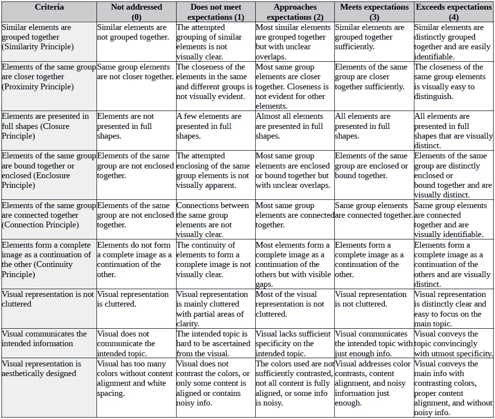
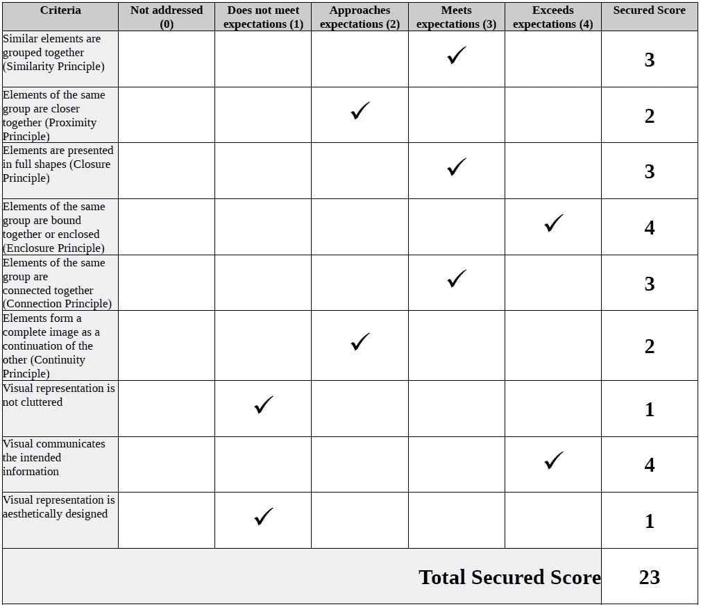

# 测量数据可视化的认知过载因子

> 原文：<https://towardsdatascience.com/measuring-the-cognitive-overload-factor-of-a-data-visualization-65b0ce56254b>

## 计算 COF 的简单经验方法，举例说明


在 [Unsplash](https://unsplash.com/s/photos/data-visualization?utm_source=unsplash&utm_medium=referral&utm_content=creditCopyText) 上拍摄的 [ThisisEngineering RAEng](https://unsplash.com/@thisisengineering?utm_source=unsplash&utm_medium=referral&utm_content=creditCopyText)

**TL；提出了一种使用评价量规计算数据可视化认知过载因子的经验方法。解释了量规使用的评估标准和评分方法。一个数据可视化的例子被用来演示该方法。建议进一步扩展和定制评估标准。**

## 数据可视化

数据可视化将原始数据转换为图形和图表等可视化表示，以有效地将感兴趣的信息传达给目标受众，否则很难直接从原始数据中解读这些信息。以可视形式表示原始数据通过数据发现、汇总数据视图、综合信息、定量和定性趋势以及从数据中挖掘的其他模式向目标受众讲述故事。

引人入胜的讲故事的一个重要方面是减少认知超载。当信息供应量超过个人的信息处理能力时，就会出现认知超载。本质上，当呈现的信息引发试图综合和理解信息的个人的过度思考时，认知超载就发生了。这种精神能力的超负荷会导致严重的不适、沮丧和低效的决策。最重要的是目标受众在认知上处理视觉信息以理解它的难易程度。视觉中杂乱的存在、视觉不能清楚地呈现预期的信息、缺乏精心设计的美感以及其他视觉缺陷会导致消费者的认知负担过重，从而破坏视觉化的目的。

## **初级挑战**

主要的挑战是缺乏可视化数据的认知质量测量。这种客观方法的缺乏增加了解释认知质量的主观性，因为感知的认知过载因人而异。

## **提议的方法**

所提出的方法是一种经验方法，使用一个简单的评价标准来定量计算认知超载。随之而来的经验认知超载因子(COF)是一个介于 0 和 1 之间的数值。

## 评价标准

量规是一种评估和评分工具，它定义了具体的评估标准、衡量达到评估标准的程度的标记以及对衡量标记进行分级的评分尺度。量规是使用特定的和高度相关的评估标准来评估感兴趣的对象的可靠工具。因此，量规中的评价标准对量规使用的有效性至关重要。

开发的量规包含 9 个跨行的评估标准和 5 个跨列的测量标记，形成一个 9x5 的评估网格。五列标记衡量评估标准是否符合预期——未达到、未达到预期、接近预期、达到预期和超出预期。每个评估标记都有一个 4 分制的分数。0 分为“未解决”，1 分为“未达到预期”，2 分为“接近预期”，3 分为“达到预期”，4 分为“超出预期”。应用于每个评估标准的每个测量标记的解释在标题的相应单元格中定义，如图 1 所示。



*图 1:评估数据可视化认知过载因素的规则*

## 评定标准

如图 1 第一栏所示，九个主要标准有助于评估视觉感知格式塔原则的数据可视化输出:相似性、接近性、闭合性、封闭性、连接性、连续性、视觉中杂乱的存在、视觉清晰呈现预期信息的能力以及视觉表现的设计美学。

***格式塔相似性原则标准***
格式塔相似性原则标准评估可视化是否使用相似的大小、形状和颜色对相似的元素进行分组。类似元素的这种分组有助于人类容易地识别视觉表示中的相似性和差异。

***格式塔邻近原则标准***
格式塔邻近原则标准评估视觉是否呈现彼此更靠近的相同组元素。这种接近有助于人类将更接近的元素归类为属于同一组。

***格式塔封闭原则标准***
格式塔封闭原则标准评估视觉的元素是否使用完整的形状呈现。过去的研究表明，人类更喜欢完整的形状来理解一个元素。如果该元素使用不完整的形状来表示，人类倾向于填补空白来解释该元素，从而导致意想不到的认知超载。

***格式塔封闭原则准则***
格式塔封闭原则准则评估视觉是否呈现封闭或绑定在一起的同一组元素。这种外壳有助于人类容易地感知属于一起的元素，从而简化认知理解。

***格式塔连接原则标准***
格式塔连接原则标准评估视觉是否呈现连接在一起的同一组元素。这种联系帮助人类观众容易地将属于同一组的元素分类。

***格式塔连续性原则标准***
格式塔连续性原则标准评估当视觉中的元素看起来是其他元素的延续时，它们是否形成完整的图像。这种可视化帮助人类观众感知由连续元素形成的完整图像。任何不连续性都会导致人们试图完成图像，从而导致不必要的认知超载。

***杂乱存在标准***
该标准评估视觉是否过于杂乱。由于不必要的图表边框、网格线、数据标签、标记、嘈杂的轴标签、不一致的配色方案等，视觉效果会变得混乱。杂乱会导致认知超载，分散观众对主要信息的注意力。

***清晰传达预期信息***
这一关键标准评估可视化是否通过突出重要内容、减少噪音和消除干扰以及创建清晰的信息流层级来呈现数据。

此外，视觉效果应该强调主要信息主题的“谁”、“什么”和“如何”属性。“谁”属性有助于在过程的早期识别目标受众，并有助于理解数据可视化应该解决的那些目标受众的特定需求。目标受众越窄，叙述的数据故事就越具体，越有说服力。“什么”属性有助于理解目标受众期望什么信息，以及通过可视化数据期望目标受众做出什么行动和决策。这样的“是什么”方面有助于实现可视化数据的真正目的，符合目标受众的期望。“如何”属性有助于解决如何处理和转换可用数据，以通过数据可视化突出显示受众的兴趣点。

**美学设计的视觉效果可以对目标受众产生愉悦的影响，减少认知负荷。**

## 认知超载因子(COF)

数据可视化的 COF 可以基于其在标题上的安全总分来计算。任何数据可视化可以获得的最高分数是 36。为 COF 提出的经验公式为:

```
COF = 1 - (Secured Total Score/Maximum Score) => 1 - (S/36)
```

接近 0 的 COF 意味着可以忽略不计的认知超载。COF 接近 1 表示认知负荷最严重。大约 0.3 的 COF 可能是最佳的，因为认知过载可能无法完全消除。需要进一步的实验评估来确定更精确的最佳 COF。

## COF 评估者

建议由特定的目标受众或消费者来评估数据可视化的 COF。目标受众更适合，因为他们知道可视化的“谁”、“什么”和“如何”属性以及整体可视化上下文。来自目标群体的个体可以独立地评估 COF，并且所有评估值的平均值可以被认为是估计的 COF。

## 示例评估

图 2 显示了一个数据可视化输出的例子，比较了伊利诺伊州芝加哥的月温度和年温度。可视化有两个部分。第一部分是一个气泡图，显示 2019 年平均气温最高的月份。第二部分是一张热图，显示了 2009 年至 2019 年期间气温最高的月份。


图 2:伊利诺伊州芝加哥的月气温和年气温对比

显然，示例可视化的目标受众是对芝加哥的历史气温特别感兴趣的数据科学家。它们拥有这种温度信息的特定上下文，因此非常适合更有效地评估示例数据可视化的 COF。

***使用标题的评估***
属于目标受众群体的数据科学家可以使用标题对上述聚类可视化进行评分，如图 3 所示。这样的数据科学家评估的假设总分是 23。同样，其他数据科学家的假设分数可能是 18、27、21、24 和 20。平均分 22.17。因此，使用经验公式估计的 COF 是 0.3843，这意味着认知超负荷接近最优，并且可以增强可视化以进一步改善 COF。



图 3:医学数据科学家的假设评估

## 推荐

本文中建议的 COF 评价标准使用了视觉感知的格式塔原理、视觉中杂乱的存在、视觉清晰呈现预期信息的能力以及视觉表现的设计美学。该标准形成了一个简单的 9x5 评估网格，每行有九个评估标准，每列有五个测量标记。评分方法有意保持简单，以帮助构建 COF 量化模型和演示概念。建议感兴趣的读者使用更多更好的标准进一步扩展这个模型，并根据特定的需求对其进行定制。

## 参考

数据分析报告生命周期的最佳实践:报告构建和数据验证的质量。(2018).*《AHIMA 日报》*， *89* (9)，40–45。

m .卡特(2013 年)。*设计科学演示:数字、论文、幻灯片、海报等的视觉指南*。爱思唯尔科技&科技。

北卡罗来纳州纳弗利克(2015 年)。*用数据讲故事:商业专家数据可视化指南*。威利。

维特尔，T. R. (2017)。描述性统计:报告五个基本问题的答案:谁，什么，为什么，何时，何地，第六，那又怎样？*美国国家医学图书馆*， *125* (5)，1797–1802。