# 媒体混合建模:如何用 Python & LightweightMMM 测量广告的效果

> 原文：<https://towardsdatascience.com/media-mix-modeling-how-to-measure-the-effectiveness-of-advertising-with-python-lightweightmmm-b6d7de110ae6>

## 媒体混合建模、实现和实用技巧


安德里亚斯·米在 [Unsplash](https://unsplash.com?utm_source=medium&utm_medium=referral) 上的照片

**TLDR:**

媒体组合建模，也称为营销组合建模(MMM)，是一种帮助广告商量化几项营销投资对销售的影响的技术。LightweightMMM 是考虑到媒体饱和度和广告库存的 MMM 的 python 库。然而，当你尝试 MMM 的时候，你可能需要反复试验。对于实际的见解和行动，不断尝试更好的数据，做出更好的模型，做更好的实验。

# 1.介绍

当你听到广告这个词时，你会想到什么？

让我给你举几个例子。电视广告是一种常见的方法。社交媒体广告比如当你在社交媒体平台上查看朋友的帖子或视频时，你可能会看到许多广告。另外，如果你用谷歌搜索某样东西，你通常会在搜索结果的顶部看到一些广告。此外，公共汽车、机场、火车、出租车、建筑物上的广告，即所谓的户外广告也相当普遍。

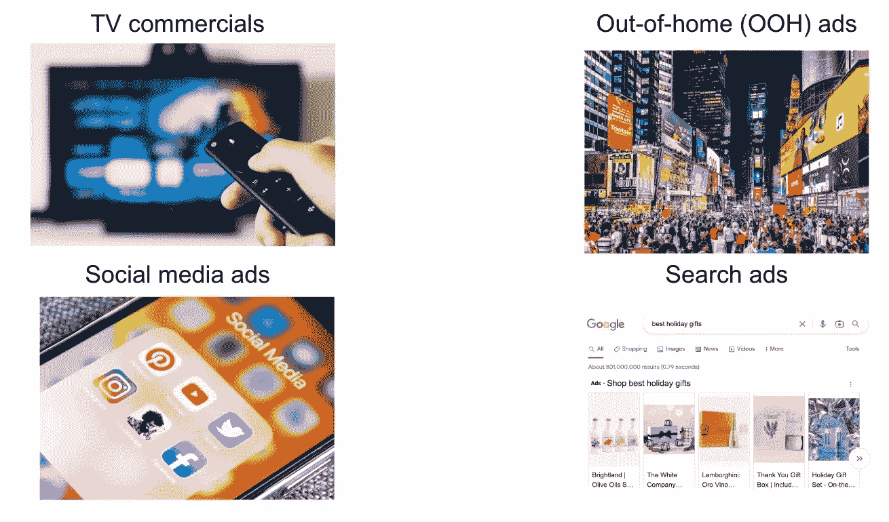

图像由作者，由 unsplash.com 缩略图

长期以来，媒体优化一直是一项挑战。你们中的一些人可能熟悉营销先驱约翰·沃纳梅克。据说他说过，“我花在广告上的钱有一半都浪费了；问题是我不知道是哪一半。”

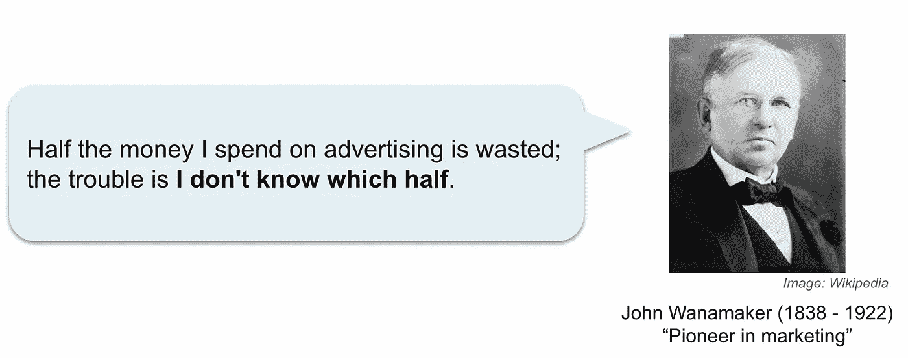

作者图片，维基百科缩略图

解决这个问题的统计方法被称为媒体组合建模或营销组合建模。一般简称为 MMM。MMM 的目的是了解每种营销媒体对销售的贡献有多大，每种媒体应该花多少钱。

几十年来，在饮料、消费品、汽车和时尚行业拥有巨额广告预算的公司一直致力于改进 MMM。此外，广告技术公司，如谷歌和 Meta，这些天一直在积极关注 MMM。

# **2。什么是 MMM？**

MMM 是统计模型，有助于量化几种营销投入对销售的影响。

粗略来说，有三个目标。

*   第一个目标是“理解和衡量投资回报(ROI)”。比如，模型会告诉你你去年在电视上的投资回报率。
*   第二个目标是模拟。例如，有了这个，你可以回答一个商业问题，比如“如果明年在电视上花更多或更少的钱，我们的销售额会是多少？如果第二年花在电视上的钱多了或少了，你就能知道你的销售额会是多少。
*   第三是优化媒体预算。这一步将帮助你优化预算分配，这将有助于最大限度地提高销售额。


**媒体优化的主要挑战**

你可能想知道为什么衡量投资回报率如此困难，或者为什么不只是检查每个媒体发布的报告的投资回报率。

这些都是好问题。但是现实要复杂一点。

第一个原因是，最终用户有多个媒体接触点，媒体渠道的影响相互交织。

其次，如今跟踪精度并不总是正确的。线下媒体渠道影响力难以追踪。例如，对于报纸或杂志等印刷媒体，我们无法跟踪有多少人实际上看到了这种媒体形式的广告。更糟糕的是，即使在数字世界，隐私法规，如 GDPR 和苹果公司的 IDFA 贬低已经影响了跟踪的准确性。

第三，被称为提升测试的随机实验是不切实际的。
回答因果问题的黄金标准是进行随机实验，将人群随机分为测试组和对照组，测试组没有广告。然而，这是不切实际的，因为公司不喜欢长期限制广告，因为这可能导致失去机会。

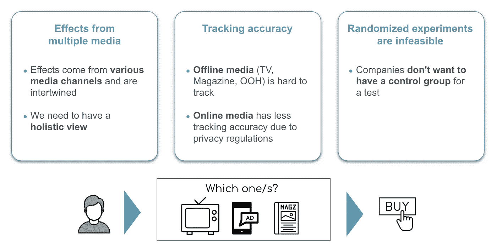

作者图片

# **3。数据准备**

**3.1 输入数据**

我们使用时间序列数据，不使用任何隐私相关的数据。如你所见，我们有一个周、销售、媒体支出和其他数据栏。


作者图片

**3.2 需要哪种数据？**

第一部分是最重要的指标，也就是你企业的 KPI，这将是一个因变量。如果你是零售商或者制造商，销售是常见的选择。然而，如果你是一家移动应用公司，安装的应用数量就是 KPI。其次，解释变量是影响销售的潜在因素。媒体数据是必需的，因为我们希望优化这些分配。价格、促销或产品分销等非媒体营销数据也会影响销售。季节性、节假日、天气或宏观经济数据等外部因素对于提高模型的准确性也很重要。

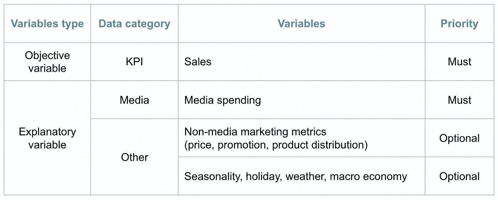

作者图片

**3.3 数据的粒度应该有多细？**

就时间而言，mmm 通常需要两到三年的周级数据。但是，如果您没有那么多数据，日常数据也是可以接受的，但是在这种情况下，您需要更加小心地检查异常值。接下来是业务粒度。常见的方法是收集品牌或业务单位级别的数据。比如宝洁的护发类有潘婷、海飞丝、草本精华。每个品牌团队都有不同的销售、营销和媒体策略。确保根据产品线、组织和决策过程来确定数据粒度。在查看媒体支出数据时，一个常见的粒度是媒体渠道级别，如电视、印刷、OOH 和数字。但这取决于你在每种媒体上的花费。例如，如果你在数字广告上花了很多钱，最好将数字渠道细分为更具体的群体，如谷歌搜索广告、谷歌展示广告、YouTube 广告、脸书广告等。，因为谷歌搜索广告和 YouTube 广告的漏斗和作用不同。

# **4。建模**

**4.1 简单的传统方法——线性回归**

首先，让我们从简单建模开始考虑。
对观测数据进行线性回归是一种传统的常用方法。


作者图片

这里，销售额是客观变量，媒体支出因素和控制因素是解释变量。这些系数意味着对销售的影响。所以，β_ m 是媒体变量的系数，β_ c 是控制变量的系数，如季节性或价格变化。这种方法最显著的优点是每个人都可以快速运行它，因为即使是 Excel 也有回归功能。还有，包括非技术高管在内的所有人都很容易直观地理解结果。然而，这种方法并不基于被营销行业广泛接受的关键营销原则。

**4.2 广告的两个原则**

有两个广告原则需要考虑:饱和度和广告存量。

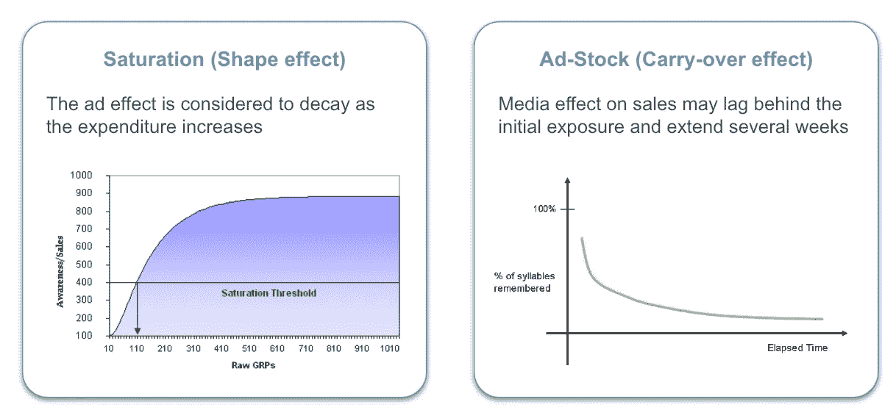

作者图片，维基百科图表

饱和:随着支出的增加，一个媒体渠道的广告效果会下降。让我换一种方式说:你在一个媒体渠道广告上花的钱越多，效果越差。饱和度也称为形状效应。

广告库存:广告对销售的影响可能会滞后于最初的曝光，并延续几周，因为消费者通常会记住广告很长一段时间，但他们有时会推迟行动。有几个原因:如果消费者已经有库存，他们不会立即购买这些商品。或者，如果他们计划购买昂贵的物品，如电脑、家具或电视，他们可能需要几天到几周的时间来考虑购买这些物品。这些例子导致了遗留效应。

【Google 研究员金等提出的 4.3 模型

谷歌的研究人员在 2017 年提出了一种反映这两个特征的方法。下面的公式是反映遗留效应和 ad 饱和度的最终模型。

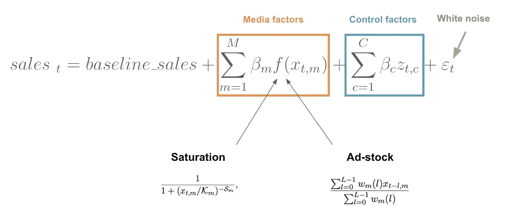

作者图片

基本方法与我之前分享的简单模型相同。销售可以分解为基线销售、媒体因素、控制因素和白噪音。而在这个公式中，系数β代表了各个因素的影响。这里的变化是将两个转换函数应用于媒体支出的时间序列:饱和度和广告存量函数。

**4.4 有用的 MMM 库(轻量级 MMM vs Robyn)**

在这里，让我介绍两个伟大的 OSS 库，它们将帮助你尝试 MMM : [LightweightMMM](https://github.com/google/lightweight_mmm) ，一个主要由 Google 开发者开发的基于 Python 的库，和 [Robyn](https://github.com/facebookexperimental/Robyn) ，一个由 Meta 开发的基于 R 的库。

LightweitMMM 使用 Numpyro 和 JAX 进行概率编程，这使得建模过程快得多。在标准方法之上，LightweightMMM 提供了一种分层方法。如果您有州级或地区级的数据，这种基于地理的等级方法可以产生更准确的结果。

而 Robyn 则利用 Meta 的人工智能图书馆生态系统。Nevergrad 用于超参数优化，Prophet 用于处理时间序列数据。

# **5。样本代码**

让我向您展示它实际上是如何使用 LightweightMMM 的。完整的代码可以在下面我的 Github 上找到。我的示例代码基于 lightweight_mmm 的官方演示脚本。

[](https://github.com/takechanman1228/mmm_pydata_global_2022/blob/main/simple_end_to_end_demo_pydataglobal.ipynb) [## mmm _ pydata _ global _ 2022/simple _ end _ to _ end _ demo _ pydata global . ipynb at main…

### 此时您不能执行该操作。您已使用另一个标签页或窗口登录。您已在另一个选项卡中注销，或者…

github.com](https://github.com/takechanman1228/mmm_pydata_global_2022/blob/main/simple_end_to_end_demo_pydataglobal.ipynb) 

首先，让我们使用 pip 命令安装 lightweight_mmm 库。大约需要 1-2 分钟。如果你得到错误“重启运行时”，你需要点击“重启运行时”按钮。

```
!pip install --upgrade git+https://github.com/google/lightweight_mmm.git
```

另外，让我们导入一些库，如 JAX，numpryro，以及库的必要模块。

```
# Import jax.numpy and any other library we might need.
import jax.numpy as jnp
import numpyro

# Import the relevant modules of the library
from lightweight_mmm import lightweight_mmm
from lightweight_mmm import optimize_media
from lightweight_mmm import plot
from lightweight_mmm import preprocessing
from lightweight_mmm import utils
```

接下来，我们来准备数据。官方示例脚本使用**一个由库函数生成的**模拟数据集来创建虚拟数据。然而，在这次会议中，我将使用更真实的数据。我在一个 GitHub 仓库上找到了一个很好的数据集:sibylhe/mmm_stan。我不确定这个数据集是真实的、虚拟的还是模拟的数据，但对我来说，它看起来比我在互联网上找到的任何其他数据都更真实。

```
import pandas as pd

# I am not sure whether this data set is real, dummy, or simulated data, but for me, it looks more realistic than any other data I found on the internet.
df = pd.read_csv("https://raw.githubusercontent.com/sibylhe/mmm_stan/main/data.csv")

# 1\. media variables
# media spending (Simplified media channel for demo)
mdsp_cols=[col for col in df.columns if 'mdsp_' in col and col !='mdsp_viddig' and col != 'mdsp_auddig' and col != 'mdsp_sem']

# 2\. control variables
# holiday variables
hldy_cols = [col for col in df.columns if 'hldy_' in col]
# seasonality variables
seas_cols = [col for col in df.columns if 'seas_' in col]

control_vars =  hldy_cols + seas_cols

# 3\. sales variables
sales_cols =['sales']

df_main = df[['wk_strt_dt']+sales_cols+mdsp_cols+control_vars]
df_main = df_main.rename(columns={'mdsp_dm': 'Direct Mail', 'mdsp_inst': 'Insert', 'mdsp_nsp': 'Newspaper', 'mdsp_audtr': 'Radio', 'mdsp_vidtr': 'TV', 'mdsp_so': 'Social Media', 'mdsp_on': 'Online Display'})
mdsp_cols = ["Direct Mail","Insert", "Newspaper", "Radio", "TV", "Social Media", "Online Display"]
```

让我们快速浏览一下。该数据包含四年每周级别的数据记录。为简单起见，我使用七个媒体渠道的媒体支出数据，以及假日和季节信息的控制变量。

```
df_main.head()
```


接下来，我将对数据进行预处理。我们将数据集分为训练和测试两部分。在这种情况下，我只留下最后 24 周进行测试。

```
SEED = 105
data_size = len(df_main)

n_media_channels = len(mdsp_cols)
n_extra_features = len(control_vars)
media_data = df_main[mdsp_cols].to_numpy()
extra_features = df_main[control_vars].to_numpy()
target = df_main['sales'].to_numpy()
costs = df_main[mdsp_cols].sum().to_numpy()

# Split and scale data.
test_data_period_size = 24
split_point = data_size - test_data_period_size
# Media data
media_data_train = media_data[:split_point, ...]
media_data_test = media_data[split_point:, ...]
# Extra features
extra_features_train = extra_features[:split_point, ...]
extra_features_test = extra_features[split_point:, ...]
# Target
target_train = target[:split_point]
```

此外，这个库提供了一个用于预处理的 CustomScaler 函数。在此示例代码中，我们将媒体支出数据、额外功能数据和目标数据按其平均值进行划分，以确保结果的平均值为 1。这允许模型不知道输入的规模。

```
media_scaler = preprocessing.CustomScaler(divide_operation=jnp.mean)
extra_features_scaler = preprocessing.CustomScaler(divide_operation=jnp.mean)
target_scaler = preprocessing.CustomScaler(divide_operation=jnp.mean)
cost_scaler = preprocessing.CustomScaler(divide_operation=jnp.mean, multiply_by=0.15)

media_data_train = media_scaler.fit_transform(media_data_train)
extra_features_train = extra_features_scaler.fit_transform(extra_features_train)
target_train = target_scaler.fit_transform(target_train)
costs = cost_scaler.fit_transform(costs)p
```

下一步是训练。我们可以从 3 个选项中为建模选择广告库存函数:Hill-广告库存、广告库存和结转。通常建议比较所有三种方法，并使用最有效的方法。

```
mmm = lightweight_mmm.LightweightMMM(model_name="hill_adstock")
mmm.fit( media=media_data_train, media_prior=costs, target=target_train, extra_features=extra_features_train, number_warmup=number_warmup, number_samples=number_samples, media_names = mdsp_cols, seed=SEED)
```

一旦训练完成，您可以检查您的跟踪的摘要:这里重要的一点是检查所有参数的 r hat 值是否小于 1.1。这是运行贝叶斯建模时的一个检查点。

```
mmm.print_summary()
```

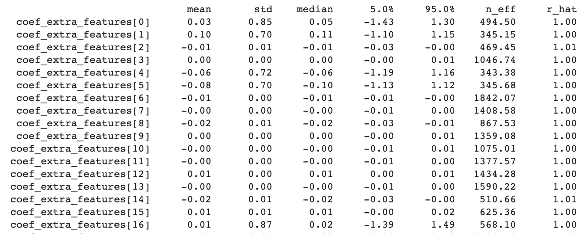

作者图片

我们可以看到媒体效应的后验分布。

```
plot.plot_media_channel_posteriors(media_mix_model=mmm, channel_names=mdsp_cols)
```

现在，让我们做一个合适的检查。还可以使用 plot_model_fit 函数来检查模型与训练数据的拟合度。图表中显示了 r 平方和 MAPE，即平均绝对百分比误差。在这个例子中，R2 是 0.9，MAPE 是 23%。一般来说，如果超过 0.8，R2 就被认为是好的。此外，MAPE 的目标是 20%或更低。

```
plot.plot_model_fit(mmm, target_scaler=target_scaler)
```

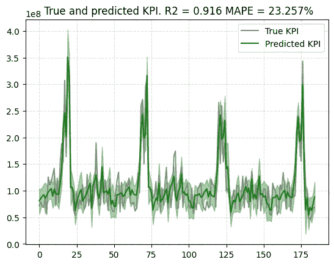

作者图片

这是预测结果的可视化。R2 是 0.62，MAPE 是 23%。老实说，这里的 R2 和 MAPE 价值观并不理想。然而，我没有任何额外的数据，而且——我甚至不确定——这个数据集是真实的还是虚假的。也就是说，我仍然会使用这个数据集和模型来向你展示我的见解。稍后，我将详细讨论如何改进这个模型。

```
plot.plot_out_of_sample_model_fit(out_of_sample_predictions=new_predictions,
                                 out_of_sample_target=target_scaler.transform(target[split_point:]))
```

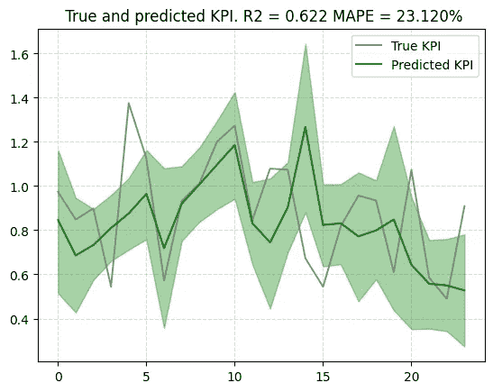

作者图片

**结果**

通过使用这个函数，我们可以快速地可视化估计的媒体和基线贡献。下图显示，大约 70%的销售额是基线销售额，用蓝色区域表示。其他颜色显示媒体对剩余销售额的贡献。

```
media_contribution, roi_hat = mmm.get_posterior_metrics(target_scaler=target_scaler, cost_scaler=cost_scaler)
plot.plot_media_baseline_contribution_area_plot(media_mix_model=mmm,
                                                target_scaler=target_scaler,
                                                fig_size=(30,10),
                                                channel_names = mdsp_cols
                                                )
```

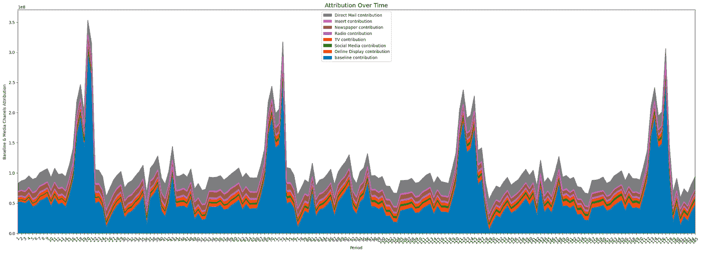

作者图片

```
plot.plot_bars_media_metrics(metric=roi_hat, metric_name="ROI hat", channel_names=mdsp_cols)
```

此图显示了每个媒体渠道的预计投资回报率。每个条形代表媒体的投资回报率有多高。在这种情况下，电视和网络展示比其他媒体更有效率。


作者图片

我们可以将优化的媒体预算分配可视化。该图显示了以前的预算分配和优化的预算分配。在这种情况下，应该减少直邮和广播，增加其他媒体。

```
plot.plot_pre_post_budget_allocation_comparison(media_mix_model=mmm, 
                                                kpi_with_optim=solution['fun'], 
                                                kpi_without_optim=kpi_without_optim,
                                                optimal_buget_allocation=optimal_buget_allocation, 
                                                previous_budget_allocation=previous_budget_allocation, 
                                                figure_size=(10,10),
                                                channel_names = mdsp_cols)
```

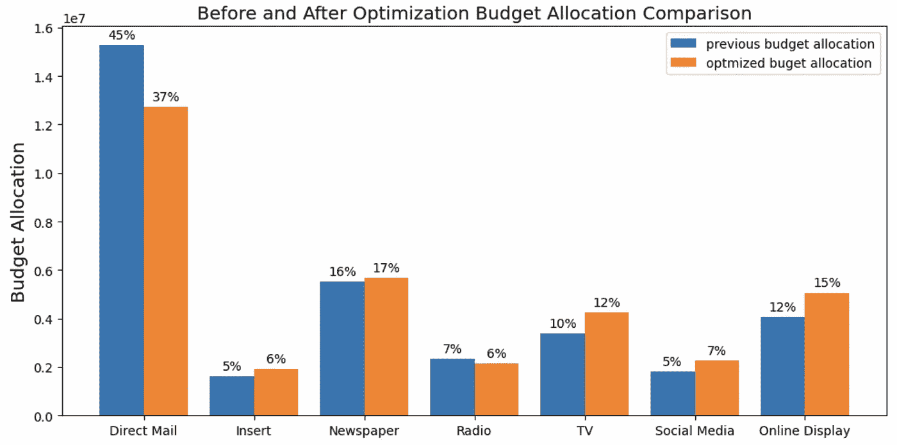

作者图片

# **6。如何提高模型的准确性？**

为了更好地洞察和行动，需要一个量身定制的模型，因为没有“一刀切”的模型，因为每个企业的情况都不同。

那么，我们如何提高模型的准确性以获得更好的洞察力和行动呢？

**更好的数据**:你需要根据你的业务选择影响你销售的控制变量。一般来说，销售额随着促销、价格变化和折扣而波动。缺货信息对销售也有很大影响。谷歌研究人员发现，相关查询的搜索量可以用于 MMM，以适当控制付费搜索广告的影响。

如果你在一个特定的媒体渠道上花费很多，最好把这个媒体渠道分解成更具体的群体。

**更好的模型**:下一个建议是改进建模。当然，超参数调整很重要。除此之外，尝试地理级别的等级方法是获得更高精度的好方法。

更好的实验:第三个建议是与你的营销团队合作，做实际的实验，也就是所谓的提升测试。如前所述，在所有媒体上做随机实验是不现实的。然而，在关键点上的实验对于获得基本事实和改进模型是有用的。Meta 最近发布了 Geo Lift，这是一个开放源码软件解决方案，可用于基于地理的实验。

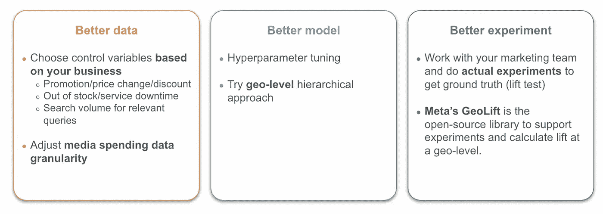

作者图片

# 7.结论

让我们总结一些要点。

*   MMM 是统计模型，有助于量化几种营销投入对销售的影响。
*   在广告中，饱和度和广告存量是关键原则。可以使用转换函数对它们进行建模。
*   如果您熟悉 Python，LightweightMMM 是很好的第一步。
*   为了更好的洞察和行动，不断尝试更好的数据，做更好的模型，做更好的实验。

感谢您的阅读！如果您有任何问题/建议，欢迎随时在 [Linkedin](https://www.linkedin.com/in/hajime-takeda/) 上联系我！此外，如果你能跟随我学习数据科学，我会很高兴。

# 8.参考

*   [金，杨，王，杨，孙，陈，丁，&克勒，J. (2017)。具有遗留和形状效应的媒体混合建模的贝叶斯方法。谷歌公司](https://static.googleusercontent.com/media/research.google.com/en//pubs/archive/46001.pdf)
*   [陈博士，&佩里博士(2017)。媒体组合建模的挑战和机遇。](https://static.googleusercontent.com/media/research.google.com/en//pubs/archive/45998.pdf)
*   https://github.com/google/lightweight_mmm
*   罗宾:https://github.com/facebookexperimental/Robyn
*   嗯 _ 斯坦:[https://github.com/sibylhe/mmm_stan](https://github.com/sibylhe/mmm_stan)