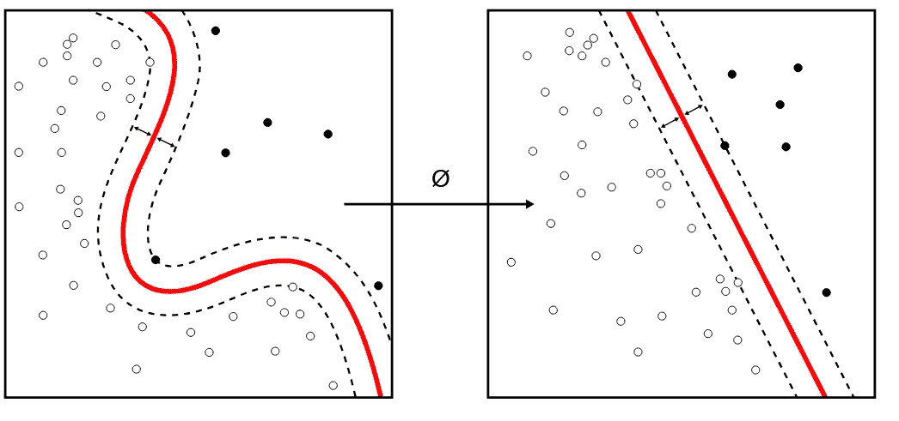

# 人工智能中的记忆和概括

> 原文：<https://towardsdatascience.com/memory-and-generalization-in-artificial-intelligence-35e006ca0a9a>

> "对看不见的数据进行归纳的能力是机器学习的核心."

当前许多人工智能研究的核心是如何让算法**推广到看不见的数据**的问题。

在机器学习的背景下，大多数模型都是根据遵循 **i.i.d.** (独立同分布)假设的数据进行训练和评估的，这意味着给定任务的训练数据和测试数据是从相同的分布中采样的。泛化意味着只从训练数据中提取这个共享的底层分布。

然而，在环境不断变化的现实世界中，i.i.d .假设经常失败，o.o.d(“非分布”)学习对于生存至关重要。

人类目前比机器更擅长概括:我们可以快速识别环境中的分布变化，并且是“少量学习者”，从少量例子中推断出规则。我们可以更灵活地调整我们的推理模型，以适应与我们之前看到的不同的数据。对于许多经典的 ML 模型来说，这不是真的:**灾难性遗忘**是一个常见的问题，指的是神经网络模型在接受新的、看不见的数据训练时突然忘记他们所学的一切的现象。

Dall-E 所设想的记忆和人工智能。

一般化与**过拟合与**训练数据欠拟合的问题密切相关，其中过拟合是指通过本质上拟合过多**噪声**与过少**信号**来过度表达数据。解决过度拟合的标准方法是低参数模型、[修剪模型](https://arxiv.org/abs/1803.03635)和正则化技术(剔除、L2 规范等)。).然而，这些直觉中的一些受到了像**双重下降**这样的现象的质疑(这个 [Twitter feed](https://twitter.com/daniela_witten/status/1292293102103748609) 用一个简单的例子解释了[双重下降](https://twitter.com/daniela_witten/status/1292293102103748609)及其与正则化的关系)，其中高容量模型比低容量模型概括得更差，因为它们过度拟合，但是使用更高容量的模型会导致它们比低容量模型概括得更好。

大规模基于变压器的模型的泛化性能也对过度拟合的直觉提出了质疑，这始于 GPT-3 解决未经训练的任务的不可思议的能力。

原 [GPT-3 论文的标题](https://arxiv.org/pdf/2005.14165.pdf)。

DeepMind 的新 Flamingo 更进一步，将语言与视觉模型相结合，可以集成广泛的视觉和语言组合任务:

在看到数以百万计的狗和猫的标签样本后，**以概括任务的方式表示知识的能力**在直觉上似乎比神经网络对狗和猫进行分类要聪明得多。

因此，这些模型令人惊讶的成功提出了一些有趣的问题:泛化意味着什么，以及如何实现:这些模型到底学到了什么？随着模型规模越来越大，参数数量接近人脑中神经元的数量，这个问题并没有变得更容易回答。鉴于其巨大的容量，这些模型只是以一种聪明的方式记住所有的训练数据，还是有更多的东西？

概括以重要的方式与记忆相互作用:这个想法是，如果我们从数据中提取**理解**，我们就可以获得比我们仅仅记住它更灵活、更浓缩的知识表达。这是许多无监督学习设置中的一项基本任务，例如，解开表征学习。因此，归纳未知数据的能力不仅是机器学习的核心，也是许多智能定义的核心。

根据 Markus Hutter 的说法，intelligence 与无损压缩有许多相似之处，Hutter price 因压缩特定版本的英文维基百科的前 1.000.000.000 个字母的文本文件而获奖。[和他的同事 Shane Legg](https://arxiv.org/pdf/0712.3329.pdf) 一起，他们从心理学、机器学习和哲学的广泛定义中提炼出了一个智力的定义，并将其浓缩到这个公式中:

不太正式地说，智能是一个**代理**从所有**环境**的空间中提取**值**的能力，用各自环境的**复杂度**加权。Kolmogorov 复杂度函数被用作复杂度的度量:它是一个对象有多复杂的信息论度量。它对应于产生它所必需的最短代码行，这与智能作为压缩的思想相联系，对应于它的最优压缩、**内存高效表示**(我在关于[混沌理论和计算不可约性](https://manuel-brenner.medium.com/chaos-computational-irreducibility-and-the-meaning-of-life-cb40a28d0611)的文章中更详细地讨论了类似的思想)。当**过拟合噪声**时，我们必须**记住**它，因为在信息论意义上，噪声是不相关的，没有有意义的解释，因此不包含关于过去或未来的相关信息。

然而，尽管每个人似乎都同意泛化对机器学习很重要，并且在某种程度上与复杂性有关，但它仍然很难衡量，这篇谷歌论文[汇编了 40 多种旨在描述复杂性和泛化的衡量标准，结果大相径庭。](https://arxiv.org/abs/1912.02178)

神经网络泛化能力如何的问题关系到它们能记住多少，以及它们能学会忘记多少。Pedro Domingos 最近的一篇题为*“通过梯度下降学习的每个模型都近似是一个内核机器”*的论文为这一讨论带来了一个有趣的新角度:

> “深度网络……事实上在数学上近似等同于内核机器，这是一种学习方法，只需记住数据，并通过相似性函数(内核)直接用于预测。这极大地增强了深层网络权重的可解释性，因为它们实际上是训练样本的叠加。”佩德罗·多明戈斯

根据 Domingos 的说法，神经网络中的学习与基于内核的方法(如支持向量机)有许多数学相似之处。

核机器通过非线性变换将数据点嵌入特征空间。在变换的空间中，样本可以例如被线性分离。原文:Alisneaky 矢量:Zirguezi，CC BY-SA 4.0

简单地说，在基于核的方法中，训练数据首先通过非线性变换嵌入到一个新的空间，即所谓的特征向量空间。特征(嵌入空间的维度)可以具有对我们有直观意义的属性(例如，一部电影有多快乐或多恐怖，或者一只猫有多毛茸茸)，但是在更一般的意义上，嵌入空间的度量捕捉数据点之间的相似性(例如，两部电影在快乐维度上彼此有多接近)。一旦特征被嵌入，它们可以被线性分离，或者例如用于例如 k-最近邻分类，其中测试数据与特征空间中的 k 个相邻数据点进行比较，并且例如基于这些相邻数据点的最常见标签进行分类(例如，可以通过查看相似电影有多快乐来计算出电影有多快乐)。

深度度量学习的领域处理类似的问题:它的目标是找到数据的嵌入空间，在这些空间中，样本之间的相似性可以很容易地测量(例如人脸识别任务中看不见的人脸图像之间的相似性)。另一方面，[神经正切核](https://arxiv.org/abs/1806.07572)已被用于导出对应于无限宽神经网络的核函数，这反过来又被证明是一个有用的核函数，并为神经网络如何学习提供了新的理论见解。

Domingo 的论文揭示了使用梯度下降和基于内核的技术学习的模型之间有趣的相似之处:在训练期间， ***训练数据隐含地记住了网络权重中的*** 。在推断期间,“记住的”训练数据和由神经网络表示的非线性变换一起工作，以将测试点与先前看到的数据进行比较，并以类似于核方法的方式对其进行分类。

虽然这一点的含义还没有被完全理解，但它们可以解释为什么用梯度下降训练的神经网络一直在 o.o.d .学习中挣扎:如果它们确实依赖于记忆训练，那么按照前面讨论的逻辑，当它们没有被教会有时遗忘(即正则化)时，它们在概括方面应该更差。因此，这种观点也可以为如何更好地规范化模型以进行推广提供一些启示。

DALL-E 所设想的记忆。

记忆与信息在时间上的存储和检索有关，因此记忆问题在时间序列分析领域中同样重要。递归神经网络(RNNs)和长短期记忆网络(LSTMs)是两种最流行的时间序列数据建模模型。

序列模型中记忆的经典基准是加法问题:模型的任务是将在时间点 **t1** 和 **t2** 显示的两个数字相加，并且**在时间点 t 输出正确的和**。因此，模型需要在更长的时间范围内保留信息，如果 T1 和 T2 之间的时滞增加，则使用基于梯度的方法训练变得越来越困难。这与消失和爆炸梯度问题有关，这是通过序列模型反向传播时，同一层重复应用 t 次造成的([对于来自混沌系统的时间序列，这甚至必然会发生](https://arxiv.org/abs/2110.07238))。这经常导致它们爆炸或灭绝，使得循环模型要么**昂贵，要么甚至不可能在某些任务上训练**。

保持记忆的难度与学习**慢时标**的难度有关:已经表明，加法问题可以通过在 RNN 的子空间中启动慢动态的子空间(所谓的[线吸引子](https://openreview.net/pdf?id=rylZKTNYPr))来解决，其中信息可以被稳定地保持，而不受网络其余部分的动态的影响。

LSTMs 已成为 20 世纪引用最多的神经网络架构，它通过显式添加一个单元状态来解决存储问题，该单元状态可以在任意时间内保留信息，并添加一个输入、输出和遗忘门来调节流入单元的信息流。因此，LSTMs 在跨越数千个时间步长的“记忆”信息方面，以及在解决加法问题之类的任务方面，优于普通的 rnn。

但是正如前面所讨论的，在这种情况下，记忆也有它的缺点:它更容易通过记住信息来“填充”信息，而不是通过理解信息来压缩信息。

动力系统的语言是物理学家谈论时间现象的方式。从牛顿定理到薛定谔方程，对世界的动态描述是大多数物理理论的核心:

薛定谔方程由微分方程组描述。

这些通过微分方程对现实的描述的特点是它们是无记忆的。给定一个初始状态和系统的时间演化算符的完整描述(即其哈密顿量)，系统的时间演化直到无穷大都是已知的(而且是偶时间反转对称的，所以没有信息丢失)。因此，不需要记忆:如果描述确实是完整的，它在 Kolmogorov 复杂性的意义上是完全压缩的。

在动态系统重建中，机器学习领域涉及从时间序列中恢复动态系统，具有记忆的模型实际上可能是有害的，因为它们冒着无法通过找到最佳的、**无记忆**描述来推广到底层系统的风险，而是通过记住训练数据中的虚假模式来过度拟合。这对于复杂(动态)系统的学习模型来说是一个持续的挑战，例如大脑或气候，其中概括出捕捉其长期行为的系统的适当描述具有许多重要的实际意义，例如对于[预测临界点](https://arxiv.org/abs/2207.00521)后的动态。这些可以在预测极端天气事件或气候变化的长期影响等方面发挥重要作用。然而，大多数真实世界的系统都是嘈杂、混乱的，并且只能被部分观察到，因此将信号从噪声中分离出来仍然是一个巨大的挑战。

在许多实际应用中，我们并没有对我们观察到的周围世界的完整描述和完整知识。利用记忆，尤其是当没有更压缩的现实描述可用或可行时，仍然是构建实用智能系统的关键因素，也是我们自身智能的定义特征。尽管如此，我认为这是一个富有成效的角度来思考归纳和记忆是如何相互作用的，以及它如何帮助我们设计出更好的归纳算法。