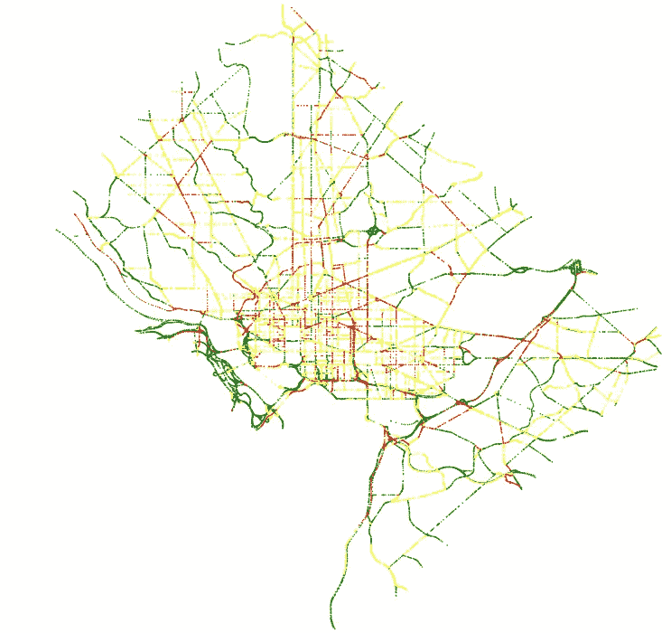
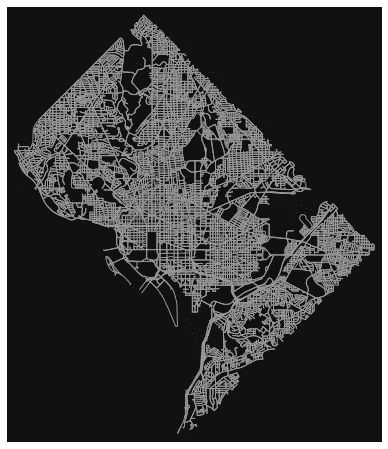
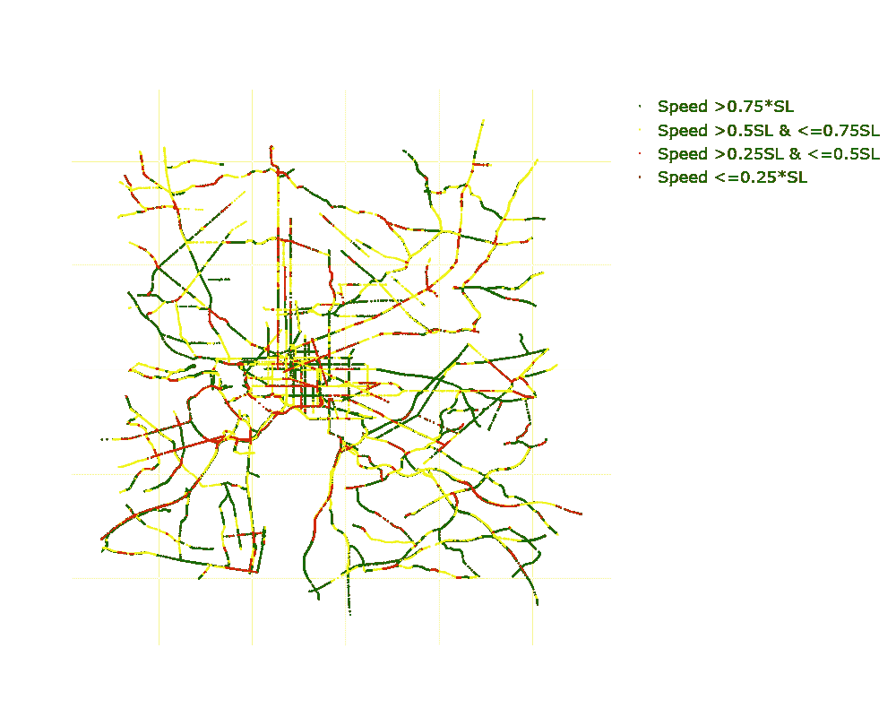
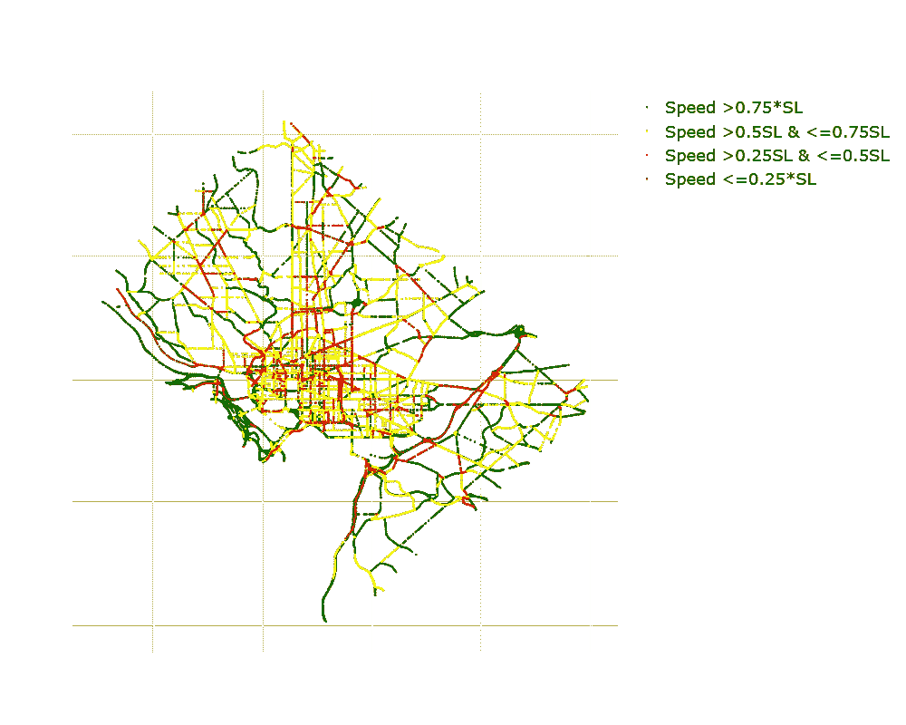

# 将道路速度与 OSMnx 城市网络融合在一起

> 原文：<https://towardsdatascience.com/merging-here-road-speeds-with-osmnx-urban-networks-960bcddd011c>

## OSMnx 是一个用于道路网络的强大 Python 包，但不包含当前的交通状况-让我们使用 HERE traffic API 来估算 OSMnx 中的实时交通信息



华盛顿 DC 公路网速度从这里 API 和 OSMnx |塞犍陀维韦克

OSMnx 是一个强大的 Python 包，用于处理取自 OpenStreetMap(一个免费的可编辑的世界地理数据库)的静态道路网络信息。下面是一个简短的代码片段，展示了如何使用 OSMnx 来获取华盛顿州 DC 的道路网络:

```
place_name="Washington DC, USA" G = ox.graph_from_place(place_name,network_type='drive', simplify=True) fig, ax = ox.plot_graph(G,node_size=0)
```



来自奥斯蒙斯的华盛顿 DC 公路网|塞犍陀·维韦克

但是，OSMnx 缺乏动态信息。特别是，OSMnx 目前根据速度限制，从单个道路穿越时间计算最短时间路径。这可能不具有代表性，尤其是在高峰时间，一些常用的道路可能会因拥堵或事故而完全堵塞。如果有一种方法可以根据当前的交通状况计算出最短的路径，那就太好了。那么我们如何获取 OSMnx 边缘的实时交通信息呢？

HERE API 使得从某个边界框内的路段获取速度成为可能。我写过一篇关于如何使用 HERE API 获得道路速度的文章:

[](/visualizing-real-time-traffic-patterns-using-here-traffic-api-5f61528d563)  

很容易设置一个 HERE API 帐户。


在此获取 REST API 密钥|塞犍陀·维韦克

给定一个来自 OSMnx 的城市道路网络 G，您可以将该道路网络输入到一个自定义函数中，该函数会计算出适当的边界框来从中提取速度。get_speeds.py 模块中的函数 speeds 就是这样做的:

```
from get_speeds import * 
speeds(G,API_KEY)
```

因为 HERE API 给出了交通速度和速度限制的信息，所以我绘制了一个图表来可视化道路上的相对速度。



速度从这里 API |塞犍陀维韦克

然而，有一个问题。这里提供了边界框中的速度。但是请注意，OSMnx 只提供来自华盛顿 DC 地区的道路网络，这对应于边界框的右半部分。我们可以通过将从 HERE 路段数据获得的速度与 OSMnx 边缘相结合来解决这个问题。为此，我们需要为 OSMnx 中的每条边分配来自 HERE 路段数据的最近路段的速度。计算最近的 OSMnx 边和与单点的相应距离需要几秒钟的时间。由于 here 数据中有 40，000+路段和速度，预计这需要一段时间！

```
API_KEY='BLAH' 
get_edge_speeds(G,API_KEY)
```


从这里获取交通位置的最近 OSMnx 边缘 API |塞犍陀维韦克

我使用 joblib 利用了所有 16 个 CPU 内核，这花了 10 多个小时才完成！过滤距离 OSMnx 边缘的阈值距离内的所有路段，得到以下图像:



通过接近奥斯门克斯边缘过滤交通速度段|塞犍陀·维韦克

正如您所看到的，它看起来好多了——而且比原来的 OSMnx 图形更有可比性！

最后，基于截止值(这里是 0.01)，你可以得到网络的边和速度！

```
df_es=pd.read_csv('df_es.csv') 
edges1=add_edge_speeds(G,df_es,0.01) #change cutoff as necessary
```

就是这样-现在您可以执行各种网络算法，如最短时间路径，考虑交通模式！不过有一点需要注意的是，HERE API 不提供某些较小道路上的速度信息，而 OSMnx 提供了更细粒度的道路网络信息。这将导致在较小的道路上对速度的不正确估计。根据您的使用情况，这可能是一个大问题，也可能根本不是什么大问题。

代码可以在 GitHub repo 中找到:

[](https://github.com/skandavivek/osmnx-edge-speeds)  

*如果你还不是中会员，想支持我这样的作家，可以通过我的推荐链接随意报名:*[*【https://skanda-vivek.medium.com/membership】*](https://skanda-vivek.medium.com/membership)

[*关注我*](https://medium.com/@skanda.vivek) *如果你喜欢这篇文章——我经常在数据科学、物理和社会的界面上写作。*

*原载于 2022 年 4 月 8 日 https://chaoscontrol.net*[](https://chaoscontrol.net/real-time-traffic-speeds-in-osmnx-urban-road-networks/)**。**