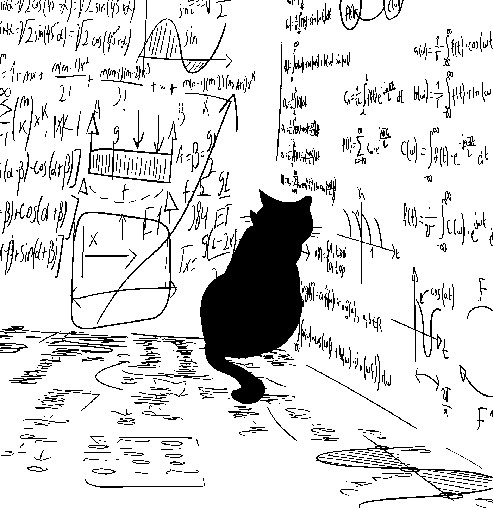

# Julia 中的元编程:全面概述

> 原文：<https://towardsdatascience.com/metaprogramming-in-julia-a-full-overview-2b4e811f1f77>

## 在 Julia 中用几种不同的技术看元编程



(图片由 [Pixabay](https://pixabay.com/images/id-6497416/) 上的 [3Lloi_KoteikA](https://pixabay.com/users/3lloi_koteika-21641593/) 提供)

# 介绍

传统函数式编程语言最著名的事情之一可能是一个叫做元编程的概念。元编程本质上只是用数据编程，而不是用代码——或者更确切地说，是从代码中创建数据或从数据中创建代码。历史上，元编程的实现一直围绕着列表和符号，Julia 的元编程实现与这些历史实现既相似又不同。

尽管有一些细微的差别，并且缺乏关于 Julia 元编程的全面教程，Julian 系统实际上真的很棒。如果你碰巧有过其他语言的元编程经验，这个实现可能会让你感到惊讶和兴奋，因为我认为 Julia 处理这个的方式非常棒，就像 Julia 中的许多其他特性一样！如果您想更深入地了解我在本文中使用的代码和数据代码，这里有一个链接指向我在本文中使用的笔记本！：

[](https://github.com/emmettgb/Emmetts-DS-NoteBooks/blob/master/Julia/Julia%20metaprogramming.ipynb) [## Emmetts-DS-NoteBooks/Julia meta programming . ipynb at master emmett GB/Emmetts-DS-NoteBooks

### 各种项目的随机笔记本。通过创建帐户，为 emmettgb/Emmetts-DS 笔记本电脑的开发做出贡献…

github.com](https://github.com/emmettgb/Emmetts-DS-NoteBooks/blob/master/Julia/Julia%20metaprogramming.ipynb) 

> 顺便说一下，这个存储库非常庞大，现在总共包含 132 个项目。那可是好多笔记本啊！

# 一切都是象征

在开始元编程之前，你需要了解的第一件事是，Julia 中的一切都是一个符号。也就是说，everything 的类型不是 Symbol()，而是对 Julia 内部的每个现有名称都有一个查找。我们实际上可以通过符号以及它们的别名来索引单个作用域，别名通常只是转换成字符串的符号。正如我刚才所说的，这可以在语言的任何单独范围内完成。换句话说，如果我们使用一个构造函数来创建一个新的类型，那么这个类型现在就有了自己的作用域，在这个作用域中，我们可以访问新定义的符号。获得这样的值的一个很好的方法是通过 Julia 保守得最好的秘密之一 getfield()方法。

我们可以在 Julia 中任何有作用域的东西上使用 getfield 方法。这可以是我们的全局环境，在 Julia 中称为 Main，一个模块，一个类型——任何可以存储作用域的东西——当然没有属性的作用域除外，比如方法，循环等等。考虑以下值 x:

```
x = 5
```

这个 x 现在被全局定义为 64 位整数 5。我们可以通过调用 Main 中的 5 来访问它，正如人们可能期望的那样:

```
println(x)5
```

当然，我们也可以直接调用它作为主模块的子模块:

```
Main.x5
```

查看一个 get 字段，我们只需将名称更改为其“字符串”别名的符号表示。我们还需要提供类型、模块或我们正在处理的任何东西作为第一个位置参数，这样方法就知道从哪里获取字段:

```
getfield(Main, :x)5
```

我有一整篇关于 getfield 和 Julian 自省主题的文章，如果这不是很有意义，或者可能有人想了解更多关于这种方法和其他类似方法的信息，那么它可能值得一读:

[](/runtime-introspection-julias-most-powerful-best-kept-secret-bf845e282367) [## 运行时自省:Julia 最强大、保守得最好的秘密

### 在 Julia 中使用内省处理类型

towardsdatascience.com](/runtime-introspection-julias-most-powerful-best-kept-secret-bf845e282367) 

# 公式

数据类型的字段也不是唯一可以用符号表示的东西。一个表达式本质上是一个可以被求值的符号，它比一个典型的符号有更多的属性。我们可以用碱。Meta.parse 以便将字符串转换为表达式，例如:

```
helloworld = Base.Meta.parse("println(\"Hello World!\")"):(println("Hello World!"))
```

这将成为 Expr 类型:

```
println(typeof(helloworld))Expr
```

最后，我们可以使用 eval()方法计算这样的表达式。

```
eval(helloworld)Hello World!
```

表达式也有自己的字段，这些字段比我们想象的要方便得多，我们将在后面的例子中详述。不过现在，让我们用一种内省的方法来看看这些字段，我在前面提到的文章中也提到了这种方法。

```
fieldnames(Expr)(:head, :args)
```

我们可以看到这些如何适合我们刚刚使用循环和 getfield 评估的示例 helloworld 表达式:

```
for field in fieldnames(Expr)
    println(getfield(helloworld, field))
endcall
Any[:println, "Hello World!"]
```

head 字段通知 Julia 我们正在使用哪种表达式。如果我们是元编程正则 Julia，就像我们在这里一样，这将永远是:call。在大多数情况下，很可能是:call，所以现在我们将忽略这一点，转到:args 字段。:args 是 arguments 的缩写，后面是作为符号的方法调用，例如:println，后面是它们的参数。求值器知道方法的参数何时结束，因为它遇到了一个新的符号，这个符号也是一个方法调用。换句话说，我们可以把这个符号包装成“Hello World！”就像我们上面写的那样。

```
println("Hello World!")
```

# 宏指令

从最终用户的角度来看，将常规代码与这些表达式联系起来的是宏。宏允许我们计算 10，或\n，或 return 之前的所有内容，无论你想在运行中调用什么，然后处理这个表达式。这里有一些有趣的细微差别，老实说，有些你无法从阅读 Julia 文档中找到——我认为这是不幸的，所以我将为你提供一些关于宏的信息，以及一种有趣的方法来查看 Julia，如果这是使用方法错误的情况。此外，如果不把这一节写得很长，我就不可能表达关于宏语法和插值的每一件事情，所以如果你想了解更多关于宏的知识，这里有一个关于宏的 Julia 文档的链接:

 [## 元编程

### Julia 语言中 Lisp 最强的遗产是它的元编程支持。像 Lisp 一样，Julia 代表它自己的…

docs.julialang.org](https://docs.julialang.org/en/v1/manual/metaprogramming/#man-macros) 

无论如何，让我们定义一个我们可以使用的宏。如你所料，我们只需使用关键字宏就可以做到。除此之外，宏的结构通常很像函数，尽管你绝对不应该使用宏作为函数，我们将在创建一个宏之后解释为什么会这样。我们的宏将被用来打印出一个循环要进行多长时间。这样，我们可以很好地了解如何使用宏来修改语法，但也不会太深入，以至于在我们进入下一个更复杂的代码部分之前我会失去你。为了证明我之前所说的，我们无法从文档中获得的信息，我将通过提供宏无法接收的参数来故意导致方法错误。

```
macro howmany(s::String, b::Int64)

end
```

请注意，这些并不是我想要使用的实际参数，我只是想说明有时方法错误实际上可以成为学习方法的很好的输出。我将使用我们之前在 getfield 中使用的小循环来定义一个循环来使用这个宏。

```
[@howmany](http://twitter.com/howmany) for field in  fieldnames(Expr)
    println(field)
endLoadError: MethodError: no method matching var"@howmany"(::LineNumberNode, ::Module, ::Expr)
Closest candidates are:
  var"@howmany"(::LineNumberNode, ::Module) at In[12]:1
  var"@howmany"(::LineNumberNode, ::Module, ::String, ::Int64) at In[13]:1
in expression starting at In[14]:1
```

这里文档没有告诉你的是::LineNumberNode 和::Module 在默认情况下总是会被提供。我们实际上从来不需要使用 LineNumberNode，因为我怀疑这更像是一个内部的东西，因为我们确实收到了宏之后的其余行作为表达式，这实际上应该是传递给我们的唯一参数。但是，还要注意提供了模块，这是调用宏的模块。我们可以使用 __module__ 在代码中访问它，这是一个全局定义，正如你所看到的:

```
__module__UndefVarError: __module__ not defined
```

但是，如果我们仅将表达式作为参数来修改宏，我们可以将该参数打印出来:

```
macro howmany(exp::Expr)
    println(__module__)
end[@howmany](http://twitter.com/howmany) for field in  fieldnames(Expr)
    println(field)
endMain
```

也就是说，论点是完全不可见的——你不会从阅读文档中知道它的存在，这也可能支持我关于行号的理论——因为也许这也是更内在的。

一般来说，编写宏时的最佳实践是做任何你必须做的事情，然后引用一个函数。出现这种情况有很多原因，这在过去确实让我感到困惑——人们告诉我这是使用宏的一种更好的方式，从而帮助了我，所以现在我将这一信息传递给你。现在，如果我们在 args 字段中打印出可索引的第一个参数，我们会得到

```
macro howmany(exp::Expr)
    println(exp.args[1])
endfield = fieldnames(Expr)
```

由于这个表达式的性质，假设它是一个 for 循环，处理这个问题的最好方法可能是拆分一个字符串——这并不总是如此，但在某些情况下，重新解析是必要的，否则就没有办法获得这些参数名。记住这一点，我将继续传递这个表达式的字符串版本，通过一个新的方法，它将为我们计算这个值的长度。

```
macro howmany(exp::Expr)
    statement = exp.args[1]
    howmany(string(exp))
end
```

在我们新的 howmany()方法中，我们将首先把我们的字符串分割成子字符串，然后因为我们的参数在这个例子中的位置保持一致，我们不需要做任何进一步的工作。

```
function howmany(exp::String)
    d = split(exp, ' ')
end
```

非常简单的东西，我将获取我们的值的位置，然后解析它并在 length()方法周围求值，就像这样:

```
function howmany(exp::String)
    d = split(exp, ' ')
    value = d[4]
    n = eval(Base.Meta.parse("length(" * value * ")"))
    println("COUNT: " * string(n))
end[@howmany](http://twitter.com/howmany) for field in fieldnames(Expr)

endCOUNT: 2
```

然而，有一个问题仍然没有答案；为什么我决定采用这种方法？在宏内部计算一个返回将会导致很多作用域的问题。尽管模块被传递到宏中，但是从外部调用方法要简单得多，因为在所有诚实的宏中，在 Julia 中有一些处理范围的有趣方法。也就是说，你也可以查看下面的替代方案，它比系统化的方法要多得多的代码来完成一项任务。

```
"""
## [@each](http://twitter.com/each) exp::Expr -> ::Bool
Determines whether each element of an iterable meets a certain condition. Returns a boolean, true if all of the elements meet a condition, false if otherwise.
Used in conditional contexts.
### example
```
x = [5, 10, 15, 20]
if [@each](http://twitter.com/each) x % 5 == 0
   println("They are!")
end
They are!
if [@each](http://twitter.com/each) x > 25
    println("They are!")
end
if [@each](http://twitter.com/each) x < 25
    println("They are!")
end
They are!
```
"""
macro each(exp::Expr)
    x = exp.args[2]
    xname = ""
    if contains(string(x), '[')
        xname = eval(x)
    else
        xname = getfield(__module__, Symbol(x))
    end
    if length(exp.args) == 2
        for value in xname
            state = eval(Meta.parse(string(exp.args[1], "(", value, ")")))
            if state != true
                return(false)
            end
        end
    endfor value in xname
        state = eval(Meta.parse(string(value," ", exp.args[1], " ", exp.args[3])))
        if state != true
            return(false)
        end
    end
    return(true)
end
```

# 结论

Julia 中有很多关于元编程的内容，但是希望这个基本介绍非常适合那些对这个主题感兴趣但是可能不知道从哪里开始的人。我认为 Julian 实现可能是我使用过的最好的实现之一，除了像 Lisp 这样评估数组的语言。也就是说，像 Lisp 这样的语言有它们自己的缺点，并且没有 Julia 那样漂亮的语法。我发现在 Lisp 中计算括号有点烦人。也就是说，这肯定是元编程在一种语言中较好的实现之一，其伟大之处就在于它允许您做多少事情。这些宏中的许多被用来在一个全新的层面上与代码进行交互，通过提高性能、计时等类似的事情，这使得许多事情有始有终。这真的非常非常酷。我喜欢在一个符号下有一个固定名称的概念，类似于利用这些元编程概念的其他语言。感谢您阅读我的文章，我希望这是对朱莉娅的一个有趣的方面的一个有趣的观察，我以前没有太多接触过。感谢您的阅读！