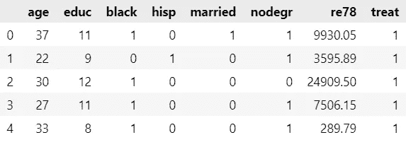
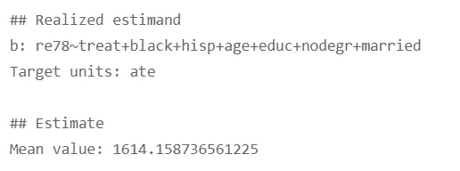
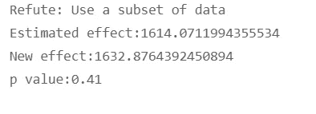
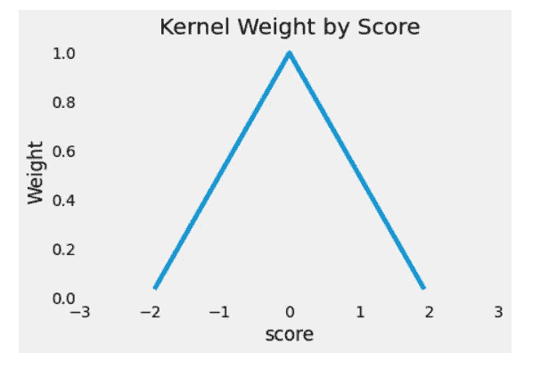

# 推断因果关系的方法

> 原文：<https://towardsdatascience.com/methods-for-inferring-causality-52e4144f6865>

## 匹配，倾向加权，双重稳健最大似然，回归不连续设计

在 [Unsplash](https://unsplash.com?utm_source=medium&utm_medium=referral) 上由 [Austin Distel](https://unsplash.com/@austindistel?utm_source=medium&utm_medium=referral) 拍摄的照片

在我们之前的文章[第 1 部分:因果推理入门](/getting-started-with-causal-inference-5cb61b707740)中，我们介绍了因果推理的基础知识，并对**回归**给予了很多关注。我们还讨论了回归不是因果估计设计中关闭后门的唯一方法。在这篇文章中，我们将讨论一些其他方法，都旨在实现同样的事情，即，使治疗组和对照组在所有方面都相似，除了在治疗方面。

 [## 因果推理入门

### 超越“相关性不是因果关系”,理解“为什么”

towardsdatascience.com](/getting-started-with-causal-inference-5cb61b707740) 

# 相称的

匹配的目的是通过为每个治疗单位找到一个(或多个)具有相似可观察特征的非治疗单位，并抵消协变量，从而减少观察数据研究中估计治疗效果的偏倚。如果存在一些影响治疗和结果的混杂因素，比如年龄，从而使治疗组和对照组不可比，我们可以通过将每个治疗单位与对照组的相似单位进行匹配来使它们具有可比性。在我们的例子中，来自治疗组和对照组的年龄相似的人被放在一起比较，最终结果是所有这些的平均值。

如上计算用于匹配的 ATE，其中 Yj(i)是来自与治疗组最相似的对照组的样本。2Ti -1 用于双向匹配。

这有助于消除一些偏差，但如果匹配的治疗和控制单位的 Y₀差异不为 0 呢？可能会发生这样的情况，因为匹配的差异，我们仍然有偏见。幸运的是，在老朋友的帮助下，我们有办法进一步改善我们已经开始的减少偏见之旅。**再一次回归拯救**！

₀(X i)是未经处理的处理单位 I 的结果值，即这是处理单位的 Y₀。

₀(X j(i))是对照单位 j 与处理单位 I 匹配的结果，即这是对照单位与处理单位匹配的 Y₀。因此，在上面的 ATE 方程中，我们确保处理过的和匹配的单位的 Y₀不会对 ATE 产生影响。

假设我们想要测量药物治疗对恢复天数的影响，但是在我们的实验设计中，我们有像患者的年龄、严重程度和性别这样的混杂因素。

ATE = 16 . 48667 . 48868688667

如果我们直接计算 ate 而不添加任何对照，看起来药物治疗增加了恢复天数，但我们知道由于混杂，治疗组和对照组没有可比性。让我们看看，如果我们使用 KNN 匹配处理和控制单元，并使用回归进一步减少偏差**(偏差校正)**，会发生什么，如上所示

ATE = 7.62666061414365

瞧啊。这肯定更有意义。一旦我们通过匹配控制了混杂因素，由于药物的原因，恢复期减少了 7 天。

**倾向得分分层:**我们可以根据**倾向**得分进行匹配，而不是直接或使用一些距离度量来匹配协变量，这是给定所有协变量的条件治疗概率 **P(T|X)** ，表示为 P(x)。**分层**使用倾向评分的分位数对个体进行细分，在每个层内计算治疗效果，并使用权重(每个层中单元的比例)进行组合，以获得最终估计值。已经表明，分成 5 层可以减少高达 90%的偏差。

让我们使用微软**的 **dowhy 库来实现这一点。****

****

**当有许多控制单元要与治疗单元匹配时，匹配效果很好。在倾向术语中，它被称为共同支持，治疗和未治疗之间的倾向分布应该有一个可靠的估计良好的重叠。**

****

# **倾向得分加权**

**我们在上面讨论过，我们可以根据称为**倾向得分**的单个值来决定条件，而不是根据协变量来决定条件，这是在给定协变量 P(T|X)的情况下获得治疗 T 的条件概率，因此**

********

**倾向得分(作者图片)**

**x(混杂因素)通过函数 P(x)影响 T(治疗),因此对 P(x)的控制间接控制了 x。我们可以使用该倾向得分进行匹配，也可以在线性回归中直接使用该倾向得分来控制偏倚，而不是根据所有混杂因素对其进行调节。我们现在将使用 P(x)作为缩放参数，这种方法被称为**治疗加权的逆概率(IPTW)****

****

**对 X 进行简化和积分，我们得到。**

****

**根据上面的等式，对于治疗组，我们通过倾向的倒数来衡量结果。当实际上在治疗组中时，对于具有低治疗概率(看起来未治疗)的人给予较高的权重，对于对照组反之亦然。这就产生了一个群体，其中每个单位都由倾向的倒数来衡量，从而控制了倾向所依赖的所有 X。**

****

**拉隆德数据集**

**我们将使用 Lalonde 数据集来发现治疗对 78 年实际收入的影响，首先通过使用回归并将所有混杂因素包括在回归方程中，然后通过使用回归方程中的倾向得分而不是混杂变量，最后我们将使用 DoWhy 包中的倾向得分加权方法。**

****

**用所有混杂变量回归后，ATE 约为 1671。现在让我们使用逻辑回归得到倾向得分，并在线性回归中使用，控制 P(x)而不是 x。**

****

****Dow why**包中的倾向得分加权函数**

****

## **关于 DoWhy 的附加注释**

**DoWhy 软件包为我们提供了一些让我们的结果更加可信的方法，叫做**反驳**方法。让我们用上面的例子来理解这一点。**

****随机共因反驳器**:将随机生成的协变量添加到数据中，并重新运行分析，以查看因果估计值是否改变。因果估计不会因为一个随机变量而改变太多。**

****

****安慰剂治疗反驳者**:随机分配任何协变量作为治疗。因果估计应该趋向于零。**

****

****数据子集反驳者:**类似于交叉验证，如果我们的因果估计在子集之间变化，它会创建数据和测量的子集。我们的估计应该不会有太大的变化。**

****

> **通过这些反驳测试并不意味着我们的因果估计是正确的。它只是用来为我们的因果估计提供更多的信心。记住，我们在上一篇文章中讨论过，观察数据的因果推断需要内部有效性，我们必须确保我们已经控制了导致偏差的变量。这不同于预测模型所需的外部有效性，我们使用训练测试分割来实现预测模型，以获得可靠的预测(非因果估计)**

**如果您想了解更多关于 DoWhy 包的信息，参考资料中提供了文档的链接。继续前进。**

# **双重稳健估计**

**我们使用了回归模型和基于倾向评分的方法来控制混杂因素，但也有一种方法可以同时使用这两种方法来确保我们的因果估计更加稳健。它被称为**双重稳健估计。****

************

**这里先看第一部分，It 1 (X)是正确的，P(x)是错误估计的，那么 E[Ti (Yi - 1 (Xi))]=0，因为 Ti 只选取治疗过的病例，对于那些(Yi - 1 (Xi))非常接近 0 的病例。所以在 1 (X)中是正确的，消除了 P(x)是正确的必要性。重新排列这些术语，我们还可以证明，当 P(x)正确时，我们不需要(X)是正确的。**

**因果估计= 1619.51**

# **回归不连续设计**

**只要有明确的阈值将治疗与对照分开，就可以使用回归不连续设计。基于阈值，我们可以通过将刚好低于阈值的人群识别为对照组，将刚好高于阈值的人群识别为治疗组来减少偏倚。例如，在移动游戏中，当分数导致级别改变时，刚好低于某个分数的玩家可以被识别为控制，而刚好高于该分数的玩家可以被识别为治疗。我们可以确定水平对其他技能的影响，因为刚好低于和高于阈值的人可能具有相似的技能。**

**实施 RDD 非常简单，只需创建一个虚拟变量，其值低于阈值为 0，高于阈值为 1。让我们实现它来研究游戏中等级变化对参与度的影响，我们的阈值是 100 分(等级变化)。该数据包含游戏分数和参与度分数。**

********

**参与度增加了 7.66 个单位，等级变化为 100 分。由于我们对阈值处的效果更感兴趣，因此与远离阈值的数据点相比，更好地拟合阈值周围的数据点是有意义的。我们可以使用线性回归中的权重来做到这一点。我们将使用下面的内核作为线性回归模型的权重**

********

**可以看出，通过使用在阈值附近具有较高权重的加权线性回归，水平变化的影响增加到 8.3。**

****

**这里和上一篇文章中讨论的所有这些方法都是有用的，但不是完全可靠的。我们可能无法完全消除偏倚，因为总有一些无法观察到的混杂因素影响我们的设计，但通过使用不同的方法控制混杂因素来减少一些偏倚是可能的，而且肯定比预测性推断更可靠。因果洞察力可以引发 A/B 测试，这是因果推理的黄金标准。**

**在上一篇文章中，我们介绍了因果推断的基础，在本文中，我们介绍了获得因果估计的方法。这些文章都旨在获得平均的治疗效果，但更好的是在治疗单元上获得更个性化的治疗效果，也称为异质治疗效果。例如，如果平均治疗效果告诉我们是否应该推出电子邮件营销活动，而异质治疗效果告诉我们应该将哪些客户作为营销活动的目标，以提高我们的投资回报率。在我们的下一篇文章中，我们将讨论异质性治疗效果和评估方法。**

**如果你喜欢这些文章，不要忘了慷慨鼓掌，订阅我的下一篇文章发表时会收到通知。**

# **参考**

*   **【https://matheusfacure.github.io/python-causality-handbook/ 号**
*   **[https://www.bradyneal.com/causal-inference-course](https://www.bradyneal.com/causal-inference-course)**
*   **https://theeffectbook.net/**
*   **【https://www.aeaweb.org/articles?id=10.1257/app.1.1.164 **
*   **[https://academic.oup.com/ejcts/article/53/6/1112/4978231](https://academic.oup.com/ejcts/article/53/6/1112/4978231)**
*   **[https://www.masteringmetrics.com/](https://www.masteringmetrics.com/)**
*   **[https://www . Amazon . in/Applied-Data-Science-Transforming-Actionable/DP/0135258529](https://www.amazon.in/Applied-Data-Science-Transforming-Actionable/dp/0135258529)**
*   **[https://mixtape.scunning.com/](https://mixtape.scunning.com/)**
*   **[https://microsoft.github.io/dowhy/](https://microsoft.github.io/dowhy/)**