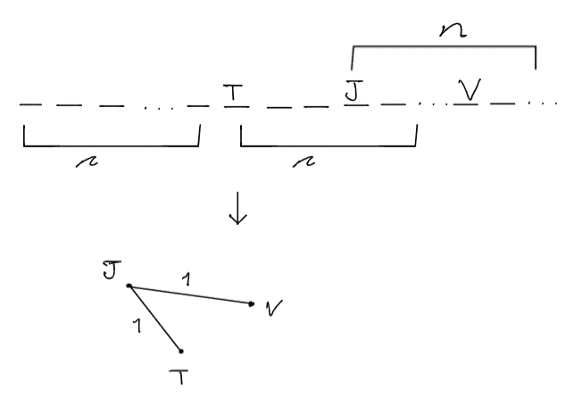
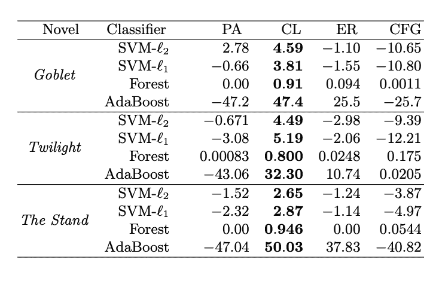

# 挖掘和模拟字符网络——第一部分

> 原文：<https://towardsdatascience.com/mining-modelling-character-networks-part-i-e37e4878c467>

## [思想和理论](https://towardsdatascience.com/tagged/thoughts-and-theory)

# 挖掘& **建模**字符网络—第一部分

## 图论中讨论从文本中挖掘字符和模拟交互网络的论文的文献综述

图片来自[纳斯蒂亚·杜尔希尔](https://unsplash.com/@dulhiier)拍摄的[水花](https://unsplash.com/photos/OKOOGO578eo)

这是一篇由两部分组成的文章，第一部分将讨论相关的研究论文，包括从各种文本中挖掘和建模字符网络的主题。接下来的第二部分将介绍挖掘角色的 python 实现，识别角色交互，然后在这些角色之间创建交互网络。

  

以下是这篇文章的提纲。

**目录**

*   介绍
*   文献评论
*   设计和方法
    -数据&网络创建
    -建模
*   结果
*   讨论和评论
*   资源

# **简介**

数学在现实世界中有许多应用，数学中一个定义明确的分支叫做图论，它是对图形的研究。图是一种通过边来模拟节点之间成对关系的数学结构，它对于定义和理解节点之间的关系及其连接有着不可思议的应用[1]。图论的许多应用之一在于理解字符网络。这些人物网络产生于小说、故事、电影、视频和其他形式的媒体。根据网络的结构，人们可以选择节点对的关系类型。这些关系可以通过对话、性别、共现、主题、故事情节、冲突、争论、朋友、敌人、种族等来描述。[1].这些网络可以带来基于结构的新观点，也就是说，我们可以基于对网络的观察和数学分析来剥离和强化文本主体中显示的现有主题和属性。

在 Bonato 等人的“*挖掘和建模字符网络*”中，分析结果可能因网络结构而异。他们根据 15 个单词范围内文本中字符的接近度创建了一个加权字符网络。如果在文本中提到了两个或更多字符，并且它们之间的距离在 15 个单词以内，那么将会创建与该组字符的组合相关联的加权边。

# **文献综述**

在字符网络的分析方面已经做了大量的工作。在“*提取和分析虚构人物网络:一项调查*”中，Labatut 和 Bost 概述并整合了人物网络主题的所有学术文献。从识别字符、检测字符交互、提取图形，到分析和应用[2]。Labatut 和 Bost 概述了识别字符和检测这些识别字符之间的相互作用的各种方法。字符识别方法包括从人工识别到使用命名实体识别(NER)工具，该工具基于预定义的类别来定位和分类文本主体中提到的命名实体。当处理视频、漫画、漫画和电影等视觉形式的媒体时，文本通过计算机视觉使用人脸检测来勾勒轮廓。Labatut 和 Bost 指出了 6 种不同方法来识别字符之间相互作用[2]，即:

1.  字符共现
2.  人物之间的直接言语互动
3.  人物间的显性提及
4.  非语言互动(打架、接吻、杀戮等。)
5.  角色之间的联系(同事、家人、朋友等。)
6.  1–5 的混合方法

图形提取过程包括基于先前为媒体主体识别的字符和交互来创建网络。Labatut 和 Bost 声称，许多作者只是简单地使用单个字符作为节点，然而有些人在他们的网络创建过程中使用字符/组织的组合作为节点。边是基于作者在它们的指定节点之间使用的交互来创建的。许多作者选择创建他们的网络作为加权或多边，而少数人创建他们的图形作为指导。Labatut 和 Bost 对这些网络的分析涵盖了各种中心性测量、图形统计、社区结构、聚类等。

在 Ramakrishna 等人的“*电影角色刻画差异的语言学分析”*中，试图通过心理语言学和网络分析来检验角色的差异[4]。性别、年龄和其他元数据定义了角色之间的差异，这些元数据是通过角色之间的电影对话提取的。从 945 个剧本中，他们创建了一个解析器来识别与剧本相关的元数据。他们已经确定了与角色相关的性别、种族和年龄，以及电影元数据，包括电影上映日期、编剧、导演等。他们概述了在他们创建的网络上运行各种实验，即心理语言学规范和语言调查和字数统计(LIWC)。心理语言规范提供了对说话者的各种情绪和心理结构的测量，如唤醒、效价、具体性、可理解性等。而且完全是从语言使用中计算出来的[4]。LIWC 是一个文本处理应用程序，它处理原始文本并输出文本中属于语言、情感、感知和其他维度的一定百分比的单词。[4].最后，他们发现电影和电影场景中的性别、年龄和种族等级有明显的区别。特别是，他们注意到，如果制作团队中有女性工作人员，他们在整个演职人员中的性别比例会更平衡，但是如果制作团队以男性为主，那么演职人员也以男性为主。他们还注意到，混血人物在电影中有更多的性词汇。与老角色相关的对话的复杂程度明显高于年轻角色。

# **设计&方法论**

Bonato 等人的“*挖掘和建模字符网络*”是本文的重点，它强调了创建合成网络的实验，这些实验密切捕捉了字符网络的属性和相似性。

## **数据&网络创建**

博纳托对从以下文本主体创建的网络进行了深入分析，*暮光之城*，*看台*，*哈利波特与火焰杯*以及从[http://moviegalaxies.com/](http://moviegalaxies.com/)拍摄的电影中的 800 个角色网络。他们构建了一个解析器，可以扫描输入文本，识别唯一的字符名称及其相关别名。在识别字符名称后，另一个解析器再次检查文本主体，以识别字符在 15 个单词范围内的共现。这些共现是网络的代表性边。Bonato 等人决定创建一个如图 1 所示的加权网络，而不是将其作为一个多边图。

图 1:从文本创建网络(图片由作者提供)

然后，在创建的网络之上计算网络统计数据，以推断对文本主体的字符动态的更多见解。Bonato 等人在网络上运行了 Louvain 的算法来识别字符社区。还在网络上运行了以下中心性测量，并且这些结果中的一些后来被输入到机器学习模型中:

1.  **页面排名:**该算法统计与角色的质量交互的频率，以生成对角色重要性的估计。预期是在网络中具有较大重要性的字符将获得较大的页面排名分数。
2.  **特征向量:**该中心性度量指示某个字符在网络中的影响水平，较大的特征向量中心性得分反映了较高的字符重要性。潜在的假设是，具有高重要性的节点将与同样具有高重要性的其他节点高度连接。
3.  **中间性:**这一衡量标准基于角色将其他角色“连接”在一起的能力来确定角色对网络的影响。它通过识别和记录网络中所有角色之间的最短路径来做到这一点。经常落在所识别的最短路径中的字符将具有较大的介数，这是因为该算法认为该字符是连接其他字符的良好“桥梁”。
4.  **度:**这个度量反映了连接节点对的边的数量。具有高连通性的节点将具有很大程度的中心性。
5.  **接近度:**该度量基于网络中字符的接近度来识别字符与其他字符的接近度。它可以被推断为一个角色向其他角色传播信息的能力。

## **造型**

建模组件的目标是识别一个随机图形模型，该模型与观察到的字符网络的属性平行[3]。Bonato 等人导出了与网络相关的 k 分布和特征值分布。图的 k-profile 是在 G [3]的诱导子图中出现的 k 个节点上的每个图的频率。特征值分布是归一化拉普拉斯矩阵的特征值通过等间距仓的直方图[3]。有 4 种不同的随机图形模型用于合成原始字符网络。

1.  **二项式随机图:**图是由随机连接的节点构成的。每条边以独立于所有其他边的概率 p 连接。他们设置 p = |E| / nC2 来匹配原字符网络的平均度[3]。
2.  **配置模型:**他们创建了一个近似的网络，与原始字符网络具有相同的度分布。这是通过从精确匹配目标度分布的图形集中一致地选择一个图形来完成的[3]。
3.  **优先连接:**给定一个图 G，在每个时间步长 t，添加一个新的节点 n 和 m 条边，将这个新的节点 n 连接到时间步长 t-1 的现有节点。他们指定通过以下公式选择边 2/n + 2m = 2|E| / n [3]。
4.  Chung-Lu : 由该模型创建的图通过字符网络度分布来参数化[3]。它创建概率 p 与产品期望度数 wi 成比例的边[3]。边缘概率可以由下面的公式表示:pij = 1/C * wi * wj

为了评估这些随机模型中哪一个最好地反映了原始字符网络，Bonato 等人决定从每个模型中生成 100 个随机图。然后，他们试图通过在生成的每个随机图上训练各种分类器来确定上述 4 个模型中的最佳随机图模型，以查看分类器是否能够正确预测原始字符网络的类别标签[3]。本实验使用了 3 种不同的 ML 模型，即:

1.  **随机森林:**一种集成学习算法，该算法使用多个决策树的结果来做出关于该数据点将被标记为什么类的总体决定。最终类别将基于生成的每个决策树的聚合的多数投票来预测。
2.  **SVM:**SVM 分类背后的直觉是生成一个超平面，该超平面将数据点精确地分成它们适当的训练类。如果数据被映射到一个三维空间，一个二维超平面，它最大化超平面和所有其他数据点之间的边界。类似地，如果数据被映射到 2 维空间中，1 维超平面将被用于将数据分成它们适当的类。
3.  **Ada Boost:**AdaBoost 背后的直觉是通过使用许多弱学习器相互结合，将弱学习器(决策树)转换为强学习器，这是一个集成类型的模型。本质上，先前迭代的错误被用于在当前迭代中做出准确的预测。

# **结果**

这种方法不仅能够准确地预测字符的重要性，而且能够准确地预测在进行分析的 3 本书中形成的社区。具有最高中心性等级的字符(如页面等级)确实在正文中扮演着重要的角色；这在所有的中心性测量中都是决定性的。由 Louvain 算法创建的相应社区准确地描绘了文本主体中概述的社区。例如，在《暮光之城》中，有 3 个显著的社区形成，第一个社区对应于吸血鬼，第二个对应于高中学生，第三个对应于查理的朋友。当查看其他小说的相应图表时，可以得出类似的结论，参见[3]了解更多信息和跨 3 个文本主体的社区网络的可视化表示。

在本实验中，在分类器上使用了交叉验证，这是一种在机器学习中常用来查看机器学习模型的结果概括得如何的度量。每个分类器都获得了非常高的交叉验证分数以及大的 F1 分数。模型的性能可以在表 1 中看到。对应于每个模型，使用不同的精度测量，对于 Ada boost，使用最终决策函数，对于随机森林，使用软决策概率，对于 SVM，使用分离超平面的距离[3]。显然，根据下表所示的结果，Chung-Lu 模型在每本书的所有类别中都优于所有其他模型。

表 1:摘自 Bonato 等人[3]的文章，概述了使用图形剖面和特征值直方图作为特征时所有最大似然模型的性能

类似地，在图 2 中，我们看到，当使用图形轮廓和特征值直方图作为特征时，Chung-Lu 模型是所有电影星系数据中性能最好的模型[3]。

图 2:摘自 Bonato 等人[3]的文章，概述了 Chung-Lu 模型在研究电影星系数据集时优于所有其他模型的强大性能

# **讨论&备注**

Bonato 等人从 3 部大型小说和 800 部电影中对加权人物网络进行了网络分析。这些网络是基于文本中字符的共现而创建的。在生成网络时，进行了各种统计分析，包括 Louvaine 的社区检测算法，以及字符的中心性度量(页面等级、特征向量、介数、接近度、程度)。该分析成功地提取了准确的文学结论，并确定了网络中有影响力和无影响力的人物[3]。通过使用各种 ML 算法，如 SVM、随机森林、ada boost、Bonato 等人，将随机模型与来自复杂网络的其他模拟数据进行了比较。他们考虑了 Chung-Lu 模型、配置模型、PA 模型和二项式随机图[3]。结果清楚地表明，Chung-Lu 模型是精确描述原始字符网络的最佳表现模型。

Bonato 等人介绍的方法在许多方面都可以改进。首先，这些模型的性能很可能是网络规模的指示。由于原文正文(*《暮光之城》*、*《看台》*、*《哈利·波特与火焰杯》*和 800 个人物网络)一开始就很大，因此对应于该正文建立的相应人物网络也会很大。同样的方法和结果可能不适用于短篇故事、视频和小电影。其次，当自主识别字符和字符交互时，可以进行改进。在“*提取和分析虚构人物网络:调查*”、Labatut 和 Bost 中介绍的通过 NER 进行人物识别的方法和识别人物互动的混合方法将产生令人信服的论点，有助于当前提出的方法和更通用数据集的结果。

当前网络创建方法的局限性在于定义角色交互的方式。他们使用任意数字 15 来表示文本主体中字符之间的共现，该数字没有被导出，也没有被实验来查看如果增加或减少某个值 k，结果会如何不同。此外，基于当前的字符交互定义，如果一个人引用一组/组织的字符，则他们自动具有与该组/组织中的每个成员相关联的高加权边。这将对使用中心性分数、社区检测等进行的分析产生重大影响。

除了上面提到的讨论点之外，对于与该主题相关的未来实验，创建和探索在某个时间步长 t 上临时创建的图表将产生有趣的结果，以查看哪个模型最适合数据。这将让我们看到随着故事的进展，网络中的变化，相关的网络统计数据将非常有趣，因为我们可以看到角色动态如何随着时间的推移而演变。这允许引入各种时间序列分析和预测模型，这非常有趣。

# **资源**

[1]陈，安迪."*用…* 建模电影人物网络" snap.stanford.edu，斯坦福，2017 年 12 月，[https://snap . Stanford . edu/class/cs 224 w-2017/projects/cs 224 w-32-final . pdf .](https://snap.stanford.edu/class/cs224w-2017/projects/cs224w-32-final.pdf.)

[2]文森特·拉巴图特和泽维尔·博斯特。2019.虚拟人物网络的提取和分析:一项调查。美国计算机学会计算调查 52(5):89。[https://doi.org/10.1145/3344548](https://doi.org/10.1145/3344548)

[3] Bonato，a .，D'Angelo，D. R .，Elenberg，E. R .，Gleich，D. F .，& Hou，Y. (2016)。"*挖掘和建模字符网络*"网络图的算法和模型:第 13 届国际研讨会，WAW 2016，加拿大魁北克蒙特利尔，2016 年 12 月 14-15 日，会议录 13(第 100-114 页)。斯普林格国际出版公司

[4]罗摩克里希纳，阿尼尔等.*电影刻画差异的语言学分析…*《2017，[https://aclanthology.org/P17-1153.pdf.](https://aclanthology.org/P17-1153.pdf.)

如果你喜欢这篇文章，下面是我写的一些你可能会感兴趣的文章:

   [## 贝叶斯 A/B 测试解释

towardsdatascience.com](/bayesian-a-b-testing-explained-344a6df88c1a)    