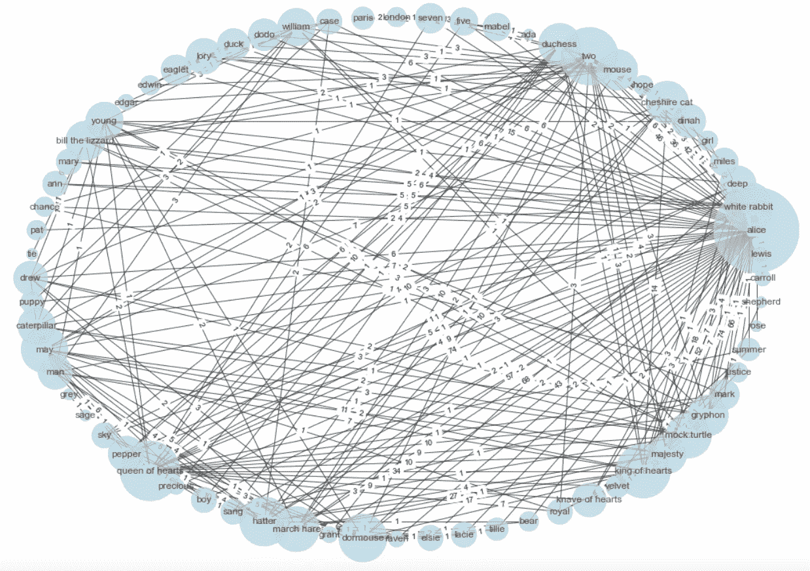
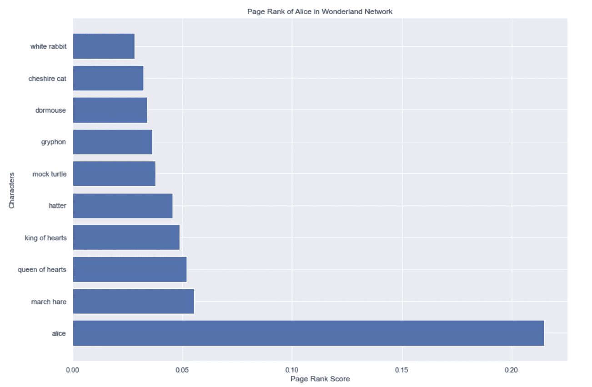

# 字符网络的挖掘和建模—第二部分

> 原文：<https://towardsdatascience.com/mining-modelling-character-networks-part-ii-a3d77de89638>

## 本文将介绍挖掘和建模字符网络的 Python 实现


由美国宇航局[拍摄的](https://unsplash.com/@nasa)[水花](https://unsplash.com/photos/Q1p7bh3SHj8)图片

如果您还没有，我建议您阅读本系列的第一部分。这是一篇研究论文的文献综述，我们将在本文中尝试用代码实现它。下面的文章我已经链接了。

[](/mining-modelling-character-networks-part-i-e37e4878c467) [## 挖掘和模拟字符网络——第一部分

### 图论研究论文讨论

towardsdatascience.com](/mining-modelling-character-networks-part-i-e37e4878c467) 

我深入研究了挖掘字符的文本数据的 Python 实现，创建了基于字符交互的字符网络，并通过 Chung-Lu 模型对这些字符网络建模。所有这些概念之前都在 Bonato 等人的“*挖掘和建模人物网络*”和“*提取和分析虚构人物网络:调查*”、Labatut 和 Bost [2]中讨论过。

本文将分析的文本主体是*爱丽丝梦游仙境，*然而，代码的结构方式是任何一段文本都可以被运行以产生它自己的结果。请注意，《爱丽丝梦游仙境》在 1923 年 1 月 1 日之前出版，因此属于公共领域，在全球范围内属于[公共领域](https://en.wikipedia.org/wiki/Public_domain)，因为卡罗尔于 1898 年去世，距今已有 100 多年[4]。

**目录**

*   数据
    -安装要求
    -下载爱丽丝梦游仙境
*   干净的数据
*   挖掘角色名字
    -方法 1:正则表达式
    -方法 2:名字语料库
*   寻找角色互动
*   创建角色网络
*   钟-卢模型
*   真实世界的应用
*   结论
*   资源

# 数据

下面将概述用于执行本文的 my Python 和库的版本。

**安装要求**

```
Python=3.8.8
networkx=2.5
pandas=1.2.4
numpy=1.20.1
scipy=1.6.2
matplotlib=3.3.4
nltk=3.6.1There are other requirements like re, collections, string and random but they come pre-installed along with Python. 
```

**下载爱丽丝梦游仙境**

导入 NLTK 后，可以非常轻松地下载《爱丽丝梦游仙境》的 txt 文件。只需在您的 python 环境中运行下面的代码，如果已经下载了，那么继续本文的下一部分。

# 干净的数据

在尝试识别字符之前，最好对原始文本数据进行一点清理。我们至少可以去掉停用词、标点符号和整个正文的小写字母。这将使交叉引用字符名称从文本与姓名语料库执行得更好。

# 挖掘角色名

有各种方法来识别角色的名字。在这里，我将介绍两种相似的方法来识别文本中的字符名称。第一个是查找字符名称的正则表达式，第二个是使用英语中已知名称的列表，并将这些已知名称与文本主体进行交叉引用，以确定在该文本主体中也找到了哪些已知名称。第二种方法将通过安大略省政府提供的开源数据集来完成:[安大略省婴儿名字 1917–2019](https://data.ontario.ca/dataset/ontario-top-baby-names-female)。

总的来说，让我通过陈述显而易见的事实来警告这一部分，这些方法中没有一个会对任何给定的文本体产生 100%准确的结果。即使在 NER 尝试 NLP 解决方案也不会给出太强的解决方案，因为机器/算法很难识别别名、组和其他只有人类才能识别的细微差别。最好的方法是让用户创建一个字典，其中的键是文本主体中的已知名称，值是与该已知名称相关联的别名列表。例如在《哈利·波特》中，已知的字典看起来像这样:

```
known_dct = {
 ‘Harry’ : [‘Harry Potter’, ‘The Chosen One’, …],
 ‘Voldemort’ : [‘He Who Must Not Be Named’, ‘Voldything’, …],
 …
}
```

## 方法 1:正则表达式

这种实现虽然有效，但在角色名中产生了许多误报。很难构造一个在任何情况下都适用于任何文本主体的正则表达式。以下代码产生的一些误报名称如下:

```
'Uglification Derision', 'Mouse Alice', 'Hatter Dormouse', 'William Conqueror', 'Caucusrace Caucusrace', 'Time Hatter', 'Elsie Lacie', 'Mad Tea', 'Soup Soup', 'Edgar Atheling', 'Gryphon Turn', 'King Queen', 'Alices Lewis'
```

## 方法 2:人名语料库

人名大全由安大略政府提供。政府发布了两个数据源，其中包括 1917 年至 2019 年的男性和女性婴儿的姓名。这一数据来源共产生了 164 034 个名字。由于安大略省是一个相对多样化的省份，名字涵盖了不同的种族背景，这对于不同的文本主体来说更加通用。您可以从这里下载这些名字:

*   [男名](https://data.ontario.ca/dataset/ontario-top-baby-names-male)
*   [女名](https://data.ontario.ca/dataset/ontario-top-baby-names-female)

或者你可以参考[我上传到 GitHub 的这个](https://raw.githubusercontent.com/vatsal220/medium_articles/main/character_networks/data/ontario_names_list_1917-2019.csv) CSV，它是男性和女性名字的连接结果。这个 CSV 是本文代码中引用的内容。

总的来说，方法 2 产生了更好的结果，因为如果用户输入姓名字典，它考虑了姓名的别名。方法 2 的结果将输入到本文的以下部分。

挖掘角色名字的其他来源也进行了探索，如使用 NER，我没有继续展示这一点的原因是因为只有高端解决方案产生任何有用的结果。通过小规模的解决方案，如在 NLTK 和 Spacy 中使用内置的 NER 模型，我们最终得到了太多的假阳性，尽管上面的结果也会产生假阳性，但它们不会达到 NER 解决方案的程度。通过 NER 的一个解决方案确实产生了有用的结果，那就是在这个文本语料库上用带标签的命名数据训练 BERT。然而，尽管这产生了很好的准确性，但是在时间和金钱上也是非常昂贵的。我没有时间或资源来标记数千本关于姓名数据的书籍并重新训练 BERT 模型，也没有大量资金分配给 GPU 来帮助训练过程。因此，找到名字的简单方法就是我现在展示的方法。

# 寻找角色互动

这个部分是由你定义角色互动的方式决定的。从本系列的第 1 部分，我们发现有许多方法可以识别角色交互。从 Labatut 和 Bost 那里，他们强调了 6 种不同的方法来识别角色之间的互动[2]，即
1)角色的共现
2)角色之间的直接言语互动
3)角色之间的明确提及
4)非言语互动(打斗、接吻、杀戮等)。)
5)角色之间的从属关系(同事、家人、朋友等。)
6)1–5 的混合方法

就本文的目的而言，我们将关注角色交互的第一种方法，即角色的共现。如果两个字符的名字出现在 N 个单词之间，我们可以定义这两个字符共现。在 Bonato 等人的*“挖掘和建模字符网络”*中，用户可以确定 N 的值。他们选择 N 等于 15。为了我们的目的，我们可以使用相同的 N 值。

# 创建角色网络

为此，我们将创建一个加权网络。节点将是字符本身，边将由我们上面发现的共现形成。边的权重将由给定正文中的共现频率来确定。例如，如果爱丽丝和王后在文本正文中有 15 次交互，则与连接爱丽丝和王后的边相关联的权重将是 15。



以圆形格式可视化的网络，如果节点的度数高，则节点的尺寸较大(图片由作者提供)



这是与《爱丽丝梦游仙境》中前 10 个角色相关的网页排名(图片由作者提供)

在网络中可以看到，爱丽丝、国王、王后都是非常突出的角色，边缘权重很高。同样，我们可以看到，最重要的人物(通过节点的页面排名捕捉到的)确实是书中的重要人物。我们看到爱丽丝、三月兔、红心皇后和红心国王是前 4 个最重要的角色。

# 钟-卢模型

根据 Bonato 等人写的论文，Chung-Lu 模型在捕获原始字符网络的结果方面是表现最好的模型，因此我们将在这里实现该模型。Dario Fasino、Arianna Tonetto 和 Francesco Tudisco*【5】的论文 [*用 Chung-Lu 随机图模型生成大型无标度网络概述了该模型，他们已经通过他们的*](https://arxiv.org/pdf/1910.11341.pdf) *[Github 库](https://github.com/ftudisco/scalefreechunglu)【3】将与该模型相关的 Python 和 MATLAB 源代码开源。我们可以对输入参数做一些轻微的重构，以匹配我们网络的度分布。**

# *真实世界的应用*

*现在你可能会想，这是一个有趣的实验，但在现实世界中它能真正应用到哪里呢？今天讨论的论文中介绍的方法的应用只是一个你如何构造问题的问题。例如，如果您在法律行业工作，创建一个法律网络可能会很有用，其中节点是法律，连接节点的边是基于原告和被告违反的法律。一旦创建了这个网络，你基本上就有了一个强大的图形数据库，它将各种法律与法官/陪审团已经做出裁决的各种犯罪和案件联系起来。这个网络也可以是暂时的，随着时间的推移，你可以看到新的节点被添加，新的边开始形成，并对未来的边和节点可能如何被创建/交互有一个想法。这些网络可以使用 Chung-Lu 或其他模型进行建模，以得出商业决策。*

# *结论*

*总的来说，本文回顾了在上一篇文章的文献综述中介绍的各种主题和概念的实现。它涵盖了文本挖掘、网络分析和图形建模的各个方面。这个系列的目的不仅仅是涵盖一篇研究论文，而且是去实现这篇论文，这是大规模公司中许多研究科学家和研究工程师做的一项任务。*

*一个好的问题解决者能够运用他们所读到和学到的东西，并应用到他们所面临的问题中。当涉及到法律行业时，类似于此的基于网络的方法可能会产生强大的结果。*

*这个领域的研究还有很多方法可以进一步发展。在未来关于这个主题的研究论文中，我希望看到一种时间网络创造的感觉，我们可以看到随着故事的进展，网络是如何变化的。这可能是流行的长时间运行的书籍/电影/电视节目，如哈利波特，辛普森一家，速度与激情。我还希望看到未来的研究论文涵盖这样一个事实，即这种方法不会在短篇故事或小说中产生强大的结果。*

*下面的脚本是上面显示的所有代码，它们被包装成一个主函数。你也可以在这里参考与这篇文章和我的许多其他文章[相关的 GitHub 库。](https://github.com/vatsal220/medium_articles/tree/main/character_networks)*

# *资源*

*   *[1] Bonato，a .，D'Angelo，D. R .，Elenberg，E. R .，Gleich，D. F .，& Hou，Y. (2016)。"*挖掘和建模人物网络*"网络图的算法和模型:第 13 届国际研讨会，WAW 2016，加拿大魁北克蒙特利尔，2016 年 12 月 14-15 日，会议录 13(第 100-114 页)。斯普林格国际出版公司*
*   *[2]文森特·拉巴图特和泽维尔·博斯特。2019.*虚拟人物网络的提取与分析:一项调查*。美国计算机学会计算调查 52(5):89。[https://doi.org/10.1145/3344548](https://doi.org/10.1145/3344548)*
*   *[https://github.com/ftudisco/scalefreechunglu](https://github.com/ftudisco/scalefreechunglu)*
*   *[4][https://www . legal current . com/Alice-in-wonderlands-adventures-in-case-law/#:~:text = Note % 20 that % 20% E2 % 80% 9 calice % 20 in % 20 wonderland，more % 20 than % 20 100% 20 years % 20 force](https://www.legalcurrent.com/alice-in-wonderlands-adventures-in-case-law/#:~:text=Note%20that%20%E2%80%9CAlice%20in%20Wonderland,more%20than%20100%20years%20ago)。*
*   *[https://arxiv.org/pdf/1910.11341.pdf](https://arxiv.org/pdf/1910.11341.pdf)*

*如果你喜欢这篇文章，这里还有一些你可能会喜欢的:*

*[](/recommendation-systems-explained-a42fc60591ed) [## 推荐系统解释

### 用 Python 解释和实现基于内容的协同过滤和混合推荐系统

towardsdatascience.com](/recommendation-systems-explained-a42fc60591ed) [](/dimensionality-reduction-explained-5ae45ae3058e) [## 解释了降维

### 用 Python 解释和实现 PCA

towardsdatascience.com](/dimensionality-reduction-explained-5ae45ae3058e) [](/random-walks-with-restart-explained-77c3fe216bca) [## 带重启的随机漫步解释

### 理解带重启的随机游走算法及其在 Python 中的相关实现

towardsdatascience.com](/random-walks-with-restart-explained-77c3fe216bca) [](/frequentist-a-b-testing-explained-90b9ce8c28b9) [## Frequentist A/B 测试说明

### 本文将解释 A/B 测试的 frequentist 方法，并提供一个何时以及如何…

towardsdatascience.com](/frequentist-a-b-testing-explained-90b9ce8c28b9)*