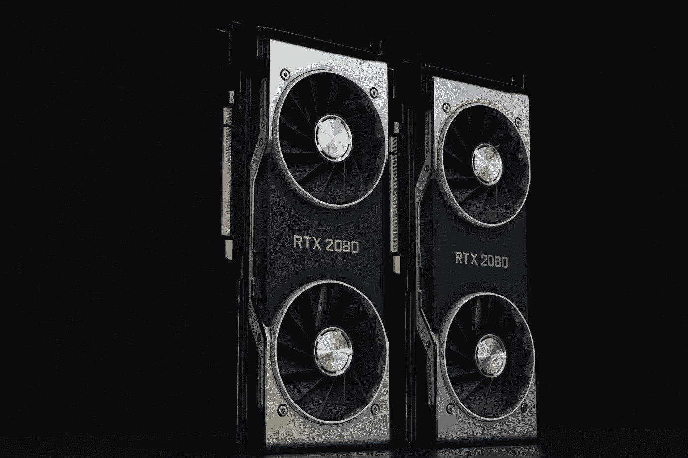
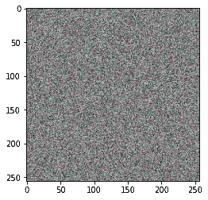

# 混合精确训练—内存更少，速度更快

> 原文：<https://towardsdatascience.com/mixed-precision-training-less-ram-more-speed-e0d5ebd0c1d1>

## 最佳化

## 用两行代码加速你的模型


图片作者[作者](https://thetestspecimen.com)

**对于大型复杂模型，尽可能减少模型训练时间并有效利用可用硬件至关重要。即使每个批次或时期的小增益也是非常重要的。**

**混合精度训练既可以显著降低 GPU RAM 的使用，也可以加快训练过程本身，而不会损失结果的精度。**

**本文将展示(通过代码示例)实际可以获得的收益，同时还将介绍在您自己的模型中使用混合精度训练的要求。**

# 介绍

本文的前半部分旨在概述什么是混合精度，以及何时、为什么以及如何使用它。

第二部分是对一组虚拟图像进行“正常”和混合精度训练的比较结果。这些图像通过 TensorFlow 中的多层 Conv2D 神经网络进行训练，RAM 使用和执行速度都受到全程监控。

**与比较相关的所有代码都可以在 colab 笔记本上找到**

[](https://colab.research.google.com/github/thetestspecimen/notebooks/blob/main/mixed_precision_training.ipynb)

# 混合精度到底是什么？

在我们深入什么是混合精度之前，在这个特定的上下文中，当我们说“精度”时，概述一下我们指的是什么可能是一个好主意。

在这种情况下，精度基本上是指浮点数如何存储，即它在内存中占用多少空间。内存占用越小，数字越不准确。基本上有三种选择:

1.  半精度— 16 位(float16) —用于表示数字的低级存储，低精度
2.  单精度— 32 位(float32) —用于表示数字的中等存储水平，中等精度
3.  双精度— 64 位(float64) —用于表示数字的高级存储，高精度

通常使用机器学习/深度学习和神经网络，您将处理单精度 32 位浮点数。


来自[像素库](https://pixabay.com//?utm_source=link-attribution&utm_medium=referral&utm_campaign=image&utm_content=6223513)的[灵感图像](https://pixabay.com/users/inspiredimages-57296/?utm_source=link-attribution&utm_medium=referral&utm_campaign=image&utm_content=6223513)

然而，在几乎所有情况下，**计算**都可以使用 16 位浮点数而不是 32 位浮点数来运行，**不会降低模型的精度。**

## 混合精度

理想且最简单的解决方案是混合使用 16 位和 32 位浮点数。使用较低精度的 16 位浮点数可以尽可能快地运行计算，然后输入和输出可以存储为 32 位浮点变量，以确保保持较高的精度，并且输出没有兼容性问题。

这种组合被称为“混合精度”。

# 为什么我应该使用混合精度？

有两个主要原因:

1.  GPU RAM 的使用会有很大的提升。差别可能是 GPU RAM 利用率降低 50%
2.  运行模型所需的时间可能会显著加快

在 TensorFlow 中使用混合精度可以:

> 在现代 GPU 上性能提高 3 倍以上，在 TPU 上性能提高 60%
> 
> [-tensorflow.org](https://www.tensorflow.org/guide/mixed_precision)

单单 RAM 使用量的减少就是一件大事。这将允许利用更大的批量，或者为在相同的硬件上实现更大和更密集的模型打开大门。

在本文后面的比较中，我们当然会看到这两个因素的实际结果。

# 使用混合精度有什么要求？

要使混合精度训练成为一项优势，您需要具备以下条件之一:

1.  计算兼容性为 7.0 或更高的 Nvidia GPU(你可以在我的上一篇文章[这里](/how-to-pick-the-best-graphics-card-for-machine-learning-32ce9679e23b)中获得更多关于“计算兼容性”以及为什么选择 Nvidia 的详细信息。)
2.  TPU(张量处理单元)



照片由[娜娜杜瓦](https://unsplash.com/@nanadua11?utm_source=unsplash&utm_medium=referral&utm_content=creditCopyText)在 [Unsplash](https://unsplash.com/s/photos/nvidia?utm_source=unsplash&utm_medium=referral&utm_content=creditCopyText) 上拍摄

虽然你可以使用其他 GPU 的混合精度，它会运行。如果没有上面详述的项目，你将不会获得任何真正的速度提高。然而，如果你只是想增加内存的使用，那么还是值得的。

> 旧的 GPU 使用混合精度不会带来数学性能优势，但是节省内存和带宽可以实现一些加速。
> 
> [-张量流或](https://www.tensorflow.org/guide/mixed_precision) g

# 什么时候应该使用混合精度？

这个问题的简单答案是几乎所有的时间，因为在大多数情况下优点大大超过缺点。

唯一要注意的是，如果你的模型相对简单和小，你可能不会意识到差异。模型越大越复杂，混合精度的优势就越显著。

# 如何使用混合精度？

在 TensorFlow 中，这非常容易，我对 PyTorch 不太熟悉，但我无法想象实现起来会有多难。

```
from tensorflow.keras import mixed_precision
mixed_precision.set_global_policy('mixed_float16')
```

…就是这样。

对上述内容的唯一警告是，您应该确保模型的输入和输出总是浮动的 32。无论如何，输入都可能在 float32 中，但是为了确保您可以隐式地应用 dtype。例如:

```
images = tf.random.uniform(input_shape, minval=0.0, maxval=1.0, seed=SEED, dtype=tf.float32)
```

为了确保模型的输出在 float32 中，您可以将模型最后一层的激活分离出来。例如:

```
# Simple layer stack using the funcitonal API with separated activation layer as output
​
layer1 = tf.keras.layers.Conv2D(128,2)(inputs)
layer2 = tf.keras.layers.Conv2D(128,1)(layer1)
layer3 = tf.keras.layers.Conv2D(128,1)(layer2)
layer4 = tf.keras.layers.Flatten()(layer3)
layer5 = tf.keras.layers.Dense(1)(layer4)
output_layer = tf.keras.layers.Activation('sigmoid', dtype=tf.float32)(layer5)
```

## 自定义训练循环

将混合精度应用到您的模型真的很简单，如前一节所述。

但是，如果您因为正在实施自己的训练循环而没有使用“model.fit ”,那么还需要注意几个步骤，因为您必须手动处理损失比例。

> 如果您使用`[tf.keras.Model.fit](https://www.tensorflow.org/api_docs/python/tf/keras/Model#fit)`，损失缩放已经为您完成，因此您不必做任何额外的工作。如果您使用定制的训练循环，您必须显式地使用特殊的优化器包装器`[tf.keras.mixed_precision.LossScaleOptimizer](https://www.tensorflow.org/api_docs/python/tf/keras/mixed_precision/LossScaleOptimizer)`，以便使用损失缩放。
> 
> [-tensorflow.org](https://www.tensorflow.org/guide/mixed_precision)

这一点很重要，因为与 float32 相比，float16 的可用存储空间更小，因此其值容易“下溢”和“上溢”。所有这一切的基本意思是:

> 高于 65504 的值将溢出到无穷大，低于 6.0×108 的值将下溢到零。
> 
> [-tensorflow.org](https://www.tensorflow.org/guide/mixed_precision)

为了避免这种情况，一种称为损失比例的策略被用来缓解这一问题。为了更深入的了解，我建议看一看 tensorflow.org 上的[混合精度指南](https://www.tensorflow.org/guide/mixed_precision)。

## TPUs

如果你足够幸运，能够使用专用的 TPU(张量处理单元)，那么值得注意的是，你应该使用数据类型“bfloat16”而不是“float16”。

实现起来并不困难，也不会遇到上一节提到的损失比例问题。

```
from tensorflow.keras import mixed_precision
mixed_precision.set_global_policy('mixed_bfloat16')
```

# 实际例子

作为潜在收益的一个例子，我提供了一个 colab 笔记本:

[](https://colab.research.google.com/github/thetestspecimen/notebooks/blob/main/mixed_precision_training.ipynb)

这样你就能看到它的好处。笔记本的开头有一些与您必须使用的 GPU 相关的注意事项，因此请确保您阅读了这些内容，以充分利用笔记本。

在下面的小节中，我将回顾笔记本中的结果。

## 数据

数据是被格式化成一批图像形状的随机均匀噪声。

```
# create dummy images based on random data
SEED = 12
tf.random.set_seed(SEED);
total_images = 800
input_shape = (total_images, 256, 256, 3) # (batch, height, width, channels)
images = tf.random.uniform(input_shape, minval=0.0, maxval=1.0, seed=SEED, dtype=tf.float32)
```

需要注意的是，我已经显式地将数据类型设置为 float32。在这种情况下，这没有什么区别，因为这是该函数的默认值。然而，根据数据的来源，情况可能并不总是如此。

一个示例图像如下:



图片作者[作者](https://thetestspecimen.com)

我还创建了随机的二进制标签，以便模型可以是二进制分类模型。

```
labels = np.random.choice([0, 1], size=(total_images,), p=[0.5,0.5])
```

## 模型

该模型被选择为简单，但足够复杂，以使用合理数量的 RAM，并有一个体面的批处理运行时间。这确保了混合精度和“正常”运行之间的任何差异都是可区分的。模型的层次如下:

```
layer1 = tf.keras.layers.Conv2D(128,2)
layer2 = tf.keras.layers.Conv2D(128,1)
layer3 = tf.keras.layers.Conv2D(128,1)
layer4 = tf.keras.layers.Flatten()
layer5 = tf.keras.layers.Dense(1)
output_layer = tf.keras.layers.Activation('sigmoid',dtype=tf.float32)
```

再次注意，输出激活层被转换为 float32。这对“正常”运行没有影响，但对混合精度运行至关重要。

## 测试

上一节提到的模型使用以下参数运行:

*   图像总数= 800
*   图像尺寸= 256 x 256
*   批量= 50
*   纪元= 10

## 总运行时间和纪元运行时间

然后使用 timeit 模块运行一次图像，以获得总的运行时间。

还会打印纪元运行时间。

## GPU RAM 使用情况

要获取 GPU RAM 使用信息，使用以下函数:

```
tf.config.experimental.get_memory_info('GPU:0')
```

这将输出当前和峰值 GPU RAM 使用情况。在每次运行之前，峰值使用被重置并与当前 GPU RAM 使用进行比较(因此它们应该是相同的)。然后在运行结束时，进行相同的比较。这允许计算运行期间实际使用的 GPU RAM。

# 结果呢

单精度(float32)型号:

```
Epoch 1/10
16/16 [==============================] - 10s 463ms/step - loss: 90.4716 - accuracy: 0.5038
Epoch 2/10
16/16 [==============================] - 8s 475ms/step - loss: 9.1019 - accuracy: 0.6625
Epoch 3/10
16/16 [==============================] - 8s 477ms/step - loss: 1.6142 - accuracy: 0.8737
Epoch 4/10
16/16 [==============================] - 8s 475ms/step - loss: 0.2461 - accuracy: 0.9488
Epoch 5/10
16/16 [==============================] - 8s 482ms/step - loss: 0.0486 - accuracy: 0.9800
Epoch 6/10
16/16 [==============================] - 8s 489ms/step - loss: 0.0044 - accuracy: 0.9975
Epoch 7/10
16/16 [==============================] - 8s 494ms/step - loss: 7.3721e-05 - accuracy: 1.0000
Epoch 8/10
16/16 [==============================] - 8s 497ms/step - loss: 1.4208e-05 - accuracy: 1.0000
Epoch 9/10
16/16 [==============================] - 8s 496ms/step - loss: 1.2936e-05 - accuracy: 1.0000
Epoch 10/10
16/16 [==============================] - 8s 490ms/step - loss: 1.1361e-05 - accuracy: 1.0000
​
RAM INFO:
​
Current: 0.63 GB, Peak: 9.18 GB, USED MEMORY FOR RUN: 8.55 GB
​
TIME TO COMPLETE RUN: 79.73
```

混合精度(mixed_float16)模型:

```
Epoch 1/10
16/16 [==============================] - 15s 186ms/step - loss: 71.8095 - accuracy: 0.5025
Epoch 2/10
16/16 [==============================] - 3s 184ms/step - loss: 15.2121 - accuracy: 0.6000
Epoch 3/10
16/16 [==============================] - 3s 182ms/step - loss: 4.4640 - accuracy: 0.7900
Epoch 4/10
16/16 [==============================] - 3s 183ms/step - loss: 1.1157 - accuracy: 0.9187
Epoch 5/10
16/16 [==============================] - 3s 183ms/step - loss: 0.2525 - accuracy: 0.9600
Epoch 6/10
16/16 [==============================] - 3s 181ms/step - loss: 0.0284 - accuracy: 0.9925
Epoch 7/10
16/16 [==============================] - 3s 182ms/step - loss: 0.0043 - accuracy: 0.9962
Epoch 8/10
16/16 [==============================] - 3s 182ms/step - loss: 7.3278e-06 - accuracy: 1.0000
Epoch 9/10
16/16 [==============================] - 3s 182ms/step - loss: 2.4797e-06 - accuracy: 1.0000
Epoch 10/10
16/16 [==============================] - 3s 182ms/step - loss: 2.5154e-06 - accuracy: 1.0000
​
RAM INFO:
​
Current: 0.63 GB, Peak: 4.19 GB, USED MEMORY FOR RUN: 3.57 GB
​
TIME TO COMPLETE RUN: 42.16
```

我认为这是相当确凿的:


表作者[作者](https://thetestspecimen.com)

在上述结果中，您可能会注意到，混合精度运行的初始历元比后续历元要长 5 倍，甚至比 float32 运行还要长。这是正常的，这是由于 TensorFlow 在学习过程开始时进行了优化。然而，即使有这个初始赤字，混合精度模型也不需要很长时间就可以赶上并超过 float32 模型。

混合精度的较长初始历元也有助于说明为什么较小的模型可能看不到好处，因为需要克服初始开销才能实现混合精度的优势。

这也恰好是过度拟合的一个很好的例子。这两种方法都成功地在带有完全随机标签的完全随机数据上实现了 100%的准确率！

# 今后

较低精度计算的趋势似乎越来越明显，随着 Nvidia 最新一代 GPU 的出现，现在已经有了诸如 [TensorFloat-32](https://www.tensorflow.org/api_docs/python/tf/config/experimental/enable_tensor_float_32_execution) 这样的实现，它们:

> 在某些 float32 操作中自动使用较低精度的数学运算，如`[tf.linalg.matmul](https://www.tensorflow.org/api_docs/python/tf/linalg/matmul)`。
> 
> [-tensorflow.org](https://www.tensorflow.org/guide/mixed_precision)

还有一种情况是:

> 即使默认的数据类型策略为 float32，TPU 也会在 bfloat16 中执行某些操作
> 
> [-tensorflow.org](https://www.tensorflow.org/guide/mixed_precision)

因此，随着时间的推移，实际上可能没有必要直接实现混合精度，因为这一切都将得到妥善处理。

然而，我们还没有到那一步，所以现在仍然值得努力考虑利用混合精确训练。

# 结论

得出的唯一结论是，混合精度是一个加速训练的优秀工具，但更重要的是释放 GPU RAM。

希望本文能帮助您理解混合精度的含义，我鼓励您试用一下 colab 笔记本，看看它是否符合您的特定要求，并感受一下它可能带来的好处。

如果你觉得这篇文章有趣或有用，记得关注我，或者[注册我的时事通讯](https://medium.com/@maclayton/subscribe)获取更多类似的内容。

如果你还没有，你也可以考虑[订阅媒体](https://medium.com/@maclayton/membership)。你的会员费不仅直接支持我，也支持你所阅读的其他作家。你还可以完全不受限制地访问媒体上的每个故事。

使用我的推荐链接注册会给我一点回扣，对你的会员资格没有影响，所以如果你选择这样做，谢谢你。

<https://medium.com/@maclayton/membership> 