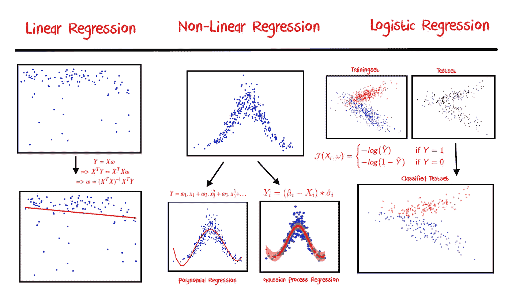
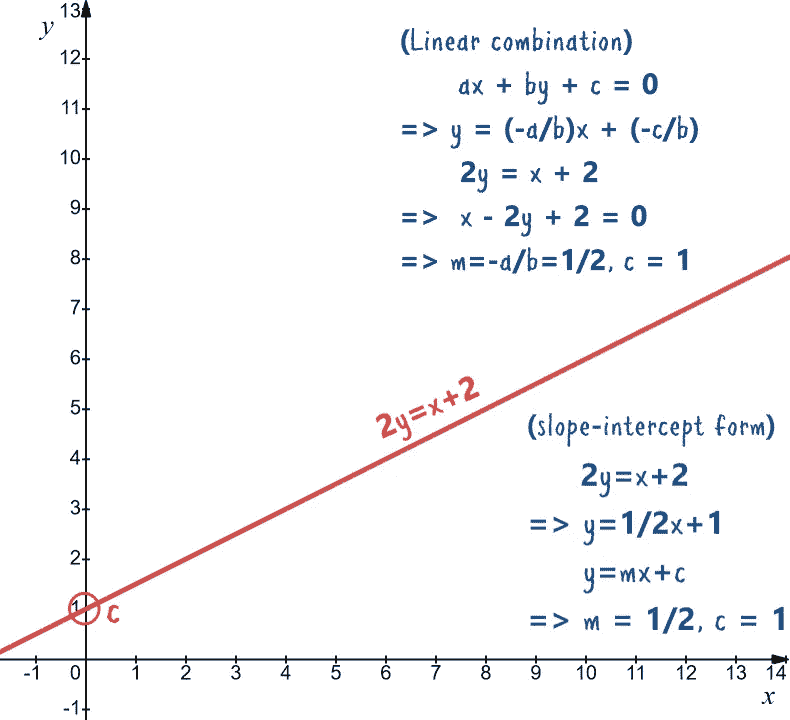
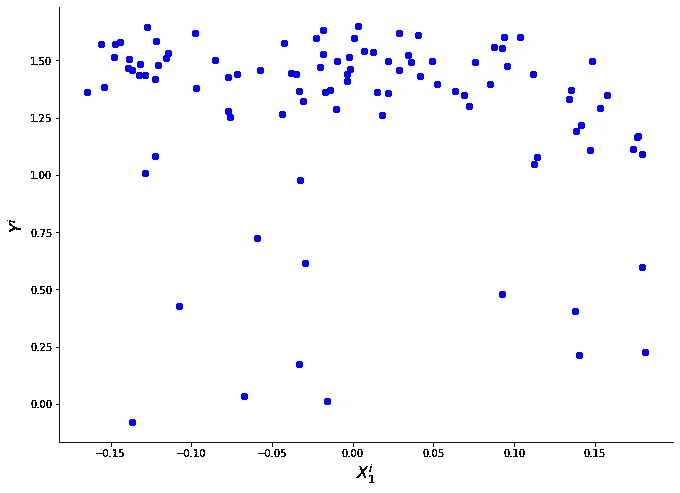
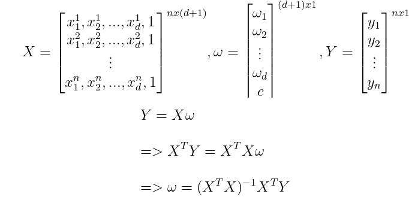
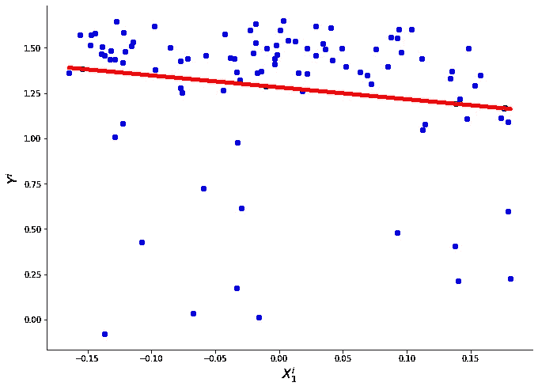
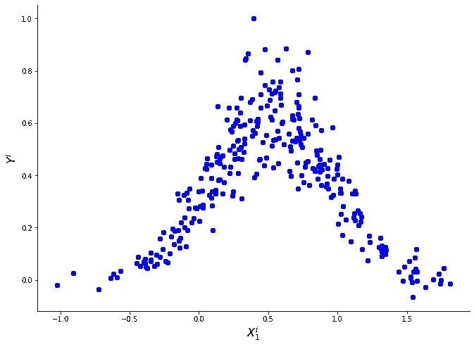
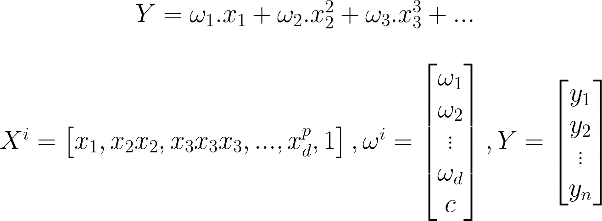
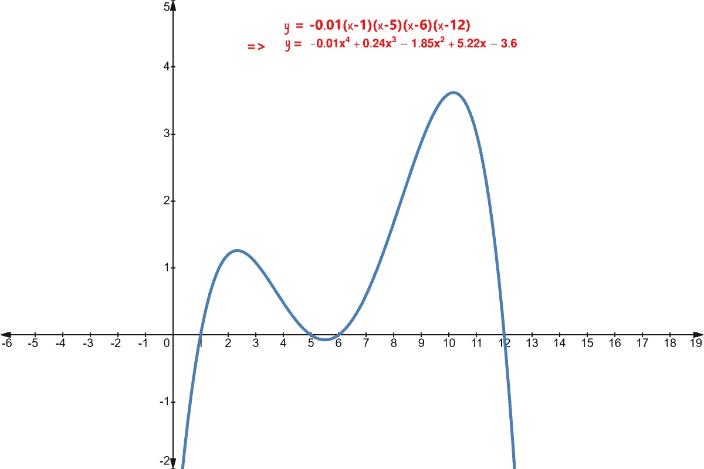
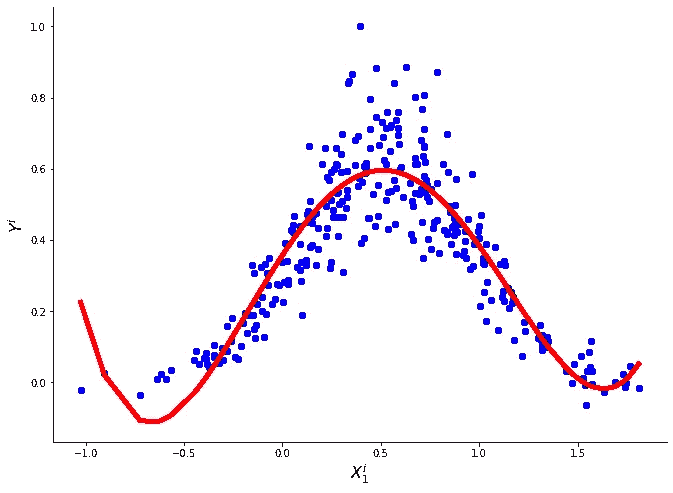
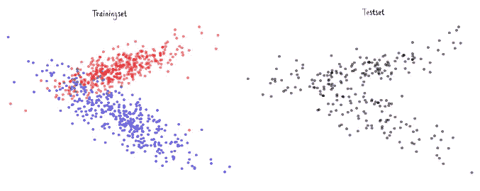

# ML 基础(第一部分):回归——机器学习的入门方法

> 原文：<https://towardsdatascience.com/ml-basics-part-1-regression-a-gateway-method-to-machine-learning-36d54d233907>

## **简单而全面地介绍线性、非线性和逻辑回归**

图 1:线性、非线性和逻辑回归的例子(来源:作者)

**前言:**

人们对机器学习中基本主题的介绍性帖子越来越感兴趣。因此，我将从这篇文章开始，在接下来的文章中讨论这些话题。这篇文章基本上是独立的，但是，它需要对*线性代数*和*微积分*有基本的理解。

**回归**

回归是估计因变量( **Y** )与一个或多个自变量( **Xi** )之间关系的过程。它主要用于在给定的一组数据样本中寻找模式，并在给定一组其他变量的值的情况下预测一个变量的值。它有广泛的应用，从预测天气预报到预测房价。这些变量的值通常是连续的，但是，也有回归方法的子集，其中的值可以是离散的(例如，名义值/序数)。一会儿我们会看到不同类型的回归方法。

**线性回归**

最简单的形式是，回归模型是一个线性函数，通过对自变量的值进行线性组合，可以获得因变量的值。例如，如果数据是二维的，这种模型可以写成直线方程(图 2)。一个直线方程有三个系数( **a** 、 **b** 和 **c** )。如果我们把因变量 **y** 写成 **y** = f( **x** )，那么我们看到只需要一个斜率( **m** )和一个截距' *c* '来表示任意一条线。这意味着，如果我们想找到一条最适合一组数据点的线，那么我们只需要找到这两个变量的最佳值。

图 2:直线方程的例子(来源:作者)

图 3:一组随机的数据点(来源:作者)

现在，让我们看一组数据点的例子，如图 3 所示。我们看到，大多数点正在形成类似于直线的模式，因此，我们可以将该数据建模为线性回归问题。更具体地说，我们感兴趣的是找到最适合这些数据点的直线的斜率和截距。

**通过求解线性方程组进行直线拟合**

如果我们把每个点写成一个线性组合( **y = mx + c** )，我们最终会得到一组线性方程组。为了找到' *m'* 和' *c'* 的值，我们至少需要两个方程。我们看到我们有两个以上的方程，因此，我们的问题是可解的。更一般地说，我们可以写出一组具有‘n’个样本和’*d’*维的线性方程，如图 4 所示。

图 4:线性方程组的解(来源:作者)

我们可以把所有的斜率和截距组织成一个组合向量，叫做' ***w'*** 。此外，我们可以在 ***X*** 中添加一列 1，以使乘积成为可能，并获得值的适当线性组合。然后我们就可以通过矩阵求逆，求解权值' ***w'*** 来求解这个线性方程组( **Y = X w** )。该解决方案为给定的数据样本集提供了最佳直线拟合的斜率和截距，如图 5 所示。

图 5:一组数据点上的直线拟合(来源:作者)

**梯度下降直线拟合**

线性方程组的矩阵逆解适用于噪声最小且无奇点的问题。然而，在大多数大型真实数据中，这些约束可能不成立。所以，一种更稳健、更通用的方法常被用来求解线性方程组，称为*梯度下降*。这是一种迭代优化方法，通过逐渐向输出解移动来寻找目标函数的最佳点(最小值/最大值)。更具体地，计算目标函数的导数(例如，在这种情况下，d**y**/d**w**=**X**)，并且在最佳点的方向上采取一小步(即，**J =**|**y**-**y’|**->-**y’**的 T42 每一步后的权重更新为***w’***=***w*——*alpha****J**其中 *alpha* 为学习率。使用*梯度下降*的直线拟合的输出示例如图 6 所示。**

图 6:随机梯度下降法直线拟合(来源:作者)

**非线性回归**

线性回归适用于变量之间的关系是线性的情况。然而，在许多现实世界的应用程序中，情况并非如此。当因变量和自变量之间的关系不能表示为线性组合时，我们需要使用非线性回归。在图 7 中可以看到一组非线性形式的数据点。

图 7:一组随机生成的数据点(来源:作者)

**多项式回归**

非线性回归可以是不同类型、曲线、闭合形状或任何其他形式。当变量之间的关系可以用曲线的形式表示时，它就被表示为一阶大于一的非线性方程。例如，我们在下面的等式中看到一个 k 次多项式。

多项式方程(来源:作者)

图 8:一个示例多项式函数(来源:作者)

我们可以用线性方程相乘来构造多项式。图 8 给出了一个四次多项式的特例。我们通过将截距分别为 *1、5、6* 和 *12* 的四个简单线性方程相乘，创建了一个复杂的多项式。乘数 *0.01* 提供了一个比例项，而负号反映了整个曲线。这只是为了说明多项式可以有不同的形状。学习这种曲线的主要目的是发现可能存在于真实世界数据集中的复杂模式。例如，数据可能是来自传感器的具有多种模式的连续信号，您可能希望使用非线性回归模型对其进行预测。

如果我们对之前的非线性数据应用多项式，我们会发现它可以很好地表示数据，如图 9 所示。对于该数据，二阶多项式应该足够了。非线性回归的问题表述与线性回归建模相同。然而，在形成权重矩阵时，必须计算高阶项的系数。一般来说，基于多项式的回归最适合于数据分布不广且似乎是连续进行的应用。这种数据的示例类型可以是来自传感器或测量设备的时间序列数据。

图 9:一组数据点的多项式曲线拟合(来源:作者)

**高斯过程回归**

在有些情况下，我们希望模型不仅预测高度精确的函数值，例如直线/多项式拟合，而且还应该考虑余量。在这种情况下，我们学习每个点的分布(即平均值和方差),而不是单一的权重值。它可以直接应用于信号有噪声或有少量湍流的情况。将回归问题建模为高斯过程可以准确预测感官数据。这种高斯过程回归的核心是一个核函数。可以有多种适用于不同类型的数据和应用的内核函数。最常见的核函数是指数函数(例如径向基核)，其提供自变量和因变量之间的非线性关系。然后，回归过程的目标是优化问题，由此每个输入数据点的最合适的*均值*和*方差*值将被优化。对于不同类型的内核，这种高斯过程回归的样本输出可以在图 10 中看到。曲线周围的条带预测模型在预测某一点的值时的置信度。范围越窄，输出值越严格。

图 10:不同核函数的基于高斯的回归(来源:作者)

**正则化逻辑回归**

到目前为止，我们已经处理了连续回归问题，其中预测输出变量的值是一个连续数。然而，在许多实际应用中，情况并非如此。例如，在对物体/特征进行分类的情况下，我们想要学习每个类别的离散标签，而不是数值。这个问题可以用一种特殊的回归方法来处理，叫做逻辑回归。它实际上是一种回归方法；但是，它修改了输出值和目标函数，使得对于给定的类，输出是 0 到 1 之间的概率值。

这可以通过在 Sigmoid 函数中包装输入变量值“x”来实现。Sigmoid 函数是一个非线性指数函数，它将“x**’**的任何值映射到 0 和 1 之间的正值。回归问题的其余部分保持不变。逻辑回归和基于 Sigmoid 函数的输出计算的目标函数在上面的等式中给出。训练集和测试集的数据点可以在图 11 中看到。

图 11:分别用于训练集和测试集的一组示例数据点(来源:作者)

分类问题需要对一组数据进行训练，而模型需要预测另一组数据的值。因此，重要的是，该模型不要仅对于训练集具有太紧的界限，并且应该对于训练集中不存在的输入值工作良好。这个问题被称为“*过拟合*”，通过一种被称为“*规则*规则化”的方法来解决。正则化是优化过程中的松弛项，它给模型拟合一个喘息的空间。这是通过在目标函数中增加一个附加项来实现的，如上面的等式所示。这种*正则化*项的系数*λ*是一个加权因子，其提供了准确性和概化性之间的折衷。这种回归拟合的结果可以在图 12 中看到。

图 12:二元分类问题的回归拟合结果(来源:作者)

**结束语**

在本文中，我们已经讨论了回归拟合及其类型。线性、非线性和逻辑回归方法是您在实际应用中会遇到的三种主要的回归问题。回归是一种简单而有效的方法，可以解决许多应用领域中的一些常见问题。它也构成了更复杂的机器学习方法的基础，我们将在以后的文章中讨论这些方法。

**如需代码，请点击链接:**

[https://www.github.com/azad-academy/MLBasics-Regression](https://www.github.com/azad-academy/MLBasics-Regression)

**在 Patreon 上支持我:**

  

**在子栈上找到我:**

  

**关注 Twitter 更新:**

[https://www.twitter.com/@azaditech](https://www.twitter.com/@azaditech)