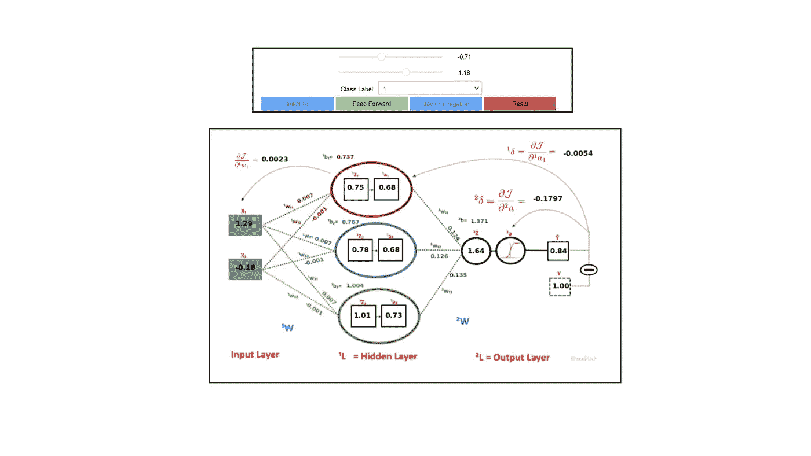
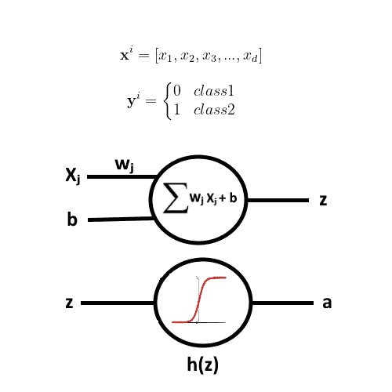
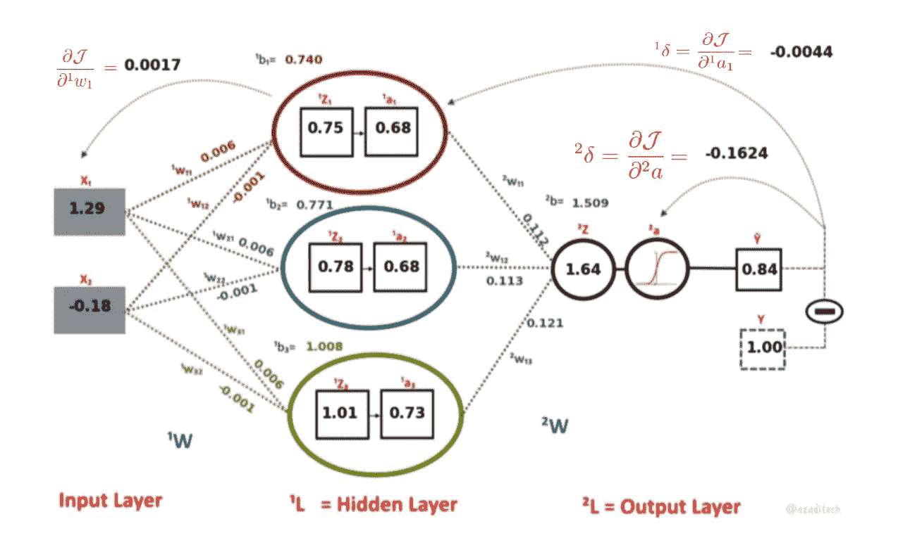
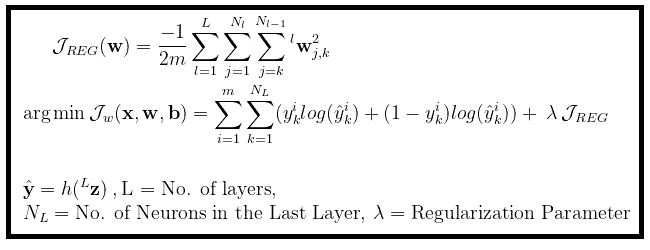
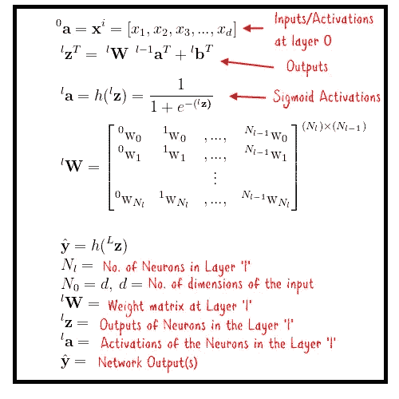
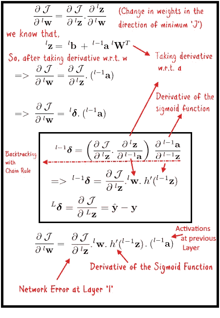
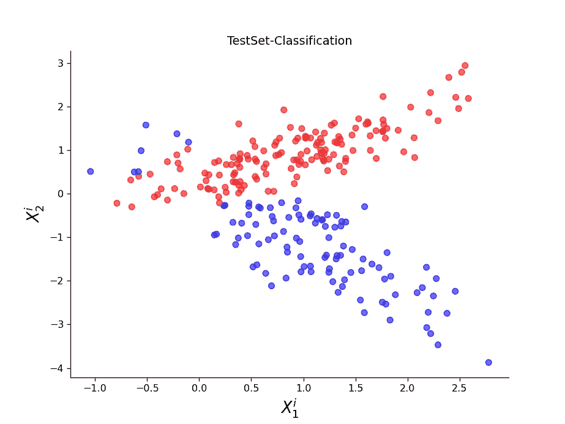
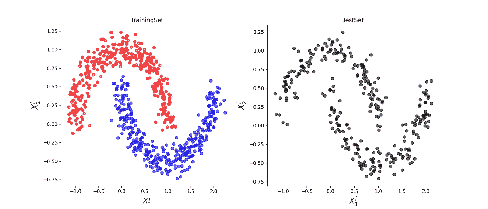
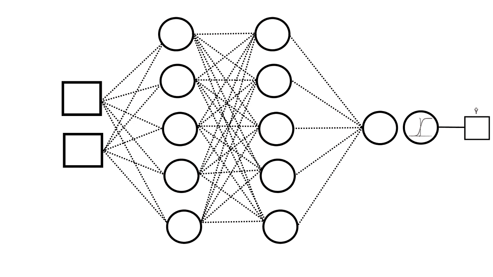
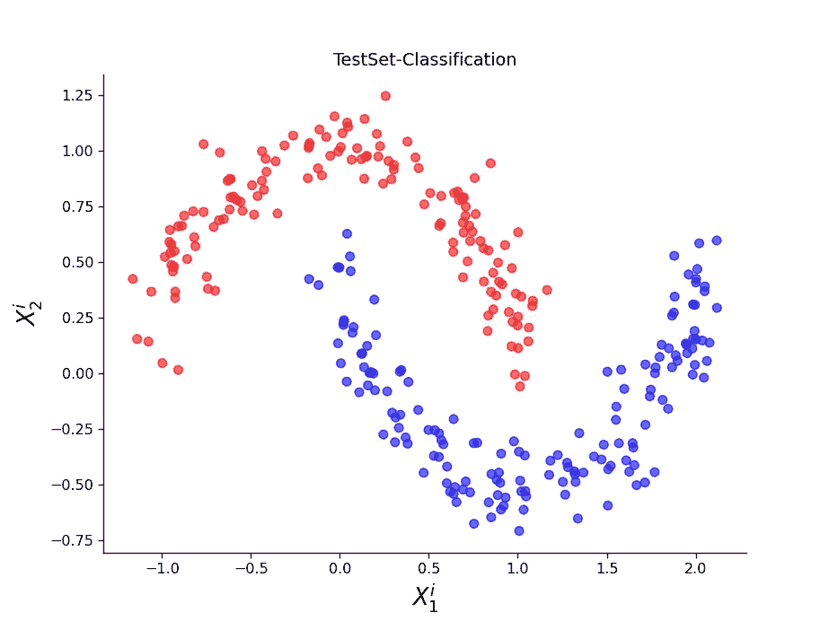

# ML 基础(第 3 部分):人工神经网络

> 原文：<https://towardsdatascience.com/ml-basics-part-3-artificial-neural-networks-879851bcd217>

## **人工神经网络的简易指南和用于理解和学习概念的交互式可视化工具**

图 1:用于可视化和学习的人工神经网络交互工具(来源:作者)

在之前的帖子中，我们已经讨论过 [*回归*](https://azad-wolf.medium.com/ml-basics-part-1-regression-a-gateway-method-to-machine-learning-36d54d233907) 和 [*支持向量机(SVM)*](https://azad-wolf.medium.com/ml-basics-part-2-support-vector-machines-ac4defba2615) 作为机器学习中的两种重要方法。SVM 与*回归分析有一些相似之处，*然而，有一种方法是*逻辑回归的直接派生。*称为“*人工神经网络(ANN)* ”。在本文中，我们将从零开始构建一个 *ANN* ，您将能够通过一个交互式工具来理解这个概念。

**简介**

人工神经网络的历史可以追溯到 20 世纪初。这是从人脑中形成网络的生物神经元得到的灵感。人工神经网络(ANN)是多层连接的神经元的集合，当输入层中的神经元被激励时，它产生输出。下图显示了人工神经元的一个非常简单的描述。

图 2:人工神经元输入和输出的定义。(来源:作者)

一个人工神经元有许多输入 **Xⱼ** 和权重 **Wⱼ** 。根据神经元在输入端接收到的信息，它输出一个单一值 **Z** ，它是矢量 **Wⱼ** 与 **Xⱼ** 的点积。还有一个偏置项 **b** ，作为线性组合添加到点积中。如果你从我们之前的课程中回忆起*回归*，那么你就会明白为什么会这样。它是代表线性回归函数的线性组合，其权重为 **Wⱼ** 和输入 **Xⱼ** 。通过应用激活函数(例如，Sigmoid)将神经元的输出映射到范围上。这种激活功能增加了输出的非线性，并将其保持在一个范围内(如 0–1)。

**网络建设**

上一节中解释的人工神经元是相互连接的，并排列成一组多层。一个非常简单的 *ANN* 由三层组成:输入层( **⁰L** )，隐藏层( **L** )，输出层( **L** )。输入层由值 **Xⱼ** 组成，输出层提供网络的结果，即给定输入的输出类的概率。输出层中神经元的数量取决于数据集中类的数量。下图显示了这样一个简单的 3 层 *ANN* 。

图 3:具有一个输入层、一个隐藏层和一个输出层的三层神经网络的例子(来源:作者)

学习发生在各层之间。更具体地，学习每一层“l”的权重 **ˡW** ，使得当这些权重被插入 *ANN* 时，输出类似于真实的类标签。权重 **ˡW** 以矩阵的形式排列，每个层转换一个。权重矩阵 **ˡW** 的维数取决于层“ **l** 中神经元的数量和前一层中神经元的数量。输入的数量被认为是层“0”的神经元数量。

所有层中的神经元都有两个组成部分:从激活函数的输入和输出的权重的点积计算的输出值。在图 3 所示的例子中，我们只有一个输出，这意味着它只产生一个类的概率。最后一层中的激活函数(即 Sigmoid)确保值保持在 0 和 1 之间。重要的是要注意这个简单网络与逻辑回归的相似性。事实上，一个简单的三层网络，只有一个隐藏层，如图 3 所示，不过是一个*线性逻辑回归*，它只对线性可分数据有效。为了给系统增加非线性，必须增加多个隐藏层。

**目标函数公式**

*ANN* 提出了一个优化问题，像任何其他机器学习方法一样，它寻求在一组参数上优化目标函数，以获得期望的输出。更具体地说，我们试图找到权重的最佳值，这样当我们将它们插入到一个 ANN 中时，它应该为输入 Xᶦ.输出真正的类标签我们通过最小化误差(ŷ **—** y)来实现这一点，其中ŷ是由 *ANN* 预测的分类概率，而 y 是真实的分类标签。在实践中，我们通过取ŷ的对数并将其排列成线性组合来计算这种误差，以适应“1”标签和“0”标签。目标函数如下图 4 所示。

图 4:人工神经网络的目标函数公式(来源:作者)

如果您注意的话，您会注意到目标函数中还添加了另一项 **JREG** 。这是正则项，以确保模型避免过度拟合。它是所有层中所有权重的平方和。λ参数是训练集上正则化和准确性之间的折衷。较低的值可能会使模型在训练集上形成紧密的决策边界，从而可能无法适应测试集中的新变体示例，而较大的值可能会导致模型不太适合数据。

**前馈过程**

神经网络由两种类型的过程组成:前馈过程和反向传播过程。前馈过程负责基于相应的输入和神经元的权重来计算网络中单个神经元的输出。更具体地，通过取相应权重ˡ **w** 、来自前一层ˡ⁻ **a** 的输入激活和偏置ˡ **b** 的线性组合，为网络中的每个神经元计算ˡ **z** 的值。然后，通过应用激活函数，ˡ **z** 的值被转换成激活ˡ **a** 。在前馈过程中执行的操作的完整列表如图 5 所示。

图 5:前馈过程的方程式。(来源:作者)

**反向传播过程**

也许学习的关键在于一个 *ANN* 的反向传播步骤。它是前馈步骤之后的步骤，负责将误差分配给网络中的每个权重。反向传播步骤从计算网络最后一层的误差(ŷ **—** y)开始。这个误差然后被用于计算每一层的权重的变化。这是通过应用偏导数的链式法则来实现的。回想一下你的微积分 ***f(g(x)) = f'(g(x))。*g '(x)**。现在从输出回溯到输入，以这样一种方式，你最终计算目标函数 w.r.t .权重的变化(∂J/∂ **w** )。这可以通过回溯当前层中的输出的偏导数 w.r.t 并将它们与前一层的输出相乘来计算。偏导数 w.r.t 输出可以使用链式法则进一步分解，直到我们到达第 0 层。这些偏导数在图 6 中被描述为*增量*。计算出的*增量*然后从最后一层开始递归地乘以每个先前层的激活。您可能还会注意到，在计算 *delta* 时，sigmoid 函数的导数也会相乘，这是因为我们通过对神经元的输出应用 sigmoid 函数来计算激活(即 **a** = h( **z** ))。

图 6:反向传播过程的推导(来源:作者)

还要注意我们是如何计算输出**z**w r t 权重**w**(∂j/∂**w**)**的变化的。**我们使用了 **z** 的定义，并对**z**w . r . t**w**进行了求导。我们做了同样的事情来计算当前层的 **z** 对前一层的 **a** 激活的偏导数(∂ˡ **z** /∂ˡ⁻ **a** )。唯一不同的是，这次我们对ˡ⁻a 求导。

我们在每一层计算 *J* w.r.t. **w** 的这些偏导数，并为每个权重矩阵ˡ **w** 获得梯度矩阵ˡ**w’**。这些梯度矩阵表示每个权重的值在 *J 的最优值方向上的变化。优化器(例如*梯度下降*)然后使用这些梯度来更新权重(例如**wₙ**=**w**—α**w**’)，其中α是学习速率。*

**用 Python 实现**

在这节课中，我们仅使用 *python* 中的 *numpy* 从头开始构建一个简单的神经网络。网络由三层组成:输入层、一个隐藏层和一个输出层。输入采用二维数据(为了便于理解这个概念，保持简单)。隐藏层中有三个神经元。输出层有一个神经元，输出输入点来自该类的概率。完整的 *ANN* 与每个神经元的权重、偏差、输出和激活一起显示在图 3 中。

**线性分类**

所构建的网络可用于对属于两类(0/1)的一组数据点进行分类。我们构建一组随机的数据点，然后将其分为训练和测试两部分。这可以从图 7 中看出。

图 7:分别用于训练和测试的两组数据(来源:作者)

通过运行优化算法(即*梯度下降*)在训练集上训练 *ANN* 模型，该优化算法为 *ANN* 的权重找到最佳值。然后，我们对这些数据点应用 *ANN* 模型，并获得测试集中每个数据点的分类标签。这种分类的输出可以在图 8 中看到。

图 ANN 在线性可分测试集上的应用(来源:作者)

**非线性分类**

正如前面提到的，一个简单的 3 层 *ANN* 只不过是*线性逻辑回归*，这意味着它只能对线性可分的数据进行分类。然而，如果我们把它应用于一个不可线性分离的数据，比如图 9 中给出的数据，那么它会失败得很惨。

图 9:非线性数据的示例训练和测试集(来源:作者)

这意味着我们必须构建一个具有多个隐藏层的网络。为此，我们修改了之前的 *ANN* 并增加了两个隐藏层，每层 5 个神经元，如图 10 所示。

图 10:解决非线性分离问题的大型网络(来源:作者)

我们将这个更大的网络应用于图 9 中的训练集，并获得这个新网络的一组优化权重。然后，我们将该网络应用于相应的测试集，并获得分类概率。可以通过对概率应用阈值(例如，> 0.7)来获得类别标签。这种网络的结果如下图 11 所示。

图 11:使用人工神经网络进行非线性分类的结果(来源:作者)

**结束语**

在本文中，您已经学习了什么是*人工神经网络*，如何用 python 从零开始构造一个人工神经网络。您还学习了如何应用*神经网络*来预测线性可分数据和非线性可分数据的类别标签。您可以通过交互式可视化工具进一步了解，您可以在您的 Jupiter 笔记本上运行该工具，并查看权重是如何更新的。

图 12:人工神经网络的交互式可视化工具(来源:作者)

**代码:**

[https://www.github.com/azad-academy/MLBasics-ANN](https://www.github.com/azad-academy/MLBasics-ANN)

**成为帕特里翁的支持者:**

[https://www.patreon.com/azadacademy](https://www.patreon.com/azadacademy)

**在子栈上找到我:**

[https://azadwolf.substack.com](https://azadwolf.substack.com)

**关注 Twitter 更新:**

[https://www.twitter.com/azaditech](https://www.twitter.com/azaditech)