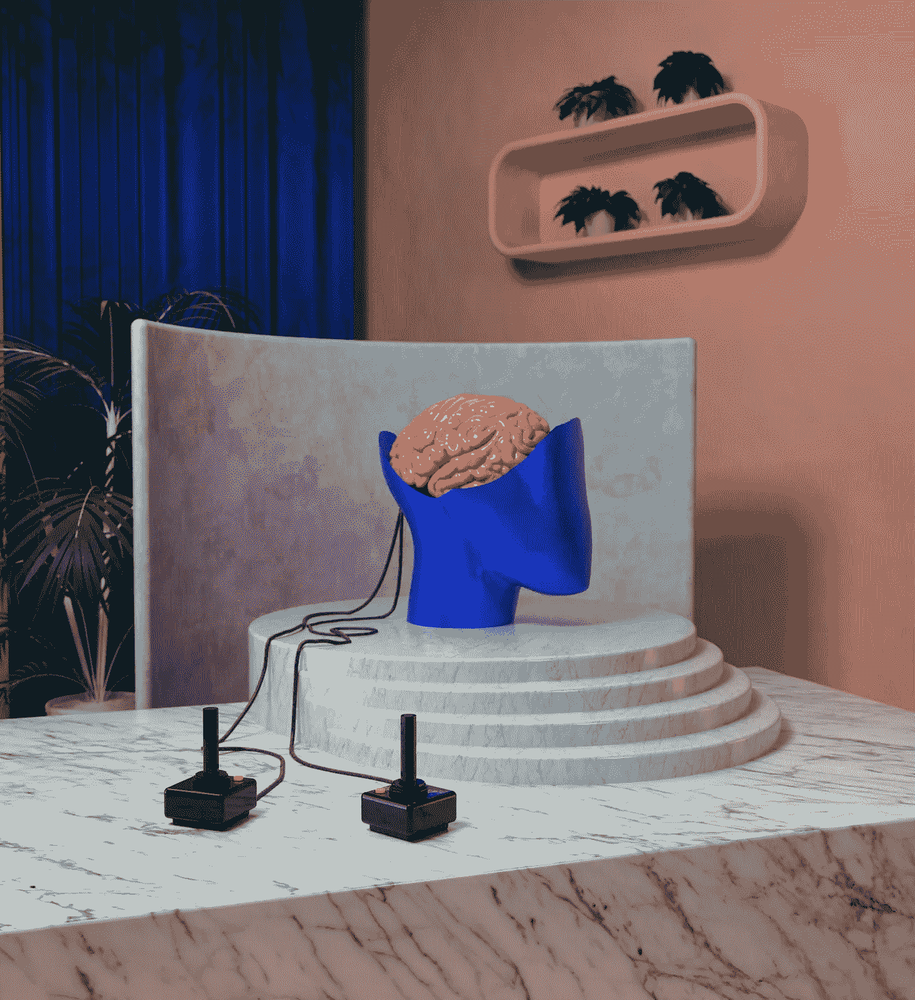
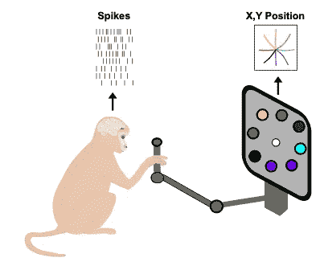
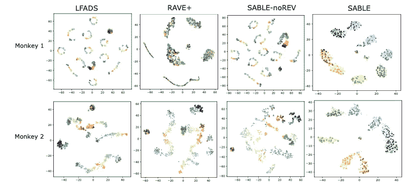
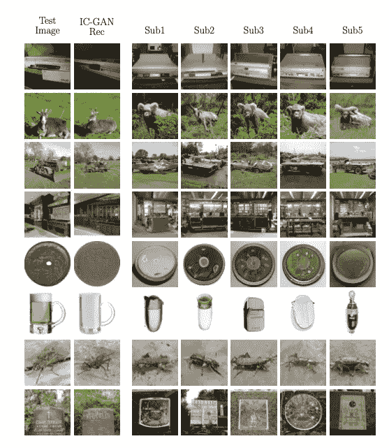
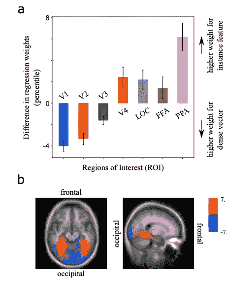
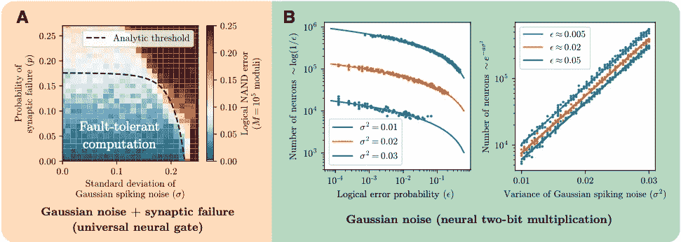

# ML &神经科学:2022 年 2 月必读

> 原文：<https://towardsdatascience.com/ml-neuroscience-february-2022-must-reads-72c7603d98d2>

本月:增强脑-机接口的可变自动编码器模型🧠💻人类功能磁共振成像扫描感知图像重建🧱and 容错神经网络❌.

图片由[莫](https://unsplash.com/@meid88)在[的 Unsplash](https://unsplash.com/photos/NKhckz9B78c)

*通过我的推荐链接加入 Medium 来支持我的写作和项目:*

 [## 通过我的推荐链接加入 Medium-Stefano Bosisio

### 作为一个媒体会员，你的会员费的一部分会给你阅读的作家，你可以完全接触到每一个故事…

stefanobosisio1.medium.com](https://stefanobosisio1.medium.com/membership) 

我最近关于 ML 和神经科学的报道:

*   神经科学:2022 年 1 月必读书目
*   [与神经科学保持同步:2021 年 11 月必读文章](/stay-updated-with-neuroscience-november-2021-must-reads-e2fba4692b21)
*   [与神经科学保持同步:2021 年 10 月必读文章](/stay-updated-with-neuroscience-october-2021-must-reads-a0cc1d50b746)

更多的故事可以在我的简介中找到

**为什么要关心神经科学？**

神经科学是当今人工智能🧠的根源🤖。阅读并意识到神经科学中的进化和新见解不仅会让你成为一个更好的“人工智能”的家伙😎而且还是一个更好的神经网络体系结构的创造者👩‍💻！

在这篇文章中，我正式用一种新的方法重新发布我的[“与神经科学保持同步”](https://stefanobosisio1.medium.com/)文章。在这个系列中，我将涵盖 3 篇主要论文，在 arxiv.org[的评论中，它们涉及机器学习和神经科学。特别是，我将涉及以下几个方面:](http://arxiv.org/)

*   ML 研究能否帮助神经科学更深入地了解大脑的动力学和活动？
*   神经科学如何用新的生物启发模型帮助增强 ML？
*   ML 和模型如何通过新的成像和信号技术给我们带来新的临床神经科学？

本月的三篇论文致力于:

*   ML 如何帮助神经科学？第一篇论文展示了变分自动编码器如何帮助神经科学家更准确地理解神经潜在空间和真实行为。这增强了未来的脑机接口场景；
*   ML 如何帮助理论神经科学？第二篇论文实现了一种新的 GAN 模型 IC-GAN，以从 fMRI 扫描中检索感知图像并定义视觉皮层神经区域携带什么信息；
*   在神经科学和计算机科学的边界，是否有可能从大脑中的生物误差补偿中获得灵感，并将其应用于人工神经网络？

## 通过无监督域适应的行为的神经群体活动的跨会话记录的鲁棒对准

贾斯汀·杰德，马修·g·佩里希，李·e·米勒，马蒂亚斯·h·亨宁， [**论文**](https://arxiv.org/abs/2202.06159)

这篇论文是一个例子，说明 ML 如何帮助神经科学达到一个全新的水平。来自爱丁堡大学(❤)、西奈山伊坎医学院和范伯格医学院的作者开发了一种新的无监督 ML 模型，可以帮助解码神经群体记录，从潜在动态中推断行为。这项工作与脑机接口(BCIs)密切相关，这是一项通过解码神经记录中的行为信息来帮助严重残疾患者的新技术。

从文献来看，众所周知，可以将神经群体转化为行为的模型非常不稳定。首先，模型训练需要数天时间，涉及不同的神经活动，以及大量不可避免的神经漂移过程(例如，想想神经元动力学如何在一周的时间尺度内发生变化)。因此，作者决定从初级运动皮层开始分解这个问题。在这里，神经元活动可能与低维流形有关。这种流形可以完全被 ML 模型捕获。从那里有可能设计一个完整的系统，它可以用来自 ML 模型的潜在动力学洞察来补偿神经记录，以返回运动皮层神经元如何工作的完整图像。

该模型是一种变分自动编码，结合 seq2seq 编解码器(如乔 RNN 编解码器)——[我这里说的就是这个模型](/graph-neural-networks-a-learning-journey-since-2008-graph-attention-networks-f8c39189e7fc?source=your_stories_page----------------------------------------)。一方面，编码器从输入数据中学习不变的潜在动态。输入数据来自不同的记录会话，以便考虑神经可变性。因此，解码器同时迫使编码器生成不同行为的潜在表示。然后，解码器返回对结果行为的预测。最终的模型被称为通过棘波不变潜在编码的行为稳定排列(SABLE)。已经对一只猴子连续训练了 13 天，对另一只猴子连续训练了 6 天。

Gallego 等人在 2020 年发表了一篇关于从看不见的神经活动中预测行为的文章，对 SABLE 进行了测试。在这个实验中，两只猴子被训练完成一个向外伸向八个外部目标的任务。

图 1:左边是实验装置。一个随机选择的目标方向，用一个彩色圆圈表示，出现在屏幕上。一只猴子被指示在出现的方向上移动光标。该模型在每个时间步从神经尖峰预测手的位置。右边是神经潜在空间表示，通过 T-SNE 算法。模型的编码器返回神经元看到的目标方向的潜在表示。与其他历史文献模型(如 LFADS、RAVE+、SABLE-noREV)相比，SABLE 能够更好地利用潜在维度。

在实验中，屏幕上用彩色圆圈显示一个点。这个点指的是一个方向(例如，上、下、左、右),一只猴子已经被训练向出现的方向移动光标。该模型对猴子初级运动皮层的神经尖峰进行编码，并作为预测返回猴子在每个时间步的手位置。此外，从模型的编码器，有可能检测神经潜在空间。潜在空间是神经元在每个时间步“看到”的东西。该尺寸可以被视为出现在屏幕上的目标点。

结果非常令人满意。SABLE 可以重建运动轨迹，并利用潜在的神经表示返回最终预测。此外，黑貂似乎也是一种可转让的模式。与这些任务中许多文献模型呈现的不稳定性相比，这是一个显著的结果。

## 基于 fMRI 模式的感知图像重建和语义脑探索

富尔坎·奥兹切利克，哈文·乔克西，米拉德·莫扎法里，莱拉·雷迪，鲁丁·范鲁伦， [**论文**](https://arxiv.org/abs/2202.12692)

本文展示了一个伟大的场景，其中 ML 可以帮助理论神经科学并增强大脑理解。这项工作的关键点是从 fMRI 信号中重建感知的自然图像，例如狗、猫。这是一个多么激动人心的话题！来自图卢兹大学、CerCo、IRIT、CNRS 和 ANITI 的作者提出了实例条件 GAN，IC-GAN，作为破解这个问题的可能工具。

该模型将作为输入。来自五个人的数据集 fMRI 记录。功能性磁共振成像会议分为“训练”和“测试”会议。在培训课程中，患者观看了一次来自 ImageNet 数据集的 1200 个样本。测试环节向患者展示了 50 个样本，在屏幕上重复了 35 次。fMRI 遵循以下设置:33 秒的注视，50 幅图像以 2Hz 闪烁呈现 9 秒，另外 6 秒的注视。每个图像的大脑表示被计算为 9 秒图像呈现窗口中每个体素的值变化的平均值。

图 2:从功能磁共振成像数据重建集成电路氮化镓。“测试图像”是呈现给受试者的图像。IC-GAN rec 是作者模型的结果。1/2/3/4/5 是其他 5 个对象的图像重建。这些重建仍然捕捉语义属性。

图 2 显示了 IC-GAN 重建(IC-GAN Rec)的出色重建结果。第一栏“测试图像”报告了在患者面前展示的真实图像。IC-GAN 可以重建测试图像，尽管丢失了一些视觉细节，例如第三张图片中丢失的车辆，图六中玻璃杯中的啤酒。潜艇。列代表每个受试者的 fMRI 解码潜变量的等效重建。一般来说，重建与地面真实图像是一致的，尽管缺少一些低层次的细节。

IC-GAN 模型可以超越这一点，它让我们看到当图像显示时大脑是如何工作的。图 3 根据神经网络权重(“回归权重的差异”)报告了每个受试者的视觉皮层如何工作。视觉皮层分为 V1 区、V2 区、V3 区、V4 区、外侧枕叶复合体(LOC)、梭形脸区(FFA)和海马旁区(PPA)。较低的大脑区域(V1、V2 和 V3)更能提供模型捕捉到的高级别潜在特征的信息，而较高的大脑区域(V4、LOC、FFA 和 PPA)携带关于低级属性潜在特征的更多信息。

图 3: a)较低大脑区域(V1、V2、V3)和较高大脑区域(V4、LOC、FFA、PPA)之间的权重对比。前者携带更多的高级潜在特征信息，而后者的低级属性 b)逐个体素的图，其显示了在视觉皮层中高级和低级属性潜在特征检测之间的差异，在 5 个对象上平均。

## 生物纠错码产生容错神经网络

亚历山大·兹洛卡帕，安德鲁·k·谭，约翰·m·马丁，马克斯·泰格马克，艾萨克·l·庄， [**论文**](https://arxiv.org/pdf/2202.12887.pdf)

这篇论文反映了计算机科学和神经科学之间的接口问题。众所周知，在哺乳动物的大脑皮层中存在误差校正，即所谓的网格编码，它允许针对神经尖峰噪声实现成功的计算。有没有可能利用这些生物代码创造一个通用的容错神经网络？也就是说，仅仅使用不可靠的神经元就能实现计算吗？

麻省理工学院的研究人员从生物学的对应部分开始研究。在哺乳动物的大脑中，神经表征通常受到噪声的影响。生物轴突输出的神经尖峰受到加性高斯噪声的影响。这种噪声被进一步补偿，使得神经系统的最终输出可能以极小的概率失败。为了将相同的概念应用于人工神经网络，作者通过布尔公式设计了神经网络容错的含义。布尔公式是布尔门与、或、或非、异或、与非的组合，是任何计算的基础。此外，作者发现了一个比例定律，它决定了需要多少神经元才能达到容错神经系统。

图 4: (A)这是显示如何实现通用容错神经网络的相变图。(B)对执行容错计算所需的神经元数量的模拟，以证明 dervied 分析标度。

图 4 A 显示了主要结果。可以导出一个相变图，该图给出了一个容错神经网络的分析阈值。在蓝色的曲线区域下，有可能存在人工神经网络，可以进行任意长的计算，误差很小。另一方面，红色区域，任何神经结合都会导致错误。此外，图 4 B 报告了对给定生物高斯噪声执行两位乘法所需的神经元数量的数值模拟。可以从分析曲线中提取的幂律证实了作者对容错网络的神经元数量的预期缩放行为。

如果你有问题或好奇，请发邮件至:stefanobosisio1@gmail.com 或在 Instagram 上关注我，支持我的新人工智能项目:[https://www.instagram.com/bosiartai/](https://www.instagram.com/bosiartai/)