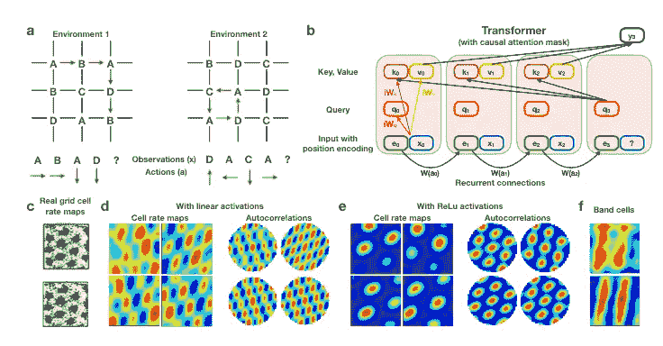
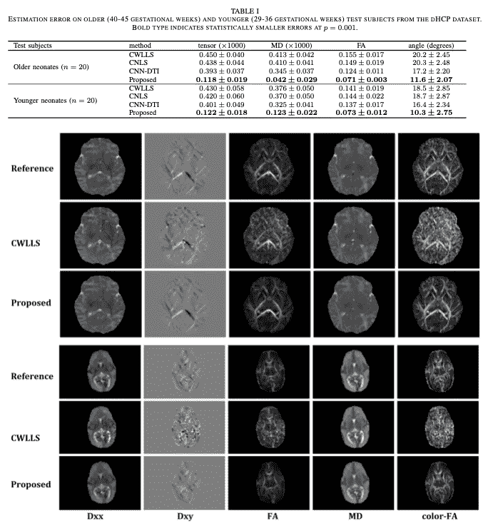

# ML &神经科学:2022 年 1 月必读

> 原文：<https://towardsdatascience.com/ml-neuroscience-january-2022-must-reads-faf91e8a1d32>

机器学习能为神经科学做些什么？在这个新系列中，我们将探索 ML 和神经科学之间的关系。这个月，牛津、史丹福、UCL、麻省理工、富士通和哈佛医学院的研究人员将他们的发现发表在 ML 和神经科学上

图片由 [Unsplash](https://unsplash.com/photos/58Z17lnVS4U) 上的 [Milad Fakurian](https://unsplash.com/@fakurian) 拍摄

*通过我的推荐链接加入 Medium 来支持我的写作和项目:*

  

**为什么要关心神经科学？**

神经科学是当今人工智能🧠的根源🤖。阅读并意识到神经科学中的进化和新见解不仅会让你成为一个更好的“人工智能”的家伙😎而且还是一个更好的神经网络体系结构的创造者👩‍💻！

在这篇文章中，我正式用一种新的方法重新发布我的[“保持神经科学的更新”](https://stefanobosisio1.medium.com/)文章。在这一系列中，我将涵盖 3 篇主要论文，在 arxiv.org[的评论中，它们涉及机器学习和神经科学。特别是，我将涉及以下几个方面:](http://arxiv.org/)

*   ML 研究能否帮助神经科学更深入地了解大脑的动力学和活动？
*   神经科学如何用新的生物启发模型帮助增强 ML？
*   ML 和模型如何通过新的成像和信号技术给我们带来新的临床神经科学？

这个月我们将看到变形金刚的大量使用。在第一篇论文中，变形金刚可以帮助神经科学获得更好的海马体模型，更深入地了解大脑中的空间表征。第二篇论文提出了关于深度神经网络以及如何处理对称性概念的问题。最后，论文使用一个变压器来创建一个新的模型，以增强 MRI 成像技术。享受:)

# 将变压器与海马结构的模型和神经表示相关联

詹姆斯 C.R 惠廷顿，约瑟夫·沃伦，蒂莫西 E.J 伯伦斯，[**论文**](https://arxiv.org/abs/2112.04035)

本文从数学的角度比较了变压器和海马的空间表征。从语言处理到计算机视觉，变形金刚肯定是最有前途的人工智能架构，但是，信不信由你，这种布局不是由大脑功能激发的。因此，惠廷顿、沃伦和伯伦斯在这篇论文中想知道变压器与海马功能有什么相似之处，特别是，我们是否能找到与海马位置细胞相似的细胞空间表征。

Transformer 模型接收输入的观察数据点，并致力于预测列表中缺失的元素。变压器的核心机制是一个“自我关注”层，其中每个输入元素与所有其他输入元素进行比较，强调与预测更相关的元素。

作者训练了一个类似变压器的模型来学习空间表示，图 1，显示了产生的变压器层“细胞”图复制了海马细胞正在做的事情。

图 1；a)空间导航学习任务 b)变压器架构。在这种情况下，作者强调了变压器模型中的递归位置编码，以便获得在海马体中发生的精确排序 c)实际网格细胞速率图 d-f)从速率图的角度用线性或递归激活函数从变压器模型的预测。

这种相似性允许作者进一步推动神经科学模型的发展，重写了一个众所周知的神经科学模型的数学基础。Tolmen-Eichenbaum 机器(TEM)模型作为序列学习器捕获海马现象。作者通过修改记忆提取的内部过程，获得了 TEM-transformer (TEM-t)模型，从而证明了 TEM 可以与 Transformer 模型完全一样地被训练。人工智能世界和大脑世界的结合改善了传统的神经科学模型，减少了 TEM 训练时间，解决了一个更大的问题，因为与标准 TEM 相比，TEM-t 可以检索和存储更多的记忆。

神经科学的含义是什么？正如我们所说，透射电镜复制了海马现象。如果 TEM-t 可以做得更好，这意味着变压器的自我注意机制可以隐藏一些关于神经元如何在海马体水平上工作的解释。特别是，从注意力层数学中，有可能识别出两个特定的神经元池。第一个池报告功能，而第二个池充当内存。特征池可以进一步分为两个子群体，一个将神经元映射到不同的大脑区域，另一个在不同的环境中跟踪这种映射。然后，存储层充当 softmax 操作，就像在变压器中一样，稀疏地激活神经元，这使得这些神经元成为每个环境的空间调谐激活器，类似于海马位置细胞。

这是一篇很棒的论文，它展示了人工智能模型不仅可以增强现有的神经科学模型，还可以打开关于大脑功能的不同解释。总结文章发现:

*   变形金刚确实重复了海马的空间表征
*   自我注意层的数学表示可以移植到现有的神经科学模型(TEM-t)
*   人工智能和神经科学可以在数学上融合，为大脑海马细胞的表达提供新的假设。

# 深度网络的对称感知:前馈结构的不足和循环连接的改进

Shobhita Sundaram，Darius Sinha，Matthew Groth，Tomotake Sasaki，Xavier Boix，**[论文 ](https://arxiv.org/abs/2112.04162)**

**深度神经网络(DNN)在计算机视觉任务中表现出惊人的性能。DNN 可以轻松地对给定的输入进行分类，增强医学成像，生成类似人类的绘画，它们是当今智能手机硬件的基础。然而，似乎对称的概念可能是一个问题，其中大多数 DNN 无法捕捉长程空间依赖性，也无法满足“简单”的人工任务。在本文中，作者调查了 DNN 的长期空间依赖性，并为 DNN 设计了新的解决方案。**

**作者在对称性检测任务上初步测试了以下模型:DenseNet、Xception、InceptionResNetV2、InceptionV3、ResNet101、ResNet50 和 RCNN-SAT。对称感知具有两个挑战:首先，对称性是抽象特征，并且仅由像素关系来指示，其次，这些像素关系是长距离的。所有常见的模型都失败了，因为它们主要是为图像识别而训练的，并且模型本身的架构不能编码长程相关性。**

**因此，研究人员在更“对称”的调谐模型上提出了同样的问题。特别是，他们使用了扩张卷积神经网络、三个堆叠卷积 LSTM (LSTM3)和一个变压器。从结果来看，LSTM3 是唯一捕捉长程关系的网络。LSTM3 扩大了其感受野的大小，并且能够将长距离依赖性分解成一系列局部操作。LSTM 在许多时间步长上应用前馈架构，在各层之间共享权重。这扩大了感受域并控制了网络的复杂性，避免了过拟合，如每个扩张卷积神经网络或变压器。**

**神经科学的含义是什么？从文献来看，对称性检测似乎主要源于递归成分。这些结果表明，鉴于 LSTM3 的循环性质，循环可能是对称性感知的关键术语。这可以通过 EEG 分析来研究，在这种情况下，考虑到对称性计算的循环性质，EEG 可能需要少量时间来显示用于检测对称性的固定大脑活动。**

# **基于变压器神经网络的扩散张量估计**

**达伍德·卡利米，阿里·格里波尔，[**论文**](https://arxiv.org/abs/2201.05701)**

**本文是 ML 在临床神经科学中的实际应用。扩散加权磁共振成像(DW-MRI)是一种广泛使用的医学成像技术。它利用水分子的扩散来进行医学成像，使这项技术成为大脑研究的最佳非侵入性工具。这项技术主要用于研究从新生儿到老年人的不同人群的大脑发育和退化。如果我们看看下面的数学理论，最终的成像是通过计算水分子的扩散张量来进行的。这种计算相当复杂，并且仍然依赖于过时的估计方法，在过去二十年中大多没有改变(例如 CWLLS)**

**在本文中，作者提出并测试了一个变压器模型，以进一步改善扩散张量估计。注意力模型是序列建模中最先进的。与基于 CNN 的模型不同，注意力提供了高度的灵活性，其中网络权重以依赖于输入的方式进行调整。此外，信息可以从序列中的一个位置传播到另一个位置。图 2 示出了所提出的模型，其中具有六个通道的输入体积 3D 图像由两个子模型处理。第一个模型，模型 S，使用扩散信号作为输入，并估计扩散张量。第二子模型，模型 ST，试图从模型 s 的输出提供扩散张量的更精确的估计。这样，模型的第一部分利用了扩散信号和相邻体素之间的相关性。模型 ST 通过输入扫描和模型 S 的预测的更广泛的视图产生最终的估计。**

****

**图 2:提议的模型。输入的六通道体素图像由两个子模型处理。模型 S 利用局部相关性提供扩散系数的初始估计，而第二模型，模型 ST，合并体素输入和第一估计，以产生更鲁棒和精确的结果。**

**图 3 显示了估计的扩散张量和张量导出变量(FA、MD 和主要特征向量的方向)的结果。在 40 多次测试中，作者的方法实现了最低的估计误差，将 MD 的平均绝对误差减少了 2.6-9.8，FA 的平均绝对误差减少了 1.5-2.2。此外，与 CWLLS 技术相比，当前的方法显示了很大的改进，仅使用了 6 次测量，获得的图像与参考图像非常接近。**

****

**图 3:用普通 CWLLS 模型和作者提出的模型得到的张量图像的结果。该表报告了 40 名受试者的扩散误差，而图像是扩散系数 FA、MD 和 color-FA 的重建。**

**这显示了简单的直觉，即使用最先进的 ML 模型，可以很容易地适用于开发临床神经科学的准确估计。使用具有挑战性的 dHCP 新生儿数据集，作者能够通过仅使用六个数据点而不是大量测量来减少估计误差并获得有价值的输出图像。**

**如果你有问题或好奇，请发邮件至:stefanobosisio1@gmail.com 或在 Instagram 上关注我，支持我的新人工智能项目:[https://www.instagram.com/bosiartai/](https://www.instagram.com/bosiartai/)**