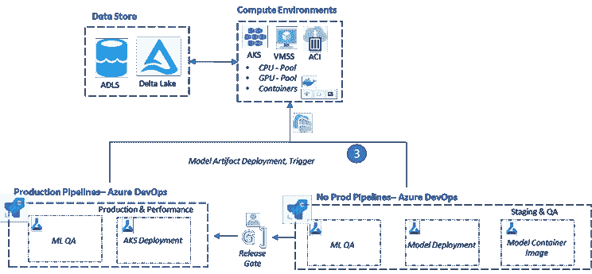
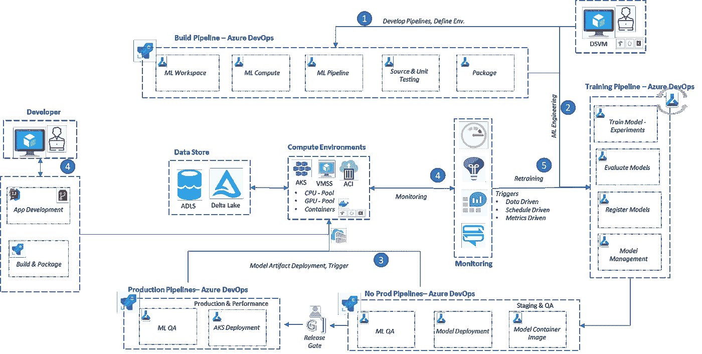

# 使用 Azure 机器学习的 ML Ops

> 原文：<https://towardsdatascience.com/ml-ops-with-azure-machine-learning-72ebc37ee3cd>

## ML DevOps 管道实施框架的高级概念概述

# 介绍

Azure 机器学习服务(AML)提供端到端的能力来管理 ML 生命周期。MLOps(机器学习操作)、框架无关的互操作性、与 ML 工具和平台的集成、安全性和信任以及可扩展性和性能是关键特征。

在 [Python](https://docs.microsoft.com/en-us/python/api/overview/azure/ml/) 或 [PowerShell](https://docs.microsoft.com/en-us/cli/azure/ml) 中的 Azure 机器学习 SDK 提供了一个开发自动化 ML 管道的机会，该管道由 [Azure DevOps 或 GitOps](https://github.com/microsoft/MLOps) 的编排功能提供支持。因此，ML 工程师和数据科学家可以专注于他们的任务，而 DevOps(构建、部署和管理)则通过自动化流程卸载。

在这篇文章中，我们将讨论使用 Azure 平台服务的 MLOps 的一般流程。当然，这个框架可以很容易地扩展到其他公共云提案(AWS 或 GCP ),只需稍加调整，就可以映射到它们的本地服务产品。

Gerrie van der Walt 在 [Unsplash](https://unsplash.com?utm_source=medium&utm_medium=referral) 上拍摄的照片

  

# 解决方案框架

## 开发和构建

**环境建设管道**(图片作者提供)

以下是创建 ML 工作空间和环境构建的高级步骤:

*   利用 Azure DevOps (ADO)作为编排平台，使用 IaC 方法自动化基础架构
*   Azure IAM 将数据科学团队(数据科学家、ML 工程师、数据工程师等)分配到 ML 工作区。
*   出于培训和测试目的，团队在工作区内分配计算资源。
*   团队搅动 ML 管道实验，每个人可以在一个竖井中工作，为管道开发一个可重用的组件。因此，实验包括数据提取、数据探索、数据预处理、模型训练、评估和测试。
*   ML 工程师然后建立源代码控制和测试工作台来支持模型开发和测试框架。
*   环境供应还使包、ML 框架和模块能够支持开发。

## 培训渠道

使用 Azure ML 自动进行模型训练和实验

Azure ML 使 ML 团队能够利用 Azure DevOps 功能，通过自动化培训渠道完成端到端的模型实验:

*   通过执行管道步骤，自动化数据预处理和模型训练。
*   跟踪来自各种模型训练实验的度量的结果有助于评估来自许多运行的模型。这样就选出了最佳模型。
*   模型注册步骤用其元数据注册所选择的模型。
*   因此，它从 Azure ML 服务的能力中提供了模型管理的能力。

## 部署管道

**通过使用 Azure DevOps 实现自动化部署**(图片由作者提供)

Azure DevOps 提供了自动化 ML 操作所需的 CI 和 CD 步骤的能力，一步一步地将最终评估的模型容器化，使其部署到试运行环境集群，让端点执行 QA 和测试管道。开发人员从遥测和度量中学习关于测试数据上部署的模型的质量和性能。

*发布经理*负责触发经验证的模型到生产集群的部署。有各种各样的策略可以达到同样的目的；canary deployment 就是一个这样的例子，这对于密切监视较小的传入数据实例子集上的模型性能特别有用。

## 模型监控和再培训

**模特监控&再培训**(图片由作者提供)

设置操作、可观测性和控制塔，以连续监控模型漂移和数据漂移。如果模型性能指标低于阈值，DevOps 管道将被触发，并使用 ML 训练管道重新训练模型。

日志和应用遥测是实施端到端指标驱动的自动化 MLOps 的重要组成部分。

# 结论

使用 Azure DevOps、tooling 和 Azure Machine Learning service 实现 MLOps 的高级解决方案架构将类似于下图。该解决方案概述了如何设置整个 MLOps 生态系统的开发、培训、测试和部署组件。可观察性实现是捕获遥测和指标数据的核心，通过利用 Azure DevOps 管道为整个 MLOps 流程实现事件驱动的自动化。

**Azure 机器学习— MLOps 解决方案架构**(图片由作者提供)

  

## 参考

*   Azure ML [文档&概念](https://docs.microsoft.com/en-us/azure/machine-learning/concept-azure-machine-learning-architecture)
*   Azure ML Ops [样片](https://github.com/microsoft/MLOps)
*   Azure [ML 服务能力](/azure-machine-learning-service-part-1-an-introduction-739620d1127b)